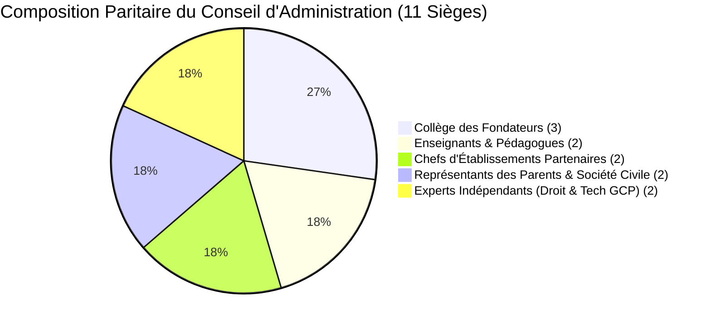
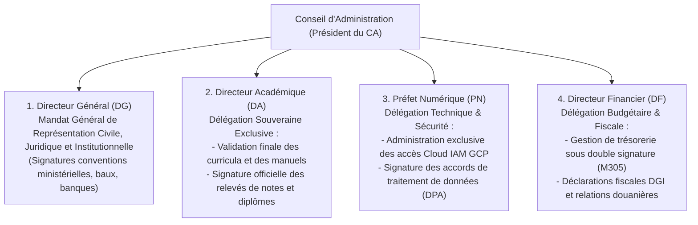
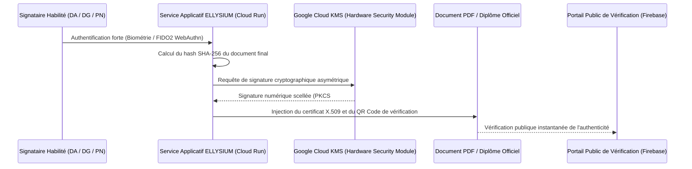

# Module 323 — Gouvernance juridique : conseil d'administration, délégations de pouvoirs et signatures électroniques

> **Positionnement :** Tome 19 — Juridique, Conformité et ASBL
> Module 4 sur 17 | Référence : ELLYSIUM-T19-M323
> **Autorité :** Conseil d'Administration / Secrétariat Général
> **Liaison amont :** Module 322 — Statuts officiels de l'ASBL : membres fondateurs et assemblée générale
> **Liaison aval :** Module 324 — Responsabilité de l'utilisateur : clause d'engagement personnel

---

## 1. Objet

L'administration quotidienne d'une plateforme d'apprentissage à l'échelle d'un sous-continent requiert une fluidité exécutive maximale, tout en prévenant les abus de pouvoir et les dérives autocratiques. Pour garantir la sécurité juridique des actes posés (contrats B2B, embauches, diplômes scellés, paiements de bourses), l'institution s'appuie sur une **gouvernance collégiale rigoureusement articulée**, des **délégations de pouvoirs formellement encadrées** et une **infrastructure de signature électronique cryptographique à pleine valeur probante en droit congolais**.

Ce module structure le fonctionnement du **Conseil d'Administration (CA)**, organise la chaîne des mandats exécutifs et définit l'architecture de scellement cryptographique sous Google Cloud KMS.

---

## 2. Composition et Équilibre du Conseil d'Administration (CA)

Le Conseil d'Administration est composé de 11 administrateurs élus pour un mandat de 3 ans renouvelable :



| Collège au CA | Nombre de Sièges | Rôle Spécifique | Pouvoir Particulier |
|---|---|---|---|
| **Membres Fondateurs** | 3 sièges | Gardiens de la doctrine et de la mémoire constitutionnelle | Droit de veto suspensif en cas d'atteinte éthique |
| **Corps Enseignant** | 2 sièges | Représentation des professeurs et formateurs de terrain | Contrôle des conditions de travail et d'évaluation |
| **Directeurs Partenaires (DEP)** | 2 sièges | Voix des établissements scolaires et universités | Veille sur l'ergonomie et la faisabilité logistique |
| **Parents & Société Civile** | 2 sièges | Défense des familles et des apprenants indépendants | Contrôle de la gratuité et de l'équité territoriale |
| **Experts Indépendants** | 2 sièges (Avocat + Architecte GCP) | Rigueur juridique et audit de souveraineté technique | Indépendance totale sans conflit d'intérêts |

---

## 3. Chaîne des Délégations de Pouvoirs Spéciales

Pour éviter toute paralysie administrative, le Conseil d'Administration délègue des prérogatives spécialisées et exclusives à l'équipe de direction :



---

## 4. Cadre Légal et Technique des Signatures Électroniques

En application de la **Loi n° 20/017 du 25 novembre 2020 relative aux télécommunications et aux TIC en RDC**, l'écrit et la signature électroniques bénéficient de la même force probante que l'acte manuscrit sous seing privé.

### 4.1 Architecture Cryptographique Cloud KMS
Chaque dirigeant habilité dispose d'une paire de clés asymétriques RSA 4096 bits ou ECDSA P-384 générée et protégée dans un module matériel de sécurité (HSM) certifié FIPS 140-2 Level 3 sous **Google Cloud Key Management Service (Cloud KMS)** :



---

## 5. Schéma SQL — Registre des Délégations et Signatures Électroniques

```sql
-- Cloud SQL PostgreSQL 16 (Schéma juridique)
CREATE TABLE schema_juridique.delegations_pouvoirs (
    id UUID PRIMARY KEY DEFAULT gen_random_uuid(),
    mandataire_nom VARCHAR(150) NOT NULL,
    poste_titre VARCHAR(50) NOT NULL CHECK (poste_titre IN ('DIRECTEUR_GENERAL', 'DIRECTEUR_ACADEMIQUE', 'PREFET_NUMERIQUE', 'DIRECTEUR_FINANCIER')),
    nature_delegation TEXT NOT NULL,
    plafond_financier_usd NUMERIC(12,2), -- NULL si illimité dans son champ de compétence
    date_effet DATE NOT NULL,
    date_expiration DATE NOT NULL,
    pv_nomination_ca_hash VARCHAR(255) NOT NULL,
    cle_kms_resource_name VARCHAR(255) UNIQUE NOT NULL,
    statut VARCHAR(20) DEFAULT 'ACTIVE' CHECK (statut IN ('ACTIVE', 'SUSPENDUE', 'REVOQUEE')),
    created_at TIMESTAMPTZ DEFAULT NOW()
);

CREATE TABLE schema_juridique.registre_actes_signes (
    id UUID PRIMARY KEY DEFAULT gen_random_uuid(),
    type_acte VARCHAR(50) NOT NULL CHECK (type_acte IN ('DIPLOME_OFFICIEL', 'CONVENTION_B2B', 'BULLETIN_SGS', 'CONTRAT_ENSEIGNANT', 'DECAISSEMENT_BANQUE')),
    reference_acte VARCHAR(100) UNIQUE NOT NULL,
    hash_document_sha256 VARCHAR(64) NOT NULL,
    delegation_id UUID NOT NULL REFERENCES schema_juridique.delegations_pouvoirs(id),
    signature_kms_base64 TEXT NOT NULL,
    horodatage_securise TIMESTAMPTZ DEFAULT NOW(),
    url_verification_publique VARCHAR(255) NOT NULL
);

CREATE INDEX idx_actes_ref ON schema_juridique.registre_actes_signes(reference_acte);
CREATE INDEX idx_actes_hash ON schema_juridique.registre_actes_signes(hash_document_sha256);
```

---

## 6. Verrous Fonctionnels

| ID | Règle | Niveau |
|---|---|---|
| VF-323-01 | Aucune décision majeure de gestion ne peut être prise sans délibération formelle et procès-verbal du CA | CRITIQUE |
| VF-323-02 | Le Directeur Académique dispose d'un pouvoir exclusif et insusceptible d'injonction politique sur les examens et diplômes | CRITIQUE |
| VF-323-03 | Les clés privées de signature électronique doivent impérativement résider sous Google Cloud KMS sans extraction possible | CRITIQUE |
| VF-323-04 | Tout diplôme ou relevé officiel ne portant pas la signature électronique Cloud KMS scellée est réputé nul et non avenu | CRITIQUE |
| VF-323-05 | Les mandats d'administrateurs et délégations de signature sont révisés annuellement lors de l'Assemblée Générale Ordinaire | OBLIGATOIRE |

---

*Sous-tome rédigé conformément aux Normes documentaires ELLYSIUM — Fondations 04.*
