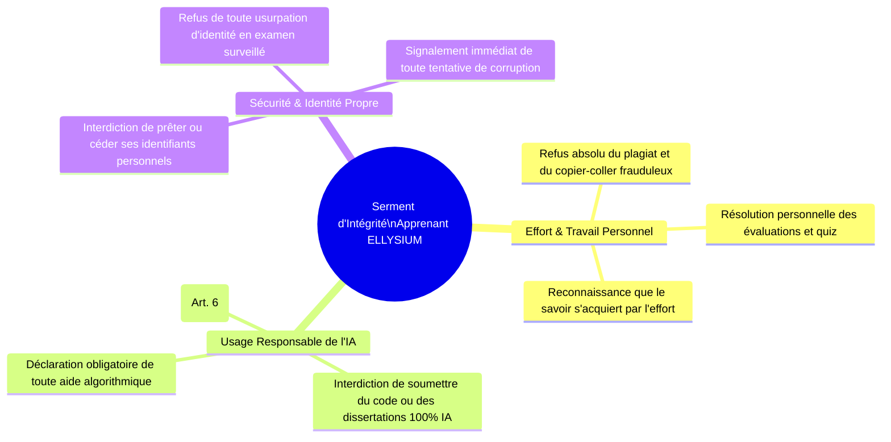
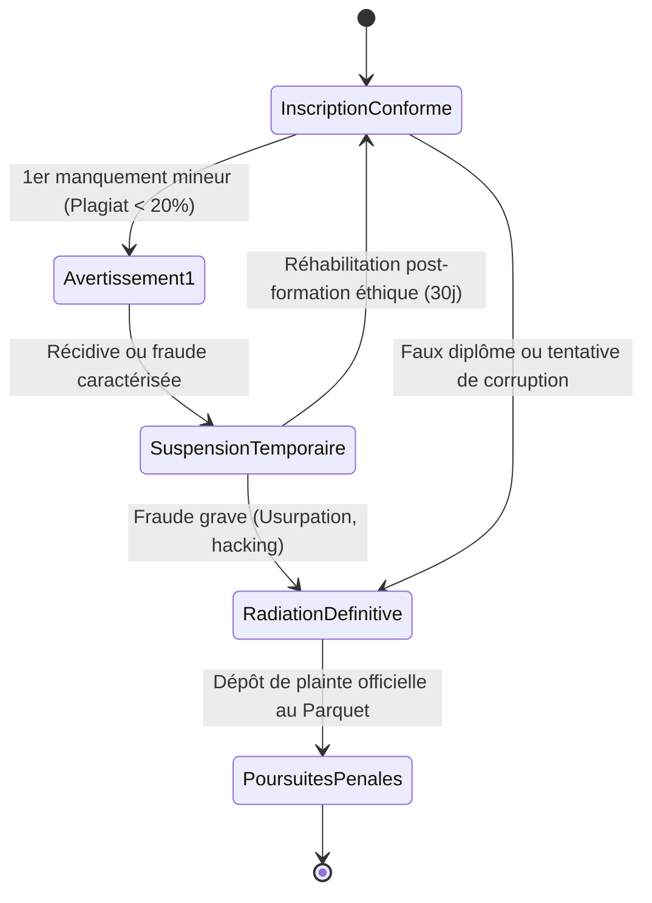

# Module 324 — Responsabilité de l'utilisateur : clause explicite d'engagement personnel et intégrité académique

> **Positionnement :** Tome 19 — Juridique, Conformité et ASBL
> Module 5 sur 17 | Référence : ELLYSIUM-T19-M324
> **Autorité :** Direction Juridique / Conseil de Discipline
> **Liaison amont :** Module 323 — Gouvernance juridique : conseil d'administration et signatures
> **Liaison aval :** Module 325 — Conditions Générales d'Utilisation (CGU) et de Service (CGS)

---

## 1. Objet

L'accès gratuit au savoir démocratisé par ELLYSIUM n'est pas un droit passif d'assistance : c'est un pacte républicain d'élévation mutuelle exigeant de chaque usager un engagement d'intégrité sans compromis. Si les apprenants trichent, si des mercenaires passent les examens à leur place ou si des enseignants monnaient leurs appréciations, la valeur des certifications ELLYSIUM est anéantie et l'effort collectif est trahi.

Ce module formalise le **régime de responsabilité personnelle de l'utilisateur**, institue le **Serment d'Intégrité Académique obligatoire**, encadre l'usage éthique des outils d'intelligence artificielle et définit l'échelle des sanctions disciplinaires et pénales opposables aux contrevenants.

---

## 2. Le Serment d'Intégrité de l'Apprenant ELLYSIUM

Lors de sa première connexion et avant chaque session d'examen certifiant, tout apprenant doit valider formellement son engagement personnel :



> **Formule Officielle du Serment :** *« Moi, apprenant d'ELLYSIUM, conscient que le savoir véritable ne s'achète ni ne s'usurpe, je m'engage sur l'honneur à produire des travaux issus de ma seule réflexion, à respecter le travail de mes maîtres et de mes pairs, et à défendre l'intégrité de ma formation pour la grandeur de mon pays. »*

---

## 3. Responsabilité Civile et Pénale des Utilisateurs

La responsabilité de l'usager s'exerce selon 3 cercles de qualification juridique :

| Infraction Constatée | Qualification Légale (Droit Congolais) | Sanction Interne ELLYSIUM | Poursuites Judiciaires |
|---|---|---|---|
| **Plagiat avéré ou tricherie simple** | Manquement grave à l'intégrité académique | Note 0/20 automatique + Avertissement formel au dossier | Aucune |
| **Usage d'IA générative non déclarée en examen** | Fraude aux examens académiques | Annulation de la session + Suspension de compte 6 mois | Aucune |
| **Usurpation d'identité / Faux candidat** | Faux et usage de faux (Code Pénal RDC, Art. 124) | Radiation définitive immédiate + Révocation des titres | Plainte pénale avec constitution de partie civile |
| **Cyberattaque ou tentative de sabotage GCP** | Infraction aux TIC (Loi n° 20/017, Art. 118) | Blocage réseau IP/Device + Radiation à vie | Saisine du Procureur de la République |
| **Tentative de corruption d'enseignant** | Corruption active et passive (Code Pénal RDC) | Radiation de l'élève + Révocation de l'enseignant | Plainte conjointe auprès du Parquet |

---

## 4. Gradation de l'Échelle Disciplinaire



---

## 5. Schéma SQL — Registre des Engagements et Sanctions

```sql
-- Cloud SQL PostgreSQL 16 (Schéma juridique)
CREATE TABLE schema_juridique.engagements_integrite_usagers (
    id UUID PRIMARY KEY DEFAULT gen_random_uuid(),
    utilisateur_id UUID NOT NULL,
    type_engagement VARCHAR(40) NOT NULL CHECK (type_engagement IN ('SERMENT_INITIAL_INSCRIPTION', 'ENGAGEMENT_SESSION_EXAMEN')),
    ip_signature_hash VARCHAR(64) NOT NULL,
    version_charte VARCHAR(20) NOT NULL,
    horodatage_consentement TIMESTAMPTZ DEFAULT NOW()
);

CREATE TABLE schema_juridique.dossiers_disciplinaires (
    id UUID PRIMARY KEY DEFAULT gen_random_uuid(),
    numero_dossier VARCHAR(50) UNIQUE NOT NULL, -- Ex: 'DISC-2026-0814'
    utilisateur_id UUID NOT NULL,
    motif_infraction VARCHAR(50) NOT NULL CHECK (motif_infraction IN (
        'PLAGIAT_TRICHERIE', 'FRAUDE_IA_NON_DECLAREE', 'USURPATION_IDENTITE',
        'TENTATIVE_CORRUPTION', 'SABOTAGE_CYBER'
    )),
    rapporteur_enseignant_id UUID NOT NULL,
    sanction_prononcee VARCHAR(40) NOT NULL CHECK (sanction_prononcee IN (
        'AVERTISSEMENT', 'ANNULATION_EVALUATION', 'SUSPENSION_COMPTE',
        'RADIATION_DEFINITIVE', 'PLAINTE_PENALE'
    )),
    date_decision DATE NOT NULL,
    dossier_preuves_gcs_hash VARCHAR(255) NOT NULL,
    notifie_a_l_usager BOOLEAN NOT NULL DEFAULT TRUE,
    recours_depose BOOLEAN DEFAULT FALSE,
    created_at TIMESTAMPTZ DEFAULT NOW()
);

CREATE INDEX idx_disc_user ON schema_juridique.dossiers_disciplinaires(utilisateur_id);
```

---

## 6. Verrous Fonctionnels

| ID | Règle | Niveau |
|---|---|---|
| VF-324-01 | La validation formelle du Serment d'Intégrité est un prérequis technique bloquant avant toute soumission d'évaluation | CRITIQUE |
| VF-324-02 | Toute usurpation d'identité lors d'un examen surveillé déclenche la radiation immédiate et irrévocable du compte | CRITIQUE |
| VF-324-03 | L'usage d'outils d'IA générative doit obligatoirement être déclaré sous peine d'annulation intégrale de l'épreuve | CRITIQUE |
| VF-324-04 | Tout apprenant faisant l'objet d'une sanction a droit à un recours contradictoire devant le Conseil de Discipline sous 15 jours | OBLIGATOIRE |
| VF-324-05 | L'historique des infractions graves est scellé sous Cloud Storage et transmis aux universités partenaires conventionnées | OBLIGATOIRE |

---

*Sous-tome rédigé conformément aux Normes documentaires ELLYSIUM — Fondations 04.*
