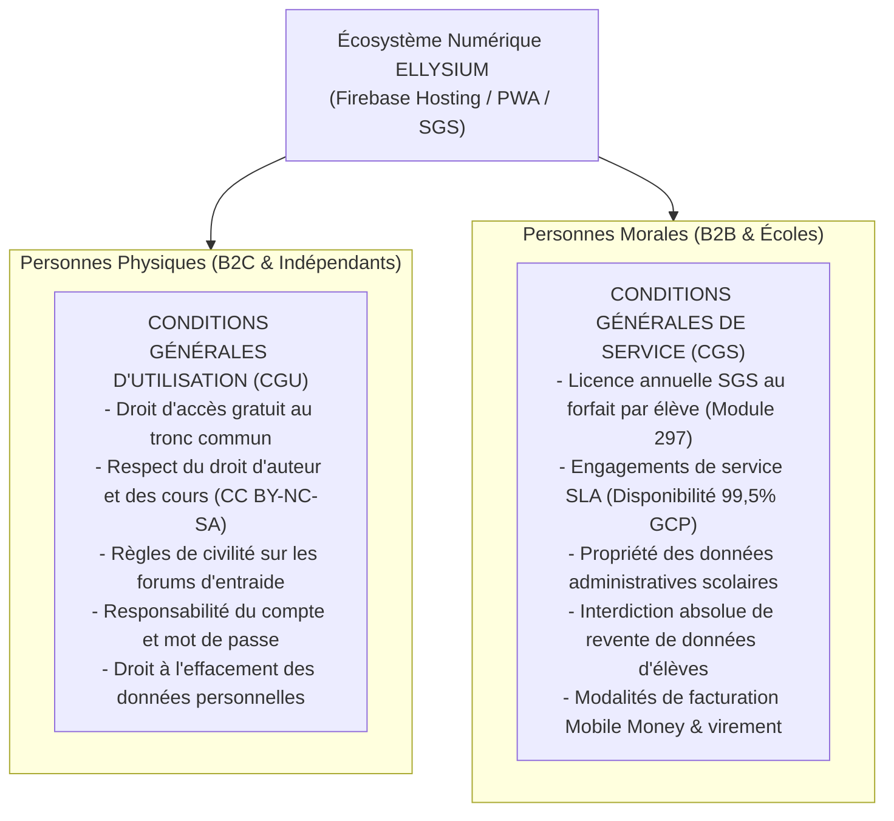
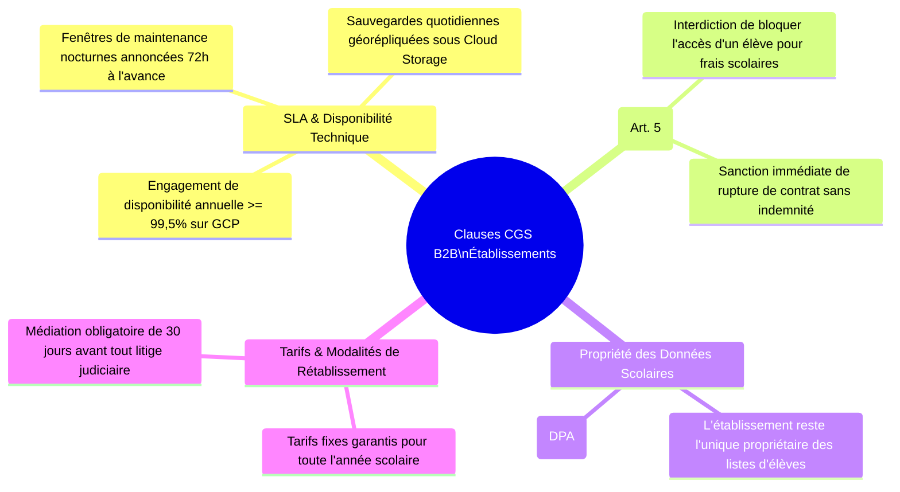
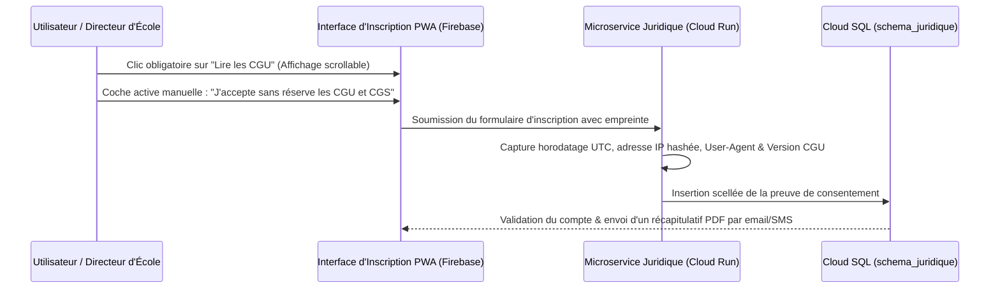

# Module 325 — Conditions Générales d'Utilisation (CGU) et Conditions Générales de Service (CGS)

> **Positionnement :** Tome 19 — Juridique, Conformité et ASBL
> Module 6 sur 17 | Référence : ELLYSIUM-T19-M325
> **Autorité :** Direction Juridique / Direction Générale
> **Liaison amont :** Module 324 — Responsabilité de l'utilisateur : clause d'engagement personnel
> **Liaison aval :** Module 326 — Politique de confidentialité et protection des données personnelles

---

## 1. Objet

L'utilisation d'une plateforme d'envergure nationale brassant des flux pédagogiques, administratifs et financiers exige des contrats d'adhésion numériques parfaitement rédigés, transparents et opposables selon le droit de la République Démocratique du Congo. Pour distinguer clairement les droits des personnes physiques individuelles des obligations contractuelles des institutions scolaires clientes, ELLYSIUM formalise une **double armature contractuelle** :
1. Les **Conditions Générales d'Utilisation (CGU)** applicables à tout visiteur, élève, parent et enseignant à titre individuel.
2. Les **Conditions Générales de Service (CGS)** régissant les abonnements B2B au Système de Gestion Scolaire (SGS) souscrits par les directions d'établissements et universités.

Ce module arrête les clauses essentielles des CGU et CGS, encadre le recueil probant du consentement numérique (Click-wrap) et définit les protocoles de résiliation et de révision.

---

## 2. Distinction Fondamentale entre CGU et CGS

---

## 3. Clauses Essentielles des Conditions Générales d'Utilisation (CGU)

Toute personne créant un compte sur la PWA ELLYSIUM accepte obligatoirement les stipulations suivantes :

| Article CGU | Intitulé de la Clause | Portée Juridique & Règle Concrète |
|---|---|---|
| **Article 1** | *Objet & Gratuité Fondamentale* | Confirme que l'accès aux cours du tronc commun et aux devoirs réguliers est 100 % gratuit à vie (Article 3 Constitutionnel). |
| **Article 4** | *Propriété Intellectuelle & Licence* | Les cours sont protégés ; l'usager bénéficie d'un droit d'usage personnel non commercial sans droit de revente ni de pillage. |
| **Article 7** | *Comportement & Anti-Harcèlement* | Tolérance zéro envers les insultes, le tribalisme, le prosélytisme ou les menaces sur les forums ; exclusion immédiate. |
| **Article 9** | *Clause de Non-Garantie Académique* | ELLYSIUM met en œuvre les meilleurs moyens didactiques mais ne garantit pas la réussite automatique aux examens d'État officiels. |
| **Article 12** | *Suspension & Clôture de Compte* | ELLYSIUM se réserve le droit de bloquer un compte en cas de cyberattaque, fraude d'examen caractérisée ou usurpation d'identité. |

---

## 4. Clauses Essentielles des Conditions Générales de Service (CGS B2B)

Les établissements partenaires souscrivant au SGS sont liés par un cadre rigoureux :

---

## 5. Mécanisme de Consentement Numérique Probant (Click-Wrap)

Pour être juridiquement opposable devant les tribunaux congolais, l'acceptation des CGU/CGS n'utilise aucune case pré-cochée :

---

## 6. Verrous Fonctionnels

| ID | Règle | Niveau |
|---|---|---|
| VF-325-01 | Il est techniquement impossible d'activer un compte utilisateur sans acceptation active non pré-cochée des CGU | CRITIQUE |
| VF-325-02 | Les CGS doivent obligatoirement intégrer la clause pénale d'interdiction de blocage financier d'élèves (Art. 5) | CRITIQUE |
| VF-325-03 | Toute mise à jour substantielle des CGU/CGS doit être notifiée aux utilisateurs au moins 30 jours avant son entrée en vigueur | CRITIQUE |
| VF-325-04 | L'engagement SLA de disponibilité de la plateforme pour les établissements partenaires est garanti à 99,5 % sous GCP | OBLIGATOIRE |
| VF-325-05 | Les preuves cryptographiques de consentement Click-wrap sont conservées de manière inaltérable pendant 10 ans | OBLIGATOIRE |
| VF-325-06 | Tout document juridique est indexé par un UUID et horodaté par Google Cloud Logging | CONSTITUTIONNEL |

---

*Sous-tome rédigé conformément aux Normes documentaires ELLYSIUM — Fondations 04.*
