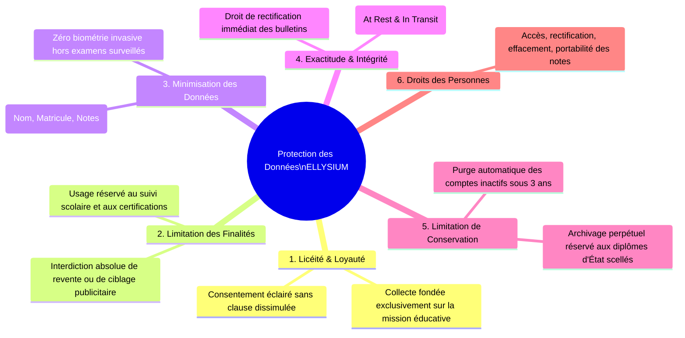
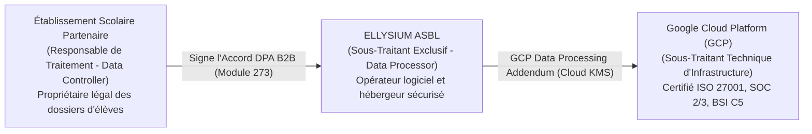

# Module 326 — Politique de confidentialité et protection des données personnelles (loi RDC n° 15/023 et équivalence RGPD)

> **Positionnement :** Tome 19 — Juridique, Conformité et ASBL
> Module 7 sur 17 | Référence : ELLYSIUM-T19-M326
> **Autorité :** Délégué à la Protection des Données (DPO) / Direction Juridique
> **Liaison amont :** Module 325 — Conditions Générales d'Utilisation (CGU) et de Service (CGS)
> **Liaison aval :** Module 327 — Protection renforcée des mineurs : consentement parental vérifié

---

## 1. Objet

À l'ère de l'économie numérique prédatrice, les données scolaires et comportementales des apprenants constituent une cible majeure de profilage commercial, de surveillance illégitime ou de piratage. ELLYSIUM refuse catégoriquement d'assimiler les données d'élèves congolais à une marchandise extractible. La protection de la vie privée des apprenants, des enseignants et des familles est une exigence constitutionnelle inaltérable.

Ce module formalise la **Politique Générale de Confidentialité et de Protection des Données Personnelles d'ELLYSIUM**. Il fonde ses exigences sur la législation congolaise (**Loi n° 20/017 du 25 novembre 2020 sur les TIC**) et applique par équivalence le standard international le plus protecteur (**Règlement Général sur la Protection des Données - RGPD**), sanctuarisant le chiffrement intégral des données au sein de l'infrastructure Google Cloud Platform.

---

## 2. Les 6 Principes Cardinaux de Protection des Données



---

## 3. Rôles Juridiques et Accords de Sous-Traitance (DPA)

Dans l'écosystème ELLYSIUM, la qualification juridique des responsabilités est rigoureusement arrêtée :



---

## 4. Droits des Utilisateurs et Procédures d'Exercice

Chaque usager (ou son tuteur légal) dispose de droits inaliénables exerçables en un clic ou par saisine du Délégué à la Protection des Données (`dpo@ellysium.cd`) :
- **Droit d'Accès et de Portabilité :** Téléchargement intégral en format ouvert (JSON/PDF) de toutes ses données académiques et historiques d'évaluation.
- **Droit à l'Oubli (Effacement) :** Suppression intégrale des logs, messages de forum et traces d'usage sous 30 jours (à l'exception des diplômes officiels scellés soumis à obligation légale de conservation).
- **Droit d'Opposition au Profilage IA :** Droit de refuser les suggestions prédictives d'orientation algorithmique de Vertex AI sans pénalité scolaire.

---

## 5. Schéma SQL — Registre des Consentements et Requêtes DPO

```sql
-- Cloud SQL PostgreSQL 16 (Schéma juridique)
CREATE TABLE schema_juridique.registre_traitements_donnees (
    id UUID PRIMARY KEY DEFAULT gen_random_uuid(),
    intitule_traitement VARCHAR(150) NOT NULL, -- Ex: 'GESTION_BULLETINS_SGS', 'ASSISTANCE_PEDAGOGIQUE_VERTEX_AI'
    finalite_principale TEXT NOT NULL,
    categories_donnees_collectees TEXT[] NOT NULL,
    base_legale VARCHAR(40) NOT NULL CHECK (base_legale IN ('MISSION_INTERET_PUBLIC', 'EXECUTION_CONTRAT', 'CONSENTEMENT_EXPLICITE', 'OBLIGATION_LEGALE')),
    duree_conservation_mois INTEGER NOT NULL,
    mesures_securite_gcp TEXT NOT NULL,
    statut_traitement VARCHAR(20) DEFAULT 'ACTIF' CHECK (statut_traitement IN ('ACTIF', 'SUSPENDU', 'OBSOLETE')),
    created_at TIMESTAMPTZ DEFAULT NOW()
);

CREATE TABLE schema_juridique.demandes_droits_usagers (
    id UUID PRIMARY KEY DEFAULT gen_random_uuid(),
    utilisateur_id UUID NOT NULL,
    type_droit VARCHAR(30) NOT NULL CHECK (type_droit IN ('ACCES', 'RECTIFICATION', 'EFFACEMENT_OUBLI', 'PORTABILITE', 'OPPOSITION_IA')),
    date_demande TIMESTAMPTZ DEFAULT NOW(),
    delai_reponse_jours_restants INTEGER DEFAULT 30,
    statut_demande VARCHAR(20) DEFAULT 'EN_COURS' CHECK (statut_demande IN ('EN_COURS', 'TRAITEE_VALIDEE', 'REJETEE_MOTIVEE')),
    justification_decision TEXT,
    date_cloture TIMESTAMPTZ,
    dpo_responsable VARCHAR(150) NOT NULL
);

CREATE INDEX idx_demandes_user ON schema_juridique.demandes_droits_usagers(utilisateur_id);
```

---

## 6. Verrous Fonctionnels

| ID | Règle | Niveau |
|---|---|---|
| VF-326-01 | Il est formellement interdit de commercialiser, louer ou céder les données personnelles des apprenants à des tiers | CRITIQUE |
| VF-326-02 | 100 % des données personnelles doivent être chiffrées au repos via Google Cloud KMS et en transit via TLS 1.3 | CRITIQUE |
| VF-326-03 | L'exercice des droits d'accès ou d'effacement d'un apprenant doit être traité et clôturé sous un délai maximal de 30 jours | CRITIQUE |
| VF-326-04 | Tout nouvel algorithme exploitant Vertex AI doit faire l'objet d'une Analyse d'Impact sur la Protection des Données (AIPD) | OBLIGATOIRE |
| VF-326-05 | Le registre des traitements de données est audité annuellement par le DPO indépendant et publié sous format synthétique | OBLIGATOIRE |
| VF-326-06 | Tout document juridique est indexé par un UUID et horodaté par Google Cloud Logging | CONSTITUTIONNEL |

---

*Sous-tome rédigé conformément aux Normes documentaires ELLYSIUM — Fondations 04.*
