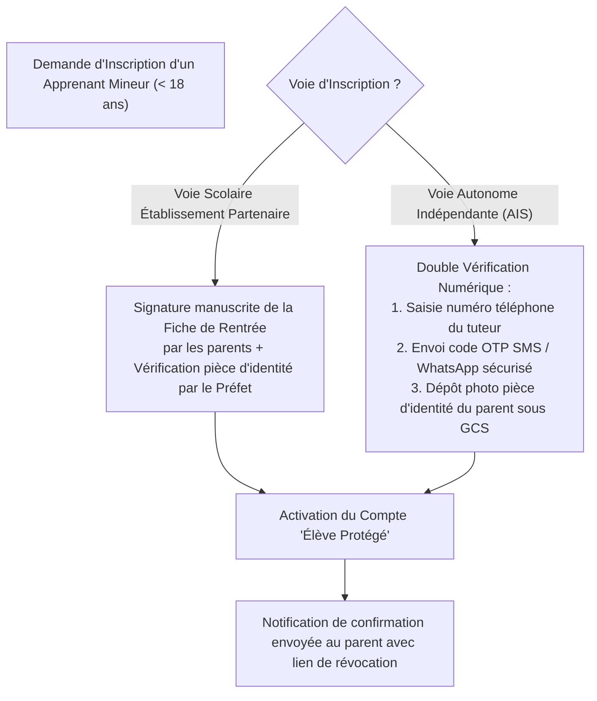
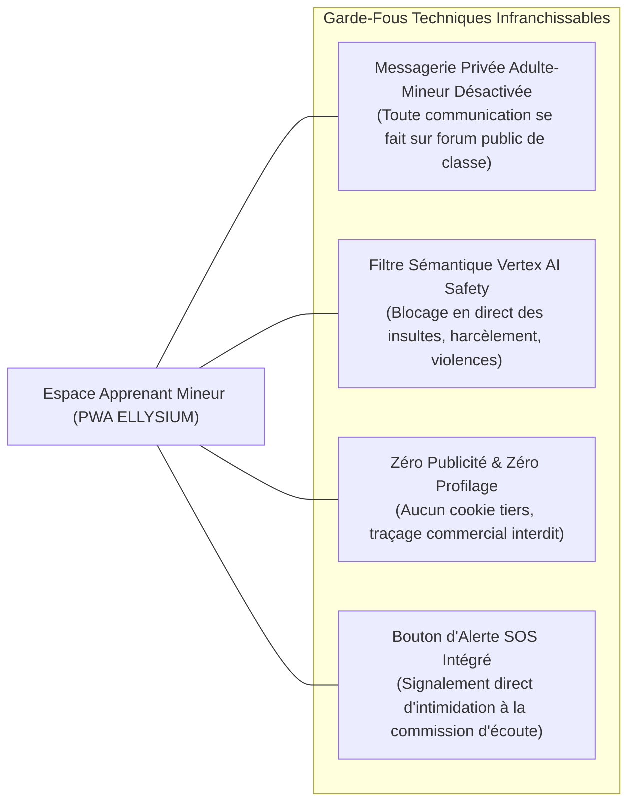
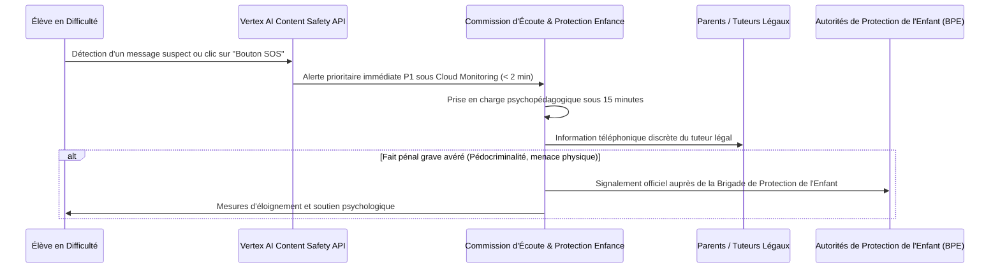

# Module 327 — Protection renforcée des mineurs : consentement parental vérifié et sécurité en ligne

> **Positionnement :** Tome 19 — Juridique, Conformité et ASBL
> Module 8 sur 17 | Référence : ELLYSIUM-T19-M327
> **Autorité :** Délégué à la Protection des Données / Comité de Protection de l'Enfance
> **Liaison amont :** Module 326 — Politique de confidentialité et protection des données personnelles
> **Liaison aval :** Module 328 — Propriété intellectuelle, logiciels et contenus pédagogiques libres (OER)

---

## 1. Objet

L'éducation des enfants et des adolescents impose une vigilance morale et légale décuplée. En République Démocratique du Congo, la **Loi n° 09/001 du 10 janvier 2009 portant protection de l'enfant** érige l'intérêt supérieur de l'enfant en principe d'ordre public absolu. Dans un environnement numérique où prolifèrent les risques de prédation, de cyberharcèlement, d'addiction aux écrans et d'exploitation commerciale, ELLYSIUM fait de la sécurité des mineurs son sanctuaire inviolable.

Ce module fixe les protocoles d'**authentification vérifiée du consentement parental**, formalise l'**architecture logicielle de protection native des mineurs (Child-Safe by Design)** et arrête les procédures d'intervention d'urgence en cas de détresse d'un élève.

---

## 2. Le Dispositif de Consentement Parental Vérifié

Aucun mineur de moins de 18 ans ne peut être inscrit sans accord parental formellement tracé :



---

## 3. Architecture Logicielle « Child-Safe by Design »

L'interface des apprenants mineurs intègre des restrictions techniques natives inaltérables :



---

## 4. Protocole d'Intervention Rapide « Alerte SOS Enfant »

Dès qu'un élève clique sur le bouton SOS ou que le filtre Vertex AI détecte un propos toxique grave (menace, chantage, détresse psychologique) :



---

## 5. Schéma SQL — Registre des Protections et Alertes Mineurs

```sql
-- Cloud SQL PostgreSQL 16 (Schéma juridique)
CREATE TABLE schema_juridique.consentements_parentaux_mineurs (
    id UUID PRIMARY KEY DEFAULT gen_random_uuid(),
    apprenant_id UUID UNIQUE NOT NULL,
    nom_parent_tuteur VARCHAR(150) NOT NULL,
    telephone_parent VARCHAR(50) NOT NULL,
    type_verification VARCHAR(30) NOT NULL CHECK (type_verification IN ('FICHE_ECOLE_VERIFIEE', 'OTP_SMS_PIECE_IDENTITE')),
    document_justificatif_gcs_hash VARCHAR(255) NOT NULL,
    date_consentement DATE NOT NULL,
    consentement_revoque BOOLEAN DEFAULT FALSE,
    date_revocation TIMESTAMPTZ,
    created_at TIMESTAMPTZ DEFAULT NOW()
);

CREATE TABLE schema_juridique.alertes_securite_mineurs (
    id UUID PRIMARY KEY DEFAULT gen_random_uuid(),
    apprenant_id UUID NOT NULL,
    type_incident VARCHAR(40) NOT NULL CHECK (type_incident IN ('CYBER_HARCELEMENT', 'LANGAGE_TOXIQUE', 'DETRESSE_PSYCHOLOGIQUE', 'CLIC_BOUTON_SOS')),
    niveau_urgence VARCHAR(20) NOT NULL CHECK (niveau_urgence IN ('MINEUR', 'ELEVE', 'CRITIQUE_IMMEDIAT')),
    contexte_message_hash_gcs VARCHAR(255) NOT NULL,
    delai_intervention_minutes INTEGER,
    traite_par_nom VARCHAR(150),
    statut_alerte VARCHAR(30) DEFAULT 'EN_TRAITEMENT' CHECK (statut_alerte IN ('NOUVELLE', 'EN_TRAITEMENT', 'RESOLUE', 'SAISINE_POLICE')),
    date_signalement TIMESTAMPTZ DEFAULT NOW(),
    date_resolution TIMESTAMPTZ
);

CREATE INDEX idx_mineur_alerte ON schema_juridique.alertes_securite_mineurs(apprenant_id);
```

---

## 6. Verrous Fonctionnels

| ID | Règle | Niveau |
|---|---|---|
| VF-327-01 | L'inscription de tout mineur de moins de 18 ans est subordonnée à la validation formelle d'un consentement parental écrit ou certifié par OTP | CRITIQUE |
| VF-327-02 | Les messageries privées individuelles entre adultes et mineurs non émancipés sont strictement et techniquement désactivées | CRITIQUE |
| VF-327-03 | Tout déclenchement du Bouton d'Alerte SOS doit faire l'objet d'une prise en charge humaine qualifiée en moins de 15 minutes | CRITIQUE |
| VF-327-04 | Le filtre de modération Vertex AI Safety s'exécute en amont de toute publication sur les espaces d'échange d'élèves | CRITIQUE |
| VF-327-05 | L'ensemble des signalements d'atteinte aux mineurs fait l'objet d'un rapport mensuel scellé adressé au Ministère de la Justice | OBLIGATOIRE |

---

*Sous-tome rédigé conformément aux Normes documentaires ELLYSIUM — Fondations 04.*
