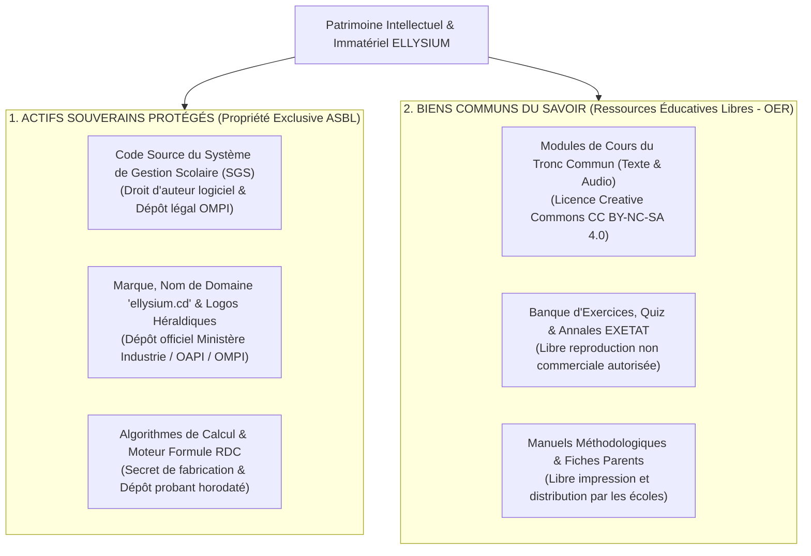
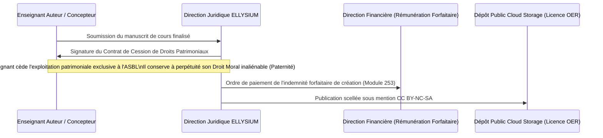

# Module 328 — Propriété intellectuelle : logiciels, marques, logos et contenus libres (OER / Creative Commons)

> **Positionnement :** Tome 19 — Juridique, Conformité et ASBL
> Module 9 sur 17 | Référence : ELLYSIUM-T19-M328
> **Autorité :** Direction Juridique / Pôle Propriété Intellectuelle
> **Liaison amont :** Module 327 — Protection renforcée des mineurs : consentement parental vérifié
> **Liaison aval :** Module 329 — Cadre contractuel : établissements partenaires, enseignants et personnel

---

## 1. Objet

Une institution éducative d'intérêt général doit concilier deux impératifs juridiques complémentaires mais distincts :
1. **Verrouiller la protection exclusive de ses actifs stratégiques souverains** (marques, logos, codes sources du Système de Gestion Scolaire SGS, algorithmes de calcul et architecture de sécurité GCP) contre toute captation prédatrice, piratage ou contrefaçon commerciale.
2. **Libérer les contenus pédagogiques fondamentaux** (cours, devoirs, capsules didactiques, manuels) sous le statut de **Ressources Éducatives Libres (OER / Creative Commons)** pour garantir l'accès universel au savoir sans rente d'auteur excluante.

Ce module formalise le double régime de propriété intellectuelle d'ELLYSIUM, encadre les contrats de cession de droits avec les enseignants concepteurs et scelle le dépôt des marques auprès des registres officiels nationaux et internationaux.

---

## 2. Le Double Régime de Propriété Intellectuelle ELLYSIUM



---

## 3. Modalités des Licences Libres Creative Commons (CC BY-NC-SA 4.0)

L'ensemble des contenus de cours produits sous la direction éditoriale d'ELLYSIUM (Module 258) est revêtu de la licence internationale **CC BY-NC-SA 4.0** :
- **Attribution (BY) :** Mention obligatoire de la paternité d'ELLYSIUM et du nom de l'enseignant auteur.
- **Pas d'Utilisation Commerciale (NC) :** Interdiction absolue pour une école privée ou un éditeur tiers de revendre ces cours ou d'en faire payer l'accès.
- **Partage dans les Mêmes Conditions (SA) :** Toute œuvre dérivée ou enrichie doit obligatoirement être redistribuée sous la même licence libre.

---

## 4. Contrat de Cession de Droits d'Auteur avec les Enseignants

Conformément à la législation congolaise sur la propriété littéraire et artistique (**Ordonnance-Loi n° 86-033 du 5 avril 1986**) :



---

## 5. Schéma SQL — Registre des Actes de Propriété Intellectuelle

```sql
-- Cloud SQL PostgreSQL 16 (Schéma juridique)
CREATE TABLE schema_juridique.registre_marques_brevets (
    id UUID PRIMARY KEY DEFAULT gen_random_uuid(),
    intitule_actif VARCHAR(150) NOT NULL, -- Ex: 'Marque ELLYSIUM', 'Logo Flambeau', 'Logiciel SGS v3'
    type_protection VARCHAR(40) NOT NULL CHECK (type_protection IN ('MARQUE_VERBALE', 'MARQUE_FIGURATIVE', 'DROIT_AUTEUR_LOGICIEL', 'NOM_DOMAINE')),
    organisme_enregistrement VARCHAR(100) NOT NULL, -- Ex: 'MINISTERE_INDUSTRIE_RDC', 'OAPI', 'OMPI_GENEVE', 'ICANN'
    numero_titre_officiel VARCHAR(100) UNIQUE NOT NULL,
    date_depot DATE NOT NULL,
    date_expiration DATE NOT NULL,
    certificat_depot_gcs_hash VARCHAR(255) NOT NULL,
    created_at TIMESTAMPTZ DEFAULT NOW()
);

CREATE TABLE schema_juridique.cessions_droits_auteurs (
    id UUID PRIMARY KEY DEFAULT gen_random_uuid(),
    enseignant_id UUID NOT NULL,
    module_code VARCHAR(30) NOT NULL,
    titre_oeuvre VARCHAR(255) NOT NULL,
    montant_forfait_cession_usd NUMERIC(8,2) NOT NULL,
    licence_distribution VARCHAR(30) DEFAULT 'CC_BY_NC_SA_4.0' NOT NULL,
    contrat_cession_scelle_hash VARCHAR(255) NOT NULL,
    date_signature DATE NOT NULL,
    created_at TIMESTAMPTZ DEFAULT NOW()
);

CREATE INDEX idx_cession_ens ON schema_juridique.cessions_droits_auteurs(enseignant_id);
```

---

## 6. Verrous Fonctionnels

| ID | Règle | Niveau |
|---|---|---|
| VF-328-01 | Les cours du tronc commun doivent être obligatoirement publiés sous licence Creative Commons CC BY-NC-SA 4.0 | CRITIQUE |
| VF-328-02 | Le code source du Système de Gestion Scolaire (SGS) est la propriété exclusive inaliénable de l'ASBL ELLYSIUM | CRITIQUE |
| VF-328-03 | Tout enseignant concepteur conserve son droit moral perpétuel et inaliénable de paternité sur son œuvre | CRITIQUE |
| VF-328-04 | La marque ELLYSIUM et son logo officiel font l'objet d'un renouvellement décennal garanti auprès des registres de propriété | OBLIGATOIRE |
| VF-328-05 | Tout plagiat commercial d'un cours ELLYSIUM par un organisme tiers déclenche une mise en demeure judiciaire sous 72h | OBLIGATOIRE |
| VF-328-06 | Tout document juridique est indexé par un UUID et horodaté par Google Cloud Logging | CONSTITUTIONNEL |

---

*Sous-tome rédigé conformément aux Normes documentaires ELLYSIUM — Fondations 04.*
