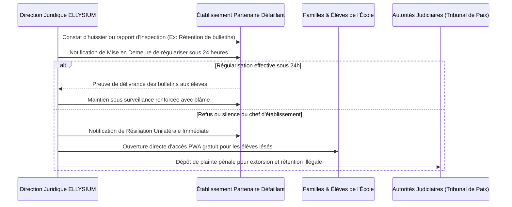

# Module 329 — Cadre contractuel : établissements partenaires, enseignants et personnel administratif

> **Positionnement :** Tome 19 — Juridique, Conformité et ASBL
> Module 10 sur 17 | Référence : ELLYSIUM-T19-M329
> **Autorité :** Direction Juridique / Direction des Ressources Humaines
> **Liaison amont :** Module 328 — Propriété intellectuelle : logiciels, marques et OER
> **Liaison aval :** Module 330 — Clause de non-garantie (résultats académiques, disponibilité)

---

## 1. Objet

L'efficacité opérationnelle et la sérénité juridique d'ELLYSIUM reposent sur des relations contractuelles claires, équitables et parfaitement conformes au droit congolais, notamment le **Code du Travail (Loi n° 015/2002 du 16 octobre 2002)** et le **Droit des Obligations et des Contrats (Code Civil Congolais Livre III)**. Qu'il s'agisse de conventionner une école partenaire, de contractualiser un enseignant auteur ou d'engager un ingénieur cloud, l'improvisation ou le flou verbal sont formellement proscrits.

Ce module fixe l'armature des **3 contrats-types fondamentaux d'ELLYSIUM**, définit les clauses de loyauté et de confidentialité non négociables et arrête les procédures de résolution amiable ou contentieuse des différends.

---

## 2. La Typologie des 3 Contrats-Types Majeurs

```mermaid
mindmap
  root((Cadre Contractuel\nELLYSIUM))
    1. Convention Établissement Partenaire (B2B)
      Obligations logistiques (Salles, alimentation électrique)
      Adhésion aux CGS du Système de Gestion Scolaire (SGS)
      Sanction pénale de rupture immédiate en cas de blocage d'élève (Art. 5)
    2. Contrats Enseignants & Formateurs
      Contrats à Durée Indéterminée (CDI) pour les permanents
      Contrats de Vacation Didactique pour les auteurs de cours
      Cession de droits d'exploitation (OER) et charte déontologique
    3. Contrats Personnel Technique & Support
      Ingénieurs Cloud GCP, développeurs Go/TypeScript, modérateurs
      Clause de confidentialité renforcée (Secret des clés Cloud KMS)
      Clause de protection des données nominatives d'élèves
```

---

## 3. Matrice des Clauses Obligatoires par Contrat

| Type de Contrat | Base Légale RDC | Clauses Spécifiques Incontournables | Sanction en Cas de Manquement |
|---|---|---|---|
| **Convention-Cadre Établissement Partenaire** | Code Civil Livre III (Contrats d'entreprise) | - Interdiction absolue de retenir les bulletins pour motif financier<br>- DPA RGPD / Loi TIC pour les données élèves<br>- Accès des auditeurs qualité ELLYSIUM | Résiliation immédiate de plein droit sans indemnité sous 24h |
| **Contrat de Travail Enseignant / Concepteur** | Code du Travail RDC (Loi n° 015/2002) | - Rémunération forfaitaire garantie (Module 253)<br>- Cession patrimoniale CC BY-NC-SA 4.0<br>- Respect strict du Code de Déontologie (Module 260) | Procédure disciplinaire interne pouvant aller jusqu'au licenciement |
| **Contrat Collaborateur Technique & SRE** | Code du Travail RDC + Loi n° 20/017 (TIC) | - Engagement de non-divulgation (NDA) perpétuel<br>- Interdiction d'export de bases de données hors GCP<br>- Responsabilité pénale en cas de fuite de données | Licenciement pour faute lourde + poursuites pénales au Parquet |

---

## 4. Procédure de Résiliation pour Faute Lourde

Lorsqu'un manquement grave compromet les principes constitutionnels ou la sécurité des élèves :



---

## 5. Schéma SQL — Registre des Contrats et Conventions Signés

```sql
-- Cloud SQL PostgreSQL 16 (Schéma juridique)
CREATE TABLE schema_juridique.contrats_conventions_actifs (
    id UUID PRIMARY KEY DEFAULT gen_random_uuid(),
    code_contrat VARCHAR(50) UNIQUE NOT NULL, -- Ex: 'CONV-ETAB-LSH-2026-004', 'CTR-ENS-KIN-2026-081'
    type_contrat VARCHAR(40) NOT NULL CHECK (type_contrat IN ('CONVENTION_ETABLISSEMENT', 'TRAVAIL_ENSEIGNANT', 'PRESTATION_AUTEUR', 'STAFF_TECHNIQUE')),
    partie_prenante_nom VARCHAR(200) NOT NULL,
    partie_prenante_id_nat VARCHAR(100),
    date_signature DATE NOT NULL,
    date_echeance DATE,
    clause_ethique_constitutionnelle_validee BOOLEAN NOT NULL DEFAULT FALSE,
    clause_confidentialite_gcp_validee BOOLEAN NOT NULL DEFAULT FALSE,
    contrat_pdf_scelle_gcs VARCHAR(255) NOT NULL,
    statut_contrat VARCHAR(30) DEFAULT 'EN_VIGUEUR' CHECK (statut_contrat IN ('EN_VIGUEUR', 'EN_REVISION', 'RESILIE_FAUTE', 'CLOTURE_TERME')),
    created_at TIMESTAMPTZ DEFAULT NOW(),
    updated_at TIMESTAMPTZ DEFAULT NOW()
);

CREATE INDEX idx_contrat_type ON schema_juridique.contrats_conventions_actifs(type_contrat);
CREATE INDEX idx_contrat_statut ON schema_juridique.contrats_conventions_actifs(statut_contrat);
```

---

## 6. Verrous Fonctionnels

| ID | Règle | Niveau |
|---|---|---|
| VF-329-01 | Tout contrat d'établissement doit obligatoirement comporter la clause de résiliation immédiate en cas d'atteinte à l'Article 5 | CRITIQUE |
| VF-329-02 | Aucun collaborateur technique ne peut accéder aux environnements GCP de production sans NDA formellement signé | CRITIQUE |
| VF-329-03 | Les contrats de travail des enseignants sont établis en stricte conformité avec le Code du Travail congolais | CRITIQUE |
| VF-329-04 | Tout contrat d'auteur doit comporter la cession expresse d'exploitation sous licence Creative Commons CC BY-NC-SA 4.0 | OBLIGATOIRE |
| VF-329-05 | L'exemplaire officiel scellé de chaque contrat est archivé avec horodatage cryptographique dans Google Cloud Storage | OBLIGATOIRE |
| VF-329-06 | Tout document juridique est indexé par un UUID et horodaté par Google Cloud Logging | CONSTITUTIONNEL |

---

*Sous-tome rédigé conformément aux Normes documentaires ELLYSIUM — Fondations 04.*
