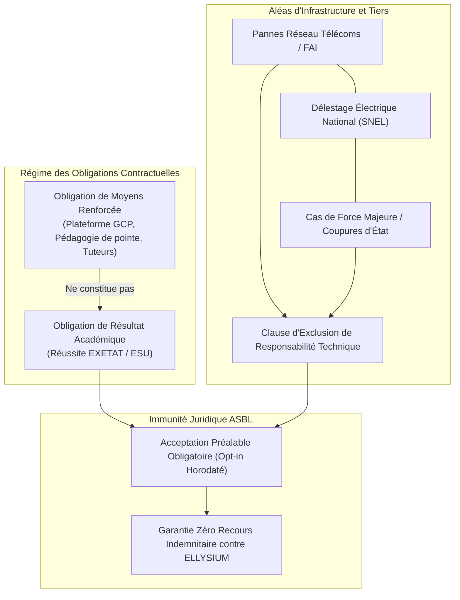

# Module 330 — Clause de non-garantie (résultats académiques, disponibilité)

## 1. Métadonnées du Sous-Tome

| Champ | Valeur |
| :--- | :--- |
| **Code Identification** | `ELL-T19-M330` |
| **Niveau d'Autorité** | Direction Juridique, Secrétariat Général, Conseil d'Administration ASBL |
| **Statut Documentaire** | Validé / Norme d'Exploitation et de Sécurisation Contractuelle |
| **Liaisons Amont** | `ELL-T19-M325` (CGU/CGS), `ELL-T19-M324` (Engagement personnel), `ELL-T08-M121` (SLA Plateforme) |
| **Liaisons Aval** | `ELL-T19-M331` (Gestion litiges), `ELL-T19-M332` (Assurances RC et cyber-risques), `ELL-T19-M336` (Clôture) |
| **Infrastructure Cible** | GCP Cloud Storage, Firebase Hosting (Affichage mentions légales), BigQuery Audit Trail |

---

## 2. Objet et Périmètre Juridique

Le présent module formalise la doctrine et les clauses contractuelles expresses de **non-garantie (disclaimer)** d'ELLYSIUM ASBL, visant à immuniser l'institution contre toute mise en cause juridique ou demande indemnitaire infondée relative à :
1. **L'absence d'obligation de résultat académique** : l'accès aux ressources, cours, simulateurs IA et parcours n'emporte aucune promesse de réussite aux examens officiels d'État (Examen d'État / EXETAT, TENASOSP, jurys universitaires ESU). ELLYSIUM est soumis à une stricte **obligation de moyens renforcée**, jamais à une obligation de résultat.
2. **La disponibilité technique et les aléas de connectivité** : bien que l'architecture Google Cloud Platform garantisse un SLA cible de 99,9%, ELLYSIUM décline toute responsabilité contractuelle ou délictuelle en cas d'interruption temporaire imputable aux défaillances des opérateurs télécoms tiers (coupures fibres optiques sous-marines, délestages électriques SNEL, coupures administratives de réseaux ou cas de force majeure).
3. **L'intégrité des décisions souveraines des jurys académiques** : l'invalidation ou le rejet d'un diplôme ou certificat par une tierce institution étrangère ou un employeur relève de la stricte appréciation discrétionnaire dudit tiers.



---

## 3. Dispositif Contractuel Détaillé

### 3.1. Clause Type : Non-Garantie des Résultats Académiques
> *"L'inscription et l'accès aux services éducatifs de la plateforme ELLYSIUM confèrent à l'apprenant le bénéfice d'outils didactiques, de contenus conformes aux programmes nationaux de la RDC et d'un accompagnement pédagogique automatisé et humain. Toutefois, l'obtention des diplômes d'État, attestations ministérielles, notes de jury ou succès aux épreuves de qualification demeure sous la responsabilité pleine, entière et exclusive de l'apprenant. ELLYSIUM ASBL, ses fondateurs, directeurs, développeurs et enseignants partenaires ne sauraient en aucun cas être tenus responsables d'un échec scolaire, d'un ajournement académique ou d'une note jugée insatisfaisante."*

### 3.2. Clause Type : Disponibilité Technique et Force Majeure
> *"Les services ELLYSIUM sont hébergés sur une infrastructure Cloud mondialement distribuée (Google Cloud Platform). Néanmoins, ELLYSIUM n'assume aucune responsabilité quant aux dommages directs ou indirects causés par : (a) l'indisponibilité de la plateforme résultant d'actes d'opérateurs télécoms ou fournisseurs d'accès Internet tiers, (b) les pannes d'alimentation électrique, (c) les attaques de déni de service distribuées (DDoS) excédant les seuils de tolérance industriels, ou (d) toute décision gouvernementale restreignant l'accès au réseau Internet en RDC. L'utilisateur reconnaît l'existence du mode hors-ligne (PWA / SQLite local) comme palliatif standard."*

---

## 4. Spécifications Techniques et Traçabilité

```typescript
// Implémentation du contrôle d'acceptation de la clause de non-garantie
export interface DisclaimerConsentAudit {
  userId: string;
  userRole: 'AIS' | 'AIU' | 'PARENT' | 'ENSEIGNANT';
  legalDocumentVersion: 'CGU-2026-V1.4';
  disclaimerAcademicAccepted: boolean;
  disclaimerServiceAvailabilityAccepted: boolean;
  timestamp: string; // ISO 8601 UTC
  ipAddressHash: string; // SHA-256 anonymisé
  digitalSignatureToken: string; // Cloud KMS ECDSA-SHA256
}

export function verifyDisclaimerCompliance(audit: DisclaimerConsentAudit): boolean {
  if (!audit.disclaimerAcademicAccepted || !audit.disclaimerServiceAvailabilityAccepted) {
    throw new Error("ACCES_REFUSE : La clause de non-garantie doit être expressément acceptée.");
  }
  return true;
}
```

---

## 5. Verrous Fonctionnels Critiques

| Réf. Verrou | Description Fonctionnelle et Technique | Conséquence en Cas de Violation |
| :--- | :--- | :--- |
| **`VF-330-01`** | **Acceptation Préalable Non-Bypassable** : Interdiction technique absolue d'accéder au catalogue de cours ou de soumettre une épreuve sans consentement explicite horodaté à la clause de non-garantie. | Blocage au niveau de Firebase Auth / Firestore Security Rules (`request.auth.token.disclaimer_accepted == true`). |
| **`VF-330-02`** | **Archivage Immuable de l'Opt-in** : Tout clic de consentement est consigné dans Google Cloud Storage en bucket verrouillé (WORM) sous signature Cloud KMS. | Sanction disciplinaire et rejet de toute prétention d'un utilisateur affirmant ne pas avoir souscrit à la clause. |
| **`VF-330-03`** | **Sanctuarisation de l'Obligation de Moyens** : Aucune communication officielle ou support marketing d'ELLYSIUM ne peut utiliser les termes "succès garanti" ou "100% de réussite garanti". | Rejet automatique par le comité d'éthique et validation juridique préalable obligatoire. |
| **`VF-330-04`** | **Exclusion Explicite des Préjudices Indirects** : Limitation contractuelle des dommages directs éventuels imputables à la plateforme au montant total des cotisations versées au cours des 3 derniers mois. | Annulation et irrecevabilité immédiate de toute assignation en dommages-intérêts exorbitants. |
| **`VF-330-05`** | **Non-Responsabilité Liée à la Restitution d'Urgence** : En cas de coupure de service force majeure, l'apprenant ne peut réclamer de prorogation de délais d'examen que dans le cadre des règlements édictés par le Ministère de tutelle. | Refus de toute pénalité de retard opposée à l'ASBL ELLYSIUM. |

---

*Sous-tome rédigé conformément aux Normes documentaires ELLYSIUM — Fondations 04.*
