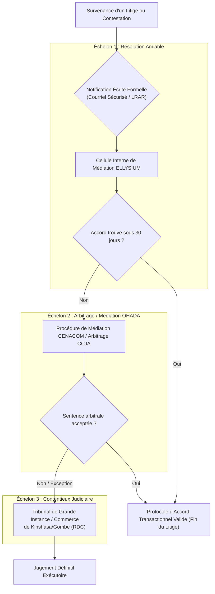

# Module 331 — Gestion des litiges – médiation, arbitrage, tribunal compétent

## 1. Métadonnées du Sous-Tome

| Champ | Valeur |
| :--- | :--- |
| **Code Identification** | `ELL-T19-M331` |
| **Niveau d'Autorité** | Direction Juridique, Conseil d'Administration ASBL, Barreau de Kinshasa |
| **Statut Documentaire** | Validé / Norme Juridictionnelle et Résolution des Différends |
| **Liaisons Amont** | `ELL-T19-M325` (CGU/CGS), `ELL-T19-M329` (Contrats partenaires), `ELL-T19-M330` (Clause de non-garantie) |
| **Liaisons Aval** | `ELL-T19-M332` (Assurances RC et cyber), `ELL-T19-M334` (Registre des risques), `ELL-T19-M336` (Clôture) |
| **Cadre Législatif** | Droit OHADA (Arbitrage CCJA), Code de Procédure Civile Congolais |

---

## 2. Objet et Architecture du Règlement des Conflits

Le présent module structure la procédure officielle et obligatoire de gestion des différends naissant de l'interprétation, de l'exécution ou de la résiliation des engagements contractuels entre ELLYSIUM ASBL et toute partie prenante (apprenants, tuteurs légaux, enseignants vacataires, écoles partenaires, prestataires technologiques).

La politique d'ELLYSIUM privilégie une **approche graduée en 3 niveaux** :
1. **Échelon 1 : Réclamation amiable et médiation interne** (Cellule d'Écoute et Médiation Juridique ELLYSIUM).
2. **Échelon 2 : Médiation institutionnelle / Arbitrage OHADA** (Centre d'Arbitrage du Congo - CENACOM ou CCJA).
3. **Échelon 3 : Juridiction étatique compétente** (Tribunaux de Commerce ou de Grande Instance de Kinshasa/Gombe, RDC).

---

## 3. Dispositif Contractuel et Clauses Types

### 3.1. Clause de Réclamation Préalable Obligatoire
> *"Tout litige relatif à l'utilisation de la plateforme ou aux services dispensés par ELLYSIUM ASBL doit faire l'objet d'une notification préalable écrite motivée par lettre recommandée avec accusé de réception ou message électronique certifié adressé au Secrétariat Général d'ELLYSIUM (`juridique@ellysium.cd`). Les parties s'engagent à rechercher une issue amiable durant un délai de trente (30) jours francs à compter de la réception de ladite notification."*

### 3.2. Clause Compromissoire (Partenaires et Fournisseurs)
> *"Pour tout différend né entre ELLYSIUM ASBL et un établissement scolaire ou prestataire commercial lié à un contrat d'affiliation, les parties conviennent expressément de soumettre le litige aux Règles d'Arbitrage de l'Acte Uniforme OHADA relatif au droit de l'arbitrage. Le tribunal arbitral siégera à Kinshasa et la langue de la procédure sera le français."*

### 3.3. Attribution de Compétence Juridictionnelle (Usagers et Particuliers)
> *"À défaut d'accord amiable intervenu au terme du délai de conciliation, attribution expresse de juridiction est faite aux tribunaux compétents du ressort de **Kinshasa/Gombe (République Démocratique du Congo)**, nonobstant pluralité de défendeurs ou appel en garantie, même pour les procédures d'urgence ou conservatoires."*

---

## 4. Matrice Opérationnelle des Litiges

| Catégorie de Litige | Déclencheur Typique | Voie de Règlement Privilégiée | Référent ELLYSIUM |
| :--- | :--- | :--- | :--- |
| **Pédagogique / Notes** | Contestation d'une évaluation ou délibération | Commission Paritaire Pédagogique Interne (Appel gracieux) | Doyen Académique & Tuteur Référent |
| **Financier / Reçus** | Erreur d'imputation de don ou frais de certification | Réconciliation financière automatique sous 72h | Trésorier Général ASBL |
| **Données Personnelles** | Demande d'effacement ou violation alléguée de données | Enquête DPO sous 15 jours (Loi n° 15/023) | Délégué à la Protection des Données (DPO) |
| **Partenariat Scolaire** | Défaut de reversement de cote ou violation d'exclusivité | Médiation CENACOM Kinshasa sous 45 jours | Direction Juridique & DG |
| **Atteinte Marque / IP** | Contrefaçon de syllabus ou usurpation de logo | Référé judiciaire d'urgence (Kinshasa/Gombe) | Avocat Conseil ASBL |

---

## 5. Verrous Fonctionnels Critiques

| Réf. Verrou | Description Fonctionnelle et Technique | Conséquence en Cas de Violation |
| :--- | :--- | :--- |
| **`VF-331-01`** | **Irrecevabilité de Saisine Directe** : Tout recours judiciaire engagé par une partie contractante sans respect du délai préalable de 30 jours de conciliation amiable est frappé de fin de non-recevoir. | Soulevée in limine litis par les avocats de l'ASBL. |
| **`VF-331-02`** | **Compétence Exclusive du Siège Social** : Interdiction contractuelle absolue de toute délocalisation de juridiction vers des tribunaux étrangers pour les utilisateurs nationaux ou de la diaspora. | Rejet immédiat par exception d'incompétence territoriale et matérielle. |
| **`VF-331-03`** | **Traçabilité Horodatée des Échanges Contentieux** : Tout dossier de médiation fait l'objet d'un ticket horodaté dans le système interne avec copie archivée sur Cloud Storage chiffré. | Preuve légale inattaquable produite aux débats. |
| **`VF-331-04`** | **Continuité Pédagogique Pendant le Litige** : Conformément à l'Article 5 de la Constitution ELLYSIUM, aucun apprenant ne peut voir son compte suspendu à titre de mesure de rétorsion durant une instance de litige financier ou administratif mineur. | Sanction disciplinaire contre l'administrateur et réactivation immédiate du compte. |
| **`VF-331-05`** | **Validation du Conseil d'Administration pour Toute Transaction > 5 000 USD** : Aucune indemnité transactionnelle ou renonciation à droit ne peut être signée par le Directeur Général sans autorisation préalable du CA. | Nullité d'ordre public de la transaction financière non approuvée. |

---

*Sous-tome rédigé conformément aux Normes documentaires ELLYSIUM — Fondations 04.*
