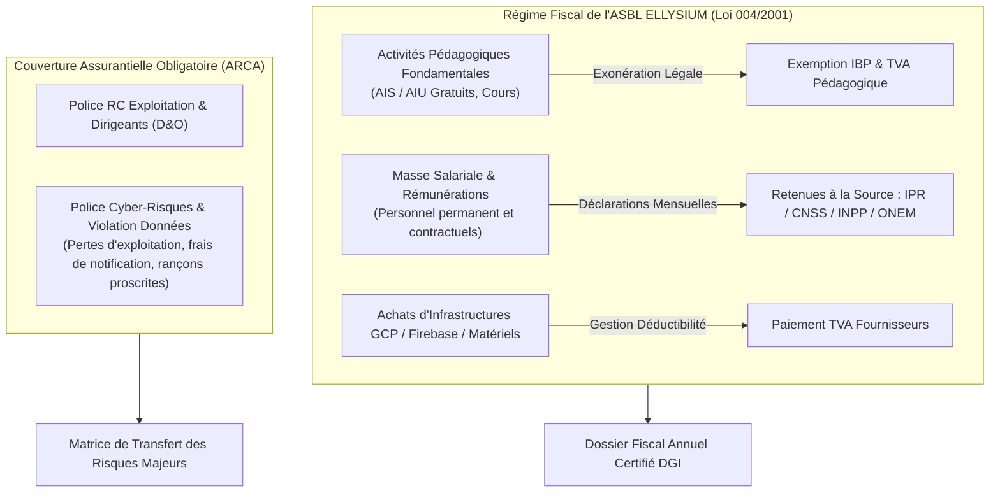

# Module 332 — Conformité fiscale – déclarations, exonérations ASBL, assurances (RC, cyber-risques)

## 1. Métadonnées du Sous-Tome

| Champ | Valeur |
| :--- | :--- |
| **Code Identification** | `ELL-T19-M332` |
| **Niveau d'Autorité** | Direction Administrative et Financière, Trésorerie ASBL, Expert-Comptable Agréé (ONEC RDC) |
| **Statut Documentaire** | Validé / Norme Fiscale, Fiscale-Comptable et Gestion des Risques Assurantiels |
| **Liaisons Amont** | `ELL-T17-M304` (Conformité fiscale RDC), `ELL-T19-M322` (Statuts ASBL), `ELL-T08-M127` (Cyber-sécurité) |
| **Liaisons Aval** | `ELL-T19-M333` (Archivage légal), `ELL-T19-M334` (Registre des risques), `ELL-T19-M336` (Clôture) |
| **Organismes Tutélaires** | Direction Générale des Impôts (DGI), CNSS, ONEM, Autorité de Régulation et de Contrôle des Assurances (ARCA) |

---

## 2. Objet et Cadre Légal Fiscal d'ELLYSIUM ASBL

Le présent module formalise la politique fiscale et la couverture assurantielle d'ELLYSIUM en sa qualité d'Association Sans But Lucratif (ASBL) d'utilité publique en République Démocratique du Congo (Loi n° 004/2001).

Bien que bénéficiant d'exonérations partielles sur l'Impôt sur les Bénéfices et Profits (IBP) pour ses activités non lucratives et éducatives pures, ELLYSIUM est assujettie à une conformité fiscale intégrale comprenant :
1. **L'Impôt Professionnel sur les Rémunérations (IPR)** et l'Impôt Exceptionnel sur les Rémunérations versées aux Expatriés (IERE).
2. **Les cotisations sociales obligatoires** : Caisse Nationale de Sécurité Sociale (CNSS), Institut National de Préparation Professionnelle (INPP), Office National de l'Emploi (ONEM).
3. **La gestion de la Taxe sur la Valeur Ajoutée (TVA)** : exonération stricte sur les prestations d'enseignement public/gratuit, mais déclaration régulière sur les achats technologiques et prestations tierces.
4. **Le portefeuille de polices d'assurances obligatoires et prudentielles** souscrites auprès de compagnies agréées par l'ARCA : Responsabilité Civile (RC) exploitation et couverture Cyber-Risques & Perte de Données.



---

## 3. Dispositif Fiscal et Calendrier des Obligations

### 3.1. Tableau des Échéances Fiscales et Sociales en RDC

| Impôt / Prélèvement | Périodicité | Date Limite | Organisme Bénéficiaire | Base Légale / Procédure |
| :--- | :--- | :--- | :--- | :--- |
| **IPR (Retenue Source)** | Mensuelle | 15 du mois M+1 | DGI (Kinshasa) | Barème progressif sur salaires du personnel ELLYSIUM. |
| **Cotisation CNSS** | Trimestrielle / Mensuelle | 15 du mois suivant | CNSS | Cotisation patronale et ouvrière (Risques pro, vieillesse, famille). |
| **Cotisation INPP** | Mensuelle | 15 du mois suivant | INPP | 1% à 3% selon effectifs pour formation continue. |
| **Cotisation ONEM** | Mensuelle | 15 du mois suivant | ONEM | 0,2% de la masse salariale brute. |
| **Déclaration Exonération IBP**| Annuelle | 31 Mars | DGI | Dépôt du bilan financier certifié et rapport moral ASBL. |

### 3.2. Programme d'Assurances Spécifiques ELLYSIUM

1. **Assurance Responsabilité Civile Exploitation et Professionnelle** :
   - Couvre les préjudices corporels, matériels ou immatériels causés aux usagers, bénévoles et tiers lors d'événements physiques (hackathons, jurys en présentiel, distributions d'équipements).
   - Montant de garantie minimum : 1 000 000 USD par sinistre.
2. **Assurance Cyber-Risques et Atteinte à la Sécurité des Systèmes d'Information** :
   - Couvre les frais d'investigation médico-légale numérique (digital forensics), les frais de notification aux usagers en cas de brèche de données, et l'assistance juridique d'urgence.
   - Exclusion stricte : interdiction absolue de paiement de rançon numérique (cryptoransomware).

---

## 4. Architecture de Contrôle Fiscal et Audit

```typescript
// Script d'audit de conformité fiscale automatisé (Cloud Function)
export interface TaxComplianceReport {
  fiscalPeriod: string; // Ex: "2026-Q1"
  asblRegistrationNumber: string; // F92 / Min Justice
  iprSubmitted: boolean;
  cnssClearanceCertificate: boolean; // Attestation de régularité
  inppClearanceCertificate: boolean;
  cyberInsurancePolicyActive: boolean;
  insuranceExpiryDate: string;
}

export function assertFiscalIntegrity(report: TaxComplianceReport): boolean {
  if (!report.iprSubmitted || !report.cnssClearanceCertificate) {
    throw new Error("ALERTE_FISCALE : Retenues fiscales ou sociales non déclarées. Risque de redressement DGI.");
  }
  if (!report.cyberInsurancePolicyActive) {
    throw new Error("ALERTE_ASSURANCE : Police cyber-risques inactive ou expirée.");
  }
  return true;
}
```

---

## 5. Verrous Fonctionnels Critiques

| Réf. Verrou | Description Fonctionnelle et Technique | Conséquence en Cas de Violation |
| :--- | :--- | :--- |
| **`VF-332-01`** | **Quitus Fiscal Annuel Obligatoire** : L'ASBL ELLYSIUM doit obtenir et publier dans ses archives internes l'Attestation de Régularité Fiscale (ARF) délivrée par la DGI. | Gel préventif de tout partenariat institutionnel financé par des bailleurs internationaux. |
| **`VF-332-02`** | **Souscription Exclusive auprès de Compagnies Agréées ARCA** : Aucune police d'assurance ne peut être souscrite auprès d'assureurs étrangers non reconnus par l'ARCA en RDC. | Nullité du contrat et exposition à sanctions réglementaires ARCA. |
| **`VF-332-03`** | **Déclaration Systématique des Gratifications d'Auteurs** : Tous les droits d'auteurs pédagogiques ou primes versées à des enseignants vacataires font l'objet d'une retenue IPR selon la législation en vigueur. | Rejet de la comptabilité par l'auditeur externe certifié ONEC. |
| **`VF-332-04`** | **Couverture Cyber Active H24** : Renouvellement tacite et paiement anticipé de la police cyber-risques au moins 30 jours avant son expiration annuelle. | Alerte prioritaire envoyée au CA et responsabilité directe du Trésorier. |
| **`VF-332-05`** | **Interdiction de Financement des Pénalités sur Fonds Pédagogiques** : Toute pénalité pour retard de déclaration fiscale est prélevée sur le budget de fonctionnement de la direction responsable, sans affecter le budget pédagogique. | Respect inviolable de l'Article 5 de la Constitution ELLYSIUM. |

---

*Sous-tome rédigé conformément aux Normes documentaires ELLYSIUM — Fondations 04.*
