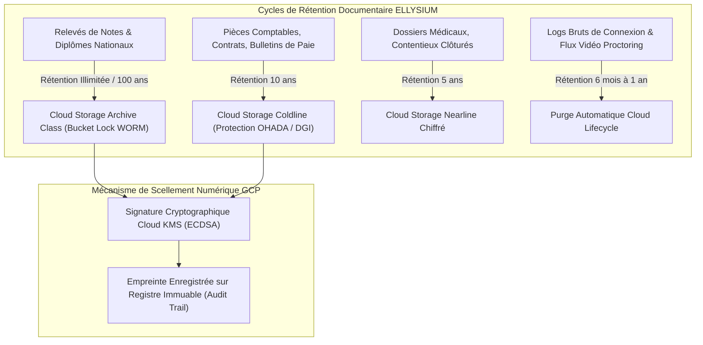

# Module 333 — Archivage légal – durée de conservation des dossiers et diplômes

## 1. Métadonnées du Sous-Tome

| Champ | Valeur |
| :--- | :--- |
| **Code Identification** | `ELL-T19-M333` |
| **Niveau d'Autorité** | Direction des Archives, Greffe Académique, Conservateur Numérique ELLYSIUM |
| **Statut Documentaire** | Validé / Norme Technique et Légale d'Archivage Pérenne |
| **Liaisons Amont** | `ELL-T08-M124` (Sauvegardes et réplication), `ELL-T19-M326` (Données personnelles), `ELL-T19-M332` (Conformité fiscale) |
| **Liaisons Aval** | `ELL-T19-M334` (Registre des risques), `ELL-T19-M335` (Plan de conformité), `ELL-T19-M336` (Clôture) |
| **Technologies GCP** | Google Cloud Storage (Archive Tier & Bucket Lock WORM), BigQuery, Cloud KMS |

---

## 2. Objet et Doctrine de Conservation Numérique

Le présent module arrête la politique officielle de conservation, de rétention, d'archivage à valeur probante et d'élimination sécurisée des documents académiques, administratifs, comptables et juridiques générés au sein de l'écosystème ELLYSIUM.

La doctrine repose sur **3 principes directeurs** :
1. **Pérennité Absolue des Diplômes et Relevés de Notes (100 ans / Perpétuité)** : Les preuves d'obtention de diplômes, de bulletins de notes semestriels et d'attestations de scolarité sont conservées à perpétuité pour garantir le droit fondamental des citoyens à faire valoir leurs acquis académiques tout au long de leur existence.
2. **Conformité Comptable et Fiscale (10 ans)** : Toutes les pièces comptables justificatives, déclarations fiscales, factures d'achats et contrats commerciaux sont scellées pour une durée minimale de 10 ans conformément au Droit Commercial Général OHADA et au Code Général des Impôts de la RDC.
3. **Minimisation et Droit à l'Oubli pour les Données Éphémères** : Les traces de navigation, logs bruts de serveurs, vidéosurveillance d'examens et données biométriques de session sont détruites à l'expiration stricte de leur finalité opérationnelle.



---

## 3. Matrice Légale des Délais de Conservation

| Typologie Documentaire | Durée de Conservation | Fondement Juridique / Normatif | Classe de Stockage GCP | Mode d'Élimination |
| :--- | :--- | :--- | :--- | :--- |
| **Diplômes, Attestations de Réussite, Cotes EXETAT** | **100 ans / Illimitée** | Arrêté Ministériel EPST/ESU, Droit à la preuve académique | Cloud Storage Archive (WORM Lock) | Aucune (Sanctuarisation perpétuelle) |
| **Bulletins de Notes Trimestriels / Semestriels** | **50 ans** | Norme Nationale de Traçabilité Scolaire RDC | Cloud Storage Archive | Aucune |
| **Contrats de Travail, Dossiers du Personnel** | **30 ans après départ** | Code du Travail de la RDC | Cloud Storage Coldline | Chiffrement détruit (Crypto-shredding) |
| **Pièces Comptables, Factures, Livres Journaux** | **10 ans** | Acte Uniforme OHADA portant Droit Commercial | Cloud Storage Coldline | Purge automatique certifiée |
| **Contrats Partenaires & Concessions d'Écoles** | **10 ans après résiliation** | Droit Général des Obligations RDC | Cloud Storage Coldline | Purge manuelle après audit juridique |
| **Tickets de Support Utilisateur, Échanges Médiation** | **3 ans après clôture** | Prescription civile ordinaire | Cloud Storage Nearline | Purge automatique BigQuery |
| **Logs de Connexion Télécoms / Adresses IP** | **12 mois** | Loi n° 15/023 sur les Télécommunications | Cloud Logging / BigQuery | Écrasement glissant |
| **Enregistrements Vidéo d'Examens Surveillés (Proctoring)** | **90 jours (si pas de fraude)** | RGPD & Loi RDC Protection Données Personnelles | Cloud Storage Standard | Suppression définitive après délibération |

---

## 4. Spécification Technique de la Rétention WORM sur Google Cloud

```json
{
  "lifecycle": {
    "rule": [
      {
        "action": {"type": "SetStorageClass", "storageClass": "ARCHIVE"},
        "condition": {"age": 365, "matchesPrefix": ["diplomes/", "releves-notes/"]}
      },
      {
        "action": {"type": "Delete"},
        "condition": {"age": 90, "matchesPrefix": ["proctoring-videos/temp/"]}
      },
      {
        "action": {"type": "Delete"},
        "condition": {"age": 365, "matchesPrefix": ["access-logs/network/"]}
      }
    ]
  },
  "retentionPolicy": {
    "retentionPeriod": 3153600000, 
    "isLocked": true
  }
}
```

---

## 5. Verrous Fonctionnels Critiques

| Réf. Verrou | Description Fonctionnelle et Technique | Conséquence en Cas de Violation |
| :--- | :--- | :--- |
| **`VF-333-01`** | **Immutabilité Technologique WORM (Write Once, Read Many)** : Les buckets Cloud Storage contenant les diplômes et relevés de notes disposent d'un `Retention Policy Lock` interdisant la suppression même par le Super-Admin du projet GCP. | Tentative de suppression bloquée par l'API Google Cloud Storage (`403 Forbidden`). |
| **`VF-333-02`** | **Double Authentification pour Consultation d'Archives Sensibles** : L'accès aux archives de plus de 5 ans requiert une double approbation (Directeur Académique + DPO) via Cloud IAM et approbation multi-facteurs. | Enregistrement de la tentative dans les alertes de sécurité Cloud Sentinel / SIEM. |
| **`VF-333-03`** | **Scellement Cryptographique des Diplômes** : Chaque diplôme archivé est accompagné d'un fichier manifeste contenant le hash SHA-256 signé par la clé maîtresse Cloud KMS d'ELLYSIUM. | Détection immédiate de toute falsification ou corruption de fichier. |
| **`VF-333-04`** | **Interdiction de Conservation Indéfinie des Flux Biométriques** : Tout enregistrement vidéo de session d'examen non contesté sous 90 jours est irrémédiablement effacé. | Responsabilité pénale du responsable de traitement pour rétention illicite de données sensibles. |
| **`VF-333-05`** | **Droit d'Accès et Délivrance de Duplicata Perpétuel** : Tout apprenant diplômé peut à tout moment, sans frais prohibitifs, requérir une copie certifiée conforme de son diplôme archivé. | Sanction administrative et mise en demeure de délivrance sous 15 jours. |
| **`VF-333-06`** | **Tout document juridique est indexé par un UUID et horodaté par Google Cloud Logging** | **Conséquence : violation = inéligibilité du module pour mise en production** |

---

*Sous-tome rédigé conformément aux Normes documentaires ELLYSIUM — Fondations 04.*
