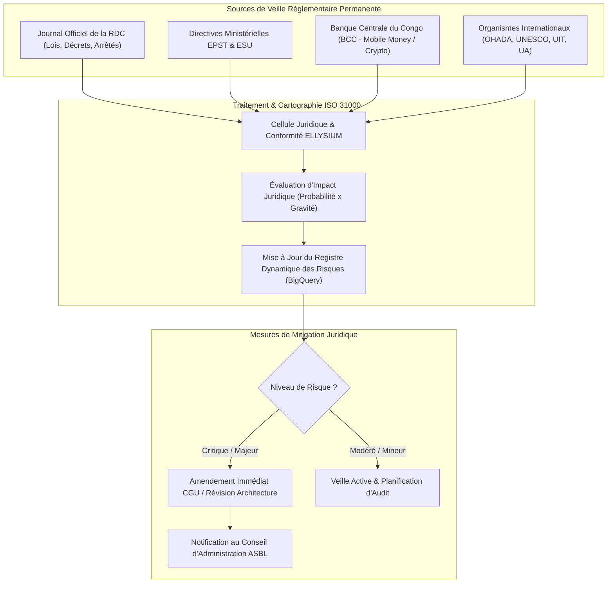

# Module 334 — Veille réglementaire et registre des risques juridiques

## 1. Métadonnées du Sous-Tome

| Champ | Valeur |
| :--- | :--- |
| **Code Identification** | `ELL-T19-M334` |
| **Niveau d'Autorité** | Direction Juridique, Délégué à la Protection des Données (DPO), Comité d'Audit et des Risques |
| **Statut Documentaire** | Validé / Norme Stratégique de Veille et Cartographie des Risques Juridiques |
| **Liaisons Amont** | `ELL-T19-M321` (Conformité Constitutionnelle/EPST/ESU), `ELL-T19-M326` (Protection des données), `ELL-T19-M331` (Litiges) |
| **Liaisons Aval** | `ELL-T19-M335` (Plan de conformité permanent), `ELL-T19-M336` (Clôture Tome 19 & Corpus ELLYSIUM) |
| **Outils Opérationnels** | BigQuery Compliance Dashboard, Alertes Journal Officiel RDC, Système de Scoring Risques (ISO 31000) |

---

## 2. Objet et Système de Veille Juridique Permanente

Le présent module définit le dispositif institutionnel de veille législative, réglementaire et jurisprudentielle d'ELLYSIUM ASBL, ainsi que la méthodologie de tenue dynamique du **Registre Cartographique des Risques Juridiques**.

Dans un contexte de transition numérique accélérée en République Démocratique du Congo (adoption du Code du Numérique, lois sur la cybercriminalité, réformes curriculaires EPST/ESU, réglementation bancaire BCC sur la monnaie électronique), ELLYSIUM doit anticiper toute évolution normative afin d'adapter ses statuts, ses CGU/CGS et ses algorithmes avant l'entrée en vigueur des textes contraignants.

---

## 3. Cartographie Types des Risques Juridiques ELLYSIUM

| ID Risque | Intitulé du Risque | Probabilité (1-5) | Impact (1-5) | Score Brut | Mesure d'Atténuation / Prévention ELLYSIUM |
| :--- | :--- | :--- | :--- | :--- | :--- |
| **`RJ-01`** | **Non-reconnaissance d'un module par l'EPST/ESU** | 2 | 5 | **10** (Majeur) | Cocréation des programmes avec les inspecteurs généraux de l'EPST (Tome 15). |
| **`RJ-02`** | **Violation de données de mineurs (Fuite PII)** | 1 | 5 | **5** (Critique) | Chiffrement AES-256 GCP KMS, isolation stricte, consentement parental vérifié (M327). |
| **`RJ-03`** | **Revendication de droits d'auteur sur un cours** | 3 | 3 | **9** (Modéré) | Cession formelle de droits signée pour chaque contenu et recours prioritaire aux OER (M328). |
| **`RJ-04`** | **Requalification fiscale de l'ASBL en entité commerciale**| 1 | 5 | **5** (Majeur) | Respect strict de la gratuité constitutionnelle (AIS/AIU) et affectation 100% désintéressée. |
| **`RJ-05`** | **Responsabilité du fait des prédictions IA / biais** | 2 | 4 | **8** (Modéré) | Application stricte de l'Article 6 de la Constitution : l'IA est purement consultative. |
| **`RJ-06`** | **Contentieux de rupture conventionnelle d'école affiliée**| 2 | 3 | **6** (Modéré) | Clause compromissoire CENACOM/OHADA et préavis contractuel de 90 jours (M329). |

---

## 4. Protocole d'Alerte et Procédure de Révision

1. **Cycle de Veille Bimensuelle** : Dépouillement systématique du Journal Officiel de la RDC et des dépêches de l'ARPTC et de la BCC.
2. **Fiche d'Impact Normatif (FIN)** : Rédigée sous 5 jours ouvrés pour tout texte touchant l'enseignement en ligne, les données personnelles, le droit du travail ou la fiscalité des ASBL.
3. **Revue Trimestrielle par le Comité d'Audit** : Présentation au Conseil d'Administration de la cartographie mise à jour des risques et des actions correctives engagées.

---

## 5. Verrous Fonctionnels Critiques

| Réf. Verrou | Description Fonctionnelle et Technique | Conséquence en Cas de Violation |
| :--- | :--- | :--- |
| **`VF-334-01`** | **Mise à Jour Obligatoire Trimestrielle du Registre des Risques** : Le registre des risques doit faire l'objet d'une validation formelle par le DPO et le Directeur Juridique chaque trimestre civil. | Blocage de l'approbation annuelle des comptes par les commissaires aux comptes. |
| **`VF-334-02`** | **Notification Obligatoire sous 48h de Tout Changement Législatif Majeur** : Toute modification de la loi scolaire ou du Code du Numérique requiert une note d'orientation transmise au CA sous 48h. | Faute professionnelle grave du responsable juridique. |
| **`VF-334-03`** | **Seuil d'Alerte Critique Automatisé** : Tout risque juridique dont le score résiduel dépasse 12/25 déclenche un plan de remédiation d'urgence audité en session extraordinaire du CA. | Audit externe juridique et technique déclenché immédiatement. |
| **`VF-334-04`** | **Archivage Historique des Versions de la Cartographie** : Chaque version du registre des risques est immuablement scellée dans Google Cloud Storage pour justification de diligence raisonnable (Due Diligence). | Présomption irréfragable de bonne foi juridique en cas de contrôle étatique. |
| **`VF-334-05`** | **Indépendance Opérationnelle du DPO et Auditeur Juridique** : Le DPO et le responsable conformité ne peuvent recevoir d'instructions opérationnelles contraires à la loi de la part de la direction générale. | Droit d'alerte direct auprès du Président du Conseil d'Administration. |

---

*Sous-tome rédigé conformément aux Normes documentaires ELLYSIUM — Fondations 04.*
