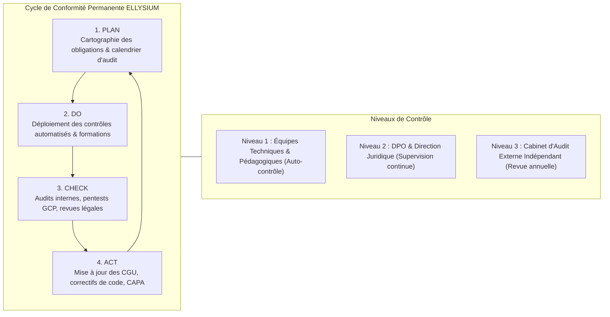

# Module 335 — Plan de conformité permanent – audits, mises à jour des politiques

## 1. Métadonnées du Sous-Tome

| Champ | Valeur |
| :--- | :--- |
| **Code Identification** | `ELL-T19-M335` |
| **Niveau d'Autorité** | Secrétariat Général, Comité d'Audit Interne, Experts Auditeurs Externes Indépendants |
| **Statut Documentaire** | Validé / Norme d'Amélioration Continue et d'Assurance Conformité Globale |
| **Liaisons Amont** | `ELL-T19-M321` (Lois RDC), `ELL-T19-M326` (RGPD/Loi 15/023), `ELL-T19-M334` (Registre des risques) |
| **Liaisons Aval** | `ELL-T19-M336` (Module de Dépendances et Clôture Générale du Corpus ELLYSIUM) |
| **Méthodologies** | Roue de Deming (PDCA), ISO/IEC 27001, ISO 27701, Cadre COSO |

---

## 2. Objet et Gouvernance du Plan de Conformité Permanent

Le présent module instaure le **Plan de Conformité Permanent (PCP)** d'ELLYSIUM ASBL. Ce dispositif garantit que l'ensemble des règles juridiques, engagements éthiques, contraintes fiscales, normes de sécurité Google Cloud Platform et principes constitutionnels sont continuellement évalués, testés, mis à jour et sanctionnés.

Le PCP repose sur le cycle d'assurance qualité **PDCA (Plan-Do-Check-Act)** :
- **Plan** : Définition des référentiels, des seuils de tolérance et du planning annuel des audits.
- **Do** : Application rigoureuse des contrôles de premier niveau par les équipes opérationnelles (devs, enseignants, comptables).
- **Check** : Audits de deuxième et troisième niveaux (internes bimensuels et externes annuels).
- **Act** : Émission de plans d'actions correctives (CAPA) et actualisation formelle des politiques de l'ASBL.

---

## 3. Calendrier Annuel des Audits et Revues de Conformité

| Domaine d'Audit | Périodicité | Intervenant / Responsable | Livrable Formel | Destinataires |
| :--- | :--- | :--- | :--- | :--- |
| **Audit des Données Personnelles (DPO)** | Semestrielle | Délégué à la Protection des Données | Rapport de Conformité Loi 15/023 / RGPD | Direction Générale & CA |
| **Pentest & Revue de Sécurité GCP** | Semestrielle | Cabinet Spécialisé en Cyber-Sécurité | Rapport de Test d'Intrusion & Correctifs | CTO & Direction Sécurité |
| **Audit Financier et Commissariat aux Comptes** | Annuelle | Expert-Comptable Agréé ONEC RDC | Rapport Financier et de Certification | Assemblée Générale Ordinaire |
| **Audit Pédagogique et Respect Curriculaire** | Annuelle | Inspection Générale EPST & Commission Mixte | Certificat de Conformité des Programmes | Ministère de Tutelle & CA |
| **Revue Juridique des CGU, CGS et Statuts** | Annuelle (Octobre) | Cabinet d'Avocats Conseil ELLYSIUM | Texte Consolidé des Nouvelles Politiques | Publié sur `ellysium.cd/cgu` |

---

## 4. Procédure Formelle de Mise à Jour des Politiques Contractuelles

1. **Identification du Besoin de Révision** : Déclenché par une modification légale, un rapport d'audit négatif ou une innovation technique sur la plateforme.
2. **Rédaction du Projet d'Amendement** : Réalisé par la Direction Juridique avec comparatif avant/après (diff) et analyse d'impact.
3. **Avis Consultatif du Comité Pédagogique et Éthique** : Vérification du respect scrupuleux des Articles 3, 4, 5 et 6 de la Constitution ELLYSIUM.
4. **Approbation par le Conseil d'Administration** : Délibération formelle et vote majoritaire des administrateurs.
5. **Notification Préalable aux Usagers (Préavis de 30 Jours)** :
   - Notification par e-mail et bannière in-app obligatoire sur toutes les landing pages Firebase.
   - Droit de résiliation sans pénalité pour les usagers n'acceptant pas les nouvelles dispositions avant la date d'effet.
6. **Scellement Numérique et Publication** : Déploiement de la nouvelle version sur Firebase Hosting et Cloud Storage avec incrémentation sémantique de version (ex: `CGU-v2.0`).

---

## 5. Verrous Fonctionnels Critiques

| Réf. Verrou | Description Fonctionnelle et Technique | Conséquence en Cas de Violation |
| :--- | :--- | :--- |
| **`VF-335-01`** | **Publication Obligatoire du Rapport Annuel de Conformité** : L'ASBL ELLYSIUM publie chaque année avant le 30 juin son rapport de transparence et de conformité accessible à tous les membres. | Sanction morale et mention d'irrégularité au procès-verbal de l'AG. |
| **`VF-335-02`** | **Délai de Préavis de 30 Jours Non Réductible pour Toute Mise à Jour de CGU** : Aucune nouvelle condition contractuelle désavantageuse pour les usagers ne peut entrer en vigueur sans un préavis public de 30 jours. | Inopposabilité légale des nouvelles conditions aux usagers préexistants. |
| **`VF-335-03`** | **Obligation de Remédiation sous 60 Jours pour Tout Écart Critique** : Toute non-conformité majeure révélée par un audit (faille de données, écart fiscal) doit être résolue sous 60 jours calendrier. | Mise sous tutelle administrative du pôle défaillant par le Conseil d'Administration. |
| **`VF-335-04`** | **Audit de Pentest GCP Obligatoire Avant Tout Déploiement Majeur** : Aucune nouvelle version majeure du portail ne peut être déployée en production sans validation des tests d'intrusion. | Blocage des pipelines Cloud Build et interdiction de release par le RSSI. |
| **`VF-335-05`** | **Sanctuarisation Intemporelle des Valeurs Fondatrices** : Aucune révision des politiques ou des statuts ne peut abroger ou restreindre la gratuité pour les apprenants isolés (Art. 3 & 4) ou l'indépendance de la pédagogie face aux finances (Art. 5). | Nullité absolue et immédiate de l'amendement pour violation de la clause d'intangibilité constitutionnelle. |

---

*Sous-tome rédigé conformément aux Normes documentaires ELLYSIUM — Fondations 04.*
