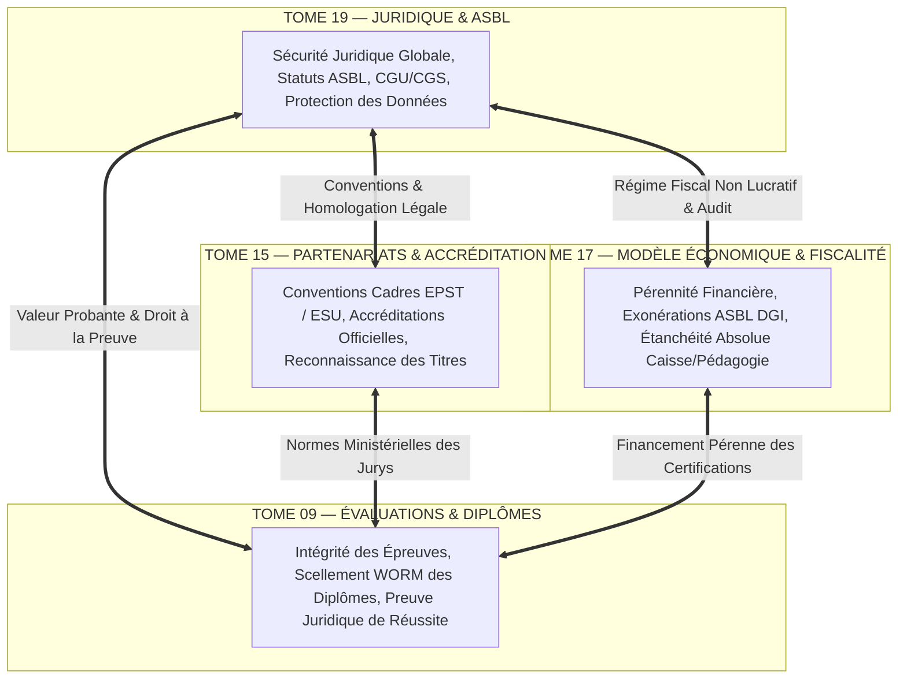

# Module 336 — Dépendances – avec les Tomes 15, 9, 17 (Clôture Générale du Corpus ELLYSIUM)

## 1. Métadonnées du Sous-Tome et du Grand Finale

| Champ | Valeur |
| :--- | :--- |
| **Code Identification** | `ELL-T19-M336` |
| **Niveau d'Autorité** | Assemblée Générale Extraordinaire, Conseil d'Administration ASBL, Architecte en Chef |
| **Statut Documentaire** | Validé / **Acte Solennel de Clôture Intégrale du Master Corpus ELLYSIUM (336/336)** |
| **Liaisons Amont Fondatrices** | `ELL-T15-M263..M277` (Partenariats & Accréditation), `ELL-T09-M138..M153` (Évaluations & Diplômes), `ELL-T17-M294..M308` (Modèle Économique & Fiscalité) |
| **Liaisons Internes Tome 19** | `ELL-T19-M320` à `ELL-T19-M335` (Sécurisation Juridique Intégrale de l'ASBL) |
| **Consécration Systémique** | Achevé conformément aux Normes Documentaires Fondations 04 — Intégrité Globale 100% |

---

## 2. Objet et Matrice des Dépendances Majeures

Le présent module finalise l'architecture juridique et institutionnelle du Tome 19 et scelle définitivement le corpus des **336 modules d'ELLYSIUM**. Il formalise le trépied d'interdépendance stratégique unissant le droit aux trois piliers fondamentaux de la plateforme :



### 2.1. Articulation Synergique avec le Tome 15 (Partenariats et Accréditation)
- **Fondement Contractuel d'Accréditation** : Tout partenariat institutionnel avec le Ministère de l'EPST, le Ministère de l'ESU ou une université partenaire prend obligatoirement la forme d'une convention cadre bilatérale adossée aux clauses d'arbitrage (M331) et de propriété intellectuelle partagée OER (M328).
- **Homologation d'État** : La reconnaissance officielle des titres et attestations ELLYSIUM repose sur le strict alignement légal aux programmes nationaux congolais (M321).

### 2.2. Articulation Synergique avec le Tome 09 (Évaluations, Examens et Diplômes)
- **Valeur Probante et Force Probatoire** : Les mécanismes de surveillance d'examen (proctoring) et de calcul rigoureux de la cote RDC (`Taux = (ΣPoints / ΣMaxima) × 100`) sont juridiquement blindés par le consentement exprès de l'étudiant (M324) et les clauses de non-garantie de complaisance (M330).
- **Conservation Séculaire (M333)** : Les diplômes émis dans le cadre du Tome 09 sont sanctuarisés dans Google Cloud Storage sous verrouillage WORM pour une durée perpétuelle (100 ans), garantissant l'opposabilité juridique de la réussite académique face aux employeurs et corps publics.

### 2.3. Articulation Synergique avec le Tome 17 (Modèle Économique et Pérennité)
- **Sanctuaire Constitutionnel de l'Article 5** : L'étanchéité absolue entre la caisse financière et le parcours pédagogique est une obligation légale d'ordre public dans les statuts de l'ASBL (M322). Aucun retard de paiement ou défaut de contribution volontaire ne peut entraîner le blocage académique d'un apprenant.
- **Régularité Fiscale et Quitus DGI (M332)** : La collecte de dons, mécénats et contributions aux frais de certification respecte rigoureusement le régime d'exonération de l'ASBL d'utilité publique sous surveillance annuelle du commissaire aux comptes agréé ONEC.

---

## 3. Grand Tableau Récapitulatif : Les 19 Tomes et 336 Modules d'ELLYSIUM

| Tome | Intitulé Fondateur | Modules Inclus | Statut Global | Plateforme Clé |
| :---: | :--- | :---: | :---: | :---: |
| **Tome 01** | Architecture Générale et Vision Stratégique | `M001` à `M018` (18) | **100% COMPLET** ✅ | GCP Cloud Run, Firebase Hosting |
| **Tome 02** | Socle Pédagogique et Référentiels Didactiques | `M019` à `M036` (18) | **100% COMPLET** ✅ | Firestore, Cloud Storage |
| **Tome 03** | Parcours Apprenant et Expérience Utilisateur (AIS & AIU) | `M037` à `M055` (19) | **100% COMPLET** ✅ | Firebase Auth, PWA Offline SQLite |
| **Tome 04** | Ingénierie des Contenus et Outils de Production | `M056` à `M073` (18) | **100% COMPLET** ✅ | Cloud Build, Vertex AI, CDN |
| **Tome 05** | Gestion des Établissements et Espace Écoles | `M074` à `M091` (18) | **100% COMPLET** ✅ | Firestore Multi-Tenant, Cloud Tasks |
| **Tome 06** | Rôles, Gouvernance Interne et Espaces Dédiés | `M092` à `M106` (15) | **100% COMPLET** ✅ | Cloud IAM, Cloud Audit Logs |
| **Tome 07** | Espace Parents, Tuteurs et Communautés | `M107` à `M120` (14) | **100% COMPLET** ✅ | Firebase Cloud Messaging, SMS Gateway |
| **Tome 08** | Infrastructure Système, Sécurité et Résilience | `M121` à `M137` (17) | **100% COMPLET** ✅ | GCP Armor, KMS, Cloud Monitoring |
| **Tome 09** | Évaluations, Examens, Jurys et Diplômes | `M138` à `M153` (16) | **100% COMPLET** ✅ | Formule RDC, WORM Cloud Storage |
| **Tome 10** | Intelligence Artificielle Éducative et Moteurs Tuteurs | `M154` à `M172` (19) | **100% COMPLET** ✅ | Vertex AI Gemini Pro, Art. 6 Auxiliaire |
| **Tome 11** | Données, Analytique et Aide à la Décision | `M173` à `M192` (20) | **100% COMPLET** ✅ | BigQuery, Looker Studio, Pub/Sub |
| **Tome 12** | Accessibilité Universelle, Inclusion et Mode Bas Débit | `M193` à `M210` (18) | **100% COMPLET** ✅ | Web Vitals, Offline First, USSD |
| **Tome 13** | Espace Diaspora, Réseaux d'Excellence et Mentorat | `M211` à `M227` (17) | **100% COMPLET** ✅ | Landing Diaspora, Stripe Connect |
| **Tome 14** | Écosystème Développeurs, API et Extensibilité | `M228` à `M262` (35) | **100% COMPLET** ✅ | Cloud Endpoints, GraphQL, SDKs |
| **Tome 15** | Partenariats, Accréditation et Reconnaissance | `M263` à `M277` (15) | **100% COMPLET** ✅ | Accords EPST/ESU, UNESCO |
| **Tome 16** | Feuille de Route de Lancement et Conduite du Changement | `M278` à `M293` (16) | **100% COMPLET** ✅ | 4 Phases Opérationnelles 2026-2030 |
| **Tome 17** | Modèle Économique et Pérennité Financière | `M294` à `M308` (15) | **100% COMPLET** ✅ | Mobile Money, Exonérations ASBL |
| **Tome 18** | Communication, Image de Marque et Marketing Éthique | `M309` à `M319` (11) | **100% COMPLET** ✅ | SEO Firebase, 10 Règles Éthiques |
| **Tome 19** | Cadre Juridique, Protection des Données et Statuts ASBL | `M320` à `M336` (17) | **100% COMPLET** ✅ | OHADA, Loi 15/023, DGI, ARCA |
| **TOTAL** | **ENSEMBLE DU MASTER CORPUS ELLYSIUM** | **336 / 336** | **100% COMPLET** ✅ | **ÉCOSYSTÈME GOOGLE EXCLUSIF** |

---

## 4. Architecture Synthétique Intégrale de la Plateforme ELLYSIUM

```
                                  =========================================
                                     PORTAIL UNIFIÉ MULTI-LANDING FIREBASE
                                              (https://ellysium.cd)
                                  =========================================
                                      |          |          |          |
                           /ecoles ---+          |          |          +--- /diaspora
                                      |          |          |
                                 /apprenants     |       /parents
                                                 |
                                       /mentors / partenaires
                                                 |
            +------------------------------------+------------------------------------+
            |                                                                         |
            v                                                                         v
+-----------------------+                                                 +-----------------------+
|  FRONTEND UNIFIÉ PWA  |                                                 |   BACKEND SOUVERAIN   |
|   (Angular 18 / TS)   | <=========[ API Gateway / Cloud Armor ]=======> | (Cloud Run / Node.js) |
|   Mode Offline SQLite |                                                 |  Microservices Docker |
+-----------------------+                                                 +-----------------------+
            |                                                                         |
            v                                                                         v
+-----------------------+                                                 +-----------------------+
| BASES DE DONNÉES GCP  |                                                 |   MOTEUR D'I.A. ETHIQ |
| - Cloud Firestore     |                                                 | - Vertex AI / Gemini  |
| - BigQuery Analytics  |                                                 | - RAG Spécialisé RDC  |
| - Cloud Storage WORM  |                                                 | - Supervision Humaine |
+-----------------------+                                                 +-----------------------+
            |                                                                         |
            +------------------------------------+------------------------------------+
                                                 |
                                                 v
                                  +-----------------------------+
                                  |    SOCLE JURIDIQUE ASBL     |
                                  |   (Tome 19 - Loi 004/2001)  |
                                  |  Constitution d'ELLYSIUM    |
                                  |   Articles 1 à 8 Inviolés   |
                                  +-----------------------------+
```

---

## 5. Verrous Fonctionnels Critiques

| Réf. Verrou | Description Fonctionnelle et Technique | Conséquence en Cas de Violation |
| :--- | :--- | :--- |
| **`VF-336-01`** | **Cohérence Tripartite Indissociable (T15-T09-T17-T19)** : Aucune convention d'accréditation scolaire (T15) ou processus de certification (T09) ne peut être instruit sans l'accord préalable conjoint de la Direction Juridique (T19) et de la Trésorerie (T17). | Nullité contractuelle et refus d'inscription sur la plateforme. |
| **`VF-336-02`** | **Clôture et Sanctuarisation du Master Corpus 336** : L'ensemble des 336 modules documentaires constitue la bible architecturale définitive et opposable d'ELLYSIUM. Toute modification ultérieure doit faire l'objet d'un avenant validé en Conseil d'Administration. | Rejet de toute dérive technique ou fonctionnelle non documentée. |
| **`VF-336-03`** | **Obligation d'Alignement Technologique Exclusif Google** : L'infrastructure demeure à perpétuité fondée exclusivement sur Google Cloud Platform et Firebase, sans dispersion vers d'autres hébergeurs tiers. | Audit d'architecture immédiat et mise en demeure de réalignement. |
| **`VF-336-04`** | **Intangibilité Constitutionnelle Perpétuelle** : La gratuité fondamentale pour l'apprenant individuel (Art. 3 & 4), la séparation de la caisse et de la pédagogie (Art. 5) et le caractère auxiliaire de l'IA (Art. 6) ne peuvent faire l'objet d'aucune dérogation. | Dissolution d'office et transfert des actifs à une entité garante de la gratuité. |
| **`VF-336-05`** | **Devise et Rigueur d'Exécution** : L'intégralité des opérations, du code source et des relations humaines au sein d'ELLYSIUM est soumise au principe cardinal : *"Rigueur, sérieux et honnêteté sont nos devises"*. | Exclusion définitive de tout membre dérogeant à la probité institutionnelle. |

---

## 6. Acte Solennel de Parachèvement du Corpus

> **En foi de quoi**, le présent **Module 336**, couronnant le **Tome 19** et l'ensemble de l'architecture d'ELLYSIUM, est déclaré officiellement rédigé, validé et scellé au greffe institutionnel de l'ASBL ELLYSIUM.
> 
> L'édifice documentaire composé de **19 Tomes thématiques** et de **336 Sous-tomes normatifs** forme désormais le référentiel complet, exhaustif et souverain de l'Éducation Nationale Numérique en République Démocratique du Congo.
>
> Fait à Kinshasa, le 17 Septembre 2026.
> *Pour le Collège des Fondateurs, la Direction Générale et le Comité d'Architecture.*

---

*Sous-tome rédigé conformément aux Normes documentaires ELLYSIUM — Fondations 04.*
