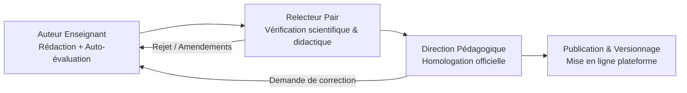
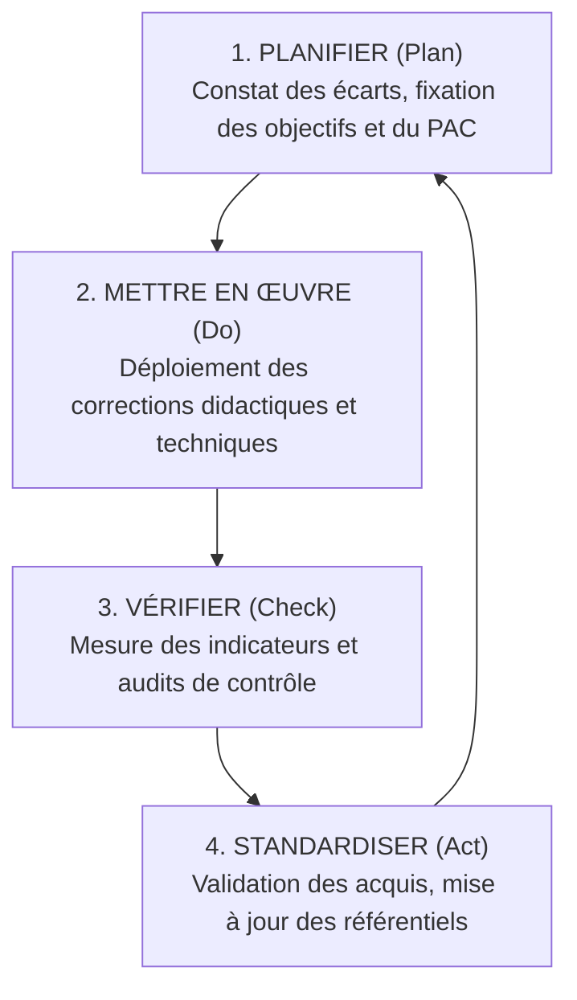

TOME 3 — ARCHITECTURE PÉDAGOGIQUE ET INGÉNIERIE DE L'ENSEIGNEMENT

PARTIE IX — ASSURANCE QUALITÉ PÉDAGOGIQUE

---

PRÉAMBULE DE LA PARTIE IX

La présente Partie IX définit les principes, dispositifs, protocoles et règles d'assurance qualité pédagogique au sein d'ELLYSIUM. Elle répond à une question centrale :

Comment l'institution garantit-elle, de manière permanente, mesurable et documentée, le niveau d'excellence scientifique, didactique et technique de ses enseignements, de ses évaluations et de son corps professoral ?

Dans un modèle d'enseignement numérique et à distance, l'assurance qualité ne peut pas être un contrôle rétrospectif ou un rituel bureaucratique intermittent. Elle constitue l'armature de la confiance publique. Elle prouve aux apprenants, aux parents d'élèves, aux établissements partenaires, aux employeurs et aux autorités de tutelle (Ministère de l'Éducation Nationale et Nouvelle Citoyenneté - MEPST, Ministère de l'Enseignement Supérieur et Universitaire - ESU) que les formations dispensées par ELLYSIUM répondent aux exigences académiques les plus strictes.

L'objectif suprême de l'assurance qualité à ELLYSIUM est d'éradiquer la complaisance, d'éviter l'obsolescence des connaissances transmises, de corriger immédiatement les défaillances didactiques et d'assurer une amélioration continue de l'ensemble du dispositif.

Les règles édictées dans cette Partie s'imposent sans dérogation à tous les concepteurs pédagogiques, enseignants, tuteurs, inspecteurs internes, auditeurs, administrateurs et développeurs de la plateforme.

Cette Partie est formellement subordonnée à la Constitution d'ELLYSIUM (Tome 2) et en cohérence intégrale avec le Tome 1. En cas de contradiction, les dispositions de la Constitution prévalent.

---

RAPPEL INSTITUTIONNEL ET CONTEXTUEL

Conformément à la Constitution d'ELLYSIUM (Tome 2) :
- **Article 4 (Principes non négociables)** : L'excellence pédagogique, l'intégrité scientifique, la traçabilité des décisions et l'amélioration continue constituent des impératifs absolus.
- **Article 12 (Neutralité et programmes)** : Les contenus doivent être rigoureusement conformes aux programmes nationaux de la RDC pour le secondaire, aux canevas LMD pour le supérieur, et présenter une neutralité politique, religieuse et idéologique totale.
- **Article 17 (Innovation permanente)** : L'institution évalue méthodiquement chaque innovation technologique ou méthodologique pour s'assurer qu'elle sert l'apprentissage sans en dégrader la rigueur.
- **Article 18 (Assurance qualité)** : Tout service, cours ou outil fait l'objet d'évaluations régulières sur la base de critères objectifs de performance et d'impact éducatif.

Le modèle d'assurance qualité d'ELLYSIUM s'inspire des meilleures normes internationales d'enseignement ouvert et à distance (notamment les standards de l'ICDE - Conseil International pour l'Éducation Ouverte et à Distance, les directives de l'UNESCO et les méthodologies de contrôle qualité d'UNISA), tout en étant enraciné dans le contexte institutionnel congolais.

---

DÉFINITIONS OFFICIELLES — PARTIE IX

Les définitions suivantes font foi pour l'ensemble des dispositions de la présente Partie :

**Assurance qualité pédagogique** : Ensemble systématique, planifié et documenté d'actions et de processus visant à garantir qu'un programme d'études, une leçon, une ressource, un enseignant ou un dispositif d'évaluation satisfait aux normes académiques et didactiques établies par l'institution et les ministères de tutelle.

**Contrôle qualité a priori** : Examen et validation obligatoire d'un contenu ou d'un dispositif avant toute mise en ligne et diffusion auprès des apprenants.

**Contrôle qualité continu** : Surveillance en temps réel et permanente de l'usage didactique, des indicateurs d'engagement, des taux de réussite et des anomalies pédagogiques.

**Contrôle qualité a posteriori** : Évaluation rétrospective de l'efficacité de l'enseignement à travers des audits formels, l'analyse des résultats d'examens d'État (TENASOSP, EXETAT), des évaluations semestrielles LMD et l'insertion professionnelle des diplômés.

**Audit pédagogique** : Examen méthodique, indépendant et documenté permettant d'évaluer la conformité et l'efficacité d'un enseignement ou d'un service par rapport aux objectifs et critères de référence.

**Plan d'Amélioration Continue (PAC)** : Document opérationnel obligatoire consignant les défaillances constatées, les actions correctives arrêtées, les responsables désignés, les indicateurs cibles et le calendrier précis d'exécution.

**Comité d'Assurance Qualité Pédagogique (CAQP)** : Instance collégiale suprême chargée de superviser les normes didactiques, d'approuver la mise à jour des programmes et de statuer sur les rapports d'audit.

---

# CHAPITRE 26 — CONTRÔLE QUALITÉ PÉDAGOGIQUE

### 26.1 Qualité des contenus didactiques

#### 26.1.1 Principes et critères directeurs
Tout contenu publié sur la plateforme ELLYSIUM (cours écrit, résumé, fiche de synthèse, vidéo, baladodiffusion audio, schéma, exercice, corrigé) doit obligatoirement satisfaire à cinq critères fondamentaux :
1. **Validité et exactitude scientifique** : Les notions, lois, formules, faits historiques et théories présentés doivent être vérifiés, dénués de toute inexactitude ou approximation, et conformes à l'état éprouvé de la science.
2. **Conformité stricte aux référentiels nationaux de RDC** : Les contenus du secondaire doivent correspondre fidèlement aux programmes officiels de la DIPROMAT (MEPST) ; les maquettes universitaires doivent intégrer les canevas du LMD (ESU).
3. **Qualité didactique et clarté rédactionnelle** : Les cours doivent appliquer les principes d'ingénierie définis aux Parties I et III du présent Tome 3 (formulation des objectifs selon la taxonomie de Bloom, séquençage logique, clarté conceptuelle, contextualisation africaine et congolaise, explicitation systématique des prérequis).
4. **Frugalité et adaptabilité technique** : Les contenus doivent être optimisés pour une lecture hors-ligne, un téléchargement ultra-rapide sur réseaux à faible bande passante (2G/3G) et un affichage irréprochable sur petits écrans de smartphones.
5. **Neutralité constitutionnelle** : Respect rigoureux de l'Article 12 de la Constitution. Interdiction absolue d'inclure des éléments de propagande politique, des prosélytismes religieux ou des discriminations idéologiques.

#### 26.1.2 Protocole de validation de publication en trois étapes
Aucun document de cours ne peut être mis en production sans avoir franchi avec succès le circuit de validation suivant :
- **Étape 1 — Auto-évaluation par le concepteur** : L'auteur enseignant remplit une grille critériée normalisée vérifiant la présence de toutes les rubriques obligatoires (objectifs, corps du texte, exemples, quiz, auto-évaluation).
- **Étape 2 — Relecture par les pairs (Peer-reviewing didactique)** : Le cours est soumis à l'examen anonyme d'au moins un autre enseignant de la même discipline, qui valide la pertinence didactique, la rigueur conceptuelle et l'absence d'erreurs de raisonnement.
- **Étape 3 — Homologation par la Direction Pédagogique et l'Inspecteur de Discipline** : Validation finale formelle par le responsable académique de la filière. Le contenu reçoit alors un identifiant unique de version et une signature numérique garantissant son intégrité.

---

### 26.2 Qualité des évaluations

#### 26.2.1 Critères métrologiques des évaluations
Toute épreuve (quiz automatisé, devoir à la maison, travaux pratiques, examen semestriel, simulation d'EXETAT) doit être calibrée selon quatre critères métrologiques rigoureux :
1. **Validité de contenu** : L'évaluation doit mesurer exactement ce qu'elle prétend mesurer, en stricte conformité avec les objectifs d'apprentissage annoncés dans le cours.
2. **Fidélité et objectivité** : Deux correcteurs indépendants appliquant le barème officiel doivent aboutir à une note identique. Pour les devoirs à correction humaine, la mise à disposition d'une grille critériée descriptive détaillée est obligatoire.
3. **Pouvoir discriminant** : L'épreuve doit comporter une progressivité de difficulté (questions de restitution de base, questions d'application directe, questions de synthèse et de réflexion critique) permettant de différencier clairement les niveaux réels d'acquisition.
4. **Équité et accessibilité** : L'épreuve ne doit pas pénaliser un apprenant pour des raisons technologiques (temps de réponse serveur, latence réseau) ou culturelles.

#### 26.2.2 Étalonnage et banque d'épreuves
- Toutes les questions à correction automatique sont intégrées dans une **Banque d'Épreuves Sécurisée**.
- Chaque question est étiquetée par son niveau de difficulté, sa discipline, sa matière, son objectif pédagogique spécifique et ses statistiques réelles de réussite observées lors des sessions antérieures.
- Toute question présentant un taux d'échec anormal (> 85 %) ou un taux de réussite universel (> 98 %) est automatiquement signalée pour révision didactique ou suppression par le comité de discipline.

#### 26.2.3 Prévention et détection des fraudes
Conformément à l'Article 16 de la Constitution d'ELLYSIUM, les protocoles de surveillance et de vérification d'intégrité sont stricts :
- Randomisation dynamique de l'ordre des questions et des options de réponse pour chaque candidat.
- Détection automatisée du copier-coller et analyse anti-plagiat systématique pour tous les travaux rédigés et mémoires universitaires.
- Analyse comportementale des temps de réponse pour détecter les tentatives de triche assistée.
- Obligation de confirmation physique en centre agréé pour les épreuves certifiantes finales et diplômantes.

---

### 26.3 Qualité et qualification du corps enseignant et des tuteurs

#### 26.3.1 Critères de recrutement et d'accréditation
Pour enseigner, concevoir des cours ou exercer comme tuteur à ELLYSIUM, les intervenants doivent satisfaire aux exigences académiques suivantes :
- **Secondaire** : Être titulaire au minimum d'un diplôme de gradué (Bac+3) ou d'une licence d'enseignement (ISP, Université) dans la discipline enseignée, avec une expérience pédagogique attestée.
- **Université** : Être titulaire au minimum d'un Master 2 de recherche (pour les travaux dirigés et le tutorat de Licence) ou d'un Doctorat (pour les cours magistraux, la direction de mémoires et la présidence de jurys LMD).
- **Compétences numériques certifiées** : Chaque enseignant recruté doit obligatoirement suivre et valider la formation interne ELLYSIUM à la didactique de l'enseignement à distance, à l'ingénierie des contenus numériques et à l'éthique de la relation apprenant-enseignant.

#### 26.3.2 Évaluation continue du corps enseignant
L'activité de chaque enseignant et tuteur fait l'objet d'un suivi semestriel structuré autour de :
1. **L'assiduité et la réactivité** : Respect des délais de correction des devoirs (délai maximal fixé à 5 jours ouvrés), fréquence des interventions sur les forums de tutorat, assiduité aux séances synchrones programmées.
2. **La pertinence des rétroactions (feedback didactique)** : Contrôle par sondage des appréciations portées sur les copies des élèves. Tout retour se limitant à une note sans justification explicative est sanctionné.
3. **L'évaluation par les apprenants** : À l'issue de chaque unité d'enseignement ou période scolaire, les apprenants remplissent une enquête d'évaluation pédagogique anonyme portant sur la clarté des explications, la disponibilité de l'enseignant et la qualité des échanges.
4. **L'évaluation collégiale par les pairs** : Observation périodique d'une classe virtuelle ou relecture d'un ensemble de corrigés par le chef de département académique.

---

### 26.4 Qualité des ressources d'apprentissage et supports numériques

#### 26.4.1 Frugalité technique et accessibilité universelle
Conformément à la Partie IV (Méthodes d'enseignement) et aux contraintes nationales de la RDC :
- **Poids unitaire maximal des leçons** : Une leçon texte complète incluant illustrations vectorielles ne doit pas excéder 500 kilo-octets.
- **Accessibilité tous handicaps** : Tout élément visuel (schéma, graphique) doit comporter un texte alternatif descriptif complet (balise alt). Les enregistrements audio et vidéo doivent obligatoirement disposer d'une transcription textuelle intégrale.
- **Pérennité des formats** : Utilisation exclusive de formats ouverts et documentés (Markdown, HTML5 sémantique, PDF/A, SVG pour les illustrations, Opus/AAC pour l'audio, WebM/MP4 pour la vidéo). Interdiction absolue de formats propriétaires verrouillés.

---

# CHAPITRE 27 — RÉVISION ET ÉVOLUTION DES PROGRAMMES

### 27.1 Veille scientifique, technologique et pédagogique

#### 27.1.1 Organisation de la veille
ELLYSIUM met en place une cellule permanente de veille académique rattachée à la Direction Pédagogique. Cette cellule a pour mission :
- De surveiller l'état de l'art scientifique et les découvertes fondamentales dans chaque domaine enseigné.
- D'identifier les évolutions technologiques majeures (notamment dans les facultés d'Informatique, de Gestion et de Santé Publique).
- De collecter et d'analyser les publications scientifiques relatives aux pédagogies numériques, à l'efficacité du télé-enseignement et aux sciences cognitives appliquées à l'apprentissage.

#### 27.1.2 Rapports annuels de veille disciplinaire
Chaque département académique produit annuellement un **Rapport de Veille Didactique** identifiant les concepts devenus obsolètes, les nouvelles approches méthodologiques à intégrer et les recommandations d'ajustement pour l'année académique suivante.

---

### 27.2 Processus et cycle de mise à jour des cours

#### 27.2.1 Cycle de révision triennal obligatoire
En dehors des corrections d'erreurs matérielles (qui sont effectuées en continu avec traçabilité immédiate) :
- **Secondaire** : Les cours sont révisés annuellement lors de l'intersession scolaire (juillet-août) afin d'intégrer les directives ministérielles de la rentrée scolaire.
- **Université** : Chaque maquette de formation et chaque syllabus de cours fait l'objet d'une révision de fond obligatoire tous les trois ans.

#### 27.2.2 Protection des cohortes en cours
Toute modification substantielle d'un programme ou d'un mode de validation ne peut avoir d'effet rétroactif sur les apprenants déjà engagés dans un semestre ou une année académique :
- Les règles d'évaluation et de pondération en vigueur au premier jour de l'année scolaire ou du semestre demeurent intangibles jusqu'à la clôture des délibérations de cette session.
- En cas de suppression ou de refonte majeure d'une Unité d'Enseignement (UE), des mesures transitoires et des équivalences automatiques de crédits sont obligatoirement arrêtées pour garantir les droits acquis des étudiants.

---

### 27.3 Conformité permanente aux référentiels officiels de la RDC

#### 27.3.1 Articulation avec les réformes du Ministère de l'EPST
- Tout arrêté ministériel, toute modification des grilles horaires ou tout ajustement des programmes nationaux publié par le Ministère de l'Éducation Nationale et Nouvelle Citoyenneté donne lieu, dans un délai maximal de 30 jours ouvrés, à une réunion d'alignement de la Commission Pédagogique d'ELLYSIUM.
- Les adaptations nécessaires sont consignées dans un avenant d'alignement au Tome 4 et déployées sur les cours de la plateforme.

#### 27.3.2 Articulation avec les canevas du Ministère de l'ESU
- Les maquettes de Licence et de Master d'ELLYSIUM restent en conformité stricte avec le Cadre Normatif National du LMD.
- L'intitulé des UE, le volume des crédits ECTS, la semestrialisation et les coefficients respectent scrupuleusement les arrêtés d'homologation de l'enseignement supérieur congolais.

---

### 27.4 Adéquation aux réalités économiques et à l'évolution des métiers

#### 27.4.1 Conseils de perfectionnement professionnels
Pour chaque filière universitaire et option professionnelle des humanités (Sciences Commerciales, Informatique de gestion, Électricité, Mécanique, Pédagogie) :
- Un **Conseil de Perfectionnement** réunissant des enseignants, des inspecteurs, des directeurs d'écoles partenaires et des représentants d'entreprises locales (FEC - Fédération des Entreprises du Congo, ordres professionnels, ONG de développement) se réunit une fois par an.
- Ce conseil émet des recommandations sur les compétences pratiques, les outils logiciels et les savoir-faire exigés par le marché du travail en RDC et dans la région d'Afrique centrale.

#### 27.4.2 Suivi de l'employabilité et des parcours des diplômés
L'Observatoire de l'Insertion d'ELLYSIUM réalise une enquête annuelle auprès des lauréats des examens d'État (EXETAT) et des diplômés de Licence LMD :
- Taux de poursuite d'études supérieures réussies.
- Taux d'insertion professionnelle à 6 mois et 12 mois.
- Degré d'adéquation entre la formation reçue et les fonctions occupées.
Ces données statistiques alimentent directement les révisions pédagogiques ultérieures.

---

# CHAPITRE 28 — AMÉLIORATION CONTINUE ET AUDITS

### 28.1 Audits pédagogiques internes et externes

#### 28.1.1 Typologie et calendrier des audits
L'Assurance Qualité d'ELLYSIUM orchestre trois niveaux d'audit complémentaires :
1. **Audits pédagogiques internes continus** : Réalisés chaque trimestre par les inspecteurs internes d'ELLYSIUM sur un échantillon aléatoire de 20 % des cours actifs, des cahiers de cotes et des devoirs corrigés.
2. **Audits annuels de conformité globale** : Bilan annuel complet portant sur l'ensemble de la chaîne : inscription, enseignement, calcul des moyennes, délibérations de jurys, génération des bulletins et archivage des dossiers.
3. **Audits externes indépendants** : Tous les deux ans, ELLYSIUM mandate une commission d'experts universitaires et d'inspecteurs généraux honoraires de l'EPST indépendants pour réaliser une revue complète de la gouvernance académique et de la qualité des programmes.

#### 28.1.2 Grille d'audit critériée
Chaque audit donne lieu à une notation objective selon 5 axes notés de 1 à 5 :
- *Axe 1 — Rigueur académique et conformité aux programmes RDC*.
- *Axe 2 — Efficacité didactique et clarté des supports*.
- *Axe 3 — Équité et rigueur du système d'évaluation*.
- *Axe 4 — Qualité de l'accompagnement et du tutorat*.
- *Axe 5 — Frugalité technique et accessibilité faible débit*.

Toute note globale inférieure à 3,5/5 déclenche une procédure d'alerte qualité immédiate.

---

### 28.2 Retours d'expérience des apprenants

#### 28.2.1 Enquêtes de satisfaction périodiques
- À la fin de chaque période scolaire (secondaire) et de chaque semestre (université), un questionnaire d'évaluation standardisé est proposé à l'ensemble des apprenants connectés.
- Les questions portent sur : l'intérêt du cours, la difficulté perçue, la qualité des supports, la rapidité des tuteurs et l'ergonomie générale.
- Les réponses sont traitées de façon strictement anonyme afin de garantir la liberté totale d'expression de chaque élève ou étudiant.

#### 28.2.2 Canal direct de signalement pédagogique
Chaque page de leçon et chaque interface d'évaluation dispose d'un bouton discret : **« Signaler une coquille ou une anomalie didactique »**.
- L'apprenant peut en un clic indiquer une faute typographique, un lien rompu, une ambiguïté dans une consigne ou une divergence de corrigé.
- Tout signalement est automatiquement ventilé dans la file de traitement du département didactique compétent, avec obligation de qualification ou correction sous 48 heures.

---

### 28.3 Retours des enseignants et des établissements partenaires

#### 28.3.1 Baromètre des enseignants et tuteurs
Les enseignants et tuteurs sont interrogés trimestriellement sur :
- La charge de travail réelle induite par les corrections et le tutorat.
- L'adéquation des outils numériques de saisie des cotes et de suivi des présences.
- Les besoins de formation continue et de perfectionnement disciplinaire.

#### 28.3.2 Retours des directions des établissements partenaires
Pour les écoles utilisant l'ERP scolaire d'ELLYSIUM, une revue semestrielle est organisée avec les préfets des études et directeurs d'écoles :
- Gains de temps constatés dans la gestion administrative.
- Fiabilité du module Caisse et de la génération des bulletins scolaires.
- Difficultés rencontrées avec les parents d'élèves ou avec la connectivité locale.

---

### 28.4 Analyse statistique approfondie des résultats et du décrochage

#### 28.4.1 Détection précoce du décrochage scolaire
Le système de Learning Analytics (encadré par la Partie VIII et le Tome 8) transmet quotidiennement au Comité Qualité les indicateurs agrégés suivants :
- Baisse brutale de l'assiduité ou du temps de connexion d'une cohorte.
- Taux d'abandon constaté entre deux trimestres ou semestres.
- Taux d'échec anormalement concentré sur une matière spécifique.

#### 28.4.2 Analyse post-examen d'État et délibérations
Dès la publication des résultats officiels de l'EXETAT et du TENASOSP par le Ministère congolais :
- Une commission spéciale compare les résultats obtenus par les élèves préparés sur ELLYSIUM aux moyennes nationales et provinciales.
- Une analyse fine par discipline permet d'identifier précisément les matières où les candidats ont surperformé ou sous-performé, et de recalibrer immédiatement les banques d'exercices pour l'année suivante.

---

### 28.5 Élaboration, exécution et suivi du Plan d'Amélioration Continue (PAC)

#### 28.5.1 Cycle d'amélioration PDCA (Plan - Do - Check - Act)
L'assurance qualité applique la méthode rigoureuse de la roue de Deming adaptée à l'enseignement :

#### 28.5.2 Le registre institutionnel du PAC
Chaque anomalie constatée lors des audits ou des enquêtes est consignée dans le Registre Officiel du PAC d'ELLYSIUM. Ce registre spécifie :
- La nature exacte de la défaillance (didactique, technique, organisationnelle).
- L'impact mesuré sur les apprenants.
- L'action corrective arrêtée.
- L'autorité responsable de sa mise en œuvre.
- L'indicateur objectif de réussite et la date d'échéance impérative.
- Le visa de validation émis par le Comité d'Assurance Qualité après vérification sur le terrain.

#### 28.5.3 Publication de transparence
Conformément à l'Article 4 et à l'Article 13 de la Constitution (Gouvernance et transparence), une synthèse annuelle des audits et des actions correctives du Plan d'Amélioration Continue est rendue publique et accessible à l'ensemble de la communauté d'ELLYSIUM.

---

CONCLUSION ET ARTICULATION DE LA PARTIE IX

La présente Partie IX boucle la cohérence académique de l'institution ELLYSIUM en fournissant l'appareil régulateur qui garantit sa longévité et sa crédibilité :
- Elle s'appuie directement sur les fondements pédagogiques des Parties I à VIII.
- Elle alimente la Partie X (Règles métiers pédagogiques) en fournissant les verrous opérationnels qui seront codés dans les modules logiciels.
- Elle prépare directement le **Tome 10 (Examens, certifications et détection des fraudes)** et le **Tome 15 (Partenariats, accréditation et reconnaissance institutionnelle)** en dotant l'institution d'un dossier qualité irréfutable devant les autorités de tutelle de la République Démocratique du Congo.
