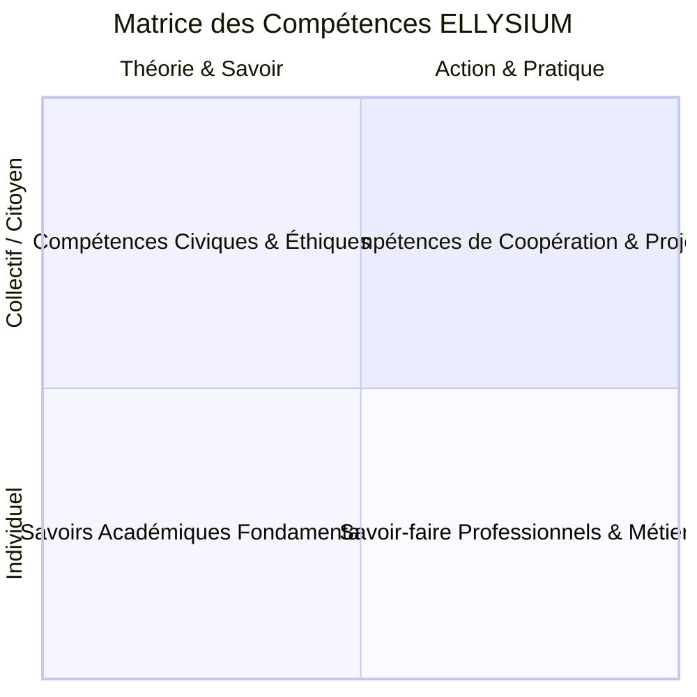

# TOME 3 — ARCHITECTURE PÉDAGOGIQUE ET INGÉNIERIE DE L'ENSEIGNEMENT

## ANNEXES RÉFÉRENTIELLES (A À J)

---

> **Autorité normative :** Annexes officielles associées au Tome 3 d'ELLYSIUM  
> **Conformité :** Subordonnées à la Constitution (Tome 2) et alignées sur les lois de la République Démocratique du Congo

---

## SOMMAIRE DES ANNEXES

- [Annexe A — Glossaire pédagogique officiel](#annexe-a--glossaire-pédagogique-officiel)
- [Annexe B — Références réglementaires de la RDC](#annexe-b--références-réglementaires-de-la-rdc)
- [Annexe C — Principes du système LMD](#annexe-c--principes-du-système-lmd)
- [Annexe D — Références méthodologiques d'UNISA](#annexe-d--références-méthodologiques-dunisa)
- [Annexe E — Référentiels de compétences](#annexe-e--référentiels-de-compétences)
- [Annexe F — Modèle normé de guide d'étude](#annexe-f--modèle-normé-de-guide-détude)
- [Annexe G — Modèle normé de syllabus de cours](#annexe-g--modèle-normé-de-syllabus-de-cours)
- [Annexe H — Modèle de progression pédagogique](#annexe-h--modèle-de-progression-pédagogique)
- [Annexe I — Exemples types de parcours d'apprentissage](#annexe-i--exemples-types-de-parcours-dapprentissage)
- [Annexe J — Bibliographie et normes pédagogiques](#annexe-j--bibliographie-et-normes-pédagogiques)

---

## ANNEXE A — GLOSSAIRE PÉDAGOGIQUE OFFICIEL

Cette annexe fixe la terminologie officielle obligatoire utilisée dans l'ensemble des documents, cours et interfaces d'ELLYSIUM :

- **Alignement constructif (Biggs)** : Principe selon lequel les objectifs d'apprentissage, les activités pédagogiques et les modalités d'évaluation sont conçus en cohérence absolue les uns avec les autres.
- **Approche par compétences (APC)** : Modèle pédagogique qui privilégie la capacité de l'apprenant à mobiliser des savoirs, savoir-faire et savoir-être dans une situation-problème concrète, par opposition à la seule mémorisation passive.
- **Asynchrone** : Modalité d'apprentissage où l'interaction entre l'enseignant et l'apprenant ne se fait pas en temps réel. L'apprenant avance à son propre rythme dans le cadre d'échéances fixées.
- **Banque d'items / d'épreuves** : Référentiel sécurisé contenant des questions et exercices calibrés par niveau de difficulté, objectif didactique et matière, servant à la génération aléatoire et équitable des examens.
- **Bulletin scellé** : Document officiel récapitulant les résultats académiques d'un apprenant pour une période, un semestre ou une année, signé numériquement et horodaté, dont toute altération postérieure est techniquement impossible.
- **Cahier des cotes** : Registre tenu par l'enseignant où sont saisies les notes brutes attribuées aux apprenants lors des différentes épreuves, associé aux maxima réglementaires.
- **Capitalisation (Crédits)** : Règle du système LMD selon laquelle une Unité d'Enseignement validée (note $\ge 10/20$) est définitivement acquise pour l'étudiant, même en cas de redoublement ou de changement d'université.
- **Compensation** : Règle académique permettant aux notes supérieures à 10 d'une UE de compenser les notes inférieures d'une autre UE au sein d'un même semestre ou d'une même année, selon des seuils minimaux définis.
- **Cycle d'Orientation (CTEB)** : Phase initiale de l'enseignement secondaire en RDC d'une durée de deux ans (7e et 8e années de l'Éducation de Base), commune à tous les élèves.
- **DIPROMAT** : Direction des Programmes Scolaires et Matériel Didactique du Ministère en charge de l'Enseignement Primaire et Secondaire en RDC.
- **ECU (Élément Constitutif d'Unité)** : Subdivision pédagogique d'une Unité d'Enseignement (UE) universitaire, correspondant généralement à un cours spécifique.
- **EXETAT (Examen d'État)** : Examen national sanctionnant la fin des quatre années d'humanités secondaires en RDC et ouvrant l'accès à l'enseignement supérieur.
- **Humanités** : Cycle de spécialisation du secondaire congolais d'une durée de quatre ans (1re à 4e humanités, correspondant aux 9e à 12e années de la scolarité globale).
- **IUNE (Identifiant Unique National ELLYSIUM)** : Numéro d'immatriculation pérenne attribué à tout apprenant dès sa première inscription, conservant son historique académique complet à vie.
- **Local-First / Offline-First** : Architecture logicielle où l'application fonctionne intégralement sans réseau grâce à une base locale sur l'appareil de l'élève, synchronisant ses données dès qu'un accès réseau est disponible.
- **LMD (Licence-Master-Doctorat)** : Architecture d'enseignement supérieur articulée en 3 cycles : Licence (Bac+3, 180 crédits), Master (Bac+5, 120 crédits supplémentaires), Doctorat (Bac+8).
- **Maxima variables** : Système de notation officiel en RDC où chaque évaluation possède son total propre de points (ex. interrogation sur 10, devoir sur 20, examen sur 60), imposant un calcul de résultat par cumul des points obtenus sur la somme des maxima.
- **Remédiation** : Dispositif pédagogique ciblé proposé à un apprenant ayant échoué à un objectif spécifique, visant à combler ses lacunes avant l'évaluation suivante.
- **Synchrone** : Modalité d'apprentissage en temps réel (classe virtuelle, visioconférence, clavardage direct).
- **TENASOSP** : Test National de Sélection et d'Orientation Scolaire et Professionnelle, organisé à l'issue de la 8e année de base en RDC pour orienter l'élève vers les différentes filières des humanités.
- **UE (Unité d'Enseignement)** : Bloc fondamental du cursus universitaire LMD regroupant un ensemble cohérent de connaissances et de compétences, crédité en ECTS.

---

## ANNEXE B — RÉFÉRENCES RÉGLEMENTAIRES DE LA RDC

ELLYSIUM inscrit son fonctionnement dans le respect absolu des textes légaux et réglementaires de la République Démocratique du Congo :

1. **Textes généraux de l'Enseignement National** :
   - *Loi-cadre n° 14/004 du 11 février 2014 de l'Enseignement National* : Pose les principes fondamentaux de l'éducation, le droit pour tout citoyen à l'instruction, la liberté d'enseignement et la promotion des technologies éducatives.
   - *Constitution de la République Démocratique du Congo du 18 février 2006* (telle que modifiée par la Loi n° 11/002 du 20 janvier 2011), notamment les articles 43 (droit à l'éducation) et 44 (éradication de l'analphabétisme).
2. **Textes de l'Enseignement Primaire, Secondaire et Technique (EPST / MEPST)** :
   - *Décrets portant création et organisation du Cycle Terminal de l'Éducation de Base (CTEB - 7e et 8e années)*.
   - *Arrêtés ministériels fixant la nomenclature officielle des sections et options des humanités secondaires*.
   - *Instructions officielles de la DIPROMAT relatives aux programmes scolaires nationaux et aux coefficients de cotation*.
   - *Ordonnance ministérielle régissant l'organisation de l'Examen d'État (EXETAT) et du TENASOSP*.
3. **Textes de l'Enseignement Supérieur et Universitaire (ESU)** :
   - *Loi-cadre et Arrêtés ministériels portant généralisation du système LMD dans l'ensemble des établissements d'enseignement supérieur et universitaire de la RDC*.
   - *Cadre Normatif National du système LMD (ESU - Kinshasa)* : Définition des domaines, filières, mentions, maquettes types, semestres et crédits.
4. **Textes du Numérique et des Télécommunications** :
   - *Loi n° 20/017 du 25 novembre 2020 relative aux télécommunications et aux technologies de l'information et de la communication en RDC*.
   - *Ordonnance-loi n° 23/010 du 13 mars 2023 portant Code du Numérique en RDC* (protection des données personnelles, validité juridique des documents électroniques, signature numérique, cybercriminalité).

---

## ANNEXE C — PRINCIPES DU SYSTÈME LMD

Le modèle universitaire d'ELLYSIUM applique rigoureusement les normes du système LMD :

### C.1 Les trois cycles fondamentaux
- **Licence (Bac + 3)** : 6 semestres (S1 à S6) de 30 crédits chacun, soit un total de 180 crédits ECTS. Sanctionne un premier niveau de qualification professionnelle ou prépare à la poursuite d'études.
- **Master (Bac + 5)** : 4 semestres (S7 à S10) de 30 crédits chacun, soit 120 crédits supplémentaires (300 crédits cumulés). Décliné en Master Professionnel (spécialisation directe) ou Master de Recherche (voie doctorale).
- **Doctorat (Bac + 8)** : 6 semestres de recherche (180 crédits supplémentaires). *Non déployé dans la phase initiale d'ELLYSIUM.*

### C.2 Mesure de l'effort par le crédit ECTS
- 1 crédit ECTS équivaut à **25 à 30 heures de travail global de l'étudiant**.
- Ce volume horaire intègre :
  - Les heures d'apprentissage guidé (cours écrits, podcasts, vidéos explicatives, classes virtuelles) : ~ 30 % à 40 %.
  - Les heures de travaux personnels (lectures, résumés, exercices, projets, recherche) : ~ 50 % à 60 %.
  - Les temps d'évaluation formelle (quiz, devoirs, examens) : ~ 10 %.
- Une année académique à plein temps représente 60 crédits ECTS (1 500 à 1 800 heures d'investissement apprenant).

### C.3 Typologie des Unités d'Enseignement (UE)
Chaque semestre universitaire est composé de :
1. **UE Fondamentales (UEF)** : Constituent le noyau dur de la discipline (ex. *Algorithmique et structures de données* en Informatique). Elles représentent au moins 60 % des crédits du semestre et ne peuvent généralement pas être compensées si la note est trop basse.
2. **UE Complémentaires / Méthodologiques (UEC/UEM)** : Outils d'appui indispensables (ex. *Mathématiques appliquées, Méthodologie du travail universitaire, Statistiques*).
3. **UE Transversales (UET)** : Compétences d'ouverture et d'insertion (ex. *Anglais académique et professionnel, Éthique et citoyenneté, Droit du numérique*).

### C.4 Règles de validation, compensation et mention
- **Validation d'une UE** : Une UE est définitivement validée et capitalisée dès lors que la moyenne des éléments constitutifs (ECU) qui la composent est supérieure ou égale à 10/20.
- **Compensation semestrielle** : La compensation s'exerce entre les UE d'un même semestre si la moyenne générale pondérée du semestre est $\ge 10/20$, sous réserve qu'aucune UE fondamentale n'obtienne une note strictement inférieure à la note éliminatoire de 7/20.
- **Tableau des mentions officielles** :
  - De 10,00 à 11,99 / 20 : Mention **Passable** (Satisfaction).
  - De 12,00 à 13,99 / 20 : Mention **Assez Bien** (Distinction).
  - De 14,00 à 15,99 / 20 : Mention **Bien** (Grande Distinction).
  - De 16,00 à 20,00 / 20 : Mention **Très Bien / Excellent** (La Plus Grande Distinction).

---

## ANNEXE D — RÉFÉRENCES MÉTHODOLOGIQUES D'UNISA

L'Université d'Afrique du Sud (UNISA) constitue la référence continentale africaine centenaire de l'enseignement ouvert et à distance (Open and Distance Learning - ODL). ELLYSIUM adapte les principes majeurs d'UNISA aux réalités de l'Afrique francophone :

1. **Le « Student-Centered ODL » (Apprenant au centre)** :
   - L'apprenant à distance n'est pas un spectateur passif recevant un flux magistral, mais un acteur autonome gérant son planning.
   - Les supports de cours sont écrits dans un style conversationnel didactique (« Guided didactic conversation » d'Holmberg) où le document dialogue avec l'élève, pose des questions, anticipe les incompréhensions et propose des temps d'arrêt de réflexion.
2. **La règle des « Study Packages » autonomes et complets** :
   - Un cours à distance doit être autonome : un apprenant qui télécharge son paquet d'étude dans une zone isolée sans accès internet régulier doit trouver dans son guide d'étude l'intégralité des notions, textes fondamentaux, exemples et exercices nécessaires sans dépendre d'une bibliothèque physique inaccessible.
3. **Le découpage en « Study Units » (Unités d'apprentissage modulaires)** :
   - Découpage strict de chaque cours en unités d'apprentissage digestes (1 à 2 heures de travail concentré par unité), évitant la surcharge cognitive.
4. **Le modèle d'évaluation formative continue** :
   - Multiplier les évaluations intermédiaires formatives sans enjeu punitif afin de maintenir la motivation de l'apprenant et d'éviter l'abandon (fléau historique de l'e-learning).
5. **Le réseau décentralisé de soutien (Study Centres)** :
   - Bien qu'entièrement numérique, ELLYSIUM s'appuie, à l'instar d'UNISA, sur des établissements partenaires physiques pour servir de points de contact, de centres d'examen sécurisés et de lieux de connectivité mutualisée.

---

## ANNEXE E — RÉFÉRENTIELS DE COMPÉTENCES

ELLYSIUM articule tous ses cursus autour de 4 macro-domaines de compétences :



1. **Savoirs fondamentaux (Connaissances)** :
   - Maîtrise des concepts, théories, formules et terminologies scientifiques et littéraires.
2. **Savoir-faire opérationnels (Compétences pratiques)** :
   - Capacité à résoudre un problème d'ingénierie, à concevoir un algorithme, à tenir un bilan comptable, à rédiger un acte juridique ou à diagnostiquer un enjeu de santé communautaire.
3. **Savoir-être et compétences transversales (Soft Skills)** :
   - Rigueur intellectuelle, esprit critique, autonomie de travail, gestion du temps, capacité d'auto-évaluation et honnêteté académique.
4. **Compétences citoyennes et panafricaines** :
   - Conscience citoyenne, respect des lois et de la chose publique, éthique professionnelle, préservation de l'environnement et engagement au service du développement économique de la RDC et du continent.

---

## ANNEXE F — MODÈLE NORMÉ DE GUIDE D'ÉTUDE

Tout cours ou matière dispensé à ELLYSIUM s'accompagne obligatoirement d'un **Guide d'Étude** normé selon le plan-type suivant :

```markdown
# GUIDE D'ÉTUDE : [Code Cours] — [Intitulé Officiel du Cours]
## Niveau : [ex. 8e Année de Base / Licence 1 Informatique] | Crédits : [ex. 6 ECTS]

### 1. Bienvenue et Présentation de l'Équipe Pédagogique
- Message de bienvenue du professeur responsable.
- Noms, coordonnées académiques et horaires de permanence des tuteurs.

### 2. Finalités et Objectifs d'Apprentissage
- Pourquoi ce cours est-il essentiel dans votre parcours ?
- Objectifs généraux et compétences mesurables visées au terme du cursus.

### 3. Prérequis et Test d'Auto-positionnement
- Ce que vous devez déjà maîtriser avant de débuter.
- Quiz court d'auto-évaluation des prérequis avec corrigé immédiat.

### 4. Méthodologie de Travail et Conseils d'Organisation
- Volume horaire hebdomadaire estimé (heures de cours + travail personnel).
- Comment aborder les leçons et exploiter le cahier de notes personnel.
- Stratégie d'étude pour les étudiants travaillant hors-ligne.

### 5. Calendrier Hebdomadaire et Échéancier Impératif
- Tableau semestriel semaine par semaine : unités à étudier, dates de remise des devoirs, dates des classes virtuelles facultatives et des examens.

### 6. Modalités d'Évaluation et Barèmes
- Répartition des points entre contrôle continu (quiz, devoirs) et examen final.
- Critères de notation et seuils minimaux de validation.

### 7. Ressources Obligatoires et Complémentaires
- Manuels officiels en texte intégral téléchargeables sur la plateforme.
- Liens vers les ressources libres et la bibliothèque numérique d'ELLYSIUM.

### 8. Foire Aux Questions (FAQ) Pédagogique
- Réponses claires aux 10 questions didactiques les plus fréquentes sur ce cours.
```

---

## ANNEXE G — MODÈLE NORMÉ DE SYLLABUS DE COURS

Le **Syllabus de Cours** codifie l'intégralité du contenu didactique et doit être structuré de manière rigide :

```markdown
# SYLLABUS DE COURS : [Code UE/Cours] — [Intitulé]

## 1. Fiche d'Identité du Cours
- Faculté / Département / Section :
- Semestre d'enseignement :
- Volume horaire global : CM ([X]h), TD ([X]h), TP ([X]h), Travail personnel ([X]h)
- Coefficients / Crédits ECTS :

## 2. Description Sommaire (Course Description)
- Résumé du champ disciplinaire en 250 mots.

## 3. Matrice Compétences — Objectifs Spécifiques
| Chapitre | Compétence Visée | Objectif Spécifique (Bloom) | Modalité d'Évaluation |
| :--- | :--- | :--- | :--- |
| Chapitre 1 | Savoir identifier... | Être capable d'énoncer et définir... | Quiz d'assimilation |
| Chapitre 2 | Savoir appliquer... | Être capable de calculer et résoudre... | Devoir d'application |

## 4. Plan de Cours Détaillé (Chapitres et Leçons)
- Chapitre 1 : [Titre]
  - Leçon 1.1 : [Concepts clés, illustrations]
  - Leçon 1.2 : [...]
- Chapitre 2 : [...]

## 5. Travaux Pratiques et Études de Cas (le cas échéant)
- Descriptif des protocoles de TP, logiciels libres utilisés ou études de cas d'entreprises congolaises.

## 6. Références Bibliographiques Officielles
- Ouvrages de référence, manuels ministériels agréés et publications académiques recommandées.
```

---

## ANNEXE H — MODÈLE DE PROGRESSION PÉDAGOGIQUE

Toute année scolaire secondaire (organisée en 4 périodes et 2 semestres) et toute maquette semestrielle universitaire (organisée sur 15 semaines d'enseignement actif) suit un gabarit de progression prédéfini :

### H.1 Gabarit Semestriel Universitaire (15 Semaines)
- **Semaines 1 à 6** : Bloc d'enseignements fondamentaux n° 1 (Leçons 1 à 6) + Évaluations formatives hebdomadaires non pénalisantes.
- **Semaine 7** : Session d'évaluation mi-semestre (Devoir surveillé sommative n° 1) + Rétroaction détaillée des tuteurs.
- **Semaine 8** : Semaine de remédiation ciblée pour les étudiants en difficulté + Approfondissement pour les étudiants avancés.
- **Semaines 9 à 13** : Bloc d'enseignements fondamentaux n° 2 (Leçons 7 à 12) + Travaux dirigés et dépôts de projets.
- **Semaine 14** : Révisions générales, banques d'annales corrigées et séances de questions-réponses avec les professeurs.
- **Semaine 15** : Session des examens terminaux semestriels.
- **Intersession** : Délibérations des jurys, publication des relevés scellés, rattrapages semestriels.

---

## ANNEXE I — EXEMPLES TYPES DE PARCOURS D'APPRENTISSAGE

### I.1 Profil 1 : L'Élève Affilié au Secondaire (Goma, Nord-Kivu)
- **Situation** : Inscrit à l'Institut Technique Industriel partenaire. L'école a subi des coupures de courant et des perturbations de calendrier.
- **Parcours sur ELLYSIUM** :
  1. L'élève télécharge chaque lundi matin les cours de la semaine sur l'application mobile de son téléphone Android à la borne Wi-Fi de l'école.
  2. Il étudie hors-ligne chez lui le soir : lit les cours de Mathématiques et d'Électricité, écoute les synthèses audio compressées de son professeur.
  3. Il résout les exercices interactifs locaux. L'application stocke ses scores dans la base SQLite chiffrée.
  4. Le jeudi, dès qu'il repasse à proximité du réseau de l'école, l'application synchronise automatiquement ses devoirs vers le serveur de l'école.
  5. Ses cotes sont intégrées dans le cahier des cotes officiel de son école et prises en compte pour son bulletin national.

### I.2 Profil 2 : L'Apprenant Universitaire Indépendant (Kananga, Kasaï-Central)
- **Situation** : Titulaire d'un diplôme d'État (EXETAT), isolé géographiquement, n'ayant pas les moyens financiers de s'inscrire dans une université classique à 600 km de sa résidence.
- **Parcours sur ELLYSIUM** :
  1. Il crée son compte gratuitement en tant que *Personne — Apprenant Indépendant*.
  2. Il choisit la Licence 1 en *Informatique et Génie Logiciel*.
  3. L'institution lui attribue son Identifiant Unique National ELLYSIUM (IUNE).
  4. Il suit les 10 UE de sa première année à son rythme, soutenu par les tuteurs en ligne et le Tuteur IA (limité à l'aide méthodologique).
  5. Il valide ses 60 crédits ECTS par semestre en passant les examens sommatifs et surveillés en centre partenaire agréé.
  6. Son relevé de notes officiel scellé avec QR code infalsifiable est disponible dans son coffre-fort numérique.

---

## ANNEXE J — BIBLIOGRAPHIE ET NORMES PÉDAGOGIQUES

Les concepteurs didactiques d'ELLYSIUM s'appuient obligatoirement sur les ouvrages, référentiels et standards scientifiques suivants :

1. **Sciences cognitives et didactique de l'apprentissage** :
   - Bloom, B. S. (1956). *Taxonomy of Educational Objectives*. (Révisée par Anderson & Krathwohl, 2001).
   - Biggs, J. (1996). *Enhancing teaching through constructive alignment*. Higher Education, 32(3), 347-364.
   - Sweller, J. (1988). *Cognitive Load During Problem Solving: Effects on Learning*. Cognitive Science, 12(2), 257-285.
   - Tardif, J. (2006). *L'évaluation des compétences : Documenter le parcours de développement*. Chenelière Éducation.
2. **Enseignement ouvert, à distance et e-learning (ODL)** :
   - Holmberg, B. (1989). *Theory and Practice of Distance Education*. Routledge.
   - Moore, M. G. (1993). *Theory of transactional distance*. Theoretical principles of distance education, 22-38.
   - Bates, A. W. (2019). *Teaching in a Digital Age: Guidelines for designing teaching and learning*. Tony Bates Associates Ltd.
   - UNISA (2020). *Curriculum Policy and Framework for Open Distance eLearning*. University of South Africa Press, Pretoria.
3. **Normes internationales de technologies éducatives** :
   - **IMS Global / 1EdTech** : Standards LTI (Learning Tools Interoperability), Caliper Analytics, Question and Test Interoperability (QTI).
   - **W3C WCAG 2.2** : Web Content Accessibility Guidelines (Accessibilité universelle aux personnes en situation de handicap).
   - **UNESCO (2019)** : *Recommandation sur les Ressources Éducatives Libres (REL / OER)*.
