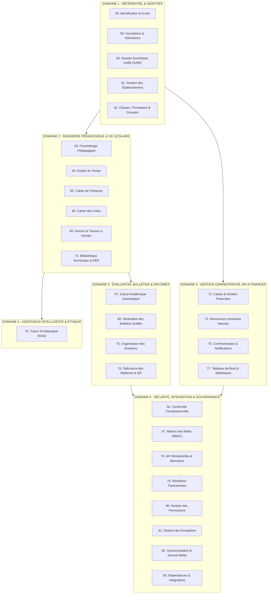

# TOME 5 — ARCHITECTURE FONCTIONNELLE
## 55. Périmètre du Tome 5 — Vision Fonctionnelle Globale

---

> **Positionnement :** Spécification fonctionnelle générale du système ELLYSIUM  
> **Autorité :** Subordonné à la Constitution (Tome 2) et aligné sur l'Architecture Pédagogique (Tome 3)  
> **Liaison aval :** Base directe pour l'Architecture Technique (Tome 7) et les Spécifications d'Applications (Tome 12)

---

## 1. Objet et Finalité du Sous-Tome

Le présent sous-tome définit le périmètre fonctionnel global, les frontières applicatives et la vision systémique unifiée de la plateforme numérique du **Centre National d'Étude en Ligne ELYSIUM (CNELE)**.

Il formalise la manière dont le système orchestre, au sein d'une infrastructure unique, deux missions institutionnelles complémentaires :
1. **L'Institution d'Enseignement à Distance Souveraine** : Dispensant gratuitement et entièrement en ligne des cycles secondaires et universitaires complets aux apprenants individuels et indépendants.
2. **Le Système Intégré de Gestion Scolaire (ERP / SIS)** : Fournissant aux établissements d'enseignement partenaires (publics, conventionnés et privés) un progiciel de gestion intégré couvrant la scolarité, la pédagogie, le personnel, la discipline et les finances scolaires.

Ce document établit la frontière stricte entre :
- Le **Quoi** (les capacités et règles métier fonctionnelles décrites dans ce Tome 5).
- Le **Pour Quoi Didactique** (les programmes et maquettes académiques définis dans les Tomes 3 et 4).
- Le **Comment Technique** (l'architecture logicielle, les bases de données et protocoles spécifiés au Tome 7).

---

## 2. Principes Fondateurs de l'Architecture Fonctionnelle

L'ensemble des modules du Tome 5 repose sur cinq principes d'ingénierie fonctionnelle non négociables :

### 2.1 Unité du Système et Dualité des Parcours
La plateforme ELLYSIUM est une institution unique. L'accès au système commence par un entonnoir d'identification commun orientant l'utilisateur vers son statut :
- **Parcours Établissement** : Conçu comme un espace de pilotage institutionnel pour la direction, les préfets d'études, les enseignants, les comptables et les élèves scolarisés dans l'école.
- **Parcours Personne / Apprenant Indépendant** : Conçu comme un campus numérique ouvert offrant l'accès autonome aux cours, devoirs, tuteurs et certifications.

### 2.2 Primauté Absolue de la Responsabilité Humaine
Conformément à l'Article 6 de la Constitution d'ELLYSIUM, aucun algorithme, moteur de règles ou agent d'intelligence artificielle ne dispose du pouvoir fonctionnel de :
- Prononcer une exclusion disciplinaire ou un rejet d'admission définitif.
- Décider seul du redoublement, de la réorientation ou du passage d'un élève.
- Sceller ou modifier un bulletin de notes officiel.
- Valider l'octroi d'un diplôme d'État ou d'un grade académique universitaire.
Le système est conçu pour assister, alerter, calculer et proposer, mais réserve exclusivement la signature décisionnelle à des autorités humaines authentifiées (professeur, préfet des études, jury de délibération, direction).

### 2.3 Traçabilité et Auditabilité Intégrale (Article 15 de la Constitution)
Toute opération fonctionnelle modifiant l'état du système (inscription, saisie de cote, validation de présence, transaction financière, modification de profil) génère un événement métier immuable consignant :
- L'identité formelle de l'auteur de l'action.
- L'horodatage universel certifié.
- L'état exact de la donnée avant et après modification.
- Le motif explicite de la modification.

### 2.4 Frugalité Fonctionnelle et Résilience Territoriale
Les cinématiques fonctionnelles sont pensées nativement pour les conditions d'exploitation réelles en République Démocratique du Congo :
- Aucune transaction métier ne doit exiger un débit supérieur à celui d'une liaison cellulaire 2G/3G de base.
- Les fonctionnalités de saisie des enseignants (cahier de cotes, présences) et de travail des apprenants (cours, devoirs, quiz) doivent fonctionner sans interruption en mode déconnecté (Offline-First), avec resynchronisation différée dès le rétablissement de la connectivité.

### 2.5 Étanchéité Stricte entre Pédagogie et Finances (Article 1 de la Constitution)
Le système sépare hermétiquement la gestion de la trésorerie scolaire et le droit d'accès aux apprentissages. Un litige financier ou un retard d'apurement des frais scolaires au sein d'une école partenaire ne peut en aucun cas bloquer techniquement l'accès d'un élève à ses cours, à ses devoirs ou à ses ressources didactiques.

---

## 3. Cartographie Macro-Fonctionnelle du Système

Le système ELLYSIUM est structuré en **6 Domaines Fonctionnels Majeurs** regroupant 29 modules opérationnels interconnectés :

---

## 4. Matrice des Flux et Interopérabilité entre Domaines

1. **Flux d'Admission et Création de Dossier (D1 $\rightarrow$ D2)** :
   L'inscription d'un apprenant valide son identité, génère son Identifiant Unique National ELLYSIUM (IUNE), lui affecte une cohorte (classe ou filière universitaire) et instancie automatiquement son dossier scolaire numérique permanent.
2. **Flux d'Évaluation et Traitement des Résultats (D2 $\rightarrow$ D3)** :
   Les notes brutes saisies par les enseignants dans le *Cahier des cotes (Module 66)* sont consolidées par le *Moteur de calcul académique (Module 67)* selon les maxima officiels de RDC et les règles LMD, pour alimenter les délibérations de jurys et la *Génération des bulletins scellés (Module 68)*.
3. **Flux Financier et Paiements Décentralisés (D4 $\rightarrow$ D1 & D6)** :
   Le *Module Caisse (Module 71)* communique avec les passerelles Mobile Money (Module 78) pour enregistrer les encaissements, émettre des reçus électroniques horodatés et mettre à jour le solde comptable de l'établissement sans impacter le statut pédagogique de l'élève.
4. **Flux d'Assistance Pédagogique Surveillée (D2 $\leftrightarrow$ D5)** :
   Le *Tuteur IA (Module 74)* dialogue avec l'apprenant en s'appuyant strictement sur les manuels de la *Bibliothèque numérique (Module 73)*, enregistrant toutes ses interactions dans le journal d'audit sans pouvoir modifier les notes de l'élève.

---

## 5. Frontières et Exclusions Formelles du Périmètre (Ce que le Tome 5 n'est pas)

Afin d'éviter tout éparpillement ou confusion conceptuelle :
- **Exclusion 1 — Spécification technique des protocoles** : Le Tome 5 décrit les besoins d'échanges de données (ex. export ministériel vers l'EPST), mais le protocole réseau (REST, JSON, GraphQL, Webhooks) et les schémas DDL relèvent exclusivement du Tome 7.
- **Exclusion 2 — Design visuel et maquettes graphiques** : Le Tome 5 spécifie les champs, les règles de validation de formulaires et les informations restituées, mais la charte graphique, les composants UI et l'ergonomie visuelle relèvent du Tome 6.
- **Exclusion 3 — Politiques de rémunération et droit du travail** : Le Tome 5 définit le suivi des charges horaires et des présences du personnel, mais la politique salariale et la gouvernance statutaire relèvent du Tome 14.
- **Exclusion 4 — Décisions juridiques et constitutionnelles** : Le Tome 5 applique les verrous constitutionnels sans jamais pouvoir les redéfinir ou y déroger.

---

## 6. Critères de Qualité et de Validation du Tome 5

Pour qu'un sous-tome de la série 55 à 83 soit déclaré conforme et prêt pour l'implémentation technique :
- Il doit définir explicitement tous les états du cycle de vie des objets métier qu'il manipule.
- Il doit formuler sous forme d'algorithmes clairs toutes les règles de calcul et conditions d'alerte.
- Il doit spécifier le comportement nominal, les comportements en cas d'erreur ou d'interruption réseau, et la règle de journalisation d'audit associée.
- Il doit être validé au regard de la checklist d'assurance qualité du Tome 3 (Partie IX).

---

## 7. Verrous Fonctionnels Critiques

| Réf. Verrou | Description Fonctionnelle et Technique | Conséquence en Cas de Violation |
| :--- | :--- | :--- |
| **`VF-055-01`** | **Dualité stricte des parcours** | Interdiction d'orienter un apprenant indépendant vers des contraintes d'établissement sans son consentement exprès. |
| **`VF-055-02`** | **Primauté de la décision humaine** | Rejet absolu de toute décision académique ou disciplinaire prise de manière automatisée sans validation d'un humain. |
| **`VF-055-03`** | **Auditabilité totale des opérations** | Toute transaction ou modification fonctionnelle génère un log immuable avec auteur, horodatage et état avant/après. |
| **`VF-055-04`** | **Séparation stricte des couches fonctionnelles** | Aucune dépendance technique ou schéma DDL ne peut être injecté dans les spécifications fonctionnelles. |
| **`VF-055-05`** | **Résilience hors-ligne obligatoire** | Tout composant fonctionnel interactif doit prévoir son mode dégradé en cas de coupure de connectivité. |

---

*Sous-tome rédigé conformément aux Normes documentaires ELLYSIUM — Fondations 04.*
