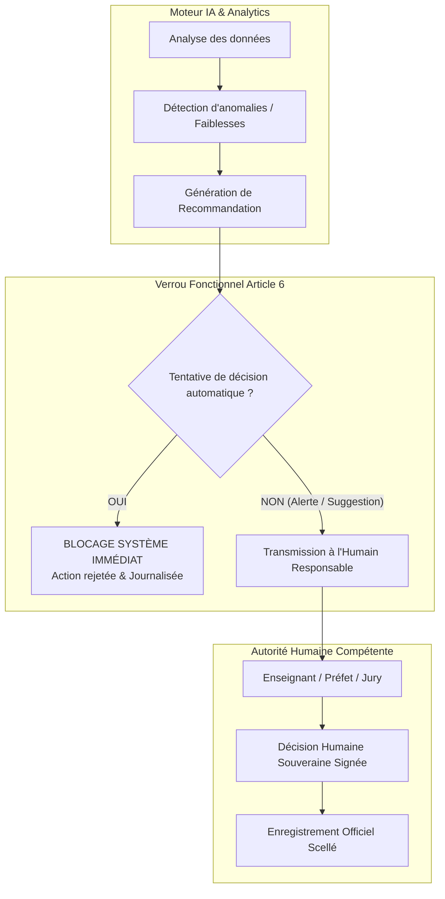

# TOME 5 — ARCHITECTURE FONCTIONNELLE
## 56. Conformité Fonctionnelle avec la Constitution

---

> **Positionnement :** Traduction opérationnelle et verrous fonctionnels issus du Tome 2 (Constitution)  
> **Autorité :** Supra-normative au sein du système fonctionnel. Aucune règle métier ne peut y déroger.  
> **Liaison aval :** Imposé à l'ensemble des modules 57 à 83, aux développeurs et aux auditeurs qualité.

---

## 1. Objet et Portée du Sous-Tome

Le présent sous-tome codifie la traduction opérationnelle des **21 articles de la Constitution d'ELLYSIUM (Tome 2)** en verrous fonctionnels, règles de gestion automatiques et contraintes d'intégrité logicielle au sein de la plateforme.

Dans un progiciel de gestion scolaire et une institution d'enseignement à distance, la Constitution ne peut demeurer une déclaration philosophique abstraite. Elle doit être matérialisée dans le code, dans la base de données et dans les cinématiques d'écrans sous forme de :
- **Verrous d'interdiction absolue** (actions techniquement impossibles à exécuter par certains acteurs ou algorithmes).
- **Workflows d'autorisation obligatoire** (actions exigeant une double signature ou une délibération collégiale humaine).
- **Pistes d'audit inviolables** (journalisation systématique et infalsifiable des événements sensibles).

---

## 2. Les 6 Grands Verrous Fonctionnels Constitutionnels

### 2.1 Verrou n° 1 — Interdiction de Substitution Décisionnelle de l'IA (Article 6 de la Constitution)
Le système informatique interdit formellement à tout service, script, moteur de calcul prédictif ou agent d'intelligence artificielle de disposer de droits d'écriture (`WRITE`) sur les décisions académiques, administratives et disciplinaires.



**Règles fonctionnelles applicatives :**
- **Règle 56.1.1 (Exclusion disciplinaire)** : Aucun apprenant ne peut être radié ou suspendu par un processus automatisé. Seul le Directeur de l'établissement ou le Conseil de Discipline peut signer une décision d'exclusion après audition contradictoire.
- **Règle 56.1.2 (Passage / Redoublement)** : Le moteur de calcul calcule les moyennes et affiche les statuts indicatifs (admis, ajourné), mais le statut académique final n'est validé qu'après signature du procès-verbal de délibération par le Jury humain.
- **Règle 56.1.3 (Correction des épreuves ouvertes)** : L'IA peut proposer un pré-calibrage de note sur un texte, mais la note définitive d'une dissertation, d'une étude de cas ou d'un mémoire universitaire doit obligatoirement émaner d'un correcteur humain certifié.

---

### 2.2 Verrou n° 2 — Inviolabilité et Traçabilité des Cotes (Articles 4, 15 et 16)
Les cotes scolaires et universitaires constituent des données juridiques à haute valeur probante.

**Règles fonctionnelles applicatives :**
- **Règle 56.2.1 (Période de saisie contrôlée)** : Un enseignant ne peut saisir ou modifier des notes que pendant la période officielle d'ouverture du relevé fixée par le préfet des études.
- **Règle 56.2.2 (Scellement post-délibération)** : Dès la clôture du jury de fin de période ou de semestre, les cotes passent à l'état `SCELLÉ`. Tout droit de modification ordinaire est révoqué.
- **Règle 56.2.3 (Procédure formelle de rectification)** : Conformément au droit de recours de l'apprenant (Article 8), toute rectification ultérieure d'une note scellée exige :
  1. Le dépôt d'un recours formel motivé.
  2. L'autorisation conjointe du professeur titulaire et du préfet des études.
  3. L'enregistrement d'une trace d'avenant dans le journal d'audit sans suppression de la valeur initiale.

---

### 2.3 Verrou n° 3 — Protection Hermétique des Données des Mineurs (Articles 4, 7 et 8)
La grande majorité des élèves du cycle secondaire étant mineurs (12 à 17 ans), leurs données personnelles bénéficient du plus haut niveau de protection fonctionnelle :
- **Règle 56.3.1 (Délégation d'autorité parentale)** : Le compte d'un élève mineur est obligatoirement lié au profil d'un parent ou tuteur légal déclaré. Le tuteur légal reçoit en temps réel copie des alertes d'absence, bulletins et notifications disciplinaires.
- **Règle 56.3.2 (Interdiction absolue de monétisation et profilage)** : Le système interdit formellement l'intégration de tout traceur publicitaire, pixel d'analyse commerciale tiers ou module d'extraction de données à des fins marketing.
- **Règle 56.3.3 (Droit à l'oubli et portabilité encadrée)** : L'historique académique officiel est préservé conformément aux obligations d'archivage d'État de la RDC, mais les données comportementales et de messagerie peuvent être purgées ou anonymisées à la demande de l'apprenant majeur.

---

### 2.4 Verrou n° 4 — Indépendance de l'Accès Pédagogique face aux Frais (Article 1 et 3)
La gratuité de l'apprentissage direct et le respect de la dignité humaine interdisent l'usage d'entraves technologiques punitives :
- **Règle 56.4.1 (Non-blocage des cours)** : En cas de défaillance ou de retard de paiement des frais de scolarité au sein d'une école partenaire, le système interdit de verrouiller l'accès de l'élève à l'espace de cours, aux leçons en ligne ou aux devoirs.
- **Règle 56.4.2 (Canal d'alerte financier séparé)** : Les notifications de relance de paiement sont adressées exclusivement aux parents et à la direction, sans stigmatisation publique de l'élève dans son interface de classe.

---

### 2.5 Verrou n° 5 — Véracité et Détection de la Fraude Documentaire (Article 16)
La falsification de diplômes ou de relevés scolaires constitue une infraction pénale grave et une atteinte à l'intégrité de l'institution :
- **Règle 56.5.1 (Signature cryptographique systématique)** : Tout document produit par la plateforme (bulletin, relevé de notes, certificat de scolarité, diplôme) comporte une empreinte numérique SHA-256 et un sceau électronique infalsifiable.
- **Règle 56.5.2 (Vérificateur public dynamique)** : Le système met à disposition un portail public universel permettant, par simple lecture de QR code ou saisie de l'identifiant du document, de vérifier instantanément et gratuitement l'authenticité de la pièce auprès du registre central.
- **Règle 56.5.3 (Procédure en cas de faux)** : Toute détection de faux document entraîne le blocage immédiat de la contestation, le gel conservatoire du compte incriminé et l'émission d'un rapport automatique à l'attention du Conseil d'Administration et des autorités judiciaires compétentes.

---

### 2.6 Verrou n° 6 — Neutralité Pédagogique et Respect des Référentiels (Article 12)
- **Règle 56.6.1 (Alignement de la nomenclature)** : Le paramétrage des classes, matières et coefficients du secondaire ne peut utiliser d'autres intitulés que ceux publiés au Journal Officiel et dans les programmes officiels de la DIPROMAT / MEPST.
- **Règle 56.6.2 (Contrôle de conformité de publication)** : Tout cours publié doit comporter la mention explicite du texte réglementaire congolais ou de la maquette LMD de référence.

---

## 3. Matrice de Concordance : 21 Articles de la Constitution vs Modules Fonctionnels

| Article Constitutionnel | Règle / Intitulé | Traduction Fonctionnelle dans le Système | Modules Concernés |
| :--- | :--- | :--- | :--- |
| **Art. 1** | Raison d'être & Accès | Dualité d'accès gratuit pour apprenants indépendants / ERP partenaires | Modules 55, 58, 59 |
| **Art. 2** | Identité & Conformité RDC | Nomenclature officielle des matières EPST et filières LMD | Modules 61, 62, 63 |
| **Art. 3** | Valeurs fondamentales | Ergonomie inclusive, transparence des barèmes, égalité d'accès | Modules 57, 70, 77 |
| **Art. 4** | Principes non négociables | Horodatage infalsifiable, traçabilité et qualité métrologique | Modules 67, 82 |
| **Art. 5** | Philosophie pédagogique | Parcours individualisé, approche par compétences, remédiation | Modules 69, 73, 74 |
| **Art. 6** | Place et rôle de l'IA | Verrou logiciel interdisant toute décision autonome définitive de l'IA | Modules 56, 67, 74 |
| **Art. 7** | Engagements envers apprenants | Transparence totale des critères d'évaluation et accès aux cours | Modules 60, 66, 68 |
| **Art. 8** | Droits des apprenants | Droit de recours sur les notes, consultation permanente du dossier | Modules 60, 68, 81 |
| **Art. 9** | Devoirs des apprenants | Gestion rigoureuse des absences (ABI) et charte anti-plagiat | Modules 65, 69, 75 |
| **Art. 10** | Engagements enseignants | Automatisation des calculs rébarbatifs, allégement administratif | Modules 64, 66, 67 |
| **Art. 11** | Droits & devoirs enseignants | Respect des barèmes officiels, délai maximal de correction (5j) | Modules 66, 69, 72 |
| **Art. 12** | Neutralité et programmes | Interdiction de prosélytisme, programmes nationaux stricts | Modules 63, 73 |
| **Art. 13** | Gouvernance institutionnelle | Séparation stricte des rôles et collégialité des délibérations | Modules 57, 79, 80 |
| **Art. 14** | Principes décisionnels | Critères objectifs de délibération sans favoritisme | Modules 67, 81 |
| **Art. 15** | Gouvernance des données | Journal d'audit immuable, chiffrement et classification 4 niveaux | Modules 80, 82 |
| **Art. 16** | Véracité & Anti-fraude | Hachage SHA-256, QR code dynamique et vérification publique | Modules 68, 76 |
| **Art. 17** | Innovation permanente | Évaluation de l'impact des modules avant mise en production | Modules 55, 78 |
| **Art. 18** | Assurance qualité | Tableaux de bord de suivi, baromètres et audits continus | Modules 77, 82 |
| **Art. 19** | Responsabilité sociétale | Mode dégradé pour zones rurales, inclusion des personnes en situation de handicap | Modules 55, 64, 70 |
| **Art. 20** | Révision de la Constitution | Toute modification constitutionnelle verrouillée par super-admin | Modules 56, 80 |
| **Art. 21** | Primauté de la Constitution | En cas de conflit de règles métier, la règle constitutionnelle l'emporte | Tous modules |

---

## 4. Spécification de la Piste d'Audit Métier (Audit Trail)

Chaque événement métier constitutionnel produit un enregistrement normalisé dans le journal d'audit (`audit_log`) :

```json
{
  "event_id": "uuid-v4-universel",
  "timestamp_utc": "2026-09-17T17:58:00Z",
  "actor": {
    "user_id": "USR-KIN-2026-8942",
    "role": "PREFET_DES_ETUDES",
    "ip_address": "102.164.x.x",
    "device_fingerprint": "hash-navigateur-ou-terminal"
  },
  "action": "RECTIFICATION_NOTE_POST_DELIBERATION",
  "target_entity": "EVALUATION_NOTE",
  "target_id": "NOTE-MAT-8E-2026-041",
  "constitutional_context": {
    "article_ref": "ARTICLE_8_RECOURS_APPRENANT",
    "dossier_recours_id": "REC-2026-012"
  },
  "payload": {
    "previous_value": 8.5,
    "new_value": 11.0,
    "scale_max": 20.0,
    "justification": "Erreur matérielle de report constatée sur copie originale - approuvé par jury"
  },
  "cryptographic_signature": "sha256-signature-du-bloc-audit"
}
```

---

## 5. Sanctions et Alertes en Cas de Tentative de Violation

Toute tentative par un utilisateur ou un script de contourner un verrou constitutionnel déclenche une procédure de sécurité en trois volets :
1. **Blocage transactionnel immédiat** : L'opération est avortée au niveau du contrôleur métier.
2. **Notification d'alerte haute priorité** : Envoi immédiat d'une alerte au délégué à la protection des données et au Responsable Académique Central.
3. **Gel conservatoire des privilèges** : En cas de tentative répétée de falsification de notes ou de contournement de délibération, le compte auteur est automatiquement suspendu à titre préventif dans l'attente d'une enquête humaine.
