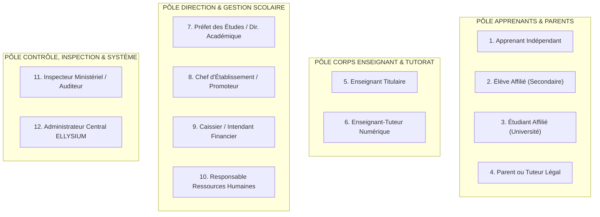

# TOME 5 — ARCHITECTURE FONCTIONNELLE
## 57. Cartographie des Acteurs et Matrice des Rôles (RBAC)

---

> **Positionnement :** Modélisation fonctionnelle des utilisateurs, personas, droits d'accès et séparation des pouvoirs  
> **Autorité :** Subordonné à la Constitution (Tome 2, notamment Articles 6, 8, 11, 13 et 15)  
> **Liaison aval :** Imposé aux modules de gestion des accès (Module 80) et à la sécurité technique (Tome 7)

---

## 1. Objet et Portée du Sous-Tome

Le présent sous-tome établit la cartographie exhaustive des **12 profils d'acteurs** interagissant avec la plateforme ELLYSIUM. Il définit pour chacun d'eux :
- Le profil sociologique et institutionnel (Persona).
- Le périmètre de responsabilité et les cas d'usage nominaux.
- Les limites strictes d'accès et d'intervention.
- La **Matrice de Contrôle d'Accès Basée sur les Rôles (RBAC - Role-Based Access Control)**.
- Les règles de **Séparation des Fonctions (SoD - Segregation of Duties)** visant à prévenir les fraudes, les abus d'autorité et les conflits d'intérêts au sein des établissements scolaires et de l'institution en ligne.

---

## 2. Typologie Détaillée des 12 Profils d'Acteurs

---

### Profil 1 : L'Apprenant Indépendant (Secondaire ou Université)
- **Définition** : Candidat autodidacte, professionnel en reconversion ou jeune en zone isolée sans école de proximité, suivant les cours d'ELLYSIUM sans être rattaché à un établissement physique tiers.
- **Périmètre d'action** : Inscription autonome gratuite, choix de filière/options, consultation illimitée des cours et médias, réalisation des exercices et devoirs, sollicitation du Tuteur IA et des tuteurs en ligne, passage des épreuves sommatives, consultation de ses résultats et attestations.
- **Limites strictes** : Ne peut interagir avec les espaces réservés aux écoles partenaires. Aucun accès aux corrigés avant soumission finale.

### Profil 2 : L'Élève Affilié (Enseignement Secondaire)
- **Définition** : Élève scolarisé dans une école secondaire partenaire d'ELLYSIUM (7e et 8e années de base ou 1re à 4e humanités).
- **Périmètre d'action** : Accès à sa classe virtuelle, consultation de son emploi du temps scolaire, téléchargement des cours synchronisés avec la progression de son enseignant physique, soumission des devoirs, consultation de ses cotes périodiques et de ses bulletins scolaires.
- **Limites strictes** : Ne peut modifier aucune présence, aucune note ni aucun paramètre de classe. Dépend de son établissement pour toute modification d'option ou réorientation.

### Profil 3 : L'Étudiant Universitaire Affilié (Système LMD)
- **Définition** : Étudiant inscrit dans une faculté ou filière universitaire d'ELLYSIUM ou d'un établissement d'enseignement supérieur conventionné.
- **Périmètre d'action** : Inscription pédagogique aux Unités d'Enseignement (UE), dépôt de projets et devoirs de TD/TP, interaction académique avec les professeurs et chargés de cours, dépôt de sujet de mémoire de Licence, consultation des crédits ECTS capitalisés et relevés semestriels.
- **Limites strictes** : Interdiction d'auto-validation d'UE. Accès aux rattrapages conditionné aux seuils réglementaires de compensation.

### Profil 4 : Le Parent ou Responsable Légal
- **Définition** : Représentant légal d'un ou plusieurs élèves mineurs inscrits en secondaire ou en cycle de base.
- **Périmètre d'action** : Consultation en temps réel du tableau de bord de son enfant (assiduité, absences injustifiées, retards, cahier de textes, calendrier des devoirs, notes et bulletins scellés), réception des communiqués de la direction, consultation de la situation financière (frais scolaires, reçus de caisse).
- **Limites strictes** : Accès strictement en lecture seule. Ne peut intervenir dans les espaces pédagogiques ni déposer de devoirs au nom de l'élève.

### Profil 5 : L'Enseignant Titulaire / Chargé de Cours
- **Définition** : Professeur responsable de l'enseignement d'une ou plusieurs disciplines au sein d'une classe ou promotion.
- **Périmètre d'action** : Préparation et publication des plans de leçons, pointage des présences quotidiennes (cahier de présence), saisie des notes d'interrogations et devoirs (cahier des cotes), dépôt des sujets d'examens et grilles de correction, participation aux délibérations des jurys scolaires.
- **Limites strictes** : Ne peut saisir de cotes que pour les classes et matières qui lui sont expressément assignées. Ne peut modifier aucune cote une fois la période académique verrouillée ou le bulletin scellé sans visa du préfet.

### Profil 6 : L'Enseignant-Tuteur Numérique
- **Définition** : Enseignant spécialisé dans l'accompagnement pédagogique à distance des apprenants indépendants.
- **Périmètre d'action** : Animation des forums thématiques de discipline, correction des devoirs à correction humaine des apprenants indépendants avec rétroaction détaillée, accompagnement des élèves en remédiation, tenue de permanences de tutorat en ligne.
- **Limites strictes** : N'intervient pas dans la gestion administrative ou financière des établissements physiques partenaires.

### Profil 7 : Le Préfet des Études / Directeur Académique
- **Définition** : Autorité pédagogique suprême au sein de l'établissement scolaire secondaire ou universitaire.
- **Périmètre d'action** : Structuration de l'année scolaire (périodes, semestres), création et affectation des classes, affectation des enseignants aux cours, supervision du cahier de cotes général, ouverture et fermeture des sessions de saisie des notes, présidence des jurys de délibération, validation et scellement officiel des bulletins scolaires.
- **Limites strictes** : Ne peut pas encaisser directement les frais de scolarité (séparation de l'ordonnateur et du comptable). Ne peut modifier unilatéralement la note d'un enseignant sans procédure contradictoire formelle.

### Profil 8 : Le Chef d'Établissement / Promoteur d'École
- **Définition** : Responsable légal, moral et administratif de l'établissement d'enseignement partenaire.
- **Périmètre d'action** : Souscription de l'établissement sur ELLYSIUM, paramétrage général de l'école (agrément ministériel, coordonnées, statuts), signature des conventions de partenariat, supervision globale des tableaux de bord administratifs, financiers et pédagogiques, signature officielle des documents de fin d'études et des exclusions disciplinaires graves.
- **Limites strictes** : Ne peut manipuler directement le calcul algorithmique des moyennes ni violer l'indépendance souveraine des jurys de délibération académique.

### Profil 9 : Le Caissier / Intendant Financier d'Établissement
- **Définition** : Agent habilité à percevoir les frais de scolarité et à tenir la comptabilité interne de l'école.
- **Périmètre d'action** : Configuration de la grille des frais scolaires approuvée par le comité de parents, enregistrement des paiements (espèces, chèques, virements), validation des transactions Mobile Money (M-Pesa, Orange, Airtel), émission instantanée de reçus de caisse infalsifiables, génération des rapports d'apurement et bilans financiers.
- **Limites strictes** : **AUCUN accès au cahier des cotes ni à la validation des bulletins**. Interdiction formelle de bloquer l'accès pédagogique d'un élève.

### Profil 10 : Le Responsable des Ressources Humaines
- **Définition** : Gestionnaire administratif du personnel enseignant et ouvrier de l'école.
- **Périmètre d'action** : Tenue des dossiers administratifs des enseignants (diplômes, contrats, ancienneté, affectations), suivi du volume horaire effectif presté, gestion des congés et des absences professionnelles.
- **Limites strictes** : Aucun droit sur l'évaluation académique des élèves ni sur les encaissements de scolarité.

### Profil 11 : L'Inspecteur Ministériel / Auditeur Qualité
- **Définition** : Inspecteur de l'Éducation Nationale (MEPST) ou représentant de l'ESU mandaté pour auditer la conformité des enseignements et examens.
- **Périmètre d'action** : Accès transversal en lecture seule supervisée aux programmes enseignés, aux volumes horaires prestés, aux cahiers de cotes, aux statistiques de réussite et aux procès-verbaux de délibération.
- **Limites strictes** : Accès exclusivement en **consultation et audit (READ-ONLY)**. Aucune capacité d'écriture ou de modification directe des données de l'établissement.

### Profil 12 : L'Administrateur Central ELLYSIUM (Support & Super-Admin)
- **Définition** : Équipe d'ingénierie centrale garante de l'infrastructure globale, de la sécurité et de l'intégrité de la plateforme.
- **Périmètre d'action** : Maintenance des serveurs, supervision des passerelles API et du moteur d'IA, intervention sur incident technique majeur, audit de sécurité, sauvegarde et restauration du système.
- **Limites strictes** : Soumis à une traçabilité totale. Interdiction de modifier des résultats scolaires sans commission rogatoire ou arrêté ministériel documenté.

---

## 3. Matrice de Contrôle d'Accès Basée sur les Rôles (RBAC)

Légende des droits :
- **C** : Créer (`Create`)
- **R** : Consulter en lecture (`Read`)
- **U** : Mettre à jour / Modifier (`Update`)
- **D** : Supprimer / Désactiver (`Delete`)
- **V** : Valider / Signer officiellement (`Validate`)
- **-** : Aucun accès

| Objet Métier / Ressource | Élève / Étudiant | Parent Légal | Enseignant | Préfet des Études | Promoteur / Dir. | Caissier / Finance | Inspecteur | Admin Central |
| :--- | :---: | :---: | :---: | :---: | :---: | :---: | :---: | :---: |
| **Dossier Apprenant (IUNE)** | R (le sien) | R (son enfant) | R (sa classe) | C / R / U | R | R (financier) | R | C / R / U / D |
| **Inscriptions & Classes** | - | - | R (sa classe) | C / R / U / V | C / R / U | - | R | C / R / U |
| **Cahier de Présence** | R (le sien) | R (son enfant) | C / R / U | R / U / V | R | - | R | R |
| **Cahier des Cotes (Brut)** | - | - | C / R / U (saisies) | R / U (contrôle) | R | - | R | R |
| **Moteur de Calcul Académique** | R (résultats) | R (résultats) | R (matière) | R / V (délib.) | R | - | R | C / R (moteur) |
| **Bulletins Officiels Scellés** | R (le sien) | R (son enfant) | R (sa classe) | C / R / V | R / V | - | R | R |
| **Devoirs & Travaux Pratiques** | C / R (dépôt) | R (suivi) | C / R / U / V | R | R | - | R | R |
| **Module Caisse & Paiements** | - | R (ses reçus) | - | R (états) | R (bilan) | C / R / U / V | R | R |
| **Ressources Humaines & Contrats**| - | - | R (le sien) | R (pédago) | C / R / U / V | - | R | R |
| **Bibliothèque & Supports de Cours**| R | R | C / R / U | R / V | R | - | R | C / R / U |
| **Tuteur IA (Interactions)** | C / R (les siennes) | R (suivi enfant) | R (statistiques) | R | R | - | R | R / U (modèles) |
| **Journal d'Audit Immuable** | - | - | - | R (ses actions)| R (école) | - | R (audit) | R / V (sécurité) |

---

## 4. Règles Fondamentales de Séparation des Fonctions (SoD)

Pour garantir l'intégrité institutionnelle et se conformer aux meilleures pratiques de gouvernance financière et académique :

1. **Règle SoD 57.1 (Étanchéité Note - Argent)** :
   Le profil `Caissier / Intendant Financier` ne peut **JAMAIS** se voir attribuer le rôle de `Préfet des études` ou d'`Enseignant titulaire`. La personne qui perçoit les fonds ne peut avoir aucune prise sur l'évaluation académique des élèves.
2. **Règle SoD 57.2 (Double Clé de Rectification de Note)** :
   Aucune modification de cote scellée ne peut être exécutée par un seul individu. Toute révision nécessite obligatoirement l'action conjointe de l'Enseignant titulaire (qui formule la proposition technique justifiée) et du Préfet des études (qui valide formellement l'avenant).
3. **Règle SoD 57.3 (Délibération Collégiale Obligatoire)** :
   La validation du passage, du redoublement ou de la délivrance d'un titre universitaire n'est pas le fait d'une seule personne, mais d'une session de délibération collégiale enregistrant la présence et la signature des membres du jury.
4. **Règle SoD 57.4 (Auditabilité des Super-Administrateurs)** :
   Toute intervention technique exécutée par un `Administrateur Central` sur les tables de données en production est obligatoirement soumise à un enregistrement d'audit tiers, interdisant toute modification furtive sans trace.

---

## 7. Verrous Fonctionnels Critiques

| Réf. Verrou | Description Fonctionnelle et Technique | Conséquence en Cas de Violation |
| :--- | :--- | :--- |
| **`VF-057-01`** | **Cloisonnement hermétique des personas** | Un compte élève ne peut sous aucun prétexte accéder aux interfaces d'administration ou de saisie de cotes. |
| **`VF-057-02`** | **Validation des statuts institutionnels** | L'attribution du rôle Préfet ou Chef d'établissement exige une double validation administrative. |
| **`VF-057-03`** | **Ségrégation des tâches financières et pédagogiques** | L'enseignant ne dispose d'aucun droit de consultation sur le solde financier des familles. |
| **`VF-057-04`** | **Délégation de pouvoir temporaire bornée** | Toute délégation d'autorité est horodatée avec date de fin obligatoire et trace d'audit. |
| **`VF-057-05`** | **Vérification d'identité tuteur/parent** | L'association d'un parent à un élève requiert la présentation d'une pièce d'état civil vérifiée. |
| **`VF-057-06`** | **Toute donnée d'apprenant peut être exportée sur demande conformément à l'Article 8 de la Constitution** | **Conséquence : violation = inéligibilité du module pour mise en production** |

---

*Sous-tome rédigé conformément aux Normes documentaires ELLYSIUM — Fondations 04.*
