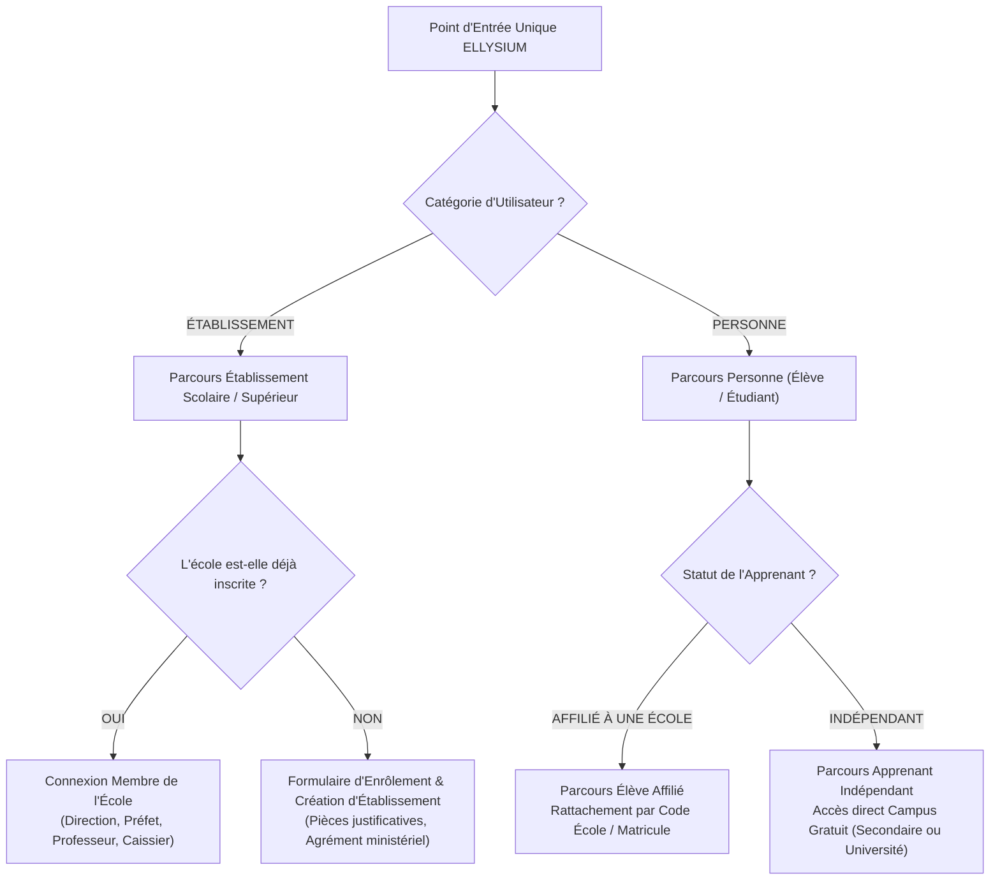
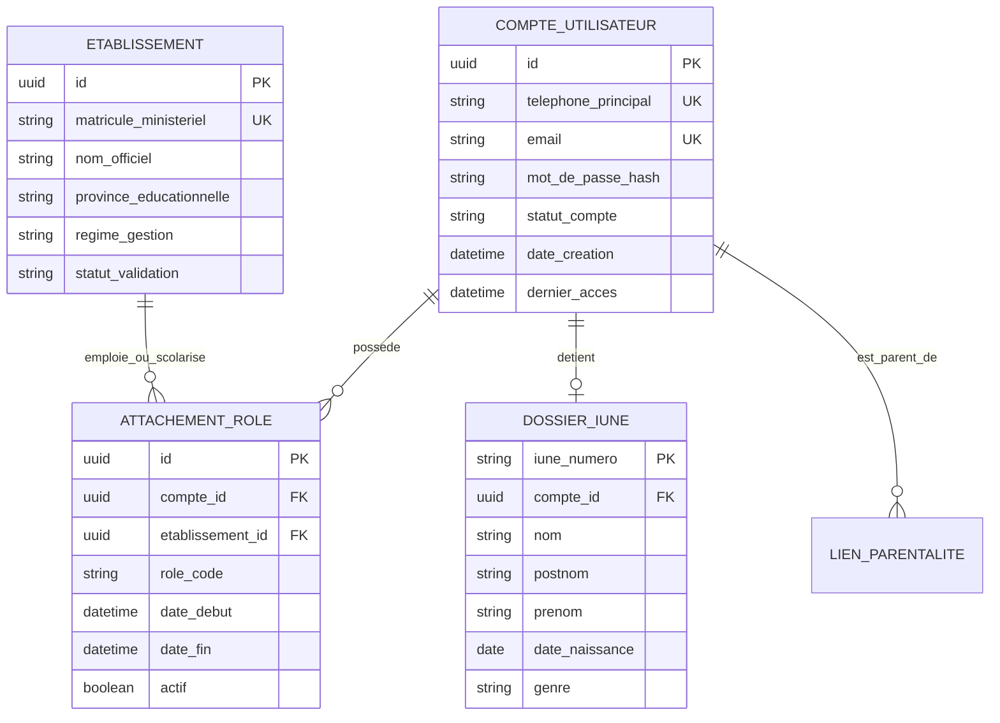

# TOME 5 — ARCHITECTURE FONCTIONNELLE
## 58. Module Identification et Parcours d'Accès Unifié

---

> **Positionnement :** Porte d'entrée souveraine du système ELLYSIUM  
> **Autorité :** Conforme au Tome 1 (Section 4) et à la Constitution (Tome 2, Articles 1, 8 et 15)  
> **Liaison aval :** Alimente directement le Module 59 (Inscriptions & Admissions) et le Module 60 (Dossier Numérique)

---

## 1. Objet et Portée du Module

Le Module **Identification et Parcours d'Accès** constitue l'entonnoir d'entrée universel sur la plateforme ELLYSIUM. Il matérialise le principe directeur posé dès le Tome 1 : **une seule institution, accessible par un parcours d'identification unique qui oriente chaque utilisateur vers l'expérience et les prérogatives qui lui correspondent**.

Ce module a pour fonctions exclusives :
- L'orientation initiale sans ambiguïté entre les deux grandes catégories : **Établissement** ou **Personne**.
- La gestion des comptes, des identités numériques certifiées et des mécanismes d'authentification forte (mot de passe robuste, OTP par SMS ou e-mail, biométrie locale sur smartphone).
- La détection et la gestion des sessions multi-terminaux (ordinateur de bureau, tablette, smartphone Android à faible ressource).
- La récupération sécurisée d'accès en cas de perte d'identifiants ou de changement de numéro de téléphone (courant en RDC).
- La journalisation de toutes les tentatives d'accès (succès, échecs répétés, blocages de sécurité).

---

## 2. L'Entonnoir d'Orientation Initiale (L'Aiguillage Souverain)

Toute personne physique ou représentant moral qui accède à la plateforme ELLYSIUM (via le web ou l'application mobile) est immédiatement orienté selon l'arbre de décision fonctionnel suivant :

---

## 3. Spécifications Détaillées des Parcours

### 3.1 Parcours Établissement

#### Cas 3.1.1 — Création d'un nouvel établissement scolaire
1. **Formulaire d'enrôlement institutionnel** :
   - Dénomination officielle de l'école (ex. *Institut Technique Industriel de Goma*).
   - Code d'identification officiel national (numéro matricule attribué par le Ministère de l'EPST ou de l'ESU).
   - Province éducationnelle, Sous-division, Commune/Territoire, Adresse physique.
   - Régime de gestion : École Publique / Non conventionnée, Conventionnée Catholique, Protestante, Islamique, Fraternelle, ou Privée Agréée.
   - Coordonnées de contact officielles (téléphone, adresse e-mail institutionnelle).
2. **Identification du promoteur ou chef d'établissement** :
   - Nom, prénom, fonction légale, numéro de pièce d'identité officielle (carte d'électeur/passeport).
   - Dépôt de l'arrêté ministériel d'agrément ou de création (document scanné ou photographié).
3. **Cycle d'approbation et validation** :
   - L'établissement est créé à l'état `EN_ATTENTE_DE_VALIDATION`.
   - L'équipe d'administration centrale ELLYSIUM vérifie la véracité des informations auprès du répertoire officiel des écoles de la RDC.
   - Dès validation, l'établissement passe à l'état `ACTIF` et le promoteur reçoit ses accès administrateur racine de l'école.

#### Cas 3.1.2 — Connexion d'un membre d'un établissement existant
- L'utilisateur sélectionne son établissement (ou saisit le code école unique).
- Il s'authentifie au moyen de son identifiant personnel (e-mail ou numéro de téléphone) et de son mot de passe.
- Le système applique immédiatement la matrice des droits correspondant à son rôle (Préfet, Enseignant, Caissier, etc.).

---

### 3.2 Parcours Personne (Élève, Étudiant ou Parent)

#### Cas 3.2.1 — L'Apprenant Affilié à un établissement partenaire
- L'élève reçoit de son école un **Code de Rattachement Sécurisé** (ou flashe un QR code fourni sur son reçu d'inscription scolaire).
- Il renseigne son nom, prénom, date de naissance et crée son mot de passe.
- Le système vérifie la concordance avec la liste des effectifs saisie par le secrétariat de l'école :
  - Si concordance : le compte élève est immédiatement lié à son école, à sa classe et à ses enseignants pour l'année scolaire en cours.
  - L'Identifiant Unique National ELLYSIUM (IUNE) est rattaché à son profil.

#### Cas 3.2.2 — L'Apprenant Indépendant (Campus Ouvert Gratuit)
- L'apprenant s'inscrit librement et gratuitement sans intermédiaire :
  - Nom, prénom, date de naissance, genre, nationalité, pays de résidence.
  - Numéro de téléphone cellulaire (clé d'identification universelle en RDC pour validation SMS).
  - Niveau d'études sollicité :
    - *Option A — Enseignement Secondaire* : Tronc commun (7e-8e de base) ou Humanités (choix de l'option parmi les 14 disponibles).
    - *Option B — Enseignement Universitaire* : Choix de la faculté parmi les filières ouvertes (Informatique, Économie-Gestion, Droit, Santé Publique).
- Le système génère instantanément son IUNE et instancie son espace de cours sans frais.

#### Cas 3.2.3 — Le Parent ou Représentant Légal
- Le parent crée son compte personnel au moyen de son numéro de téléphone.
- Il associe les profils de ses enfants mineurs en saisissant le matricule élève et une clé de sécurité parentale fournie par l'école ou par le système.
- Le compte parent permet de basculer en un clic d'un enfant à l'autre sans déconnexion.

---

## 4. Règles de Gestion et Verrous de Sécurité Métier

- **Règle 58.1 (Unicité stricte de la personne)** : Un même individu ne peut pas disposer de deux comptes apprenants distincts. L'IUNE est attribué à vie sur la base du nom, de la date de naissance et du justificatif d'identité validé.
- **Règle 58.2 (Robustesse du mot de passe & Sécurité SMS)** :
  - Le mot de passe doit comporter au minimum 8 caractères incluant au moins un chiffre et une lettre majuscule.
  - En cas de perte de mot de passe, la réinitialisation par code OTP à 6 chiffres transmis par SMS sur le numéro certifié de l'utilisateur est privilégiée, compte tenu du faible taux d'usage du courrier électronique en RDC.
- **Règle 58.3 (Protection contre les attaques par force brute)** :
  - Après 5 tentatives de connexion erronées consécutives, le compte est temporairement bloqué pendant 15 minutes.
  - Une alerte SMS est transmise au titulaire du compte.
- **Règle 58.4 (Persistance de session hors-ligne)** :
  - Sur l'application mobile Android, le jeton d'authentification local est chiffré dans la mémoire sécurisée du téléphone.
  - L'apprenant peut continuer à s'identifier et à utiliser ses cours en mode déconnecté complet pendant une durée de 30 jours sans exiger de reconnexion réseau.

---

## 5. Modèle Conceptuel de Données (Entités du Module)

---

## 6. Journalisation et Piste d'Audit (Événements Obligatoires)

Le module consigne obligatoirement dans l'audit log :
- `AUTH_LOGIN_SUCCESS` (Connexion réussie avec IP et empreinte terminal).
- `AUTH_LOGIN_FAILED` (Échec de connexion avec motif et compteur).
- `AUTH_ACCOUNT_LOCKED` (Verrouillage de sécurité suite à échecs).
- `AUTH_PASSWORD_RESET_REQUESTED` (Demande de réinitialisation avec envoi d'OTP).
- `ETABLISSEMENT_ENROLLED` (Création d'un dossier école en attente de vérification).
- `APPRENANT_AFFILIATED` (Rattachement d'un élève à une école partenaire).

---

## 7. Verrous Fonctionnels Critiques

| Réf. Verrou | Description Fonctionnelle et Technique | Conséquence en Cas de Violation |
| :--- | :--- | :--- |
| **`VF-058-01`** | **Attribution unique de l'IUNE** | Chaque apprenant se voit attribuer un Identifiant Unique National ELLYSIUM non réassignable. |
| **`VF-058-02`** | **Dédoublonnage biométrique/alphanumérique** | Détection et blocage de toute tentative de création de compte double. |
| **`VF-058-03`** | **Vérification des numéros de téléphone locaux** | Validation OTP obligatoire sur les réseaux télécoms congolais (Vodacom, Airtel, Orange, Africell). |
| **`VF-058-04`** | **Protection du mot de passe et MFA pour personnels** | MFA obligatoire pour tout personnel enseignant et administratif. |
| **`VF-058-05`** | **Gestion sécurisée de la perte d'accès** | Procédure de récupération d'accès sans divulgation de questions de sécurité vulnérables. |
| **`VF-058-06`** | **Toute donnée d'apprenant peut être exportée sur demande conformément à l'Article 8 de la Constitution** | **Conséquence : violation = inéligibilité du module pour mise en production** |

---

*Sous-tome rédigé conformément aux Normes documentaires ELLYSIUM — Fondations 04.*
