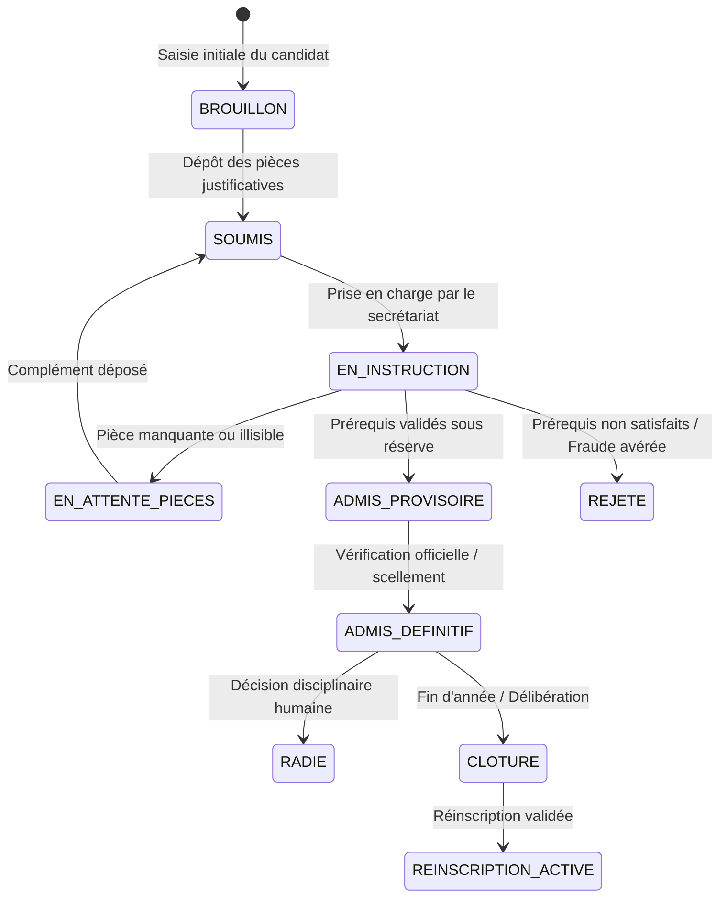
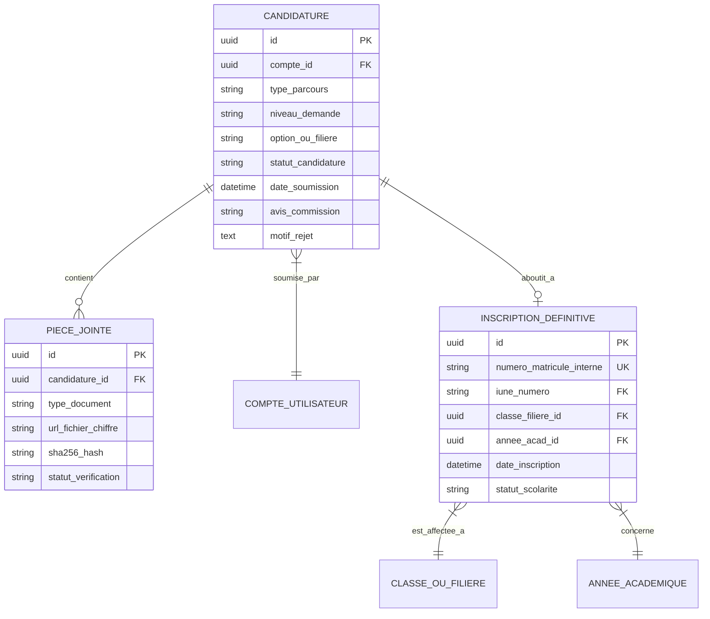

# TOME 5 — ARCHITECTURE FONCTIONNELLE
## 59. Module Inscriptions et Admissions (Fusionné)

---

> **Positionnement :** Gestion du cycle de vie des candidatures, admissions et réinscriptions annuelles  
> **Autorité :** Subordonné à la Constitution (Tome 2, notamment Articles 1, 8, 9 et 16)  
> **Liaison amont :** Module 58 (Identification) | **Liaison aval :** Module 60 (Dossier Numérique) et Module 62 (Classes & Cohortes)

---

## 1. Objet et Portée du Module

Le Module **Inscriptions et Admissions** régit l'ensemble des processus d'entrée, de sélection académique, d'enrôlement officiel et de renouvellement d'inscription pour l'ensemble des publics accueillis par ELLYSIUM.

Il traite de manière unifiée mais étanche trois cas de figure :
1. **L'Admission de l'Apprenant Indépendant** (Campus national en ligne) : Admission libre et gratuite sur justification des prérequis légaux d'entrée (Certificat d'études primaires pour le secondaire, Diplôme d'État / EXETAT pour l'université).
2. **L'Inscription de l'Élève Affilié** (Établissement physique partenaire) : Enrôlement au sein des effectifs scolaires d'une école partenaire, attribution d'une promotion et génération du dossier réglementaire.
3. **La Réinscription Annuelle et le Renouvellement** : Reconversion de l'inscription pour l'année académique suivante après délibération souveraine du jury scolaire ou universitaire.

---

## 2. Le Cycle de Vie des Demandes d'Inscription

Chaque candidature traverse un diagramme d'états rigoureusement cadencé :

---

## 3. Pièces Justificatives et Prérequis Académiques par Niveau

Conformément à la législation scolaire et universitaire congolaise :

### 3.1 Entrée dans l'Enseignement Secondaire
- **Entrée en 7e Année de l'Éducation de Base (Cycle d'Orientation)** :
  - Preuve de réussite à l'école primaire : Certificat de Fin d'Études Primaires (CFEP) ou Attestation de réussite officielle de la 6e primaire.
  - Acte ou extrait de naissance officiel attestant de l'identité et de l'âge de l'élève.
  - Formulaire de consentement et coordonnées du parent ou tuteur légal.
- **Entrée en Humanités (1re à 4e humanités / 9e à 12e années)** :
  - Relevé de notes ou attestation de réussite au **TENASOSP** (pour l'entrée en 1re des humanités).
  - Bulletins des années secondaires antérieures justifiant du passage régulier sans saut de classe non autorisé.

### 3.2 Entrée dans l'Enseignement Universitaire (Système LMD)
- **Entrée en Licence 1 (L1)** :
  - Diplôme d'État officiel de l'EXETAT (ou attestation officielle de réussite délivrée par l'Inspection Générale du MEPST).
  - Pourcentage obtenu à l'EXETAT (avec vérification des critères minimaux de la faculté sollicitée, par exemple $\ge 60\%$ pour les filières d'Ingénierie Informatique ou Santé Publique).
  - Pièce d'identité nationale (carte d'électeur, passeport ou pièce consulaire pour la diaspora).
- **Entrée par Passerelle ou Équivalence (L2, L3 ou Master)** :
  - Dépôt des relevés de notes universitaires scellés des années antérieures.
  - Rapport descriptif des cours suivis pour examen par la Commission d'Équivalence d'ELLYSIUM.

---

## 4. Règles Métier et Verrous d'Admissibilité

- **Règle 59.1 (Obligation de sincérité et sanction de la fraude - Article 16)** :
  Toute déclaration mensongère ou dépôt de faux diplôme (EXETAT falsifié) entraîne le rejet immédiat et irrévocable de la candidature, la désactivation définitive du compte et le signalement aux autorités ministérielles.
- **Règle 59.2 (Admission automatique conditionnelle des apprenants indépendants)** :
  Pour garantir le droit constitutionnel au savoir (Article 1), un apprenant indépendant présentant un justificatif apparent conforme reçoit une admission provisoire immédiate lui ouvrant l'accès aux cours en ligne pendant que le contrôle de véracité s'exécute en arrière-plan.
- **Règle 59.3 (Gratuité de la candidature individuelle)** :
  Le système interdit formellement de facturer des frais de dossier ou de candidature aux apprenants indépendants s'inscrivant sur le campus ouvert d'ELLYSIUM.
- **Règle 59.4 (Gestion des capacités d'accueil dans les écoles partenaires)** :
  Pour les établissements scolaires physiques partenaires, chaque classe dispose d'un paramètre de capacité maximale (ex. 45 élèves). Le module bloque automatiquement toute inscription surnuméraire dès que le seuil est atteint, sauf dérogation expresse accordée par le Chef d'Établissement.
- **Règle 59.5 (Clôture des dates limites d'inscription)** :
  Le Préfet des études ou le Secrétaire Général Académique fixe une date butoir annuelle pour les admissions. Passé ce délai, le bouton de soumission est désactivé et toute inscription tardive exige un motif impérieux validé par la direction.

---

## 5. Modèle Conceptuel de Données (Entités du Module)

---

## 6. Procédure de Réinscription Annuelle Automatisée

À l'issue de l'année scolaire et après validation définitive du procès-verbal de délibération du Jury (Module 67) :
1. **Élève admis en classe supérieure** :
   Le système génère automatiquement une proposition de réinscription pour le niveau $N+1$. Le parent ou l'apprenant n'a qu'à confirmer son intention pour l'année suivante sans avoir à redéposer ses pièces d'état civil.
2. **Élève autorisé à redoubler** :
   Le système propose la reconduction de l'inscription dans la même classe et la même filière, en conservant l'historique intégral des résultats antérieurs.
3. **Élève orienté vers une autre filière** :
   Le système initie un workflow de transfert interne vers la filière recommandée par le conseil d'orientation.

---

## 7. Verrous Fonctionnels Critiques

| Réf. Verrou | Description Fonctionnelle et Technique | Conséquence en Cas de Violation |
| :--- | :--- | :--- |
| **`VF-059-01`** | **Gratuité de l'inscription pour les apprenants isolés** | Aucune commission ou frais de dossier n'est exigible pour le compte AIS/AIU. |
| **`VF-059-02`** | **Validation légale des pièces justificatives** | Les bulletins scolaires antérieurs sont validés par un agent avant affectation de niveau. |
| **`VF-059-03`** | **Affectation univoque à un établissement** | Un élève sous parcours établissement ne peut être inscrit simultanément dans deux écoles actives. |
| **`VF-059-04`** | **Enregistrement probant de la date d'admission** | L'ancienneté académique prend effet à la date exacte de scellement du dossier. |
| **`VF-059-05`** | **Quota d'admission par classe respecté** | Alerte bloquante en cas de dépassement des effectifs réglementaires fixés par l'EPST. |
| **`VF-059-06`** | **Toute donnée d'apprenant peut être exportée sur demande conformément à l'Article 8 de la Constitution** | **Conséquence : violation = inéligibilité du module pour mise en production** |

---

*Sous-tome rédigé conformément aux Normes documentaires ELLYSIUM — Fondations 04.*
