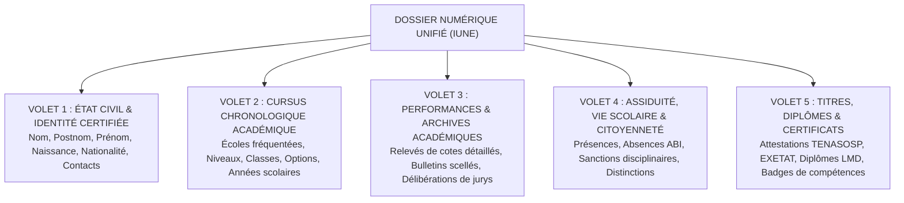
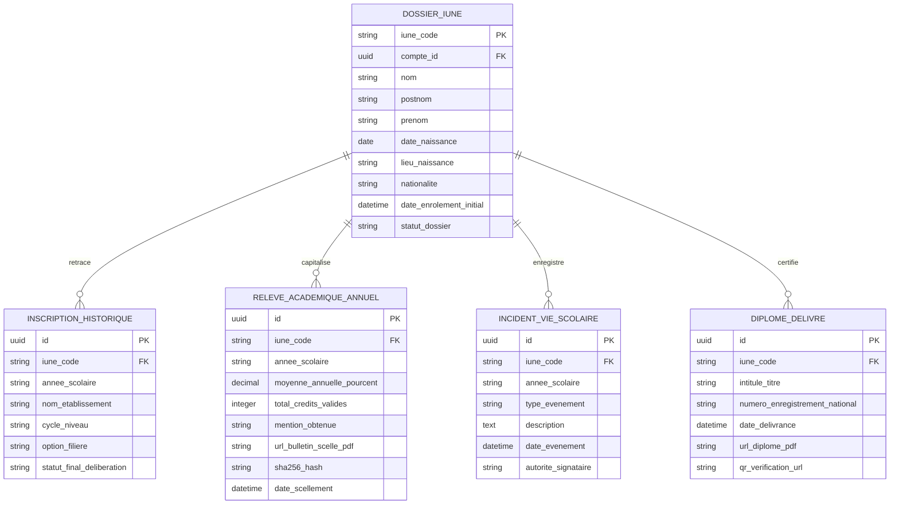

# TOME 5 — ARCHITECTURE FONCTIONNELLE
## 60. Module Dossier Numérique Unifié (Élève, Étudiant, Enseignant)

---

> **Positionnement :** Coffre-fort numérique pérenne et mémoire institutionnelle intégrale  
> **Autorité :** Conforme au Tome 1 (Section 3) et à la Constitution (Tome 2, Articles 4, 8, 11 et 15)  
> **Liaison amont :** Modules 58 et 59 | **Liaison aval :** Modules 66, 68, 72, 76 et 82

---

## 1. Objet et Portée du Module

Le Module **Dossier Numérique Unifié** incarne l'un des engagements fondateurs les plus solennels d'ELLYSIUM : **la conservation intégrale, infalsifiable et pérenne de la mémoire de chaque parcours éducatif et professionnel**.

Dans le contexte éducatif congolais et africain, la perte récurrente de dossiers scolaires papier suite à des déménagements, des fermetures d'écoles, des sinistres ou des crises sécuritaires constitue une tragédie humaine qui brise des destins académiques. ELLYSIUM apporte une réponse structurelle souveraine :
- L'attribution de l'**Identifiant Unique National ELLYSIUM (IUNE)** dès l'entrée dans le système, servant de clé universelle à vie.
- L'unification du dossier d'un apprenant sur l'ensemble de sa scolarité : de la 7e année de base jusqu'au diplôme de Master universitaire.
- La constitution du dossier professionnel unifié pour les enseignants et personnels administratifs.
- La mise à disposition d'un coffre-fort numérique personnel, auditable et exportable en permanence.

---

## 2. Architecture et Structure du Dossier Numérique

Le dossier numérique unifié est structuré en **cinq volets hermétiques et horodatés** :

---

## 3. Spécification des Volets du Dossier Apprenant

### Volet 1 — Identité et État Civil Certifié
- Identifiant Unique National ELLYSIUM (IUNE) : format normé `CD-EL-YYYY-NNNNNNNN` (ex. `CD-EL-2026-00049281`).
- Nom, postnom, prénom, genre, date et lieu de naissance certifiés conformes à l'acte de naissance ou au jugement supplétif déposé.
- Numéro d'identité nationale / carte d'électeur (pour les apprenants majeurs).
- Historique des coordonnées de contact vérifiées (numéros de téléphone, e-mails, adresses de résidence successives).
- Filiation et lien avec les comptes des représentants légaux (pour les élèves mineurs).

### Volet 2 — Cursus Chronologique Scolaire et Universitaire
- Registre séquentiel et immuable de chaque année académique suivie :
  - *Année académique* (ex. 2026-2027).
  - *Établissement fréquenté* (nom de l'école partenaire ou mention « Campus Ouvert Indépendant ELLYSIUM »).
  - *Niveau et Filière* (ex. 2e des humanités — Option Scientifique Math-Physique ; ou Licence 2 — Informatique et Génie Logiciel).
  - *Statut d'inscription* (régulier, auditeur libre, réinscription après interruption).

### Volet 3 — Performances et Relevés Académiques Scellés
- Enregistrement détaillé de l'ensemble des résultats obtenus :
  - Cotes détaillées par période (P1, P2, Semestre 1, P3, P4, Semestre 2) pour le secondaire.
  - Notes d'évaluation continue, examens terminaux et crédits ECTS capitalisés par Unité d'Enseignement pour l'université.
  - Archive PDF/A de chaque **Bulletin officiel scellé** émis, muni de son empreinte cryptographique SHA-256 et de son QR code de vérification.
  - Procès-verbaux des jurys de délibération annuelle (décision collégiale : admis, redouble, réorienté, ajourné).

### Volet 4 — Assiduité et Vie Scolaire
- Compteur officiel des présences et des retards.
- Registre des absences justifiées (avec motifs médicaux ou administratifs archivés) et injustifiées (`ABI`).
- Registre disciplinaire : avertissements, blâmes prononcés par le conseil de discipline, ainsi que distinctions honorifiques (Tableau d'Honneur, Prix d'Excellence, Félicitations du Conseil des Professeurs).

### Volet 5 — Titres, Diplômes et Certifications Infalsifiables
- Attestations de réussite officielles délivrées (Certificat de fin d'éducation de base, TENASOSP, attestation d'admission aux épreuves de l'EXETAT).
- Diplômes de Licence et de Master d'ELLYSIUM homologués.
- Micro-certifications et attestations modulaires de compétences acquises.

---

## 4. Spécification du Dossier Professionnel de l'Enseignant

Pour le corps enseignant et le personnel d'encadrement, le dossier numérique consigne :
1. **Identité et Titres Académiques** : Copies certifiées des diplômes universitaires (Graduat, Licence, Master, Doctorat), spécialités disciplinaires enseignées.
2. **Historique des Affectations et Charges Horaires** :
   - Classes, promotions et matières assignées par année scolaire.
   - Volumes horaires hebdomadaires contractuels et effectifs prestés.
3. **Évaluations et Contrôle Qualité Pédagogique** :
   - Rapports d'inspection pédagogique interne et d'inspection ministérielle.
   - Synthèses annuelles d'évaluation didactique par les pairs et baromètres étudiants (anonymisés).
   - Suivi du respect des délais de correction des copies et d'assiduité aux séances de cours.
4. **Formation Continue et Certifications** : Historique des formations suivies sur la didactique numérique d'ELLYSIUM.

---

## 5. Règles de Gouvernance, Droits d'Accès et Traçabilité (Article 15)

- **Règle 60.1 (Propriété inaliénable du dossier)** : Le dossier académique appartient à l'apprenant à vie. Même si une école partenaire cesse sa collaboration avec ELLYSIUM, l'élève conserve l'accès total à son historique et à ses bulletins certifiés.
- **Règle 60.2 (Portabilité universelle)** : L'apprenant peut générer à tout moment un **Relevé de Scolarité Global Certifié** en un clic, exportable sous format standardisé et vérifiable par tout tiers.
- **Règle 60.3 (Immuabilité absolue des archives)** : Les notes, délibérations et sanctions passées ne peuvent en aucun cas être supprimées. Une correction d'erreur matérielle fait obligatoirement l'objet d'un acte rectificatif annexé au dossier, laissant intacte la trace originale.
- **Règle 60.4 (Cloisonnement des accès entre écoles concurrentes)** : Une école partenaire $B$ dans laquelle s'inscrit un élève transféré ne peut consulter que les informations académiques indispensables transmises légalement, sans accéder aux correspondances privées ou données financières internes de l'école d'origine $A$.

---

## 6. Modèle Conceptuel de Données (Entités du Module)

