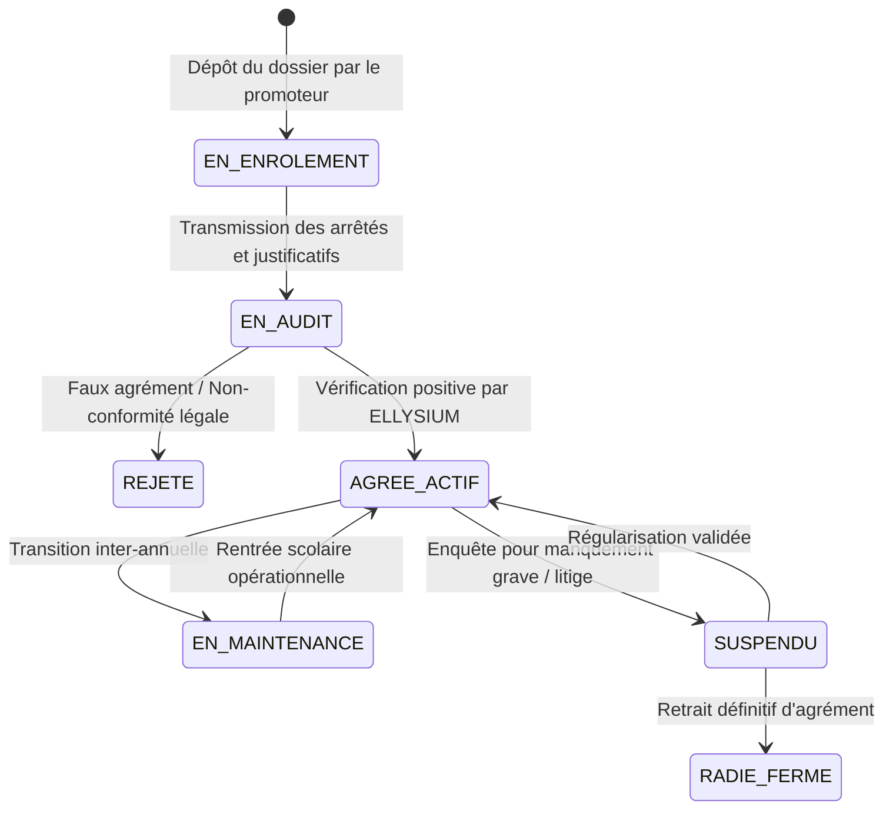
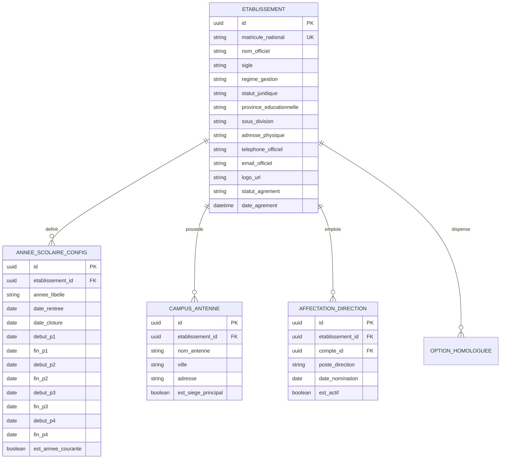

# TOME 5 — ARCHITECTURE FONCTIONNELLE
## 61. Module Gestion des Établissements Scolaires et Supérieurs

---

> **Positionnement :** Socle de paramétrage institutionnel et d'administration des écoles partenaires  
> **Autorité :** Conforme au Tome 1 (Section 4.2) et à la Constitution (Tome 2, Articles 2, 4 et 13)  
> **Liaison amont :** Module 58 (Identification) | **Liaison aval :** Modules 62, 63, 64, 71 et 77

---

## 1. Objet et Portée du Module

Le Module **Gestion des Établissements Scolaires** constitue la tour de contrôle institutionnelle permettant d'enregistrer, de valider, de configurer et de superviser l'ensemble des établissements d'enseignement (écoles secondaires, instituts techniques, universités, instituts supérieurs, centres de formation) adhérant au réseau ELLYSIUM.

Ce module garantit que chaque école partenaire fonctionne comme une entité administrative autonome au sein de la plateforme, tout en respectant scrupuleusement les normes académiques nationales de la RDC et les règles constitutionnelles d'ELLYSIUM.

Il prend en charge :
- Le circuit d'enrôlement officiel et d'audit préalable des écoles candidates.
- La configuration des métadonnées légales (agrément ministériel, arrêté de création, régime de gestion).
- Le paramétrage de l'identité visuelle officielle (en-têtes, armoiries, sceau de l'école) imprimée sur les bulletins.
- La gestion de l'organigramme de direction et l'assignation des autorités responsables.
- La gestion des campus multiples, antennes provinciales ou succursales décentralisées.

---

## 2. Le Cycle de Vie Institutionnel d'un Établissement

L'adhésion d'une école au réseau ELLYSIUM suit un workflow de vérification en 5 états :

---

## 3. Paramétrage Institutionnel et Configuration Métier

Dès qu'un établissement atteint l'état `AGREE_ACTIF`, son équipe de direction accède au module de paramétrage structuré en quatre domaines :

### 3.1 Fiche d'Identité Juridique et Réglementaire
- **Code Matricule National d'Établissement** : Numéro officiel attribué par le Ministère de l'EPST ou de l'ESU (obligatoire sur tous les documents officiels).
- **Régime de gestion** :
  - *Public / Non conventionné*.
  - *Conventionné Catholique* (Sous-coordination diocésaine).
  - *Conventionné Protestant* (Communauté ecclésiastique).
  - *Conventionné Kimbanguiste / Islamique / Fraternel*.
  - *Privé Agréé* (Arrêté ministériel d'agrément avec date et numéro d'enregistrement).
- **Localisation géographique et administrative** :
  - Province éducationnelle (ex. *Haut-Katanga 1, Nord-Kivu 2, Kinshasa-Lukunga*).
  - Sous-division éducationnelle.
  - Ville, Commune, Territoire, Avenue et numéro de parcelle.

### 3.2 Identité Visuelle et Formalisme Documentaire
- Téléversement du logo officiel de l'établissement (format haute résolution vectoriel ou PNG transparent).
- Devise officielle de l'école (ex. *« Labor - Scientia - Disciplina »*).
- Configuration de l'en-tête officiel à 3 niveaux conforme à l'usage républicain congolais :
  1. République Démocratique du Congo / Ministère de l'Éducation Nationale.
  2. Direction Provinciale / Sous-Division Éducationnelle.
  3. Nom officiel complet de l'établissement scolaire.
- Signature numérisée officielle et spécimen du cachet sec du Chef d'Établissement (avec contrôle cryptographique d'autorisation).

### 3.3 Calendrier Académique et Périodes Scolaires
- Découpage temporel de l'année scolaire conformément aux arrêtés ministériels :
  - Dates d'ouverture et de clôture de l'année scolaire.
  - Bornes de début et fin des **4 Périodes** (1re, 2e, 3e, 4e périodes).
  - Bornes des examens du **Premier Semestre** et du **Second Semestre**.
  - Périodes de vacances scolaires obligatoires et jours fériés légaux de la République.

### 3.4 Gouvernance et Délégation des Pouvoirs Internes
- Assignation des rôles de direction :
  - Titulaire du rôle `Chef d'Établissement / Préfet Principal`.
  - Titulaire(s) du rôle `Préfet des Études / Directeur Pédagogique`.
  - Titulaire du rôle `Directeur de Discipline / Préfet de Discipline`.
  - Titulaire du rôle `Intendant / Caissier en Chef`.
- Règle de double validation : Définition des seuils financiers et administratifs exigeant une double signature conjointe (ex. validation d'un échéancier spécial ou recours sur un bulletin).

---

## 4. Règles de Gestion et Verrous Institutionnels

- **Règle 61.1 (Vérification préalable obligatoire)** : Aucun établissement ne peut être activé sans contrôle de validité de son arrêté de création auprès de la Direction des Établissements Privés ou de la Direction de l'Enseignement Secondaire du Ministère.
- **Règle 61.2 (Cloisonnement des données inter-écoles)** : Chaque établissement scolaire constitue un locataire hermétique (Multi-tenant logique). Aucun personnel, aucun enseignant et aucun directeur d'une école $A$ ne peut accéder, même par erreur, aux données administratives, financières ou pédagogiques de l'école $B$.
- **Règle 61.3 (Continuité du service en cas de litige financier de l'école)** : Si un établissement scolaire partenaire est en retard sur le paiement de son abonnement à la plateforme logicielle, le système ELLYSIUM **s'interdit formellement de couper l'accès aux données des élèves ou de bloquer la génération des bulletins**. Le litige est traité par voie conventionnelle et juridique sans prise d'otage des apprenants.
- **Règle 61.4 (Archivage pérenne en cas de fermeture)** : Si une école ferme définitivement ses portes, l'ensemble des dossiers numériques de ses élèves et de ses enseignants est automatiquement transféré au Répertoire National Central d'ELLYSIUM, garantissant la survie des archives scolaires.

---

## 5. Modèle Conceptuel de Données (Entités du Module)

---

## 7. Verrous Fonctionnels Critiques

| Réf. Verrou | Description Fonctionnelle et Technique | Conséquence en Cas de Violation |
| :--- | :--- | :--- |
| **`VF-061-01`** | **Conformité à l'organigramme officiel EPST/ESU** | Toute classe créée doit correspondre à une filière et une option reconnue par l'État. |
| **`VF-061-02`** | **Validation des volumes horaires minimaux** | Le système alerte si la grille horaire d'une classe est inférieure aux normes ministérielles. |
| **`VF-061-03`** | **Verrouillage de la structure après rentrée** | La création ou suppression d'une section après J+30 exige l'accord de l'Inspection Générale. |
| **`VF-061-04`** | **Cohérence des crédits ECTS en LMD** | Chaque semestre universitaire doit totaliser rigoureusement 30 crédits ECTS. |
| **`VF-061-05`** | **Traçabilité des transferts d'option** | Tout changement de filière fait l'objet d'un procès-verbal numérique signé. |
| **`VF-061-06`** | **Toute donnée d'apprenant peut être exportée sur demande conformément à l'Article 8 de la Constitution** | **Conséquence : violation = inéligibilité du module pour mise en production** |

---

*Sous-tome rédigé conformément aux Normes documentaires ELLYSIUM — Fondations 04.*
