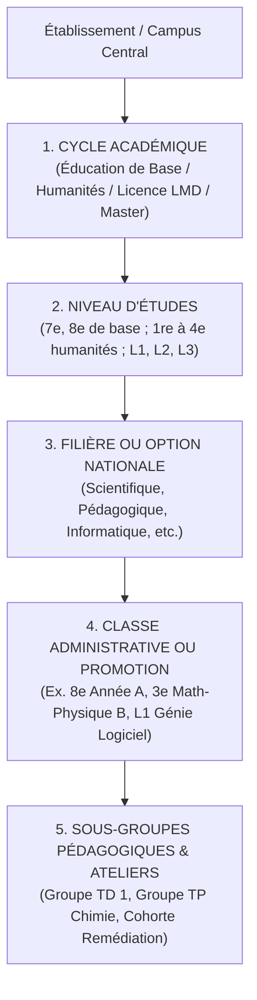
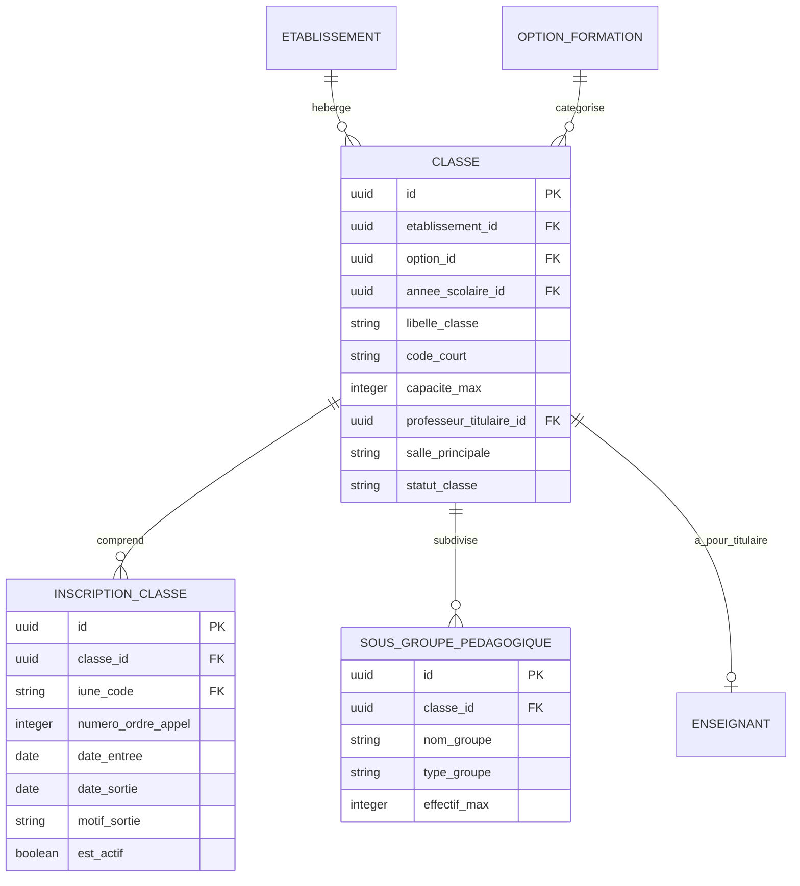

# TOME 5 — ARCHITECTURE FONCTIONNELLE
## 62. Module Gestion des Classes, Promotions et Groupes

---

> **Positionnement :** Modélisation de la structure pédagogique opérationnelle et organisation des cohortes  
> **Autorité :** Conforme aux Tomes 3 et 4 et à la Constitution (Tome 2, Articles 2 et 10)  
> **Liaison amont :** Module 61 (Établissements) | **Liaison aval :** Modules 63 (Paramétrage Pédagogique), 64 (Emploi du Temps), 65 et 66

---

## 1. Objet et Portée du Module

Le Module **Gestion des Classes, Promotions et Groupes** assure l'organisation structurelle concrète des apprenants et des équipes pédagogiques au sein de chaque établissement partenaire et sur le campus universitaire en ligne d'ELLYSIUM.

Il traduit les cursus académiques généraux en **entités collectives d'apprentissage vivantes** :
- La hiérarchie académique complète (Cycles $\rightarrow$ Niveaux $\rightarrow$ Options $\rightarrow$ Promotions $\rightarrow$ Classes physiques $\rightarrow$ Groupes de TP/TD).
- L'affectation et le suivi des effectifs par classe avec contrôle strict des capacités d'accueil.
- La nomination et les prérogatives du **Professeur Titulaire de Classe** (pivot de la relation éducative et de la vie de classe).
- L'organisation des sous-groupes spécialisés (travaux dirigés, laboratoires virtuels, ateliers pratiques, cohortes de remédiation).

---

## 2. Hiérarchie Structurelle des Entités Pédagogiques

Le modèle d'organisation scolaire et supérieur d'ELLYSIUM est structuré selon une arborescence à 5 niveaux :

---

## 3. Spécifications Métier et Règles de Gestion

### 3.1 Création et Paramétrage d'une Classe
Pour chaque classe créée au sein d'une année scolaire active :
1. **Dénomination normalisée** : Format officiel congolais associant le niveau, l'option et la lettre de section (ex. `7e EB-A`, `8e EB-B`, `1re HP-A` pour 1re Humanités Pédagogiques section A, `3e SC-B` pour 3e Scientifique section B).
2. **Capacité nominale et maximale** :
   - *Capacité recommandée* : 35 à 45 élèves.
   - *Seuil d'alerte de surpopulation* : Dépassé à 50 élèves. Le système génère une alerte administrative suggérant le dédoublement de la classe (création d'une division parallèle).
3. **Localisation physique (pour les écoles physiques)** : Affectation d'une salle de classe principale de rattachement dans l'établissement.

### 3.2 Le Rôle du Professeur Titulaire de Classe
Chaque classe secondaire se voit obligatoirement assigner un **Enseignant Titulaire** :
- Il est l'interlocuteur privilégié des parents d'élèves de cette classe.
- Il a une vue d'ensemble transversale sur les présences, la discipline et les notes attribuées par ses collègues professeurs.
- Il rédige l'appréciation globale de conduite et de travail figurant sur le bulletin de période et de semestre.
- Il présente la classe lors des réunions du jury de délibération de fin d'année.

### 3.3 Constitution et Gestion des Groupes Spécialisés
Pour répondre aux impératifs d'apprentissage actif et d'ateliers :
- **Groupes de Travaux Pratiques (TP)** : Scission d'une classe de 40 élèves en deux groupes de 20 élèves pour les séances de laboratoire (chimie, physique, informatique).
- **Cohortes de Remédiation Pédagogique** : Regroupement dynamique automatique d'élèves issus de différentes classes présentant les mêmes lacunes sur un objectif didactique précis, pour un module de soutien accéléré avec un tuteur.
- **Groupes de Projets Collaboratifs** : Constitution d'équipes de 3 à 5 étudiants universitaires pour la réalisation d'études de cas ou de projets de développement logiciel.

---

## 4. Règles de Gestion et Verrous Fonctionnels

- **Règle 62.1 (Affectation exclusive annuelle)** : Un élève ne peut appartenir qu'à une seule classe administrative principale par année scolaire. Le transfert d'un élève d'une classe $A$ vers une classe $B$ au sein de la même école clôture son historique dans la classe $A$ et transfère son relevé de notes sans perte.
- **Règle 62.2 (Interdiction des classes sans titulaire)** : Le système signale comme incomplète toute classe secondaire n'ayant pas de Professeur Titulaire désigné au-delà de 15 jours après la rentrée des classes.
- **Règle 62.3 (Gestion des options orphelines)** : Une option ne peut être ouverte dans un établissement scolaire que si l'école détient l'agrément ministériel officiel pour cette filière spécifique (vérification au Module 61).
- **Règle 62.4 (Préservation des effectifs scellés)** : À la date officielle de clôture des listes fixée par la sous-division de l'EPST, la composition des classes est verrouillée (`EFFECTIF_SCELLÉ`). Toute modification ultérieure (arrivée tardive, départ) requiert un visa du Préfet des études.

---

## 5. Modèle Conceptuel de Données (Entités du Module)

---

## 7. Verrous Fonctionnels Critiques

| Réf. Verrou | Description Fonctionnelle et Technique | Conséquence en Cas de Violation |
| :--- | :--- | :--- |
| **`VF-062-01`** | **Horodatage non falsifiable des présences** | L'enregistrement de présence par QR code intègre un jeton cryptographique à validité de 60 secondes. |
| **`VF-062-02`** | **Notification automatique aux parents sous 30 minutes** | Toute absence non justifiée déclenche une alerte SMS/Push vers le tuteur légal. |
| **`VF-062-03`** | **Seuil d'exclusion pour absences encadré par la loi** | L'alerte de non-validation d'année pour défaut d'assiduité requiert un avis du conseil des maîtres. |
| **`VF-062-04`** | **Saisie hors-ligne des présences avec synchronisation** | L'enseignant peut pointer les élèves hors connexion, synchronisation automatique dès retour réseau. |
| **`VF-062-05`** | **Interdiction d'altération rétroactive des registres** | Le registre d'appel de la veille ne peut être corrigé que par le Préfet avec motif justificatif. |
| **`VF-062-06`** | **Toute donnée d'apprenant peut être exportée sur demande conformément à l'Article 8 de la Constitution** | **Conséquence : violation = inéligibilité du module pour mise en production** |

---

*Sous-tome rédigé conformément aux Normes documentaires ELLYSIUM — Fondations 04.*
