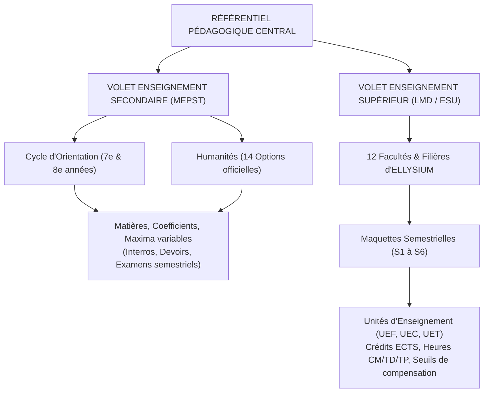
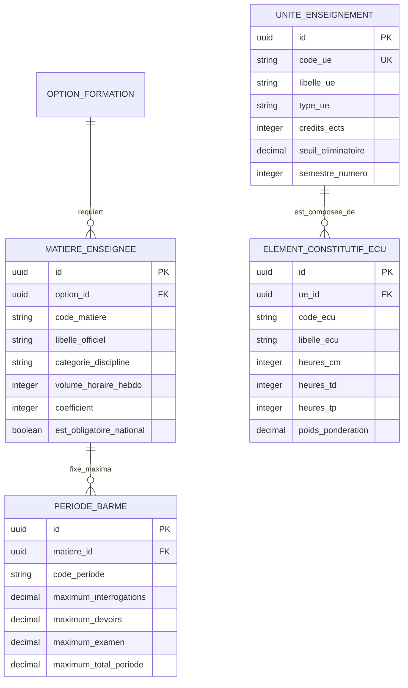

# TOME 5 — ARCHITECTURE FONCTIONNELLE
## 63. Module Paramétrage Pédagogique (Matières, Coefficients et Référentiels)

---

> **Positionnement :** Moteur référentiel des programmes, grilles horaires, volumes et barèmes  
> **Autorité :** Conforme aux Tomes 3 et 4 et à la Constitution (Tome 2, Article 12)  
> **Liaison amont :** Tome 4 (Programmes d'études) | **Liaison aval :** Modules 64 (Emploi du temps), 66 (Cotes), 67 (Calculs) et 68 (Bulletins)

---

## 1. Objet et Portée du Module

Le Module **Paramétrage Pédagogique** constitue le registre normatif central qui codifie l'ensemble des règles académiques appliquées au sein de la plateforme. Il interdit formellement toute improvisation ou saisie arbitraire de matières, de pondérations ou de maxima de points.

Ce module assure :
- L'instanciation des grilles horaires et matières officielles du **Secondaire congolais** définies au Tome 4 (Cycle d'orientation 7e-8e et les 14 options des humanités).
- L'instanciation des maquettes semestrielles du **Système LMD** (Unités d'Enseignement, Éléments Constitutifs d'Unité, crédits ECTS, seuils éliminatoires).
- La définition des maxima périodiques et semestriels de cotation conformément aux instructions ministérielles de la RDC.
- L'association stricte entre les disciplines, les volumes horaires hebdomadaires et les enseignants habilités.

---

## 2. Modélisation des Référentiels Pédagogiques

---

## 3. Spécifications Métier — Volet Secondaire (RDC)

### 3.1 Découpage des Disciplines et Catégorisation Officielle
Pour chaque option du secondaire, les cours sont catégorisés selon la typologie officielle :
1. **Cours Principaux / Matières Dominantes** : Matières caractéristiques de l'option (ex. *Mathématiques et Physique* en Scientifique ; *Chimie et Biologie* en Biochimie ; *Comptabilité et Économie* en Commerciale ; *Pédagogie et Psychologie* en Pédagogie générale).
2. **Cours Complémentaires / Tronc Commun** : Français, Anglais, Histoire, Géographie, Éducation civique et morale.
3. **Cours Pratiques & Développements** : Dessin technique, Informatique appliquée, Travaux manuels, Éducation physique et sportive.

### 3.2 Structure de Cotation et Maxima de Points
Conformément aux instructions officielles de la Direction des Programmes Scolaires (DIPROMAT) :
- **Cotation d'une Période Scolaire** :
  - Chaque matière dispose d'un **Maximum Périodique Officiel** (ex. 10, 20, 30 ou 50 points selon le poids de la discipline).
  - La note de la période est le cumul pondéré des travaux journaliers (interrogations orales/écrites, devoirs à domicile, travaux pratiques).
- **Cotation des Examens Semestriels** :
  - L'examen de fin de semestre dispose d'un maximum spécifique (généralement égal ou proportionnel au cumul des deux périodes précédentes, ex. sur 40 ou 100 points).
- **Verrouillage des Coefficients** : Une école partenaire ne peut pas modifier unilatéralement le coefficient d'une matière nationale sans que cette dérogation ne soit tracée et visée par l'inspecteur d'État.

---

## 4. Spécifications Métier — Volet Universitaire (Système LMD)

### 4.1 Modélisation des Unités d'Enseignement (UE) et des ECU
Chaque formation de Licence ou Master est articulée en semestres de 30 crédits ECTS :
- **Unité d'Enseignement (UE)** :
  - Code officiel normalisé (ex. `INFO-L1-S1-UE1`).
  - Intitulé officiel complet (ex. *« Algorithmique Fondamentale et Structures Linéaires »*).
  - Nature de l'UE : Fondamentale (UEF), Complémentaire (UEC) ou Transversale (UET).
  - Volume de crédits ECTS alloué (ex. 6 crédits).
  - Note éliminatoire stricte (ex. note minimale de $7/20$ interdisant la compensation globale).
- **Éléments Constitutifs d'Unité (ECU)** :
  - Chaque UE peut être subdivisée en 1 à 3 ECU (cours spécifiques composant l'UE).
  - Pour chaque ECU : Répartition horaire contractuelle en Heures de Cours Magistraux (CM), Travaux Dirigés (TD), Travaux Pratiques (TP) et Travail Personnel de l'Étudiant (TPE).
  - Coefficient interne de pondération dans l'UE.

---

## 5. Règles de Gestion et Verrous Fonctionnels

- **Règle 63.1 (Intégrité des Grilles Ministérielles)** : Le système interdit la suppression d'une matière obligatoire du programme national congolais dans une classe homologuée.
- **Règle 63.2 (Matières optionnelles et cours locaux)** : Un établissement partenaire a la faculté d'ajouter des « Cours Complémentaires Locaux » (ex. *Informatique renforcée, Langue locale, Éducation spirituelle*), mais ceux-ci doivent être clairement isolés sur le bulletin sous la rubrique « Matières Spécifiques d'Établissement » sans altérer le calcul des totaux nationaux officiels.
- **Règle 63.3 (Validation obligatoire de rentrée)** : Au début de chaque année scolaire, le Préfet des études valide la grille pédagogique active de son établissement. Toute modification ultérieure en cours d'année scolaire est bloquée dès que la première note d'évaluation a été enregistrée.
- **Règle 63.4 (Immutabilité de la somme des crédits universitaires)** : Chaque semestre de Licence ou Master doit totaliser **exactement 30 crédits ECTS**. Le système refuse de valider une maquette semestrielle dont la somme des crédits est inférieure ou supérieure à 30.

---

## 6. Modèle Conceptuel de Données (Entités du Module)

