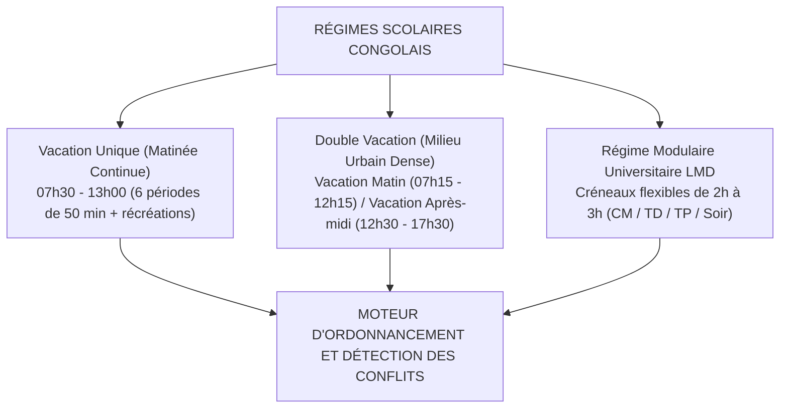
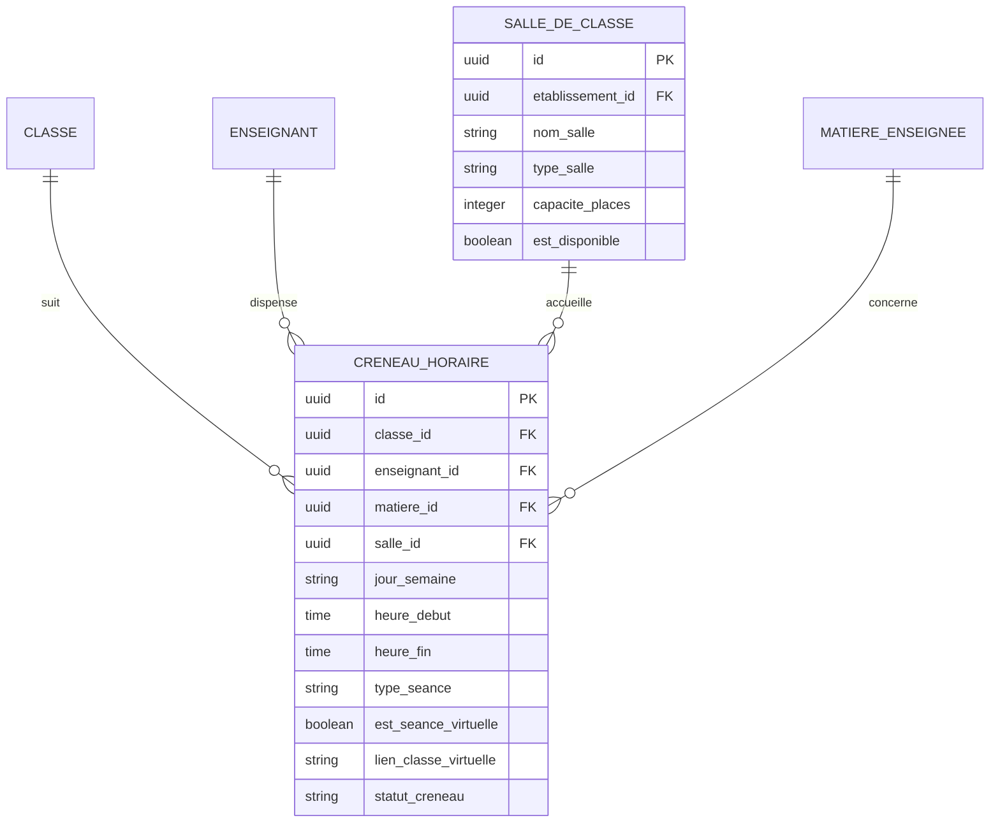

# TOME 5 — ARCHITECTURE FONCTIONNELLE
## 64. Module Emploi du Temps et Planification Pédagogique

---

> **Positionnement :** Moteur d'ordonnancement spatio-temporel des enseignements et séances en ligne  
> **Autorité :** Conforme au Tome 3 (Méthodes d'enseignement) et à la Constitution (Tome 2, Article 10)  
> **Liaison amont :** Modules 61, 62 et 63 | **Liaison aval :** Modules 65 (Présences), 70 (Notifications) et 72 (RH Enseignants)

---

## 1. Objet et Portée du Module

Le Module **Emploi du Temps et Planification Pédagogique** assure la gestion des créneaux horaires, la réservation des espaces pédagogiques et la distribution harmonieuse des charges d'enseignement pour les établissements partenaires physiques et le campus numérique d'ELLYSIUM.

Il résout de manière automatisée et contrôlée la complexité de l'ordonnancement scolaire :
- La planification des cours hebdomadaires réguliers pour chaque classe.
- L'affectation optimale des salles de cours, laboratoires d'expérimentation et salles d'informatique.
- La prise en compte des contraintes horaires des enseignants et le respect des volumes maximaux autorisés par la loi.
- La gestion des créneaux synchrones (classes virtuelles, webinaires de révision d'EXETAT, permanences de tutorat).
- La diffusion en temps réel et la consultation hors-ligne sur l'application mobile des élèves, parents et enseignants.

---

## 2. Modélisation des Régimes Horaires et Contraintes Métier

Le système prend en charge nativement les régimes d'organisation du temps scolaire en République Démocratique du Congo :

---

## 3. Spécifications du Moteur de Planification

### 3.1 Définition de la Grille Hebdomadaire
- Découpage de la semaine scolaire du lundi au samedi inclus.
- Structuration de la journée en **périodes élémentaires de 50 minutes** (ou blocs de 1h40 pour les cours avec travaux dirigés ou manipulations).
- Intégration des pauses réglementaires : Récréation principale de 30 minutes au milieu de la matinée.

### 3.2 Algorithme de Détection et Blocage des Conflits
Le système intègre un vérificateur de cohérence en temps réel interdisant les anomalies suivantes :
1. **Conflit d'enseignant (Chevauchement)** : Un enseignant ne peut pas être planifié simultanément dans deux classes ou sur deux cours différents à la même heure.
2. **Conflit de salle (Sur-réservation)** : Une salle de classe physique, un laboratoire de sciences ou une salle d'informatique ne peut accueillir plus d'une classe sur le même créneau.
3. **Conflit d'effectif** : L'effectif de la classe planifiée ne peut excéder la capacité physique maximale de la salle attribuée.
4. **Conflit d'étudiant / classe** : Une classe ne peut pas avoir deux matières distinctes programmées sur la même période horaire.

### 3.3 Règles Pédagogiques d'Ordonnancement Idéal
Le planificateur applique des heuristiques didactiques conformes aux recommandations du Tome 3 :
- *Répartition des matières lourdes* : Les disciplines exigeant une forte concentration abstraite (Mathématiques, Physique, Chimie, Philosophie) sont prioritairement programmées en début de matinée (périodes 1 à 3).
- *Limitation des blocs consécutifs* : Pas plus de deux périodes consécutives (1h40) pour une même matière théorique au secondaire.
- *Planification des séances d'ateliers et TP* : Les travaux pratiques d'électricité, de mécanique ou de sciences expérimentales sont regroupés en demi-journées dédiées pour permettre les manipulations d'atelier.

---

## 4. Gestion des Événements et Remplacements en Cours d'Année

- **Gestion des absences d'enseignants** :
  - Dès qu'une absence d'enseignant est enregistrée dans le Module RH (Module 72), les créneaux concernés passent à l'état `COURS_SUSPENDU` ou `EN_REMPLACEMENT`.
  - Le système propose automatiquement une liste d'enseignants disponibles de la même discipline pour assurer la suppléance.
- **Notification instantanée aux familles** :
  - Toute modification de l'emploi du temps (déplacement d'heure, cours annulé, rattrapage planifié) génère une notification automatique push et SMS aux parents et aux élèves concernés via le Module 70.
- **Rattrapages académiques** :
  - Possibilité pour le Préfet des études de planifier des sessions de rattrapage le samedi après-midi ou durant les congés scolaires pour respecter le quota annuel d'heures imposé par le Ministère.

---

## 5. Modèle Conceptuel de Données (Entités du Module)

---

## 6. Règles de Gestion et Verrous Fonctionnels

- **Règle 64.1 (Plafond de charge hebdomadaire de l'enseignant)** : Le système alerte le Préfet si la charge hebdomadaire programmée d'un enseignant dépasse le maximum légal conventionnel (ex. 24 heures de cours par semaine au secondaire).
- **Règle 64.2 (Consommation hors-ligne de l'agenda)** : L'emploi du temps de l'élève et de l'enseignant est synchronisé et stocké en local sur l'appareil mobile. Tout changement de salle ou d'horaire est mis à jour dès la reconnexion.
- **Règle 64.3 (Liaison obligatoire au Cahier de Présence)** : La grille d'emploi du temps génère automatiquement les feuilles d'appel quotidiennes dans le Module 65 (Cahier de présence). Aucun appel de présence ne peut être validé s'il ne correspond pas à un créneau officiellement planifié.
