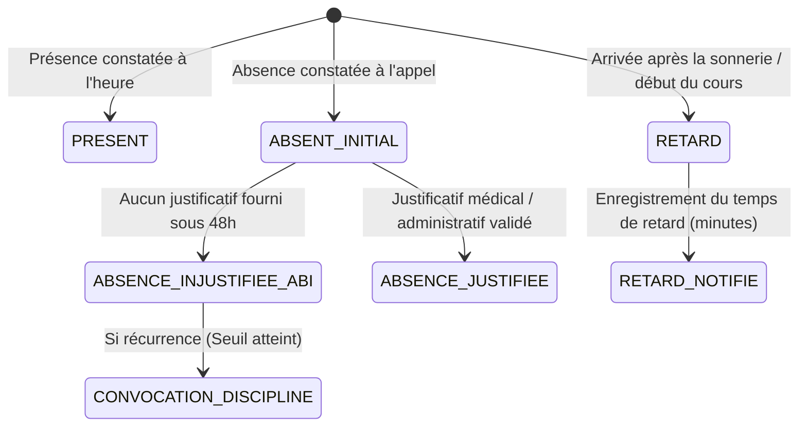
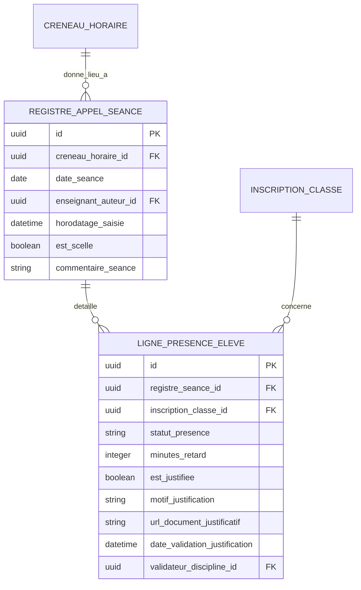

# TOME 5 — ARCHITECTURE FONCTIONNELLE
## 65. Module Cahier de Présence et Gestion de l'Assiduité

---

> **Positionnement :** Contrôle de la présence, détection précoce du décrochage et gestion des absences  
> **Autorité :** Conforme à la Constitution (Tome 2, Articles 7, 8 et 9 — Devoirs de l'apprenant)  
> **Liaison amont :** Modules 62 et 64 | **Liaison aval :** Modules 66 (Cotes), 67 (Calculs), 70 (Alertes) et 77 (Statistiques)

---

## 1. Objet et Portée du Module

Le Module **Cahier de Présence et Gestion de l'Assiduité** digitalise et sécurise l'appel scolaire et le suivi de l'engagement des apprenants à ELLYSIUM.

Dans les établissements scolaires physiques partenaires, la gestion manuelle sur registres papier entraîne des pertes de temps considérables, des falsifications d'absences et l'information trop tardive des parents en cas d'école buissonnière. Dans l'enseignement en ligne pour apprenants indépendants, l'assiduité mesure l'implication réelle et prévient le décrochage solitaire.

Le module assure :
- La saisie ultra-rapide de l'appel par l'enseignant en présentiel (en ligne ou hors-ligne).
- La traçabilité de l'engagement des apprenants à distance (consultation des leçons, soumission des devoirs).
- La catégorisation stricte des absences (Justifiée vs Non Justifiée / `ABI`).
- L'émission automatique d'alertes instantanées aux parents dès le premier retard ou la première absence.
- Le calcul du taux d'assiduité officiel et son impact sur la recevabilité aux examens semestriels et nationaux.

---

## 2. Typologie des Statuts de Présence et Qualification des Absences

Chaque élève ou étudiant évalué lors d'une séance reçoit l'un des statuts officiels suivants :

1. **Présent (`PRESENT`)** : L'élève est présent dans la salle ou connecté à la séance synchrone obligatoire.
2. **En retard (`RETARD`)** : Présent mais arrivé avec un retard enregistré en minutes (ex. +15 min). Tout retard excédant 20 minutes sans autorisation préalable de la préfecture de discipline équivaut administrativement à une absence.
3. **Absence Justifiée (`ABSENCE_JUSTIFIEE`)** : Absence couverte par un motif recevable (certificat médical officiel, cas de force majeure familiale, convocation administrative), visé par le Directeur de Discipline dans un délai de 48 heures ouvrées.
4. **Absence Injustifiée (`ABI`)** : Absence sans motif valable ou sans justificatif produit dans les délais. **L'ABI entraîne des conséquences directes sur les cotes d'interrogations manquées** (Module 66).

---

## 3. Cinématiques de Saisie et Interface d'Appel Rapide

### 3.1 Saisie Mobile en Classe Physique (Enseignant)
- L'enseignant ouvre l'application ELLYSIUM sur son smartphone ou sa tablette.
- Le système présente la liste des élèves ordonnée par ordre alphabétique et numéro d'appel.
- **Principe du Présent par Défaut** : Tous les élèves sont pré-cochés « Présent ». L'enseignant n'a qu'à cliquer sur les élèves absents ou en retard (temps moyen d'appel pour 45 élèves : moins de 45 secondes).
- **Fonctionnement Hors-Ligne Total** : Si la classe n'est pas couverte par le réseau Wi-Fi de l'école, l'appel est scellé en local avec horodatage certifié et synchronisé automatiquement dès que l'enseignant rejoint la salle des professeurs.

### 3.2 Mesure d'Assiduité pour l'Enseignement à Distance (Campus Ouvert)
Pour les apprenants indépendants et étudiants universitaires en ligne :
- Le système mesure l'assiduité non pas par la seule connexion passive, mais par des **jalons d'apprentissage actifs** :
  - Consultation effective et complète des unités d'étude hebdomadaires.
  - Participation aux quiz d'auto-évaluation.
  - Remise des devoirs dans les échéances fixées.
- Toute absence d'activité pédagogique constatée pendant 14 jours consécutifs déclenche une alerte de décrochage auprès du tuteur assigné.

---

## 4. Seuils d'Alerte et Sanctions Graduées

Conformément au règlement de discipline scolaire d'ELLYSIUM et aux directives ministérielles :

| Seuil d'Absence | Déclencheur | Action Automatique du Système |
| :--- | :--- | :--- |
| **Alerte 1** | 1re absence injustifiée de la semaine | Envoi immédiat d'un SMS et d'une notification push aux parents ou tuteurs légaux. |
| **Alerte 2** | Cumul de 3 absences injustifiées dans le mois | Notification au Professeur Titulaire et émission d'un billet d'avertissement de discipline. |
| **Alerte 3** | Cumul de 5 absences injustifiées | Blocage temporaire de l'admission en classe jusqu'à comparution des parents devant la Direction. |
| **Seuil Critique** | Taux d'absence $\ge 25\%$ dans une matière | **Invalidation automatique de la recevabilité à l'examen semestriel de la matière**. L'élève est ajourné pour insuffisance d'assiduité. |

---

## 5. Modèle Conceptuel de Données (Entités du Module)

---

## 6. Règles de Gestion et Verrous Fonctionnels

- **Règle 65.1 (Verrouillage temporel de l'appel)** : Une feuille d'appel ne peut être modifiée par l'enseignant que dans un délai maximal de 24 heures après la fin du créneau horaire. Au-delà, seule la préfecture de discipline est habilitée à régulariser une absence sur présentation d'un justificatif officiel.
- **Règle 65.2 (Report automatique dans le Bulletin scolaire)** : Le cumul des absences (justifiées et non justifiées) et des retards de chaque période est calculé automatiquement et imprimé obligatoirement sur le bulletin officiel scellé (Module 68).
- **Règle 65.3 (Liaison obligatoire Absence - Note ABI)** : Si un élève est marqué `ABSENCE_INJUSTIFIEE` lors d'un créneau où une interrogation sommative a été administrée, le Module 66 lui affecte automatiquement la mention `ABI` (note équivalente à 0 pointée dans le calcul).
