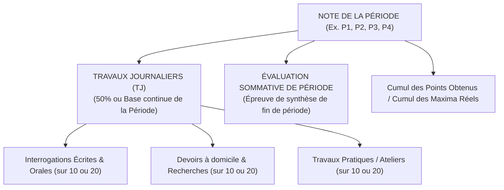
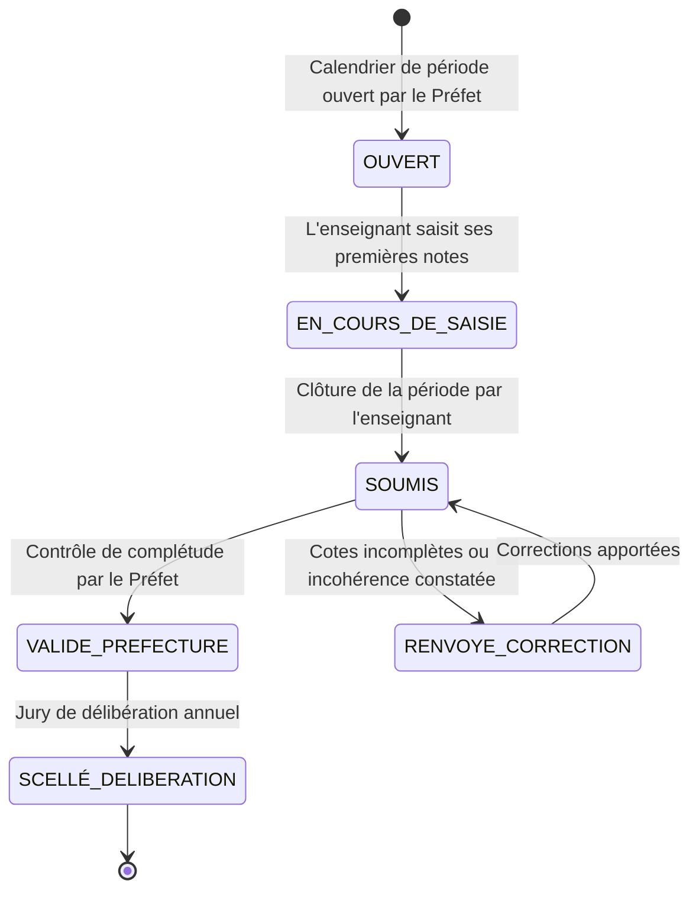
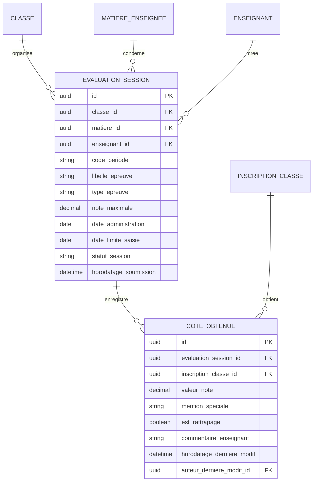

# TOME 5 — ARCHITECTURE FONCTIONNELLE
## 66. Module Cahier des Cotes et Gestion des Notes

---

> **Positionnement :** Cœur de saisie des évaluations et registre légal des performances scolaires  
> **Autorité :** Conforme aux Tomes 3 et 4 et à la Constitution (Tome 2, Articles 4, 10, 15 et 16)  
> **Liaison amont :** Modules 62, 63 et 65 | **Liaison aval :** Module 67 (Calculs) et Module 68 (Bulletins)

---

## 1. Objet et Portée du Module

Le Module **Cahier des Cotes et Gestion des Notes** constitue le registre légal au sein duquel les enseignants titulaires et chargés de cours consignent l'ensemble des résultats obtenus par les apprenants lors des différentes épreuves d'évaluation (interrogations, devoirs, travaux pratiques, examens de période et de semestre).

Il libère définitivement les enseignants de la charge harassante des calculs manuels et des recopies de listes sur carnets papier, tout en garantissant une étanchéité absolue contre les erreurs arithmétiques, les ratures et les altérations frauduleuses de cotes.

Le module assure :
- La saisie ergonomique et fluide des notes brutes par matière, classe et période.
- La prise en compte des maxima variables officiels congolais (épreuves sur 10, 20, 30, 50, etc.).
- Le contrôle de validité métrologique instantané à la saisie.
- Le traitement normalisé des mentions administratives (`ABI`, `ABJ`, `DISP`).
- La traçabilité inviolable de chaque saisie, modification ou visa d'enseignant.

---

## 2. Typologie des Évaluations et Structure des Travaux Journaliers (TJ)

Conformément à la réglementation de l'Enseignement Secondaire en RDC, la cote d'une période scolaire résulte de la combinaison de deux composantes obligatoires :

---

## 3. Cinématique de Saisie et Ergonomie Hors-Ligne

### 3.1 Interface Tabulaire de Saisie Rapide
- L'enseignant accède à la grille tabulaire de sa classe pour la matière et la période sélectionnées.
- L'affichage présente la liste ordonnée des élèves avec leurs photos et leurs numéros matricules.
- **Saisie au pavé numérique avec navigation automatique** : Après avoir tapé la note d'un élève, la touche `Entrée` ou `Flèche Bas` positionne directement le curseur sur l'élève suivant.
- **Contrôle de borne instantané** : Si l'enseignant saisit une note de `18` pour une épreuve sur `10`, le champ s'illumine immédiatement en rouge, bloque la validation et émet un avertissement sonore/visuel : *"La note ne peut excéder le maximum fixé (10)"*.

### 3.2 Gestion des Mentions Spéciales
Pour chaque élève, l'enseignant peut saisir un code de mention plutôt qu'une note numérique :
1. `ABI` (Absence Injustifiée) :
   - L'élève ne s'est pas présenté à l'épreuve sans motif valable.
   - **Impact arithmétique** : La cote compte pour `0` au numérateur, mais le maximum de l'épreuve est **maintenu au dénominateur** (pénalisant ainsi la moyenne globale).
2. `ABJ` (Absence Justifiée) :
   - L'élève était absent pour cause médicale ou force majeure validée par la Direction.
   - **Impact arithmétique** : L'épreuve est neutralisée pour cet élève (les points et le maximum sont exclus du calcul de sa moyenne) OU l'élève est planifié pour une épreuve de rattrapage équivalente.
3. `DISP` (Dispensé officiel) :
   - Élève exempté d'une matière par décision médicale ou administrative légale (ex. dispense d'Éducation Physique et Sportive). La matière est neutralisée sur son bulletin.

---

## 4. Cycle de Vie du Cahier de Cotes Périodique

Pour éviter les dérives et manipulations tardives, le cahier de cotes traverse 5 états séquentiels :

---

## 5. Modèle Conceptuel de Données (Entités du Module)

---

## 6. Règles de Gestion et Verrous Fonctionnels

- **Règle 66.1 (Quota minimal d'évaluations par période)** : Pour valider son cahier de cotes de période, l'enseignant doit obligatoirement avoir administré au minimum **deux interrogations écrites et un devoir** pour les matières à fort coefficient, et au moins **une interrogation** pour les matières secondaires. Le système refuse la soumission d'une période ne respectant pas ce quota.
- **Règle 66.2 (Délai maximal de publication des cotes - Article 11)** : L'enseignant dispose d'un délai impératif de **cinq (5) jours ouvrés** après la date de passation de l'épreuve pour saisir l'ensemble des notes dans le système. Tout dépassement génère une alerte administrative de retard au préfet des études.
- **Règle 66.3 (Audit trail de chaque modification)** : Toute rectification de note saisie après enregistrement initial conserve l'historique complet (valeur antérieure, nouvelle valeur, utilisateur, date, heure, motif de rectification).

---

## 7. Verrous Fonctionnels Critiques

| Réf. Verrou | Description Fonctionnelle et Technique | Conséquence en Cas de Violation |
| :--- | :--- | :--- |
| **`VF-066-01`** | **Saisie sous borne temporelle stricte** | La saisie des notes est automatiquement verrouillée à la date limite fixée par la direction. |
| **`VF-066-02`** | **Historisation complète de toute modification de cote** | Toute rectification de note enregistre l'ancienne cote, la nouvelle cote, l'auteur et la raison. |
| **`VF-066-03`** | **Contrôle des maxima autorisés** | Impossibilité de saisir une cote supérieure au maximum fixé pour l'épreuve. |
| **`VF-066-04`** | **Signature cryptographique de l'enseignant** | L'enseignant valide l'intégralité de son cahier de cotes par signature électronique. |
| **`VF-066-05`** | **Disponibilité hors-ligne intégrale** | Saisie possible en classe sur tablette/PC hors réseau avec scellement lors de la synchronisation. |

---

*Sous-tome rédigé conformément aux Normes documentaires ELLYSIUM — Fondations 04.*
