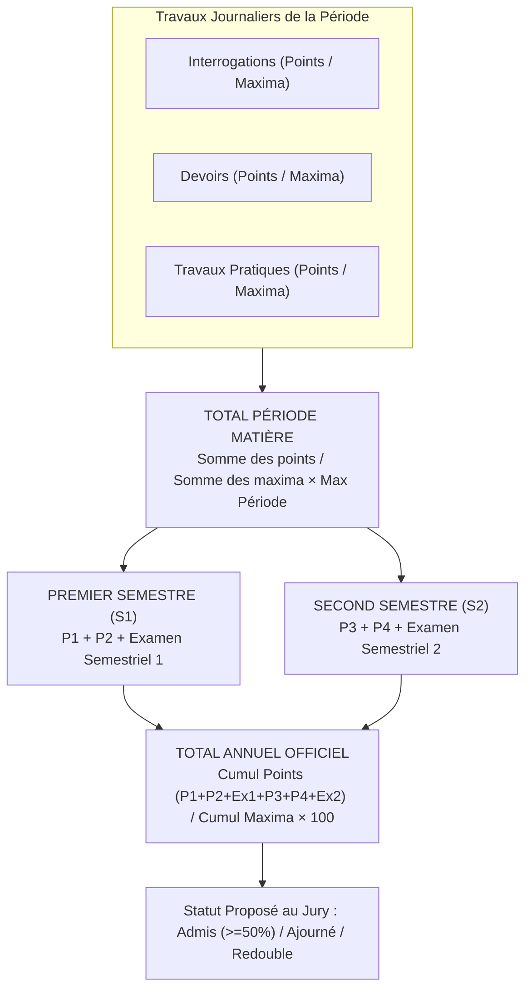

# TOME 5 — ARCHITECTURE FONCTIONNELLE
## 67. Module Calcul Académique Automatique (Moteur Déterministe)

---

> **Positionnement :** Moteur algorithmique officiel de calcul des moyennes, crédits, compensations et classements  
> **Autorité :** Conforme au Tome 3 (Parties II et VII) et au Tome 4 (Chapitre 8)  
> **Liaison amont :** Modules 63 et 66 | **Liaison aval :** Modules 68 (Bulletins) et 76 (Diplômes)

---

## 1. Objet et Portée du Module

Le Module **Calcul Académique Automatique** est le moteur mathématique et déterministe d'ELLYSIUM. Il remplace l'arbitraire, les erreurs d'arrondi manuelles et la pénibilité des calculs arithmétiques par une exécution algorithmique certifiée, transparente et 100 % conforme aux textes réglementaires de la République Démocratique du Congo et aux standards internationaux du LMD.

Ce module garantit :
- L'application stricte de la méthode du **cumul réel des points sur le cumul réel des maxima** (proscrivant la moyenne arithmétique erronée des pourcentages).
- Le traitement exact des maxima variables congolais pour chaque période, semestre et examen.
- Le calcul automatisé des crédits ECTS, des compensations semestrielles et des mentions universitaires.
- L'attribution mathématique des rangs et classements sans biais.
- La traçabilité intégrale des formules appliquées, auditables à tout moment.

---

## 2. Formules Officielles de Calcul — Volet Secondaire (RDC)



---

### 2.1 Calcul du Résultat Périodique par Matière
Pour un élève $i$ dans une discipline $m$ au cours d'une période $p$ comportant $K$ évaluations :
$$\text{Total Points Obtenus}_{i,m,p} = \sum_{k=1}^{K} \text{Note}_{i,m,p,k}$$
$$\text{Total Maxima Réels}_{m,p} = \sum_{k=1}^{K} \text{Max}_{m,p,k}$$

La note périodique ramenée au maximum réglementaire fixé pour la période ($\text{MaxPériode}_m$, ex. 10, 20 ou 50 points) est calculée par :
$$\text{NotePériodique}_{i,m,p} = \left( \frac{\text{Total Points Obtenus}_{i,m,p}}{\text{Total Maxima Réels}_{m,p}} \right) \times \text{MaxPériode}_m$$

### 2.2 Calcul du Résultat Semestriel par Matière
Conformément au programme national congolais, un semestre comprend deux périodes d'activités régulières et une session d'examen semestriel :
$$\text{Total Semestre 1}_{i,m} = \text{NotePériode1}_{i,m} + \text{NotePériode2}_{i,m} + \text{NoteExamen1}_{i,m}$$
$$\text{Max Semestre 1}_m = \text{MaxPériode1}_m + \text{MaxPériode2}_m + \text{MaxExamen1}_m$$

### 2.3 Règle d'Or Congolaise : Calcul du Pourcentage Général (Semestriel et Annuel)
Le système applique la règle fondamentale du Ministère de l'EPST : **Le pourcentage général n'est JAMAIS la moyenne des pourcentages par matière**, car cela fausserait le poids relatif des disciplines. Il s'obtient exclusivement par la somme des points de toutes les matières divisée par la somme de tous les maxima :

$$\text{Pourcentage Général Semestre}_{i} = \left( \frac{\sum_{m=1}^{M} \text{Total Semestre}_{i,m}}{\sum_{m=1}^{M} \text{Max Semestre}_m} \right) \times 100$$

$$\text{Pourcentage Général Annuel}_{i} = \left( \frac{\sum_{m=1}^{M} (\text{Total S1}_{i,m} + \text{Total S2}_{i,m})}{\sum_{m=1}^{M} (\text{Max S1}_m + \text{Max S2}_m)} \right) \times 100$$

---

## 3. Formules Officielles de Calcul — Volet Universitaire (Système LMD)

### 3.1 Moyenne d'une Unité d'Enseignement (UE)
Soit une Unité d'Enseignement composée de $J$ éléments constitutifs (ECU), chacun affecté d'un poids de pondération $\alpha_j$ tel que $\sum \alpha_j = 1$ :
$$\text{Moyenne UE}_i = \sum_{j=1}^{J} (\alpha_j \times \text{Note ECU}_{i,j})$$

- Si $\text{Moyenne UE}_i \ge 10,00 / 20$ : L'UE est **VALIDÉE DIRECTEMENT**. L'étudiant acquiert définitivement la totalité des crédits ECTS alloués à l'UE (ex. 6 crédits).

### 3.2 Moteur de Compensation Semestrielle LMD
Soit un semestre universitaire comprenant $N$ Unités d'Enseignement, chacune dotée de $C_n$ crédits ECTS (avec $\sum C_n = 30$ crédits) :
$$\text{Moyenne Semestrielle}_i = \frac{\sum_{n=1}^{N} (C_n \times \text{Moyenne UE}_{i,n})}{30}$$

**Algorithme de décision de compensation :**
```python
def evaluer_semestre_lmd(ue_results, seuil_eliminatoire=7.0):
    moyenne_semestre = calculer_moyenne_ponderee(ue_results)
    note_minimale = min([ue.note for ue in ue_results if ue.est_fondamentale])
    
    if moyenne_semestre >= 10.0 and note_minimale >= seuil_eliminatoire:
        statut = "SEMESTRE_VALIDE_PAR_COMPENSATION"
        credits_acquis = 30
    elif moyenne_semestre >= 10.0 and note_minimale < seuil_eliminatoire:
        statut = "AJOURNE_NOTE_ELIMINATOIRE"
        credits_acquis = sum([ue.credits for ue in ue_results if ue.note >= 10.0])
    else:
        statut = "AJOURNE_SESSION_RATTRAPAGE"
        credits_acquis = sum([ue.credits for ue in ue_results if ue.note >= 10.0])
        
    return statut, credits_acquis
```

---

## 4. Algorithme de Classement et Gestion des Ex-Aequo

Pour établir le rang officiel d'un élève dans sa classe :
1. Le classement est établi par ordre décroissant du **Pourcentage Général Officiel**.
2. **Gestion des Ex-Aequo Stricts** :
   - Si deux élèves obtiennent exactement le même pourcentage (arrondi au centième près, ex. $68,45\%$) :
     - Les deux élèves reçoivent le même rang (ex. *3e ex-aequo*).
     - Le rang suivant est sauté (le candidat suivant est classé *5e*).
   - Le système affiche la mention officielle `ex` à côté du rang.

---

## 5. Critères d'Admissibilité et Préparation aux Délibérations

Le moteur calcule et soumet au Jury de fin d'année les propositions suivantes :

| Situation Académique Secondaire | Statut Pré-Calculé Soumis au Jury | Décision Règlementaire |
| :--- | :--- | :--- |
| $\text{Pourcentage Annuel} \ge 50\%$ et 0 échec | **ADMIS (A)** | Passage automatique en classe supérieure |
| $\text{Pourcentage Annuel} \ge 50\%$ et échecs légers tolérés ($\le 2$ cours secondaires) | **ADMIS AVEC RÉSERVE (AR)** | Passage avec obligation de remédiation ciblée |
| $45\% \le \text{Pourcentage Annuel} < 50\%$ | **AJOURNÉ / REPÊCHAGE (AJ)** | Convocable aux épreuves de rattrapage de vacances |
| $\text{Pourcentage Annuel} < 45\%$ | **REDOUBLE (R)** | Non admis en classe supérieure / Redoublement |

---

## 6. Règles de Gestion et Verrous Fonctionnels

- **Règle 67.1 (Déterminisme et Reproductibilité Absolue)** : Le calcul des moyennes est un processus pur : soumis aux mêmes données de notes brutes, l'algorithme produit obligatoirement le même résultat au bit près, sans aucun facteur aléatoire.
- **Règle 67.2 (Précision des Arrondis Réglementaires)** : Les calculs intermédiaires conservent une précision à 4 décimales. L'arrondi final affiché sur le bulletin est tronqué ou arrondi au deuxième chiffre après la virgule conformément aux normes du Ministère (ex. $54,375\% \rightarrow 54,38\%$).
- **Règle 67.3 (Interdiction de modification post-scellement)** : Dès que le procès-verbal de délibération est validé et signé par le Président du Jury, les résultats calculés sont gelés et deviennent la référence immuable injectée dans le Module 68 (Bulletins).
