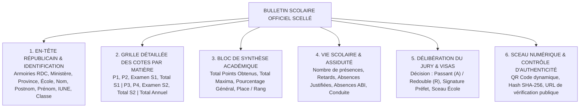
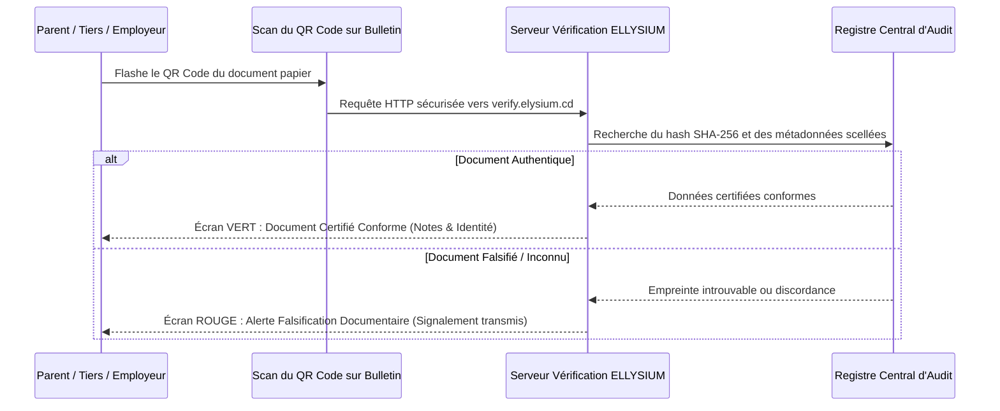

# TOME 5 — ARCHITECTURE FONCTIONNELLE
## 68. Module Génération Automatique des Bulletins et Relevés Scellés

---

> **Positionnement :** Moteur d'édition, scellement cryptographique et délivrance des documents officiels de scolarité  
> **Autorité :** Conforme au Tome 2 (Articles 4, 8, 15 et 16 — Véracité des informations et anti-fraude)  
> **Liaison amont :** Modules 61, 65, 66 et 67 | **Liaison aval :** Module 60 (Dossier Numérique) et Module 76 (Diplômes)

---

## 1. Objet et Portée du Module

Le Module **Génération Automatique des Bulletins et Relevés Scellés** assure la production industrielle, l'authentification numérique et la distribution des documents académiques officiels d'ELLYSIUM.

Dans les établissements scolaires conventionnels, l'établissement des bulletins manuscrits monopolise des semaines entières de travail pour les enseignants, génère des erreurs de transcription récurrentes et favorise l'industrie du faux document scolaire. ELLYSIUM élimine ces dérives par :
- La génération instantanée et sans erreur de l'ensemble des bulletins d'une école en un clic dès la clôture des délibérations.
- La stricte conformité visuelle et réglementaire avec la maquette officielle du **Bulletin Scolaire National de la RDC** édictée par le Ministère de l'Éducation Nationale.
- L'émission des **Relevés de Notes Semestriels LMD** conformes aux normes du Ministère de l'ESU.
- L'inviolabilité absolue garantie par un **hachage SHA-256**, une signature numérique d'établissement et un **QR code dynamique de vérification publique**.

---

## 2. Structure Normée du Bulletin Scolaire Officiel du Secondaire (RDC)

Le bulletin généré par ELLYSIUM reproduit fidèlement la maquette réglementaire imposée par l'Inspection Générale de l'Enseignement :

---

## 3. Spécifications du Tableau Multicolonne des Cotes

Le cœur du bulletin secondaire est constitué d'une matrice à 15 colonnes reprenant l'intégralité du parcours de l'année scolaire :

| Matières Enseignées | Période 1 (TJ1) | Période 2 (TJ2) | Examen S1 | Total Semestre 1 | Période 3 (TJ3) | Période 4 (TJ4) | Examen S2 | Total Semestre 2 | Total Général Annuel |
| :--- | :---: | :---: | :---: | :---: | :---: | :---: | :---: | :---: | :---: |
| *Ex. Mathématiques* | $16 / 20$ | $14 / 20$ | $38 / 60$ | **$68 / 100$** | $15 / 20$ | $17 / 20$ | $44 / 60$ | **$76 / 100$** | **$144 / 200$** |
| *Ex. Physique* | $12 / 20$ | $13 / 20$ | $32 / 60$ | **$57 / 100$** | $11 / 20$ | $14 / 20$ | $35 / 60$ | **$60 / 100$** | **$117 / 200$** |
| *Ex. Français* | $14 / 20$ | $15 / 20$ | $35 / 60$ | **$64 / 100$** | $13 / 20$ | $16 / 20$ | $40 / 60$ | **$69 / 100$** | **$133 / 200$** |
| ... | ... | ... | ... | ... | ... | ... | ... | ... | ... |
| **TOTAL GÉNÉRAL** | **$\sum$ Pts / Max** | **$\sum$ Pts / Max** | **$\sum$ Pts / Max** | **Pts / Max (S1)** | **$\sum$ Pts / Max** | **$\sum$ Pts / Max** | **$\sum$ Pts / Max** | **Pts / Max (S2)** | **TOTAL ANNUEL** |
| **POURCENTAGE** | **$X,XX \%$** | **$X,XX \%$** | **$X,XX \%$** | **$X,XX \%$** | **$X,XX \%$** | **$X,XX \%$** | **$X,XX \%$** | **$X,XX \%$** | **$X,XX \%$** |
| **PLACE / RANG** | *3e / 42* | *4e / 42* | *2e / 42* | **3e / 42** | *2e / 42* | *3e / 42* | *2e / 42* | **2e / 42** | **2e / 42 (Lauréat)**|

---

## 4. Dispositif de Sécurité et Vérification Publique (Anti-Fraude)

Chaque document généré par ce module fait l'objet d'un triple scellement cryptographique :

1. **Format PDF/A pérenne** :
   Génération sous la norme ISO 19005 (PDF/A-1b ou PDF/A-2b), garantissant que le document sera lisible de façon identique sur n'importe quel support pendant des décennies.
2. **Signature électronique qualifiée** :
   Le fichier PDF est signé numériquement au moyen du certificat électronique privé de l'institution ELLYSIUM. Toute altération ultérieure d'un seul pixel ou d'un chiffre invalide instantanément la signature du PDF.
3. **Le QR Code Dynamique de Vérification Publique** :
   - Présent sur chaque page du bulletin ou relevé.
   - En flashant ce QR code avec n'importe quel smartphone, l'employeur, l'inspecteur ministériel ou l'université d'accueil est redirigé vers l'URL officielle sécurisée :
     `https://verify.elysium.cd/doc/CD-EL-DOC-2026-94812`
   - Le portail affiche immédiatement l'état officiel certifié du document issu directement de la base centrale : nom de l'élève, école, pourcentage obtenu, décision du jury et copie conforme consultable en ligne.

---

## 5. Canaux de Délivrance et Modes de Distribution

Le module prend en charge deux modes de mise à disposition :
- **Distribution Numérique Immédiate** :
  Le bulletin scellé est instantanément déposé dans l'espace personnel de l'élève et dans le portail de son parent légal. Une notification push et SMS informe les familles de la disponibilité des résultats.
- **Impression Physique Centralisée (Tirage d'Établissement)** :
  Pour les écoles physiques qui remettent les bulletins lors de la proclamation solennelle de fin d'année, le Préfet des études dispose d'un outil d'exportation en masse permettant de générer en un seul fichier spool l'ensemble des bulletins de l'école prêts à être imprimés sur papier officiel.

---

## 6. Règles de Gestion et Verrous Fonctionnels

- **Règle 68.1 (Génération conditionnée à la signature du PV de délibération)** : Aucun bulletin officiel de fin d'année ne peut être généré tant que le Procès-Verbal de Délibération du Jury n'a pas été formellement clôturé et signé par le Préfet des études dans le Module 67.
- **Règle 68.2 (Interdiction des bulletins provisoires non marqués)** : Tout bulletin généré avant la fin de l'année scolaire porte en filigrane diagonal obligatoire la mention officielle : **« BULLETIN DE PÉRIODE — DOCUMENT PROVISOIRE NON DIPLÔMANT »**.
- **Règle 68.3 (Archivage automatique au coffre-fort IUNE)** : Dès son émission, le bulletin scellé est automatiquement indexé dans le Module 60 (Dossier numérique unifié) de l'apprenant, garantissant sa disponibilité à vie sans risque de perte.
