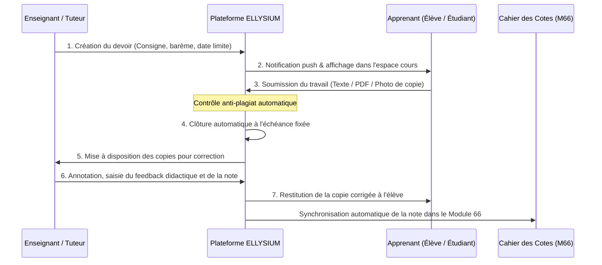
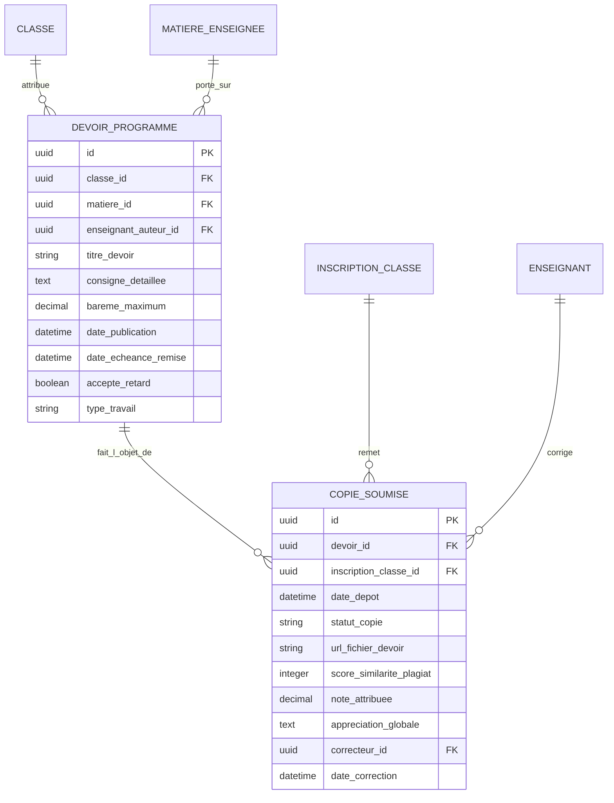

# TOME 5 — ARCHITECTURE FONCTIONNELLE
## 69. Module Devoirs, Travaux Dirigés et Travaux à Rendre

---

> **Positionnement :** Gestion du flux de dépôt, d'évaluation formative et de correction des travaux d'élèves  
> **Autorité :** Conforme au Tome 3 (Parties III et VII) et à la Constitution (Tome 2, Article 5 et 11)  
> **Liaison amont :** Modules 62 et 63 | **Liaison aval :** Modules 66 (Cahier des cotes) et 74 (Tuteur IA)

---

## 1. Objet et Portée du Module

Le Module **Devoirs, Travaux Dirigés et Travaux à Rendre** digitalise l'ensemble du cycle de travail personnel de l'apprenant à ELLYSIUM. Il constitue le pont d'interaction privilégié entre l'enseignement théorique et l'apprentissage actif.

Il résout un défi fondamental propre au contexte congolais et à l'enseignement à distance :
- Permettre aux élèves de soumettre leurs devoirs même lorsqu'ils écrivent à la main sur un cahier papier classique (par téléversement de photographies de copies optimisées et ultra-compressées).
- Fournir aux enseignants un espace d'annotation et de correction fluide, doté de grilles critériées transparentes.
- Organiser la file de correction mutualisée pour les dizaines de milliers d'apprenants indépendants suivis par le corps des tuteurs numériques.
- Lutter contre le plagiat et l'utilisation non déclarée d'outils d'intelligence artificielle pour les travaux rédigés.

---

## 2. Le Cycle de Vie d'un Devoir ou Travail Pratique

Chaque session de travail à rendre traverse un flux méthodique en 7 étapes :

---

## 3. Modalités de Dépôt Adaptées aux Réalités de Terrain

Pour ne laisser aucun apprenant au bord du chemin, le module accepte trois formats de restitution :

### 3.1 Dépôt par Photographie de Copie Manuscrite (Pratique Dominante)
- L'élève rédige son devoir de mathématiques, sa dissertation de français ou son schéma technique sur son cahier physique.
- L'application mobile ELLYSIUM intègre un **scanner de document frugal** :
  - Recadrage automatique et conversion en noir et blanc contrasté haute lisibilité.
  - Compression drastique de l'image (une copie de 3 pages pèse moins de 350 kilo-octets au total).
  - Téléversement sécurisé même sur réseau cellulaire à très faible débit.

### 3.2 Dépôt de Fichier Bureautique ou Code Source (Université LMD)
- Pour les étudiants en Licence d'Informatique, de Gestion ou de Droit :
  - Dépôt d'archives de code source, rapports d'études de cas au format PDF/A ou feuilles de calcul.
  - Vérification automatique de l'intégrité du fichier et calcul de l'empreinte SHA-256.

### 3.3 Dépôt Textuel Direct (Éditeur en Ligne)
- Saisie directe de courts paragraphes, de réponses argumentées ou d'analyses de documents dans l'éditeur de texte intégré à la plateforme, avec sauvegarde automatique locale toutes les 30 secondes pour prévenir les pertes de connexion.

---

## 4. Spécifications du Poste de Correction Enseignant

L'interface de correction met à la disposition du professeur et du tuteur les outils didactiques suivants :
1. **Grille d'Évaluation Critériée Décomposée** :
   Le correcteur ne note pas « à l'impression globale ». Il coche des niveaux d'acquisition sur des critères prédéfinis (ex. en dissertation : *Compréhension du sujet (4 pts), Rigueur du plan (4 pts), Force de l'argumentation (8 pts), Qualité de l'expression française (4 pts)*).
2. **Obligation de Feedback Didactique (Article 11)** :
   Le système interdit la soumission d'une correction comportant une note inférieure à la moyenne sans qu'au moins une appréciation explicative constructive de remédiation n'ait été renseignée par l'enseignant.
3. **Annotations Directes sur Copie** :
   Possibilité de poser des marqueurs visuels, des corrections orthographiques ou des commentaires vocaux courts (audio compressé) directement sur la copie numérisée de l'élève.

---

## 5. Détection du Plagiat et de la Fraude Académique

Conformément à l'Article 9 de la Constitution (Devoirs de l'apprenant) :
- **Analyse de similarité textuelle** : Chaque devoir rédigé déposé est comparé à la base de données des devoirs déposés par l'ensemble des promotions antérieures et au corpus web.
- **Détection des signatures de modèles génératifs** : Un algorithme statistique signale les fragments présentant une forte probabilité de génération automatique artificielle non citée.
- **Procédure en cas de plagiat avéré** :
  - Taux de similarité suspect $> 30\%$ : La copie est marquée `SUSPICION_PLAGIAT` et transmise au professeur titulaire avec le rapport de concordance.
  - Si le plagiat est confirmé par l'enseignant : La note `0` est attribuée d'office avec mention disciplinaire au dossier scolaire.

---

## 6. Modèle Conceptuel de Données (Entités du Module)

---

## 7. Règles de Gestion et Verrous Fonctionnels

- **Règle 69.1 (Verrouillage à l'échéance)** : Dès que l'heure limite de remise est dépassée, le bouton de dépôt est bloqué. Si l'enseignant a coché l'option *« Tolérance de retard »*, la copie est marquée `REMISE_TARDIVE` et subit la pénalité de points programmée (ex. -1 point par tranche de 24h de retard).
- **Règle 69.2 (Délai maximal de correction)** : Les tuteurs et enseignants disposent d'un délai contractuel de **cinq (5) jours ouvrés** pour corriger les copies. Les copies non corrigées au-delà de ce délai sont automatiquement remontées sur le tableau de bord du Préfet des études.
- **Règle 69.3 (Versement automatique au Cahier des Cotes)** : Dès que l'enseignant valide son paquet de corrections, les notes validées sont injectées directement dans le Module 66 (Cahier des cotes) sans ressaisie manuelle.

---

## 7. Verrous Fonctionnels Critiques

| Réf. Verrou | Description Fonctionnelle et Technique | Conséquence en Cas de Violation |
| :--- | :--- | :--- |
| **`VF-069-01`** | **Respect des droits de la défense** | Aucune sanction disciplinaire n'est inscrite sans convocation et audition préalable de l'apprenant. |
| **`VF-069-02`** | **Échelle des peines conforme au règlement intérieur** | Le système interdit l'application d'une sanction non prévue dans le barème officiel de l'école. |
| **`VF-069-03`** | **Notification obligatoire sous 24h aux tuteurs légaux** | Tout blâme ou exclusion temporaire génère une notification certifiée au parent. |
| **`VF-069-04`** | **Effacement des sanctions légères après délai** | Les avertissements de conduite sont amnistiés à l'issue de l'année scolaire si assiduité parfaite. |
| **`VF-069-05`** | **Interdiction des châtiments corporels et vexatoires** | Rejet et signalement administratif de toute mention violant l'intégrité physique de l'élève. |
| **`VF-069-06`** | **Toute donnée d'apprenant peut être exportée sur demande conformément à l'Article 8 de la Constitution** | **Conséquence : violation = inéligibilité du module pour mise en production** |

---

*Sous-tome rédigé conformément aux Normes documentaires ELLYSIUM — Fondations 04.*
