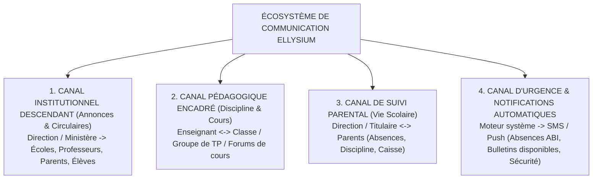
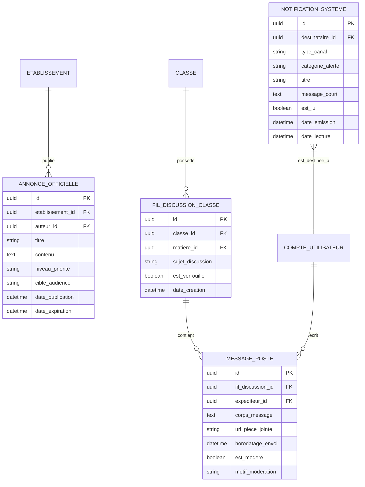

# TOME 5 — ARCHITECTURE FONCTIONNELLE
## 70. Module Communication Interne, Messagerie et Notifications

---

> **Positionnement :** Canal de liaison, d'information officielle et de notification multicanale  
> **Autorité :** Conforme au Tome 2 (Articles 7, 8, 10 et 15 — Confidentialité et intégrité)  
> **Liaison amont :** Modules 57 et 62 | **Liaison aval :** Modules 65 (Alertes présence), 68 (Bulletins) et 71 (Relances)

---

## 1. Objet et Portée du Module

Le Module **Communication Interne, Messagerie et Notifications** constitue le réseau nerveux relationnel d'ELLYSIUM. Il remplace les circuits d'information informels, dispersés ou non sécurisés (groupes de messagerie grand public non contrôlés, affichages papier perdus) par un écosystème de communication institutionnel, hermétique et vérifiable.

Il assure :
- La publication des **Annonces et Communiqués Officiels** de la Direction et des Préfets.
- La **Messagerie Pédagogique Encadrée** entre élèves, étudiants, enseignants et tuteurs.
- Le canal de **Liaison École - Parents d'Élèves** pour le suivi de la scolarité des mineurs.
- Le moteur de **Notifications Multicanales** (Notifications Push in-app, alertes SMS prioritaires pour les urgences et e-mails de synthèse).
- La protection rigoureuse des mineurs contre toute forme de harcèlement, d'intrusion ou d'échange inapproprié.

---

## 2. Typologie des Canaux de Communication

Le système cloisonne strictement les flux d'échanges selon quatre canaux fonctionnels distincts :

---

## 3. Spécifications Fonctionnelles des Canaux

### 3.1 Canal Institutionnel (Annonces & Panneau d'Affichage Numérique)
- **Publication d'annonces officielles** par le Chef d'établissement ou le Préfet des études.
- Ciblage précis de l'audience :
  - *Diffusion globale école* (ex. communiqué de rentrée, fermeture exceptionnelle pour intempéries).
  - *Diffusion ciblée par niveau ou option* (ex. calendrier des examens d'État pour les classes de 4e des humanités).
  - *Diffusion réservée au corps professoral* (ex. convocation au conseil des professeurs ou délibérations).
- **Accusé de réception électronique traçable** : Pour les notes de service critiques, le système enregistre l'ouverture et la lecture effective par le destinataire.

### 3.2 Messagerie Pédagogique Encadrée (Enseignants - Apprenants)
- **Principe de transparence éducative** : La messagerie interne d'ELLYSIUM n'est pas un réseau social privé. Tous les échanges sont rattachés à un contexte didactique (une classe, une leçon, un devoir ou un cours).
- **Interdiction formelle de messagerie privée non surveillée entre adulte et élève mineur** :
  - Tout message adressé par un enseignant à un élève individuel mineur est automatiquement visible par le parent légal et le Préfet de discipline.
  - Les interactions élèves-professeurs sont prioritairement orientées vers les **Forums Pédagogiques de Classe** où les questions/réponses profitent à l'ensemble du groupe.

### 3.3 Moteur de Notification Multicanale (Push & SMS)
Dans un environnement comme la RDC où la connexion internet mobile n'est pas activée en permanence par les familles pour économiser les forfaits data :
- **Notification Push (In-App)** : Utilisée pour les informations quotidiennes régulières (devoir publié, cours mis à jour, message sur forum). Consommée dès que l'application est en ligne.
- **SMS Transactionnel Direct** : Réservé aux **événements critiques à haute priorité** :
  - Absence injustifiée (`ABI`) constatée le matin même à l'appel de 08h00.
  - Incident disciplinaire grave ou convocation urgente des parents.
  - Disponibilité officielle du bulletin scellé de fin de période.
  - Code OTP de sécurité pour réinitialisation de mot de passe.

---

## 4. Modération, Protection des Mineurs et Lutte contre le Cyberharcèlement

Conformément à l'Article 8 de la Constitution (Environnement exempt de harcèlement) :
- **Filtre sémantique automatique** : Tout message contenant des propos insultants, violents, à caractère haineux ou pornographique est bloqué avant distribution, avec signalement immédiat à la direction.
- **Bouton de signalement d'abus en 1 clic** : Présent sur chaque fil de discussion, permettant à un apprenant de signaler un comportement suspect ou intimidant.
- **Journalisation intégrale des correspondances** : Aucun message ne peut être définitivement supprimé de la base de données. En cas d'enquête pour harcèlement scolaire, l'historique complet et inaltérable des échanges peut être produit sur réquisition légale.

---

## 5. Modèle Conceptuel de Données (Entités du Module)

---

## 6. Règles de Gestion et Verrous Fonctionnels

- **Règle 70.1 (Heures de silence et droit à la déconnexion)** : Sauf alerte sécuritaire d'extrême urgence, le système bloque la diffusion de notifications push et SMS vers les apprenants et enseignants entre 21h00 et 06h30 le matin.
- **Règle 70.2 (Signature institutionnelle des annonces)** : Toute annonce générale diffusée à l'échelle de l'école doit porter le visa électronique du Chef d'établissement ou du Préfet des études.
- **Règle 70.3 (Archivage probant des SMS d'alerte)** : Chaque envoi de SMS d'absence parentale conserve l'accusé de réception délivré par la passerelle de télécommunication (M-Pesa/Vodacom, Orange, Airtel) pour servir de preuve légale de l'information transmise à la famille.

---

## 7. Verrous Fonctionnels Critiques

| Réf. Verrou | Description Fonctionnelle et Technique | Conséquence en Cas de Violation |
| :--- | :--- | :--- |
| **`VF-070-01`** | **Détection mathématique des conflits de salle** | Impossibilité physique d'affecter deux cours simultanément dans le même local. |
| **`VF-070-02`** | **Respect du volume horaire légal des enseignants** | Alerte bloquante en cas de dépassement du maximum légal d'heures hebdomadaires. |
| **`VF-070-03`** | **Optimisation des temps de trajet inter-sites** | Prise en compte des temps de transition pour les campus multi-sites à Kinshasa. |
| **`VF-070-04`** | **Publication transparente aux familles** | Tout changement d'emploi du temps est notifié au moins 24h à l'avance. |
| **`VF-070-05`** | **Historisation des remplacements** | Les absences de professeurs et affectations de remplaçants sont consignées dans le registre. |

---

*Sous-tome rédigé conformément aux Normes documentaires ELLYSIUM — Fondations 04.*
