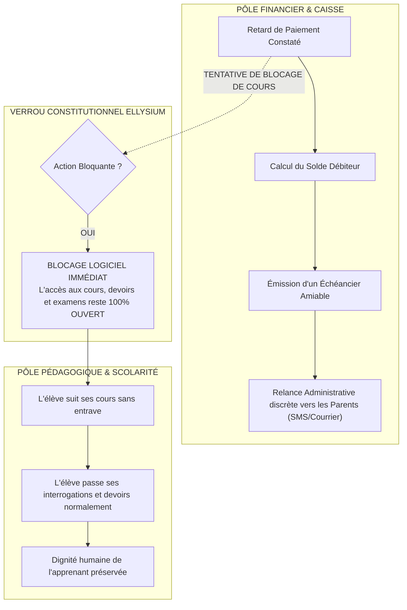
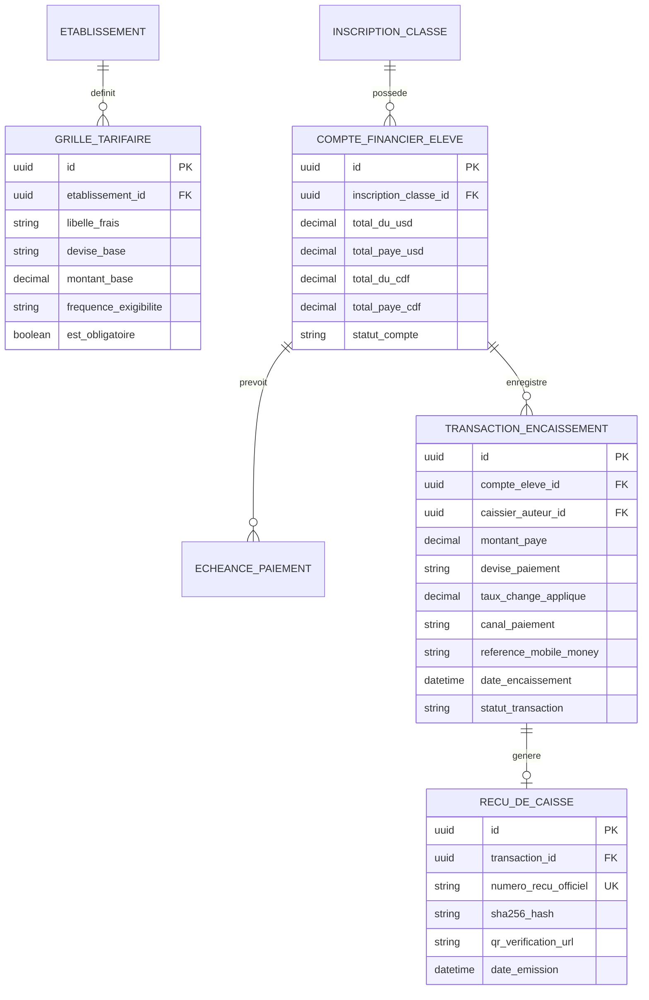

# TOME 5 — ARCHITECTURE FONCTIONNELLE
## 71. Module Caisse et Gestion Financière d'Établissement

---

> **Positionnement :** Gestion de la facturation, des encaissements, des échéanciers et du Mobile Money  
> **Autorité :** Conforme à la Constitution (Tome 2, Articles 1, 3 et 15 — Gratuité du savoir et intégrité financière)  
> **Liaison amont :** Modules 58, 59 et 61 | **Liaison aval :** Module 77 (Statistiques) et Module 78 (Passerelles bancaires)

---

## 1. Objet et Portée du Module

Le Module **Caisse et Gestion Financière d'Établissement** dote les écoles et instituts partenaires d'un système de gestion de trésorerie transparent, sécurisé et totalement vérifiable.

Dans la pratique scolaire en République Démocratique du Congo, la gestion financière manuelle est confrontée à des vulnérabilités critiques : manipulations d'espèces risquées, fraudes sur les reçus, litiges incessants avec les parents d'élèves, détournements de fonds et désorganisation des salaires des enseignants.

Ce module apporte une réponse technique irréprochable :
- La configuration claire et transparente de la grille des frais scolaires approuvée par l'Assemblée Générale des Parents d'Élèves.
- La prise en compte native du **double régime monétaire congolais (USD et CDF)** avec application du taux officiel de référence.
- L'intégration des paiements dématérialisés directs via **Mobile Money (M-Pesa, Orange Money, Airtel Money)**.
- L'émission instantanée de **Reçus de Caisse Électroniques Infalsifiables** munis d'un QR code de vérification.
- Le suivi rigoureux des échéanciers et plans de paiements échelonnés pour soutenir les familles modestes.
- **L'application stricte de l'invariant constitutionnel d'étanchéité pédagogique** : interdiction absolue de suspendre les cours ou devoirs d'un élève pour motif de retard de paiement.

---

## 2. Le Principe Sacré d'Étanchéité Pédagogique (Articles 1 et 3)

Le système informatique verrouille formellement toute tentative de punition numérique ou d'exclusion pédagogique pour cause financière :

*Note administrative :* L'établissement conserve le droit légal de retenir la délivrance matérielle du bulletin papier original de fin d'année lors de la proclamation ou de refuser la réinscription pour l'année scolaire suivante en cas de contentieux non soldé, mais le parcours éducatif de l'année en cours n'est jamais interrompu.

---

## 3. Paramétrage des Frais et Double Régime Monétaire (USD / CDF)

### 3.1 Typologie des Frais Scolaires
Pour chaque année scolaire et chaque niveau/option :
1. **Frais d'Études / Minerval Réglementaire** : Ventilés par trimestre ou mensualité.
2. **Frais Administratifs et d'Inscription** : Dossier d'entrée, badge d'élève, carte scolaire.
3. **Frais d'Épreuves et d'Examens d'État** : Frais de participation au TENASOSP (8e année) ou aux épreuves hors-session et session ordinaire de l'EXETAT (4e humanités), reversés aux comptes officiels du Ministère.
4. **Frais Connexes Facultatifs** : Internat, cantine scolaire, transport par bus de ramassage, fournitures spécifiques d'atelier technique.

### 3.2 Gestion Multi-Devises
- Le système gère simultanément les comptes en **Dollars Américains (USD)** et en **Francs Congolais (CDF)**.
- Le Chef d'établissement paramètre le taux de change officiel retenu par le comité de gestion scolaire.
- Tout reçu indique obligatoirement le montant perçu dans la monnaie de paiement, son équivalent dans l'autre monnaie au taux du jour, et le solde restant dû.

---

## 4. Canaux d'Encaissement et Automatisation Mobile Money

Le module gère trois modalités de versement :

### 4.1 Encaissement Direct par Mobile Money (Canal Recommandé)
- Le parent ou l'élève compose une syntaxe USSD ou déclenche un paiement Push depuis son téléphone vers le numéro marchand agréé de l'école (M-Pesa, Orange Money, Airtel Money).
- Dès que l'opérateur valide la transaction, un webhook sécurisé notifie instantanément le serveur ELLYSIUM.
- Le compte de l'élève est crédité en temps réel (zéro intervention humaine, zéro risque de détournement de caisse).
- Un SMS de confirmation avec le numéro de reçu officiel est immédiatement expédié au parent.

### 4.2 Encaissement au Guichet de la Caisse Physique de l'École
- Pour les parents réglant en espèces au bureau de l'intendance :
  - Le caissier sélectionne l'élève par son nom ou son matricule.
  - Il saisit le montant remis en liquide (USD ou CDF) et coche la rubrique concernée.
  - L'imprimante thermique de caisse édite instantanément un **Reçu Officiel Numéroté** avec QR code sécurisé.
  - La transaction est enregistrée dans le journal de caisse journalier inaltérable.

### 4.3 Versement Bancaire sur Bordereau
- Dépôt direct sur le compte bancaire de l'école (ex. Rawbank, EquityBCDC, TMB).
- Le parent téléverse la photo du bordereau de versement sur l'application mobile.
- Le caissier ou comptable valide la conformité du bordereau après rapprochement bancaire, ce qui valide l'encaissement.

---

## 5. Gestion des Échéanciers, Bourses et Solidarité

Conformément à la mission d'inclusion sociale du projet :
- **Plans de paiement échelonnés (Échéanciers)** : Possibilité pour la direction d'accorder un moratoire ou un paiement échelonné en 4 ou 6 fractions aux parents traversant une difficulté temporaire.
- **Réductions de fratrie automatiques** : Paramétrage de remises dégressives pour les familles nombreuses scolarisant plusieurs enfants dans le même établissement (ex. -10 % sur le 2e enfant, -25 % à partir du 3e enfant).
- **Bourses d'excellence et cas sociaux** : Prise en charge intégrale ou partielle d'élèves brillants ou orphelins sur fonds de solidarité de l'école ou parrainage d'ONG, avec enregistrement formel de la convention d'exonération.

---

## 6. Modèle Conceptuel de Données (Entités du Module)

---

## 7. Règles de Gestion et Contrôle Interne

- **Règle 71.1 (Clôture et Arrêté Journalier de Caisse)** : Chaque jour à 16h00, le caissier procède à l'arrêté de caisse informatique. Le système calcule le solde théorique en espèces et exige la saisie du comptage physique. Tout écart de caisse est consigné dans un rapport d'écart transmis automatiquement au Chef d'établissement.
- **Règle 71.2 (Immutabilité des Reçus)** : Un reçu de caisse validé ne peut être ni modifié ni supprimé. Si une erreur de saisie est constatée, elle doit obligatoirement faire l'objet d'une opération d'annulation avec émission d'un reçu d'avoir motivé, contresigné par le promoteur.
- **Règle 71.3 (Gratuité absolue du Campus Indépendant)** : Tout module de paiement est totalement désactivé pour les comptes relevant de la catégorie *Apprenant Indépendant*, matérialisant dans l'architecture le principe constitutionnel de gratuité intégrale de l'accompagnement éducatif individuel.

---

## 7. Verrous Fonctionnels Critiques

| Réf. Verrou | Description Fonctionnelle et Technique | Conséquence en Cas de Violation |
| :--- | :--- | :--- |
| **`VF-071-01`** | **Séparation absolue caisse / scolarité (Art. 5)** | Le module financier ne peut en aucun cas bloquer les droits pédagogiques d'un élève. |
| **`VF-071-02`** | **Reçu numéroté immédiat pour tout paiement** | Tout encaissement émet un reçu électronique infalsifiable avec référence unique. |
| **`VF-071-03`** | **Clôture de caisse quotidienne obligatoire** | Le caissier ne peut ouvrir une session sans validation contradictoire du solde précédent. |
| **`VF-071-04`** | **Interdiction d'annulation sans visa de la direction** | Toute annulation d'écriture financière requiert l'approbation conjointe du gestionnaire et du préfet. |
| **`VF-071-05`** | **Audit comptable continu** | Le grand livre des écritures est exportable selon le plan comptable OHADA en vigueur en RDC. |

---

*Sous-tome rédigé conformément aux Normes documentaires ELLYSIUM — Fondations 04.*
