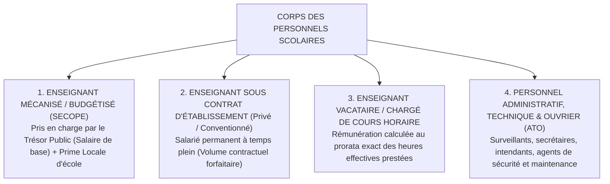
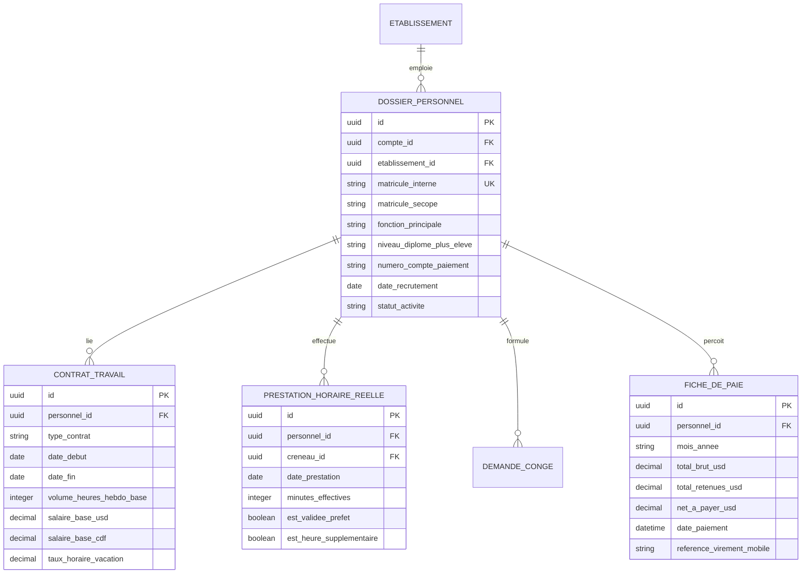

# TOME 5 — ARCHITECTURE FONCTIONNELLE
## 72. Module Ressources Humaines Internes à l'Établissement

---

> **Positionnement :** Gestion administrative, suivi des prestations et paie du corps professoral et administratif  
> **Autorité :** Conforme au Tome 2 (Articles 10 et 11 — Engagements, droits et devoirs des enseignants)  
> **Liaison amont :** Modules 61 et 64 | **Liaison aval :** Module 71 (Finances) et Module 77 (Tableaux de bord)

---

## 1. Objet et Portée du Module

Le Module **Ressources Humaines Internes à l'Établissement** rationalise la gestion du personnel au sein des écoles et universités partenaires d'ELLYSIUM.

Dans les structures scolaires traditionnelles en RDC, la gestion des enseignants est fréquemment gangrenée par l'opacité : suivi approximatif des heures réellement prestées, absentéisme enseignant non mesuré, retards de paiement des primes locales et difficultés de conciliation avec les listings du SECOPE (Service de Contrôle et de la Paie des Enseignants).

Ce module garantit :
- La tenue rigoureuse du dossier administratif de chaque membre du personnel (enseignants, directeurs, surveillants, comptables, personnel d'entretien).
- Le décompte automatisé des heures de cours effectivement dispensées à partir des fiches d'appel validées dans le Module 65.
- La gestion transparente des congés, permissions et suppléances pédagogiques.
- La pré-liquidation de la paie et des primes locales de scolarité, avec édition de fiches de paie claires.
- Le suivi des évaluations professionnelles et de l'avancement hiérarchique.

---

## 2. Typologie des Statuts Contractuels et Régimes de Prestation

Le module modélise les différents statuts de travail en vigueur dans les établissements congolais :

---

## 3. Spécifications du Décompte des Prestations et Assiduité

### 3.1 Décompte Automatique des Heures Prestées
Pour éliminer les litiges sur le volume horaire :
- Chaque fois qu'un enseignant effectue l'appel de présence de sa classe dans le Module 65 et valide son cours, le système enregistre automatiquement une **Prestation Pédagogique Validée** correspondant à la durée du créneau (ex. 1 période = 50 min ; 2 périodes = 1h40).
- À la fin du mois, le module agrège le total des heures normales et des heures supplémentaires effectivement dispensées.

### 3.2 Gestion des Absences et Remplacements
- **Signalement d'indisponibilité** : L'enseignant dépose sa demande de congé ou déclare son absence (certificat médical, mission officielle) directement depuis son application mobile.
- **Circuit d'approbation** : La demande est transmise au Chef d'établissement pour décision.
- Dès validation de l'absence, le système déclenche une proposition de réaffectation des cours vers les enseignants remplaçants disponibles répertoriés dans le Module 64 (Emploi du temps).

---

## 4. Préparation de la Paie et des Primes d'Établissement

En coordination avec le Module Caisse (Module 71) :
1. **Calcul de la Rémunération Mensuelle** :
   $$\text{Net à Payer} = \text{Salaire de Base Contractuel} + \text{Primes d'Assiduité} + (\text{Heures Supp.} \times \text{Taux Horaire}) - \text{Acomptes Déjà Perçus} - \text{Retenues Fiscales/Sociales}$$
2. **Gestion des Acomptes sur Salaire** :
   Possibilité d'enregistrer des avances sur salaire autorisées par la direction, immédiatement déduites du bulletin de paie du mois concerné.
3. **Édition des Bulletins de Paie Sécurisés** :
   Génération automatique d'un bulletin de paie individuel électronique, archivé dans le dossier professionnel de l'agent (Module 60) et consultable sur son espace privé.

---

## 5. Dossier Professionnel et Évaluation Pédagogique

Conformément au Tome 2 (Article 11 — Droits et devoirs des enseignants) :
- **Fiche d'identification SECOPE / CNSS** : Numéro matricule d'État, numéro de compte bancaire ou compte Mobile Money pour versement du salaire.
- **Cotation annuelle du personnel** : Enregistrement de la note de mérite annuel attribuée par le Chef d'établissement lors des inspections de classe (Élite, Très Bon, Bon, Médiocre).
- **Registre des sanctions disciplinaires** : Enregistrement contradictoire des rappels à l'ordre, avertissements écrits ou suspensions temporaires décidés par la commission de discipline.

---

## 6. Modèle Conceptuel de Données (Entités du Module)

---

## 7. Règles de Gestion et Verrous Fonctionnels

- **Règle 72.1 (Interdiction de décompte horaire non adossé à un cours)** : Une heure supplémentaire d'enseignement ne peut être validée pour le paiement que si le créneau correspondant dispose d'une feuille d'appel de présence élève formellement scellée dans le Module 65.
- **Règle 72.2 (Confidentialité absolue des salaires)** : Les fiches de paie et données de rémunération sont classées **Niveau 3 (Données confidentielles)**. Seuls le Chef d'établissement, le Responsable RH et le titulaire du compte y ont accès.
- **Règle 72.3 (Historisation des affectations)** : Aucune suppression d'affectation passée n'est autorisée. L'historique des matières et classes prises en charge par un enseignant demeure conservé indéfiniment dans son dossier numérique (Module 60).

---

## 7. Verrous Fonctionnels Critiques

| Réf. Verrou | Description Fonctionnelle et Technique | Conséquence en Cas de Violation |
| :--- | :--- | :--- |
| **`VF-072-01`** | **Accès exclusif aux données de ses propres classes** | L'enseignant ne peut consulter les dossiers d'élèves ne faisant pas partie de ses cohortes. |
| **`VF-072-02`** | **Messagerie pédagogique sécurisée** | Les échanges entre enseignants et élèves sont tracés et exempts de tout canal privé non modéré. |
| **`VF-072-03`** | **Suivi en direct de la soumission des travaux** | Tableau de bord indiquant en temps réel les devoirs rendus, en attente et corrigés. |
| **`VF-072-04`** | **Outils d'émargement des séances de cours** | Validation de la tenue de cours avec résumé pédagogique de séance sous 2h. |
| **`VF-072-05`** | **Protection des données personnelles de l'enseignant** | Le numéro de téléphone personnel de l'enseignant n'est jamais divulgué aux apprenants. |

---

*Sous-tome rédigé conformément aux Normes documentaires ELLYSIUM — Fondations 04.*
