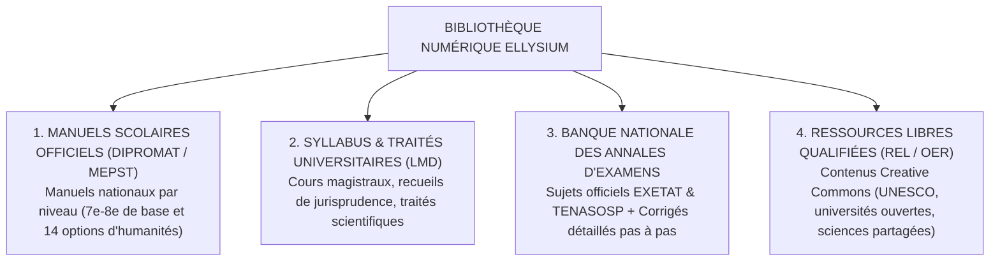
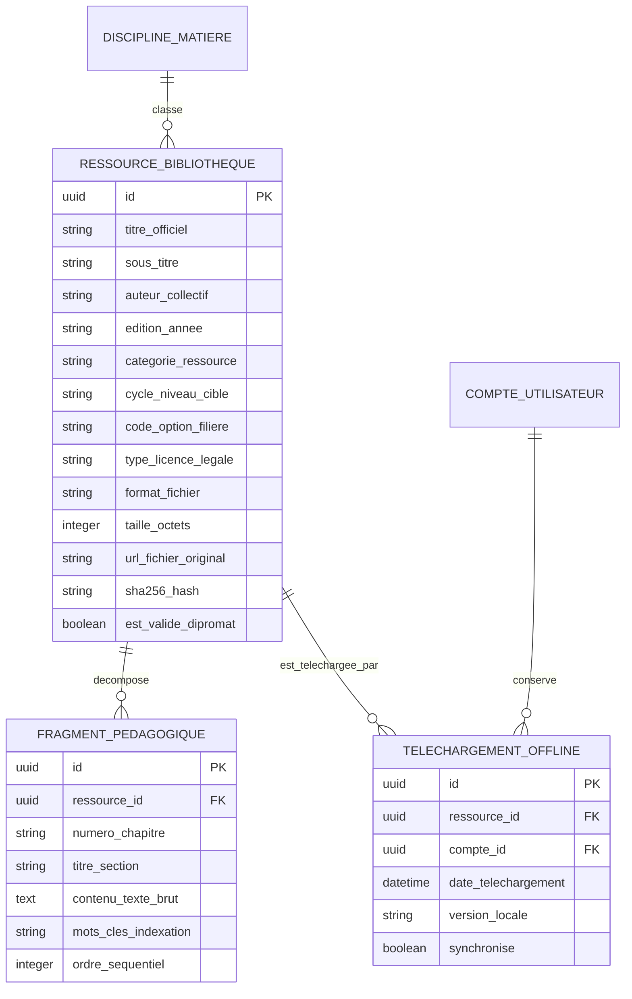

# TOME 5 — ARCHITECTURE FONCTIONNELLE
## 73. Module Bibliothèque Numérique et Ressources Éducatives Libres (OER)

---

> **Positionnement :** Réservoir central de connaissances, manuels officiels, annales et supports multimédias légers  
> **Autorité :** Conforme au Tome 3 (Chapitres 9 et 10) et à la Constitution (Tome 2, Articles 1, 3 et 12)  
> **Liaison amont :** Tome 4 (Programmes) | **Liaison aval :** Module 69 (Devoirs), Module 74 (Tuteur IA / RAG) et Module 75 (Examens)

---

## 1. Objet et Portée du Module

Le Module **Bibliothèque Numérique et Ressources Éducatives Libres (OER)** constitue le trésor pédagogique commun d'ELLYSIUM. Il matérialise le principe de gratuité universelle de l'accès au savoir pour l'ensemble des apprenants et enseignants de la communauté francophone.

Dans un contexte où les manuels scolaires physiques sont coûteux, rares ou obsolètes dans de nombreuses provinces de la RDC, ce module met à la disposition immédiate de chaque utilisateur :
- L'intégralité des manuels scolaires officiels et guides pédagogiques agréés par la DIPROMAT (Ministère de l'Éducation Nationale).
- Les syllabus universitaires de référence pour les 12 facultés d'ELLYSIUM.
- Le grand répertoire national des **Annales d'Examens d'État (EXETAT)** et du **TENASOSP** des 15 dernières années avec corrigés didactiques complets.
- Des milliers de Ressources Éducatives Libres (REL / OER) qualifiées, indexées et adaptées aux réalités africaines.
- Un mécanisme de mise en cache et de lecture hors-ligne intégrale sur smartphone.

---

## 2. Typologie et Classification des Ressources

L'ensemble des œuvres répertoriées est classé selon quatre catégories d'accès :

---

## 3. Spécifications du Moteur de Recherche et Indexation Didactique

Pour permettre à un élève de 8e année ou à un étudiant de L2 de trouver sa ressource en moins de 3 secondes :
1. **Recherche Multicritère Granulaire** :
   - Par *Cycle* (Éducation de base, Humanités secondaires, Licence LMD, Master).
   - Par *Niveau & Année* (ex. 8e année, 3e Scientifique, Licence 1).
   - Par *Discipline & Matière* (ex. Mathématiques - Analyse, Physique - Optique, Informatique - BDD).
   - Par *Type de Document* (Manuel complet, Fiche de révision, Annales d'examen, Enregistrement audio explicatif, Schéma vectoriel).
2. **Indexation Sémantique pour le RAG de l'IA (Module 74)** :
   Chaque ressource validée est découpée en fragments conceptuels étiquetés (chapitres, sections, leçons) et vectorisée dans l'index de connaissances sécurisé, servant de source d'autorité exclusive au Tuteur IA.

---

## 4. Expérience de Lecture et Frugalité Hors-Ligne (Offline-First)

Conformément à la réalité des télécommunications congolaises :
- **Formats ouverts et légers privilégiés** :
  - Priorité absolue aux formats textuels ultra-légers (Markdown balisé, HTML5 hors-ligne, EPUB 3 et PDF/A optimisé).
  - Poids moyen d'une leçon texte avec schémas vectoriels SVG : **inférieur à 250 kilo-octets**.
- **Mode Téléchargement en 1 Clic (Bibliothèque Hors-Ligne)** :
  - L'élève peut cliquer sur le bouton *« Télécharger le manuel pour l'année »*.
  - L'application mobile rapatrie l'ensemble du corpus sur la carte mémoire ou le stockage local du téléphone.
  - L'apprenant accède ensuite à ses cours, les annote et les surligne en forêt ou en village sans exiger un seul kilo-octet de données internet.
- **Lecteur Intégré Ergonomique** :
  - Mode sombre (économie d'écran OLED et confort visuel nocturne en l'absence d'électricité).
  - Réglage de la taille de police pour les écrans modestes de 5 pouces.
  - Synchronisation des marque-pages et notes de marge personnelles dès la reconnexion.

---

## 5. Gouvernance des Droits d'Auteur et Propriété Intellectuelle (Article 12)

- **Respect rigoureux du droit d'auteur** : Aucune œuvre protégée par un copyright commercial exclusif ne peut être injectée sans licence d'exploitation dûment signée avec les ayants droit ou les éditeurs scolaires.
- **Politique OER (Creative Commons)** : Les cours créés par le corps enseignant d'ELLYSIUM sont publiés sous licence **Creative Commons Attribution - Pas d'Utilisation Commerciale - Partage dans les Mêmes Conditions (CC-BY-NC-SA 4.0)**, garantissant la libre diffusion non marchande de la connaissance.

---

## 6. Modèle Conceptuel de Données (Entités du Module)

---

## 7. Règles de Gestion et Verrous Fonctionnels

- **Règle 73.1 (Contrôle d'homologation des manuels du secondaire)** : Aucun manuel scolaire de tronc commun ou des humanités ne peut être marqué comme *« Manuel Officiel Référentiel »* sans visa formel de conformité émis par le Comité Pédagogique après vérification de l'agrément ministériel congolais.
- **Règle 73.2 (Gratuité perpétuelle de consultation)** : Le téléchargement et la lecture de l'ensemble des ressources de la bibliothèque numérique sont gratuits et illimités pour tous les utilisateurs authentifiés (élèves affiliés, apprenants indépendants, enseignants, parents).
- **Règle 73.3 (Intégrité du document par empreinte SHA-256)** : Tout fichier téléchargé en local sur l'application mobile est vérifié par comparaison de son empreinte cryptographique SHA-256 avec la valeur officielle stockée sur le registre central, empêchant l'exécution de fichiers corrompus ou modifiés.
