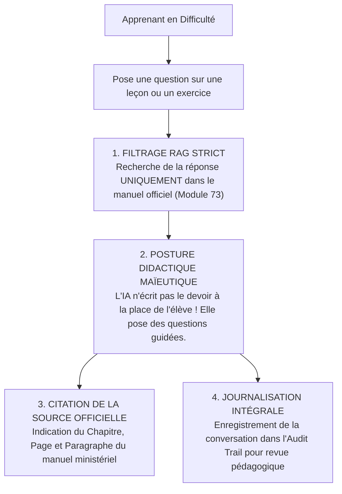
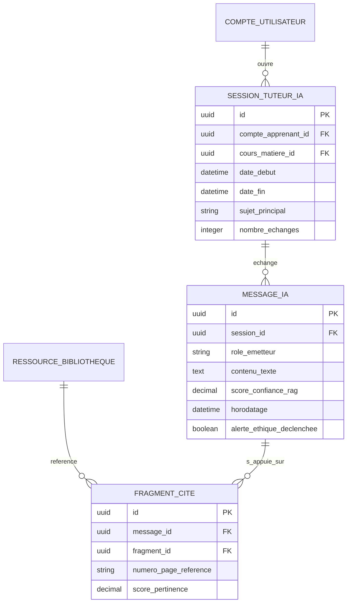

# TOME 5 — ARCHITECTURE FONCTIONNELLE
## 74. Module Tuteur IA (Interfaces Fonctionnelles et Verrous Éthiques)

---

> **Positionnement :** Spécifications fonctionnelles de l'assistant pédagogique intelligent  
> **Autorité :** Conforme au Tome 1 (Section 5) et à la Constitution (Tome 2, Article 6 — Place et rôle de l'IA)  
> **Liaison amont :** Module 73 (Bibliothèque/OER) | **Liaison aval :** Tome 8 (Spécifications techniques de l'IA)

---

## 1. Objet et Portée du Module

Le Module **Tuteur IA** définit l'interface utilisateur, les capacités d'assistance didactique, le comportement conversationnel et les verrous éthiques et constitutionnels de l'intelligence artificielle intégrée à la plateforme ELLYSIUM.

Ce module ne traite pas des algorithmes de bas niveau (qui relèvent du Tome 8), mais de **l'expérience d'interaction fonctionnelle** vécue par l'apprenant et l'enseignant.

Il a pour mission :
- D'accompagner l'apprenant dans sa compréhension des notions difficiles (explication alternative, reformulation, décorticage de concepts mathématiques ou grammaticaux).
- De proposer des exercices d'entraînement adaptés au niveau immédiat de l'élève (génération de variantes d'exercices à partir du corpus validé).
- D'aider l'enseignant dans la formulation de quiz et la structuration de supports pédagogiques.
- **D'appliquer de manière infaillible le principe constitutionnel de non-substitution (Article 6)** : l'IA est un tuteur bienveillant et un répétiteur infatigable, jamais un juge académique ni une autorité administrative.

---

## 2. Le Comportement Didactique Normé du Tuteur IA

Le Tuteur IA d'ELLYSIUM est configuré selon une personnalité didactique rigoureusement cadrée :

---

## 3. Ce que le Tuteur IA est Fonctionnellement Habilité à Faire

1. **Explication Conceptuelle Pas-à-Pas** :
   - Expliquer un théorème, une règle d'accord grammatical ou une notion d'anatomie humaine en adaptant son vocabulaire à l'âge de l'élève (ex. explication imagée pour un élève de 7e de base, explication formelle et rigoureuse pour un étudiant de Licence 3).
2. **Méthode Socratique / Maïeutique Pédagogique** :
   - Lorsque l'élève demande : *« Donne-moi la solution de mon devoir de mathématiques n° 2 »*, le système a pour consigne formelle de **refuser de donner la réponse brute**.
   - Le tuteur répond : *« Je suis là pour t'aider à réussir par toi-même. Regardons ensemble : quelle est la formule générale de dérivation d'un produit $u \cdot v$ vue dans ton cours au Chapitre 3 ? »*.
3. **Génération de Variantes d'Exercices Formateurs** :
   - Créer à la demande de l'élève des exercices d'application similaires à ceux où il a échoué lors d'une interrogation, avec correction commentée instantanée.
4. **Assistance à la Lecture et Définitions de Vocabulaire** :
   - Surlignage d'un mot difficile dans le manuel pour obtenir en 1 seconde sa définition contextuelle et son étymologie.

---

## 4. Ce que le Tuteur IA a l'Interdiction Fonctionnelle Formelle de Faire

Conformément à la Constitution (Tome 2, Article 6) :
- **Interdiction 1 — Décision de note sommative** : L'IA ne peut jamais attribuer de note définitive à une épreuve officielle comptant pour le bulletin ou le diplôme.
- **Interdiction 2 — Décision d'orientation ou de passage** : L'IA ne peut jamais décider si un élève doit redoubler, être admis ou changer de section.
- **Interdiction 3 — Dérive idéologique, politique ou religieuse** : En cas de sollicitation sur des débats politiques, confessionnels ou doctrinaux, l'IA a pour consigne stricte de rappeler le principe de neutralité de l'Article 12 et d'inviter l'apprenant à se référer aux programmes officiels de citoyenneté.
- **Interdiction 4 — Invention ou hallucination hors-programme** : Si la question de l'apprenant concerne une notion absente des référentiels officiels de la RDC ou de la maquette LMD d'ELLYSIUM, l'IA indique : *« Cette notion ne figure pas dans votre programme officiel d'études. Je vous conseille de concentrer votre apprentissage sur les objectifs prioritaires de votre année »*.

---

## 5. Interface Utilisateur et Ergonomie du Tuteur IA

- **Interface Conversationnelle Dédiée (Sidebar ou Bulle Didactique)** :
  Accessible directement depuis n'importe quelle page de cours de la bibliothèque sans perdre le fil de sa lecture.
- **Bouton « Explique-moi ce paragraphe »** :
  L'élève sélectionne un passage obscur du cours officiel et clique sur le bouton dédié pour obtenir une explication reformulée avec un exemple du quotidien africain.
- **Mode Vocal Accessible (Pour l'inclusion et les élèves malvoyants)** :
  Possibilité d'écouter la réponse de l'IA par synthèse vocale claire en français soigné, optimisée pour les terminaux mobiles.
- **Bouton d'Escalade vers l'Enseignant-Tuteur Humain** :
  Si l'élève n'a pas compris après deux explications de l'IA, un bouton **« Poser cette question à mon professeur »** transfère automatiquement la question sur le forum officiel de la classe avec l'historique du dialogue.

---

## 6. Modèle Conceptuel de Données (Entités du Module)

---

## 7. Règles de Gestion et Verrous Fonctionnels

- **Règle 74.1 (Transparence de l'identité artificielle)** : Le système rappelle à l'apprenant, de façon permanente et visible sur l'interface, qu'il interagit avec un agent d'intelligence artificielle et non avec un être humain.
- **Règle 74.2 (Audit continu des conversations par la Direction Pédagogique)** : Les inspecteurs et responsables pédagogiques disposent d'un tableau de bord anonymisé permettant de visualiser les incompréhensions les plus récurrentes des élèves, servant de base directe à l'amélioration continue des cours (Tome 3, Chapitre 28).
- **Règle 74.3 (Plafond d'usage équitable)** : Afin de préserver la bande passante et les coûts d'infrastructure, un quota d'interactions quotidiennes raisonnable (ex. 50 questions/jour) est alloué à chaque apprenant, largement suffisant pour ses études mais empêchant tout détournement automatisé ou surcharge serveur.
