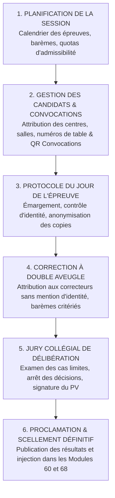
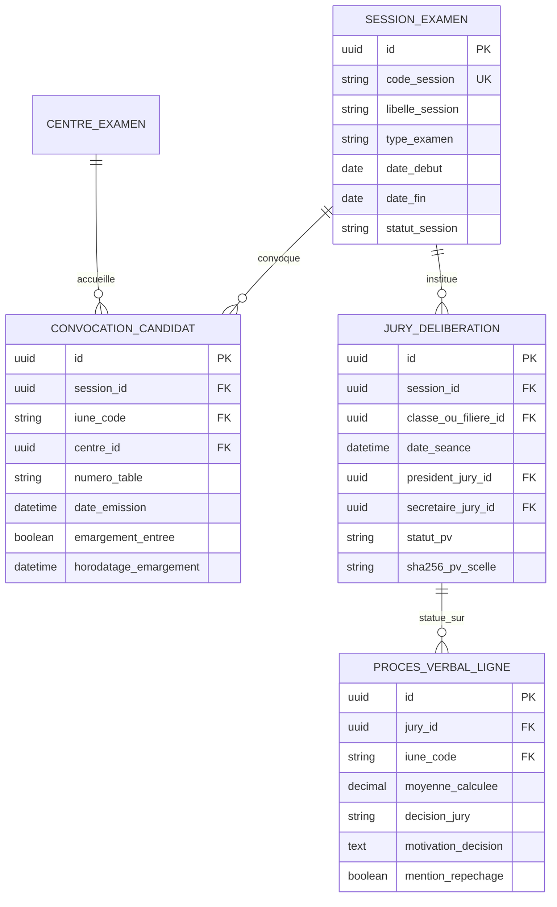

# TOME 5 — ARCHITECTURE FONCTIONNELLE
## 75. Module Examens, Évaluations Officielles et Organisation des Jurys

---

> **Positionnement :** Gestion logistique, réglementaire et sécuritaire des examens semestriels et nationaux  
> **Autorité :** Conforme au Tome 2 (Articles 4, 8, 14 et 16) et au Tome 3 (Parties II, VII et IX)  
> **Liaison amont :** Modules 62, 63 et 67 | **Liaison aval :** Modules 68 (Bulletins), 76 (Diplômes) et Tome 10 (Anti-fraude)

---

## 1. Objet et Portée du Module

Le Module **Examens, Évaluations Officielles et Organisation des Jurys** régit l'organisation spatio-temporelle, administrative et protocolaire de l'ensemble des sessions d'épreuves certificatives organisées par ELLYSIUM ou au sein de ses établissements partenaires.

Il couvre :
- Les **Examens Semestriels Ordinaires et de Rattrapage** du Secondaire et de l'Université.
- Les **Simulations Officielles à Blanc du TENASOSP et de l'EXETAT** préparant les élèves aux examens d'État congolais.
- La génération et l'envoi des **Convocations Individuelles Officielles** aux candidats.
- L'administration des salles d'examen, l'anonymisation des copies et la gestion des incidents de surveillance.
- L'organisation formelle des **Jurys Collégiaux de Délibération** et le scellement des procès-verbaux officiels.

---

## 2. Le Déroulement Procédural d'une Session d'Examens

Toute session d'examens traverse un protocole rigide en 6 phases séquentielles :

---

## 3. Spécifications des Convocations et Centres d'Examen

### 3.1 Édition de la Convocation Officielle Individuelle
Chaque apprenant admis à se présenter aux épreuves reçoit, au moins 15 jours avant la première épreuve, sa **Convocation Officielle d'Examen** comportant :
- Identité complète du candidat, photographie d'identité récente et numéro IUNE.
- Centre d'examen physique assigné (nom de l'école partenaire, ville, adresse exacte).
- Numéro de table d'examen personnel.
- Tableau détaillé des épreuves : dates, heures de début et fin de chaque discipline, durée de l'épreuve.
- Consignes impératives de sécurité et rappel des sanctions pénales et disciplinaires en cas de fraude (Article 16 de la Constitution).
- QR code unique d'émargement contrôlé à l'entrée du centre.

### 3.2 Contrôle d'Accès et Protocole de Salle
1. **Émargement à l'entrée** : Le candidat présente sa convocation et sa carte d'identité scolaire ou nationale. Le surveillant flashe le QR code avec l'application mobile de contrôle ELLYSIUM pour valider la présence effective.
2. **Anonymat Cryptographique des Copies** :
   - Pour les examens sur papier physique, la copie comporte un coin gommé ou un code-barres détachable masquant l'identité du candidat jusqu'à la fin de la correction.
   - Pour les examens universitaires en ligne surveillés, le système attribue un numéro d'anonymat aléatoire décorrélé de l'identité de l'étudiant.

---

## 4. Organisation des Jurys de Délibération (Articles 13 et 14)

Conformément à la Constitution d'ELLYSIUM, les délibérations ne résultent jamais d'un automatisme solitaire :

### 4.1 Composition Collégiale Obligatoire du Jury
- **Secondaire** :
  - *Président du Jury* : Le Chef d'établissement ou le Préfet des études.
  - *Secrétaire du Jury* : Le Directeur de discipline ou un enseignant désigné.
  - *Membres* : L'ensemble des professeurs titulaires et enseignants de la promotion.
- **Université (LMD)** :
  - *Président du Jury* : Le Doyen de la Faculté ou le Chef de Département (titulaire d'un Doctorat).
  - *Membres* : Les enseignants-chercheurs et professeurs titulaires des UE du semestre.

### 4.2 Déroulement de la Séance de Délibération
1. **Lecture des Synthèses Mathématiques** :
   Le secrétaire projette la grille consolidée calculée par le Module 67 (moyennes, pourcentages, échecs, taux d'assiduité).
2. **Examen des Cas Particuliers et Repêchages** :
   Le jury examine collégialement les élèves situés dans la zone critique (ex. moyenne entre $48\%$ et $49,99\%$), en prenant en compte la régularité du travail, l'assiduité et la conduite.
3. **Signature du Procès-Verbal Officiel de Délibération** :
   Le procès-verbal consignant la liste des admis, ajournés et redoublants est validé par la signature électronique ou manuscrite conjointe de tous les membres du jury présents. Dès signature, les délibérations deviennent irrévocables.

---

## 5. Modèle Conceptuel de Données (Entités du Module)

---

## 6. Règles de Gestion et Verrous Fonctionnels

- **Règle 75.1 (Interdiction de jury incomplet)** : Une séance de délibération de fin d'année ne peut être valablement ouverte dans le système si le quorum de présence légal (au moins deux tiers des enseignants de la promotion) n'est pas réuni et validé par émargement.
- **Règle 75.2 (Condition d'assiduité pour convocation)** : Le système refuse d'émettre une convocation aux examens semestriels pour un candidat dont le taux d'absences injustifiées dans la matière dépasse le seuil critique de 25 % (Module 65), sauf dérogation médicale dûment enregistrée.
- **Règle 75.3 (Procédure de constat d'incident et flagrant délit)** : Tout acte de triche constaté en salle d'examen fait l'objet d'un procès-verbal d'incident électronique rédigé sur le champ par les deux surveillants de salle, consignant les pièces matérielles saisies. La copie est transmise sous scellé au jury qui statue sur la sanction applicable.
