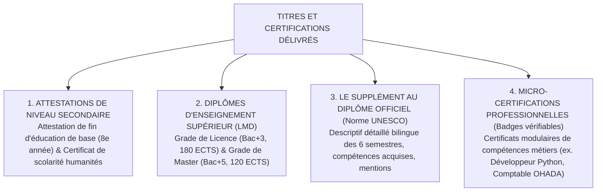
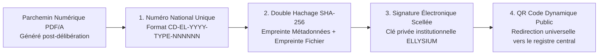
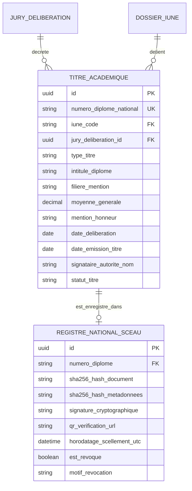

# TOME 5 — ARCHITECTURE FONCTIONNELLE
## 76. Module Délivrance des Diplômes, Titres et Attestations Infalsifiables

---

> **Positionnement :** Moteur régalien d'émission, d'enregistrement national et de certification des titres scolaires et universitaires  
> **Autorité :** Conforme au Tome 2 (Articles 2, 4, 15 et 16 — Primauté de la preuve et lutte contre la fraude)  
> **Liaison amont :** Modules 60, 67 et 75 | **Liaison aval :** Tome 10 (Sécurité des certifications) et Module 78 (API de vérification)

---

## 1. Objet et Portée du Module

Le Module **Délivrance des Diplômes, Titres et Attestations Infalsifiables** constitue l'autorité de certification finale d'ELLYSIUM. Il traduit la réussite académique de l'apprenant en un titre officiel, pérenne et universellement vérifiable.

Dans le paysage éducatif d'Afrique francophone, la prolifération des faux diplômes et la lenteur des circuits administratifs d'authentification constituent un frein majeur à l'employabilité et à la mobilité internationale des diplômés. ELLYSIUM apporte une rupture technologique majeure :
- L'émission instantanée d'**Attestations de Réussite Numériques Scellées** dès la proclamation des résultats par le jury.
- L'enregistrement de chaque diplôme dans le **Registre National d'Immatriculation Académique d'ELLYSIUM**.
- La délivrance de **Diplômes et Suppléments au Diplôme LMD** bilingues (français/anglais), conformes aux standards internationaux de l'UNESCO et du CAMES.
- La mise à disposition d'un **système de vérification publique instantanée** permettant à n'importe quelle entreprise ou ambassade dans le monde de certifier l'authenticité d'un parchemin en 5 secondes.

---

## 2. Typologie des Titres et Documents Certifiés

---

## 3. Spécifications du Dispositif d'Inviolabilité et d'Authentification

Chaque diplôme généré intègre un dispositif de sécurité à quatre niveaux :

### 3.1 Numérotation Nationale Normalisée
Chaque titre reçoit un numéro unique inaltérable :
$$\text{Code} = \text{PAYS} - \text{INSTITUTION} - \text{ANNÉE} - \text{CYCLE} - \text{FILIÈRE} - \text{NUMÉRO SÉQUENTIEL}$$
*Exemple officiel :* `CD-EL-2026-LIC-INFO-000492` (Diplôme de Licence en Informatique délivré en 2026).

### 3.2 Le QR Code Dynamique de Vérification Publique
- Imprimé sur le parchemin physique et présent sur le document numérique.
- Le scan du QR code renvoie directement vers l'URL officielle de vérification publique :
  `https://verify.elysium.cd/diplome/CD-EL-2026-LIC-INFO-000492`
- L'écran de vérification affiche sans intermédiaire :
  - Nom, postnom et prénom du lauréat.
  - Photographie d'identité certifiée issue du dossier national.
  - Titre délivré, mention obtenue, date de délibération du jury.
  - Noms du Président du Jury et du Recteur / Directeur Général signataires.
  - Possibilité de télécharger la copie numérique conforme scellée.

---

## 4. Le Supplément au Diplôme (Norme Internationale)

Conformément aux directives de l'UNESCO et aux normes LMD pour faciliter l'embauche des diplômés congolais à l'international :
- Chaque diplômé de Licence ou Master reçoit obligatoirement son **Supplément au Diplôme bilingue (Français - Anglais)**.
- Il détaille :
  - Le système éducatif de référence en RDC.
  - La maquette complète des 6 semestres avec le détail de chaque UE suivie.
  - Le volume d'heures global et la ventilation des 180 crédits ECTS acquis.
  - Les stages professionnels effectués et le sujet du mémoire de fin de cycle soutenu avec sa mention.
  - La grille des compétences professionnelles opérationnelles certifiées.

---

## 5. Modèle Conceptuel de Données (Entités du Module)

---

## 6. Règles de Gestion et Verrous Régaliens

- **Règle 76.1 (Condition absolue de complétude des crédits)** : Le système interdit formellement la génération d'un diplôme de Licence si la somme des crédits ECTS capitalisés dans le dossier numérique (Module 60) est strictement inférieure à **180 crédits**, ou inférieure à **120 crédits** pour un Master.
- **Règle 76.2 (Procédure exceptionnelle de révocation d'un diplôme)** : Conformément à l'Article 16 de la Constitution, un diplôme ne peut être révoqué qu'en cas de fraude avérée constatée par décision de justice ou arrêté ministériel. La révocation n'efface pas l'enregistrement : elle met à jour son statut à `RÉVOQUÉ_POUR_FRAUDE` sur le portail public, rendant le titre inutilisable.
- **Règle 76.3 (Gratuité de la délivrance numérique initiale)** : Le parchemin numérique certifié et le supplément au diplôme sont mis à la disposition de l'apprenant gratuitement dans son coffre-fort numérique personnel dès sa proclamation.

---

## 7. Verrous Fonctionnels Critiques

| Réf. Verrou | Description Fonctionnelle et Technique | Conséquence en Cas de Violation |
| :--- | :--- | :--- |
| **`VF-076-01`** | **Numérotation nationale séquentielle unique** | Chaque certificat délivré porte un numéro de série unique relié au registre d'État. |
| **`VF-076-02`** | **Génération automatique sous conditions vérifiées** | L'attestation de scolarité n'est émise que si l'apprenant a son inscription validée. |
| **`VF-076-03`** | **Signature numérique de l'autorité habilitée** | Application du cachet numérique et de la signature électronique du chef d'établissement. |
| **`VF-076-04`** | **Horodatage et durée de validité mentionnée** | Chaque attestation comporte sa date d'émission et sa durée de validité juridique. |
| **`VF-076-05`** | **Révocation possible avec journalisation** | En cas d'erreur matérielle, l'attestation peut être révoquée publiquement sur le portail. |

---

*Sous-tome rédigé conformément aux Normes documentaires ELLYSIUM — Fondations 04.*
