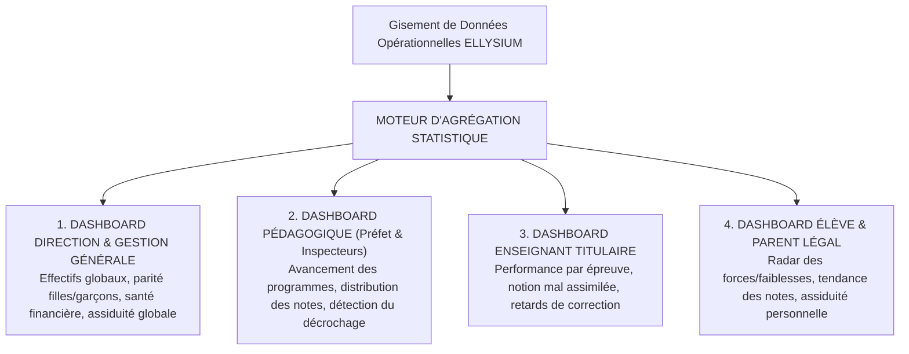
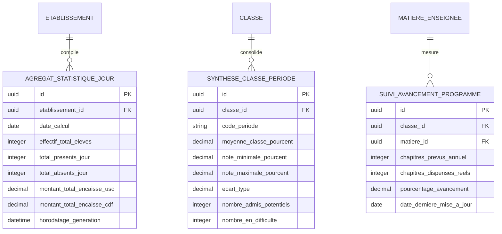

# TOME 5 — ARCHITECTURE FONCTIONNELLE
## 77. Module Statistiques, Tableaux de Bord et Pilotage Décisionnel

---

> **Positionnement :** Moteur d'analyse de données, Business Intelligence éducative et pilotage stratégique  
> **Autorité :** Conforme au Tome 2 (Articles 4, 13 et 18 — Assurance qualité et transparence) et Tome 3 (Partie VIII)  
> **Liaison amont :** Modules 65, 66, 67, 71 et 72 | **Liaison aval :** Module 78 (Exports ministériels) et Tome 11

---

## 1. Objet et Portée du Module

Le Module **Statistiques, Tableaux de Bord et Pilotage Décisionnel** transforme les millions de données opérationnelles générées quotidiennement par les établissements et le campus numérique d'ELLYSIUM en **indicateurs décisionnels clairs, visuels et exploitables en temps réel**.

Dans la gestion scolaire traditionnelle, le pilotage s'effectue « à l'aveugle » : les bilans ne sont connus que plusieurs semaines après la fin des trimestres, rendant toute action préventive impossible.

Ce module garantit :
- Le pilotage stratégique et financier instantané pour les Chefs d'établissement et Promoteurs.
- Le suivi en temps réel de l'avancement des programmes scolaires pour les Préfets des études.
- L'auto-évaluation didactique pour les enseignants titulaires.
- La visualisation claire et encourageante de la progression pour les élèves et leurs parents.
- La génération d'états statistiques consolidés pour les Directions Provinciales de l'Éducation (DIPROVED) et les ministères de tutelle (EPST/ESU).

---

## 2. Cartographie des 4 Espaces de Tableaux de Bord

Le système adapte les visualisations et les indicateurs selon le niveau de responsabilité de l'acteur :

---

## 3. Spécifications des Indicateurs Clés de Performance (KPI)

### 3.1 Indicateurs de la Direction Générale et Promoteur
1. **Démographie Scolaire & Parité** :
   - Effectif total inscrit, ventilé par niveau, option et genre (ratio filles/garçons avec suivi des objectifs d'inclusion nationale).
   - Taux de rétention scolaire annuel (mesure des départs et abandons en cours d'année).
2. **Indicateurs Financiers & Santé de Caisse** (Module 71) :
   - Taux de recouvrement des frais scolaires à date ($T = \frac{\text{Montant Encaissé}}{\text{Montant Total Exigible}} \times 100$).
   - Prévisionnel des encaissements à 30 jours et montant total des créances en souffrance.
   - Solde journalier disponible en caisse et sur les comptes Mobile Money.
3. **Productivité et Climat Scolaire** :
   - Taux d'absentéisme global des enseignants (heures non prestées).
   - Nombre d'incidents disciplinaires enregistrés par semaine.

### 3.2 Indicateurs Pédagogiques du Préfet des Études
1. **Taux d'Exécution des Programmes Nationaux (Coverage Ratio)** :
   - Pour chaque matière : pourcentage des chapitres officiels de la DIPROMAT effectivement dispensés par rapport au calendrier théorique.
   - Alerte visuelle orange si une matière accuse un retard d'avancement supérieur à deux semaines.
2. **Distribution et Dispersion des Résultats (Courbe de Gauss)** :
   - Visualisation de la répartition des moyennes par classe.
   - Détection des anomalies métrologiques : épreuves anormalement sévères (taux d'échec $> 80\%$) ou complaisantes (taux de réussite $= 100\%$).
3. **Indice de Vulnérabilité et Détection Précoce du Décrochage** :
   - Algorithme croisant la baisse soudaine d'assiduité (Module 65) et la chute des cotes aux travaux journaliers (Module 66).
   - Génération automatique de la **Liste Prioritaire de Remédiation** transmise aux professeurs titulaires.

### 3.3 Espace Apprenant et Famille (Le Radar de Progression)
- **Graphique Radar Pluridisciplinaire** :
  Permet à l'élève d'identifier d'un coup d'œil ses disciplines fortes (ex. Sciences, Anglais) et ses matières nécessitant un effort accru (ex. Mathématiques).
- **Courbe d'Évolution Temporelle** :
  Tracé chronologique de la moyenne générale période par période, valorisant les efforts de progression continue.
- **Comparatif Bienveillant** :
  Affichage de la note de l'élève en regard de la moyenne générale de sa classe, sans jamais divulguer publiquement les notes des autres camarades (préservation de l'estime de soi).

---

## 4. Exports Réglementaires et Statistiques Officielles

Pour répondre aux obligations administratives de la RDC :
- **Génération du Tableau Synoptique Annuel de l'École** : Document officiel récapitulant les effectifs de rentrée, les abandons, les exclus et les lauréats de fin d'année.
- **Export Normalisé SIGE (Système d'Information pour la Gestion de l'Éducation - EPST)** : Fichier de données structuré prêt à être téléversé sur les serveurs du Ministère.
- **Statistiques d'Accompagnement des Filles et des Régions Vulnérables** : Rapports d'impact pour les partenaires et bailleurs de fonds de l'éducation (UNESCO, UNICEF).

---

## 5. Modèle Conceptuel de Données (Entités du Module)

---

## 6. Règles de Gestion et Verrous Fonctionnels

- **Règle 77.1 (Anonymisation stricte des statistiques publiques)** : Tout rapport statistique exporté à destination d'auditeurs externes ou de partenaires est totalement purgé de données nominatives, conformément à l'Article 15 de la Constitution.
- **Règle 77.2 (Calcul asynchrone non bloquant)** : Les calculs d'agrégation statistique lourds (courbes de dispersion, moyennes provinciales) sont exécutés de manière asynchrone en arrière-plan, interdisant tout ralentissement des fonctions quotidiennes de saisie de notes ou d'appel.
- **Règle 77.3 (Intégrité des données sources)** : Les tableaux de bord ne constituent qu'une vue de restitution en lecture seule (`READ-ONLY`). Aucune modification de cote ou de statut ne peut être opérée directement depuis un écran statistique.
