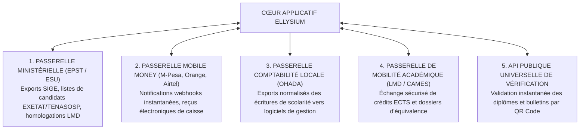
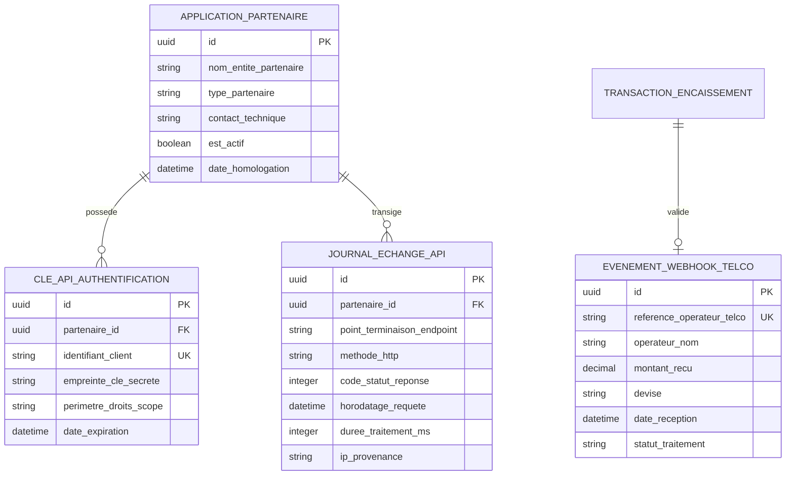

# TOME 5 — ARCHITECTURE FONCTIONNELLE
## 78. Module API et Interopérabilité Écosystémique

---

> **Positionnement :** Passerelles fonctionnelles d'échanges de données avec les ministères, banques et tiers  
> **Autorité :** Conforme au Tome 2 (Article 15 — Gouvernance des données) et Tome 1 (Section 4)  
> **Liaison amont :** Modules 60, 68, 71 et 76 | **Liaison aval :** Tome 7 (Architecture technique des API)

---

## 1. Objet et Portée du Module

Le Module **API et Interopérabilité Écosystémique** formalise les flux d'échanges automatisés entre la plateforme ELLYSIUM et son environnement institutionnel, financier et académique extérieur.

Une institution éducative souveraine ne peut pas fonctionner comme une île fermée. Elle doit s'intégrer harmonieusement avec :
- Les plateformes informatiques des ministères de tutelle en RDC (MEPST et ESU).
- Les opérateurs de télécommunication et de Mobile Money pour la collecte des frais scolaires.
- Les logiciels comptables des établissements partenaires conformes aux normes OHADA.
- Les systèmes d'information des universités nationales et internationales pour la mobilité académique.
- Le public mondial pour la vérification instantanée de l'authenticité des parchemins délivrés.

---

## 2. Cartographie des 5 Passerelles d'Interopérabilité

---

## 3. Spécifications des Passerelles Fonctionnelles

### 3.1 Passerelle Ministérielle RDC (EPST / ESU)
- **Transmission des Listes de Candidats EXETAT et TENASOSP** :
  Génération automatique du fichier national officiel des candidats réguliers (Module 59/60) avec contrôle d'intégrité, évitant les erreurs de transcription sur les fiches d'enrôlement manuelles.
- **Export Normalisé SIGE (Système d'Information pour la Gestion de l'Éducation)** :
  Génération semestrielle des matrices statistiques scolaires (effectifs par âge, genre, option, redoublants, abandons, personnel enseignant qualifié).
- **Synchronisation du Répertoire LMD (ESU)** :
  Transmission sécurisée des procès-verbaux de jurys universitaires pour l'homologation des grades de Licence et Master délivrés.

### 3.2 Passerelle Mobile Money et Télécoms
- Réception et traitement sécurisé des notifications de paiement (Webhooks) des trois grands opérateurs nationaux :
  - *M-Pesa (Vodacom RDC)*
  - *Orange Money RDC*
  - *Airtel Money RDC*
- **Traitement par Idempotence Stricte** :
  L'API garantit qu'un paiement notifié deux fois par le réseau de télécommunication ne sera comptabilisé qu'une seule et unique fois dans le Module Caisse (Module 71).
- Émission instantanée d'un SMS de quittance légale vers le numéro du payeur.

### 3.3 Passerelle de Comptabilité Générale (Système OHADA)
Pour les collèges et instituts gérant une comptabilité générale sur progiciel d'entreprise (ex. Sage, Odoo, logiciels locaux) :
- Export paramétrable du journal des opérations de caisse (Journal des encaissements, journal des créances de scolarité).
- Respect du plan comptable général OHADA révisé (comptes de classe 4 — Créances clients/parents, comptes de classe 5 — Trésorerie, comptes de classe 7 — Produits de scolarité).

### 3.4 API Publique de Vérification des Certifications (Open Verification)
- Endpoint universel public accessible sans authentification préalable :
  `GET /api/v1/verify/doc/{reference_code}`
- Retourne la charge utile officielle publique :
  - Authenticité du document (`AUTHENTIQUE`, `REVOQUE`, `INCONNU`).
  - Identité du titulaire et numéro IUNE.
  - Titre ou bulletin certifié et date d'émission officielle.
  - Sceau cryptographique de conformité.

---

## 4. Sécurité, Gouvernance des Flux et Quotas d'Échange

Conformément à la Constitution (Article 15 — Gouvernance des données) :
- **Authentification forte des tiers** : Toute connexion à l'API partenaire requiert un jeton cryptographique d'authentification mutuelle (mTLS / OAuth2 avec clés de signature dédiées).
- **Chiffrement de bout en bout** : Toutes les données échangées transitent par des canaux chiffrés sous TLS 1.3 au plus haut niveau de sécurité.
- **Limitation de débit (Rate Limiting) et protection anti-DDoS** :
  Plafonnement du nombre de requêtes par minute pour interdire toute aspiration massive de données ou tentative de saturation des services.
- **Journalisation exhaustive des requêtes d'API** : Enregistrement de chaque appel entrant/sortant avec horodatage, adresse IP source, identifiant de l'application cliente et code de réponse HTTP.

---

## 5. Modèle Conceptuel de Données (Entités du Module)

---

## 6. Règles de Gestion et Verrous Régaliens

- **Règle 78.1 (Interdiction d'accès direct aux bases de données sources)** : Aucun partenaire extérieur, bancaire ou ministériel, ne dispose d'un accès direct en lecture/écriture à la base de données centrale. Tous les flux passent exclusivement par la couche d'API contrôlée.
- **Règle 78.2 (Protection des données personnelles dans les flux d'export)** : Les exports statistiques ministériels ou de recherche ne transmettent aucune donnée confidentielle non anonymisée sans réquisition ou accord formel de la Direction Générale.
- **Règle 78.3 (Continuité des flux en mode asynchrone)** : En cas de coupure temporaire de la connectivité avec un opérateur de Mobile Money, le système stocke les requêtes dans une file d'attente sécurisée avec politique de réessais automatique dès rétablissement du lien.

---

## 7. Verrous Fonctionnels Critiques

| Réf. Verrou | Description Fonctionnelle et Technique | Conséquence en Cas de Violation |
| :--- | :--- | :--- |
| **`VF-078-01`** | **Rapprochement bancaire automatisé à 100%** | Chaque transaction Mobile Money est lettrée avec sa référence opérateur dans les 60 secondes. |
| **`VF-078-02`** | **Interdiction de stockage des codes PIN ou secrets** | La plateforme ne manipule aucun mot de passe ou code secret de portefeuille électronique. |
| **`VF-078-03`** | **Tolérance aux doubles notifications de passerelle (Idempotence)** | Une notification de paiement reçue plusieurs fois ne génère qu'une seule écriture de reçu. |
| **`VF-078-04`** | **Alerte de divergence financière immédiate** | Tout écart entre le solde déclaré par l'opérateur et le grand livre déclenche une alerte au trésorier. |
| **`VF-078-05`** | **Support des quatre opérateurs majeurs de RDC** | Interfaçage natif avec M-Pesa, Orange Money, Airtel Money et Afrimoney. |

---

*Sous-tome rédigé conformément aux Normes documentaires ELLYSIUM — Fondations 04.*
