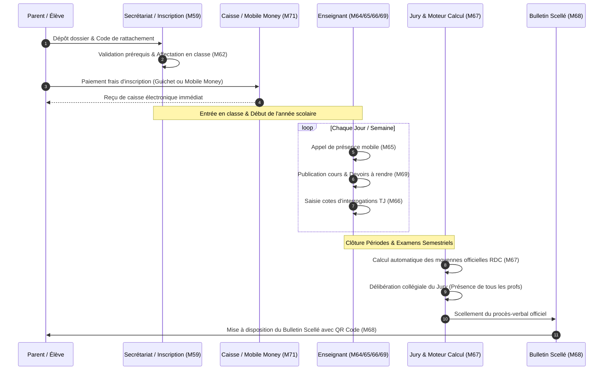
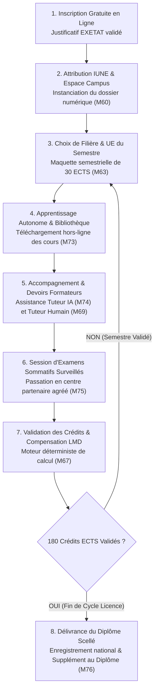
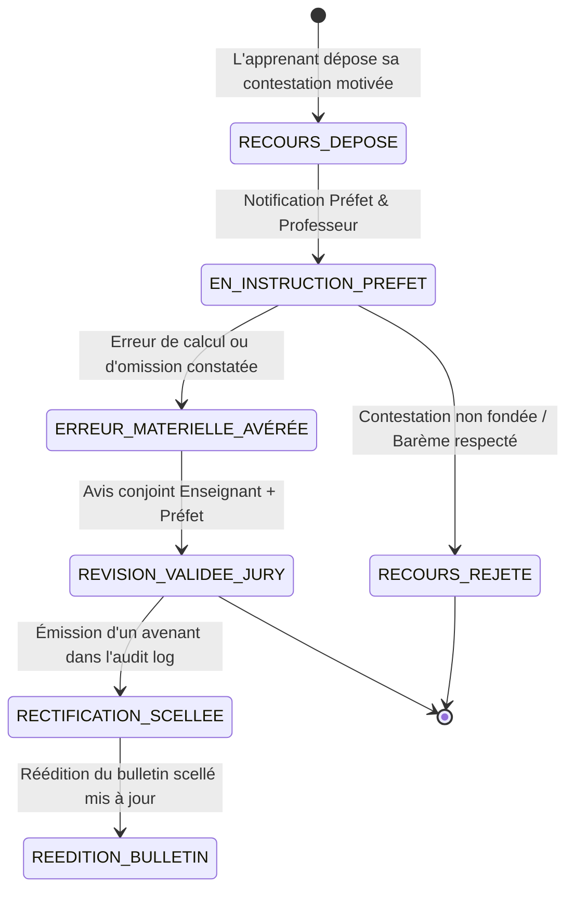

# TOME 5 — ARCHITECTURE FONCTIONNELLE
## 79. Workflows Transversaux et Orchestration des Processus Métier

---

> **Positionnement :** Orchestration de bout en bout des grands processus traversant l'ensemble des modules  
> **Autorité :** Conforme à la Constitution (Tome 2, Articles 1, 4, 8, 13 et 16)  
> **Liaison amont :** Modules 55 à 78 | **Liaison aval :** Modules 80, 81, 82 et Tome 7 (Architecture système)

---

## 1. Objet et Portée du Module

Le Module **Workflows Transversaux et Orchestration des Processus Métier** constitue le chef d'orchestre de la plateforme ELLYSIUM. Il assemble, synchronise et fiabilise les interactions entre les modules spécialisés (admission, scolarité, pédagogie, cotes, finances, délibérations, diplômes) pour garantir que chaque usager vit un parcours fluide, continu et sans rupture administrative.

Ce module modélise les **quatre grands macro-processus souverains** de l'institution :
1. Le cycle de vie complet de l'**Élève Affilié au Secondaire** (d'une rentrée scolaire à la proclamation).
2. Le parcours d'études autonome de l'**Apprenant Universitaire Indépendant** (de l'accès gratuit à la diplomation).
3. Le workflow de **Bascule Annuelle et Rentrée Scolaire** pour un établissement partenaire.
4. Le workflow officiel de **Traitement des Recours et Réclamations Académiques** (Droit de l'apprenant - Article 8).

---

## 2. Macro-Processus 1 : Parcours Annuel de l'Élève Affilié (Secondaire)

Ce workflow orchestre les 36 semaines de l'année scolaire d'un élève au sein d'une école partenaire :

---

## 3. Macro-Processus 2 : Parcours de l'Apprenant Universitaire Indépendant (Campus Ouvert LMD)

Ce workflow garantit l'accès inaliénable et gratuit au savoir supérieur :

---

## 4. Macro-Processus 3 : Bascule Annuelle et Préparation de la Rentrée Scolaire

Chaque intersession scolaire (juillet-août), le Chef d'établissement et le Préfet exécutent le workflow de bascule d'exercice :

1. **Clôture Officielle de l'Année Échue ($N$)** :
   - Vérification de la complétude de l'ensemble des cahiers de cotes.
   - Contrôle du scellement de 100 % des procès-verbaux de délibération.
   - Clôture comptable de l'exercice financier de caisse.
2. **Initialisation de l'Année Nouvelle ($N+1$)** :
   - Création de la configuration de l'année scolaire avec les dates officielles du Ministère.
   - Reconduction de la structure des classes avec ajustement des capacités d'accueil.
   - Mise à jour de la grille des frais scolaires votée par le comité des parents.
3. **Bascule Automatique des Cohortes** :
   - Les élèves déclarés *Admis* sont pré-inscrits dans la classe supérieure.
   - Les élèves déclarés *Redoublants* sont réaffectés dans leur niveau d'origine.
   - Les élèves diplômés de 4e humanités sont archivés dans le vivier des Alumni.

---

## 5. Macro-Processus 4 : Instruction des Recours et Réclamations (Article 8 de la Constitution)

Afin de concrétiser le droit inaliénable à une évaluation équitable et transparente :

---

## 6. Règles de Transition et Verrous d'Orchestration

- **Règle 79.1 (Verrou de transition pré-requis)** : Aucun élève ne peut être engagé dans une étape aval d'un workflow si l'étape amont obligatoire n'a pas été formellement validée (ex. impossible d'éditer un bulletin si le calcul académique du Module 67 n'est pas scellé).
- **Règle 79.2 (Tolérance aux coupures et reprises transactionnelles)** : Tout workflow initié sur terminal mobile hors-ligne conserve son état d'étape en mémoire locale sécurisée. Dès rétablissement du réseau, le moteur d'orchestration reprend exactement là où l'action avait été interrompue, sans doublon ni perte de contexte.
- **Règle 79.3 (Traçabilité des bifurcations de parcours)** : Toute déviation par rapport au flux nominal (transfert d'école, abandon, réintégration tardive) produit un événement d'orchestration consigné dans le Module 82.
