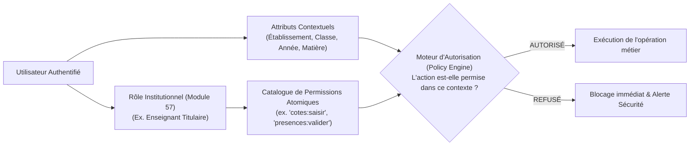
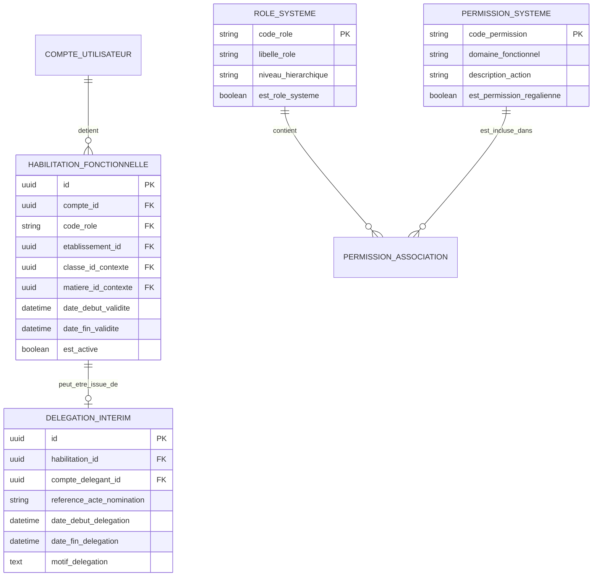

# TOME 5 — ARCHITECTURE FONCTIONNELLE
## 80. Module Gestion des Droits, Habilitations et Permissions Fines (RBAC / ABAC)

---

> **Positionnement :** Moteur d'autorisation fonctionnelle, contrôle des privilèges et délégations  
> **Autorité :** Conforme à la Constitution (Tome 2, Articles 6, 13 et 15 — Sécurité et responsabilité)  
> **Liaison amont :** Module 57 (Cartographie des Acteurs) | **Liaison aval :** Tous modules et Tome 7

---

## 1. Objet et Portée du Module

Le Module **Gestion des Droits, Habilitations et Permissions Fines** constitue le bouclier de sécurité logique d'ELLYSIUM. Il traduit la matrice des rôles du Module 57 en un moteur d'autorisation dynamique, granulaire et infalsifiable.

Dans un système hébergeant simultanément des données d'état civil de mineurs, des cotes scolaires officielles, des diplômes d'État et des flux de trésorerie scolaire, la gestion des droits ne peut pas reposer sur de simples profils statiques ou des comptes administrateurs partagés.

Ce module garantit :
- L'application stricte du **Principe du Moindre Privilège (PoLP - Principle of Least Privilege)**.
- Le contrôle d'accès contextuel basé sur les attributs (ABAC - Attribute-Based Access Control) : un enseignant titulaire ne peut voir et noter **que** les élèves des classes qui lui sont formellement attribuées pour l'exercice en cours.
- La gestion encadrée des **Délégations Temporaires de Pouvoir** (ex. intérim du Préfet des études).
- La révocation instantanée en un clic de tout accès compromis ou suspendu.
- La traçabilité de chaque vérification d'autorisation dans la piste d'audit.

---

## 2. Modélisation à Double Niveau : Rôles Métier et Permissions Atomiques

Le système sépare fonctionnellement le rôle attribué à un utilisateur des permissions unitaires requises pour chaque action métier :

---

## 3. Catalogue des Permissions Atomiques Régaliennes

Les permissions sont découpées de manière granulaire par domaine opérationnel :

### 3.1 Domaine Pédagogie & Évaluations
- `eval:cote:create` : Créer une nouvelle session d'évaluation (interrogation/devoir).
- `eval:cote:write` : Saisir des notes brutes dans le cahier des cotes.
- `eval:cote:update_locked` : Rectifier une note après clôture de période (exige double visa).
- `eval:deliberation:sign` : Signer un procès-verbal de jury de délibération.
- `eval:bulletin:seal` : Apposer le sceau électronique officiel sur les bulletins.

### 3.2 Domaine Finances & Trésorerie
- `finance:frais:configure` : Modifier la grille tarifaire officielle de l'école.
- `finance:encaissement:create` : Encaisser des fonds et émettre un reçu de caisse.
- `finance:recu:cancel` : Annuler un reçu de caisse erroné (exige visa de direction).
- `finance:cloture:execute` : Clôturer la journée comptable de caisse.

### 3.3 Domaine Administration des Identités & Établissements
- `etab:config:update` : Modifier les paramètres légaux et visuels de l'école.
- `eleve:classe:assign` : Affecter ou transférer un élève dans une classe.
- `personnel:affectation:manage` : Nommer un enseignant sur une matière ou classe.

---

## 4. Gestion des Délégations Temporaires de Pouvoir (Intérims)

En cas d'absence prolongée, de mission officielle ou de maladie d'un responsable clé (Chef d'établissement, Préfet des études) :
1. **Acte de délégation formalisé** :
   - Le délégant (ou l'autorité de tutelle) configure la délégation dans le système : désignation du mandataire (intérimaire), liste stricte des permissions déléguées, date et heure de début, date et heure de fin automatique.
2. **Double traçabilité des signatures sous intérim** :
   - Tout document ou décision validé pendant la période d'intérim porte la mention légale infalsifiable :
     *« Validé par [Nom de l'Intérimaire], agissant par délégation officielle de pouvoir de [Nom du Titulaire], Réf. Décision INT-2026-08 »*.
3. **Extinction automatique** :
   - Dès expiration du terme temporel fixé, les privilèges délégués sont automatiquement révoqués par le système sans intervention humaine.

---

## 5. Modèle Conceptuel de Données (Entités du Module)

---

## 6. Règles de Gestion et Verrous Fonctionnels

- **Règle 80.1 (Interdiction du partage d'identifiants)** : Le système détecte les connexions simultanées depuis des adresses IP ou terminaux géographiquement incompatibles pour un même compte et déclenche la déconnexion de sécurité avec alerte SMS.
- **Règle 80.2 (Principe de séparation des rôles incompatibles)** : Le moteur de règles interdit techniquement d'affecter simultanément à un même utilisateur le rôle de `Caissier` et le rôle de `Préfet des études` ou d'`Enseignant titulaire` au sein du même établissement scolaire.
- **Règle 80.3 (Immutabilité des droits de super-administrateur)** : Les droits d'administration centrale (Super-Admin) sont soumis à un mécanisme d'approbation collégiale (quorums de sécurité) pour toute opération touchant à la structure des bases de données ou aux règles constitutionnelles du système.

---

## 7. Verrous Fonctionnels Critiques

| Réf. Verrou | Description Fonctionnelle et Technique | Conséquence en Cas de Violation |
| :--- | :--- | :--- |
| **`VF-080-01`** | **Principe du moindre privilège appliqué** | Chaque utilisateur ne dispose que des droits strictement indispensables à sa fonction. |
| **`VF-080-02`** | **Interdiction de partage de compte** | Déconnexion automatique de toute session concurrente détectée sur deux adresses distantes. |
| **`VF-080-03`** | **Révocation immédiate des droits lors du départ** | La désactivation d'un compte personnel coupe l'accès à toutes les ressources en temps réel. |
| **`VF-080-04`** | **Revue semestrielle obligatoire des privilèges** | Le préfet numérique et le DPO doivent signer un rapport de validation des comptes à privilèges. |
| **`VF-080-05`** | **Isolation des environnements d'administration** | Les interfaces d'administration avancée exigent une authentification forte MFA systématique. |
| **`VF-080-06`** | **Toute donnée d'apprenant peut être exportée sur demande conformément à l'Article 8 de la Constitution** | **Conséquence : violation = inéligibilité du module pour mise en production** |

---

*Sous-tome rédigé conformément aux Normes documentaires ELLYSIUM — Fondations 04.*
