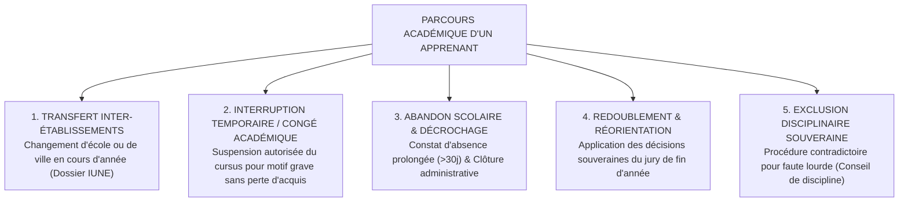
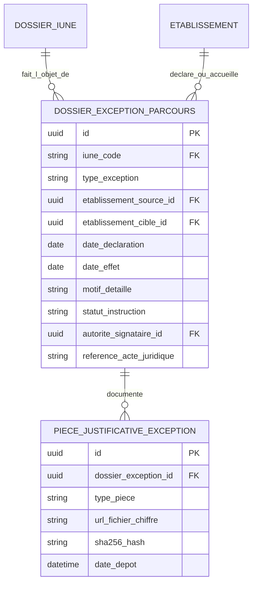

# TOME 5 — ARCHITECTURE FONCTIONNELLE
## 81. Module Gestion des Exceptions, Transferts et Ruptures de Parcours

---

> **Positionnement :** Encadrement des parcours non linéaires, transferts inter-établissements et contentieux  
> **Autorité :** Conforme à la Constitution (Tome 2, Articles 4, 8, 9 et 14 — Équité et protection des parcours)  
> **Liaison amont :** Modules 59, 60, 62 et 67 | **Liaison aval :** Module 68 (Bulletins) et Module 76 (Diplômes)

---

## 1. Objet et Portée du Module

Le Module **Gestion des Exceptions, Transferts et Ruptures de Parcours** régit le traitement administratif et académique de l'ensemble des événements qui dévient du cursus scolaire nominal continu d'un apprenant à ELLYSIUM.

Dans la réalité sociale et démographique de la République Démocratique du Congo, les parcours éducatifs sont souvent heurtés : déplacements de populations dus aux crises sécuritaires dans l'Est, mutations professionnelles imprévues des familles, difficultés économiques temporaires, maladies ou grossesses précoces.

Ce module garantit :
- Le **Transfert Inter-Écoles Transparent et Sécurisé** d'un élève d'une province à une autre sans perte de ses résultats ni ressaisie manuelle.
- L'encadrement des **Congés Académiques et Interruptions Temporaires d'Études** avec préservation intégrale des crédits ECTS acquis.
- Le constat officiel d'**Abandon Scolaire** et l'alerte préventive des services sociaux de l'Éducation Nationale.
- L'application stricte des règles de **Redoublement et de Réorientation** issues des jurys de délibération.
- La gestion rigoureuse et contradictoire des **Procédures Disciplinaires d'Exclusion**.

---

## 2. Typologie des 5 Grands Cas d'Exception Métier

---

## 3. Spécifications Procédurales Détaillées

### 3.1 Procédure de Transfert d'Élève (Inter-Écoles)
Lorsqu'une famille déménage (ex. de Bukavu vers Kinshasa) :
1. **Demande de transfert** initiée par le parent ou l'école de départ.
2. **Émission du Billet de Sortie Officiel Scellé** par l'établissement d'origine :
   - Le système vérifie que toutes les cotes des périodes révolues sont scellées dans le Module 66.
   - Génération du certificat de fréquentation avec le relevé de notes certifié à date.
3. **Admission dans l'école d'accueil** :
   - L'école d'accueil saisit simplement le numéro IUNE de l'élève.
   - Le dossier académique complet est instantanément transféré. L'élève est inscrit dans sa nouvelle classe et poursuit son année scolaire sans recommencer à zéro.

### 3.2 Interruption d'Études et Congé Académique (Système LMD)
Pour les étudiants universitaires confrontés à un impératif majeur (maladie grave, maternité, charge de famille subite) :
- Dépôt d'une demande de **Congé Académique Officiel** avant la fin des inscriptions pédagogiques.
- Dès validation par le Doyen de la Faculté :
  - L'étudiant est placé au statut `EN_CONGE_ACADEMIQUE`.
  - La totalité de ses crédits ECTS capitalisés antérieurement reste gelée et garantie sans limite de validité (Article 4 de la Constitution).
  - L'étudiant reprend ses études au semestre exact où il les a suspendues lors de la rentrée suivante.

### 3.3 Procédure Disciplinaire d'Exclusion Définitive (Article 9 de la Constitution)
Pour préserver la sécurité de la communauté scolaire en cas de faute lourde (violences physiques, agression, fraude documentaire avérée, vol grave) :
- **Interdiction formelle d'exclusion unilatérale ou par automatisme d'IA**.
- **Protocole contradictoire obligatoire** :
  1. Rapport circonstancié rédigé par le Directeur de Discipline.
  2. Convocation écrite des parents d'élèves au moins 48 heures à l'avance.
  3. Audition contradictoire de l'élève devant le **Conseil de Discipline**.
  4. Délibération et vote à la majorité qualifiée du conseil.
  5. Signature formelle de la décision d'exclusion par le Chef d'établissement avec mention des voies de recours légales.

---

## 4. Modèle Conceptuel de Données (Entités du Module)

---

## 5. Règles de Gestion et Verrous Fonctionnels

- **Règle 81.1 (Plafond de redoublement dans le cycle de base)** : Conformément aux règlements du Ministère de l'Éducation Nationale en RDC, un élève ne peut redoubler qu'une seule fois dans le Cycle Terminal de l'Éducation de Base (7e-8e années). Un second échec entraîne une réorientation obligatoire vers les filières professionnelles courtes ou de métiers.
- **Règle 81.2 (Interdiction de rétention du dossier pour motif financier)** : En cas de transfert d'un élève vers une autre école, l'école de départ **ne peut en aucun cas bloquer électroniquement la transmission du dossier scolaire numérique IUNE**. Les éventuels impayés font l'objet d'une procédure de recouvrement civil séparée sans séquestration du droit à l'instruction de l'enfant.
- **Règle 81.3 (Droit de recours sur exclusion disciplinaire)** : Toute décision d'exclusion définitive peut faire l'objet d'un recours suspensif sous 8 jours auprès de la Sous-Division provinciale de tutelle ou de la Direction Générale d'ELLYSIUM.

---

## 7. Verrous Fonctionnels Critiques

| Réf. Verrou | Description Fonctionnelle et Technique | Conséquence en Cas de Violation |
| :--- | :--- | :--- |
| **`VF-081-01`** | **Formalisme strict des dossiers de transfert** | Le transfert d'un élève vers un autre établissement exige le quitus numérique des deux directeurs. |
| **`VF-081-02`** | **Gel du dossier en cas de contentieux disciplinaire** | Un apprenant sous le coup d'une procédure d'exclusion ne peut s'auto-radier du système. |
| **`VF-081-03`** | **Conservation intégrale des traces académiques en cas d'abandon** | L'abandon scolaire ne supprime aucune des notes ou présences acquises antérieurement. |
| **`VF-081-04`** | **Enregistrement des causes de décrochage pour remédiation** | Les motifs d'abandon sont qualifiés (économique, santé, déménagement) pour analyse sociologique. |
| **`VF-081-05`** | **Procédure simplifiée de réintégration** | L'élève réintégré retrouve son IUNE et son dossier sans création d'un doublon d'identité. |
| **`VF-081-06`** | **Toute donnée d'apprenant peut être exportée sur demande conformément à l'Article 8 de la Constitution** | **Conséquence : violation = inéligibilité du module pour mise en production** |

---

*Sous-tome rédigé conformément aux Normes documentaires ELLYSIUM — Fondations 04.*
