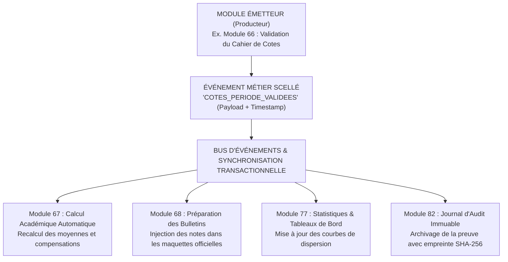
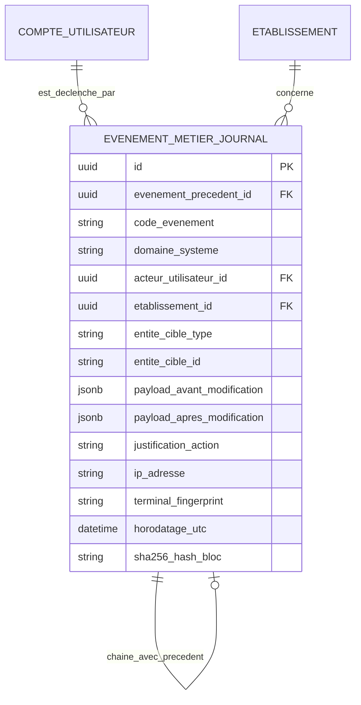

# TOME 5 — ARCHITECTURE FONCTIONNELLE
## 82. Règles de Synchronisation Inter-Modules et Journalisation Métier

---

> **Positionnement :** Moteur de cohérence événementielle, résilience réseau et journalisation immuable  
> **Autorité :** Conforme à la Constitution (Tome 2, Articles 4, 15 et 16 — Traçabilité et sécurité des données)  
> **Liaison amont :** Tous modules du Tome 5 | **Liaison aval :** Tome 7 (Architecture technique) et Tome 9 (Sécurité)

---

## 1. Objet et Portée du Module

Le Module **Règles de Synchronisation Inter-Modules et Journalisation Métier** constitue la colonne vertébrale transactionnelle d'ELLYSIUM. Il régit la propagation cohérente de l'information entre les 29 modules du système et garantit qu'aucune action sensible ne peut s'exécuter sans laisser une trace numérique indélébile.

Il répond à deux impératifs vitaux pour l'Afrique francophone :
1. **La Résilience aux Pannes et Coupures Réseau** : Permettre aux terminaux locaux (smartphones d'enseignants, tablettes de préfets, serveurs locaux d'écoles) d'opérer hors-ligne et de synchroniser leurs données sans conflit dès le rétablissement de la connectivité.
2. **La Traçabilité Anti-Fraude Constitutionnelle** : Consigner l'ensemble des événements académiques, financiers et administratifs dans un registre immuable (Audit Trail), garantissant que chaque note, chaque bulletin et chaque diplôme peut être audité avec certitude mathématique.

---

## 2. Architecture Événementielle (Event-Driven Architecture)

Pour éviter les dépendances bloquantes et garantir une haute vélocité du système même sous faible débit, la communication entre modules s'opère par **publication et souscription d'événements métier** :

---

## 3. Protocole de Synchronisation Hors-Ligne (Offline Sync)

Le système applique les règles de synchronisation suivantes entre les bases locales SQLite chiffrées des smartphones et le serveur central :

### 3.1 Synchronisation Différée et File d'Attente Locale
- Lorsqu'un utilisateur effectue une action hors-ligne (ex. appel de présence, saisie de devoirs, notes d'interrogations) :
  - L'action est validée localement et enregistrée dans la **File d'Attente de Synchronisation Locale** du terminal.
  - L'objet reçoit un identifiant UUID v4 unique généré localement et un horodatage d'émission certifié.
  - L'utilisateur continue de travailler sans interruption.

### 3.2 Règles de Résolution des Conflits de Concurrence
En cas de modification concurrente survenue pendant une période de déconnexion :
1. **Principe de l'Autorité Métier Régulière** :
   - En matière d'évaluation, la saisie validée par l'**Enseignant Titulaire** prévaut sur une saisie concurrente non finalisée.
   - Une décision scellée par le **Préfet des études** prévaut sur toute modification locale non synchronisée.
2. **Horodatage Vectoriel et Piste de Divergence** :
   - Si deux saisies divergentes surviennent sur la même ressource sans hiérarchie évidente, le système **n'écrase jamais silencieusement aucune donnée**.
   - Il crée une alerte de divergence transmise au Préfet des études pour arbitrage humain explicite, en conservant les deux versions dans le journal d'audit.

---

## 4. Spécifications du Journal d'Audit Métier Immuable (Tamper-Proof Audit Trail)

Conformément à l'Article 15 de la Constitution (Gouvernance des données) :
- **Principe d'Écriture Seule (Append-Only)** : La table d'audit log interdit formellement les opérations `UPDATE` et `DELETE` au niveau du moteur de base de données.
- **Chaînage Cryptographique des Entrées d'Audit** :
  Chaque enregistrement d'audit $E_n$ calcule son empreinte cryptographique en intégrant le hachage de l'enregistrement précédent $E_{n-1}$ (principe de la chaîne de blocs / Merkle Tree) :
  $$\text{Hash}_n = \text{SHA-256}(\text{Données Événement}_n + \text{Hash}_{n-1})$$
  Toute tentative d'effacement ou de modification clandestine d'une ligne d'audit antérieure corrompt immédiatement la chaîne et déclenche une alerte de compromission de sécurité.

---

## 5. Catalogue des Événements Métier Majeurs Journalisés

| Code Événement | Domaine | Déclencheur | Niveau de Risque |
| :--- | :--- | :--- | :---: |
| `USER_AUTH_FAILED_LOCKED` | Sécurité | 5 échecs consécutifs de mot de passe | Moyen |
| `ELEVE_ENROLLED_IUNE` | Scolarité | Attribution d'un nouvel identifiant IUNE | Haut |
| `PRESENCE_REGISTRE_SEALED` | Vie Scolaire | Validation officielle de l'appel de classe | Faible |
| `COTE_BATCH_INSERTED` | Évaluations | Saisie initiale des cotes d'une épreuve | Moyen |
| `COTE_ALTERED_POST_DELIB` | Régalien | Rectification de note après délibération de jury | **Critique** |
| `JURY_DELIBERATION_SIGNED` | Régalien | Clôture et signature d'un procès-verbal annuel | **Critique** |
| `BULLETIN_OFFICIEL_SEALED` | Régalien | Apposition de la signature numérique sur bulletin | **Critique** |
| `DIPLOME_ISSUED_REGISTERED` | Régalien | Enregistrement au registre national des diplômes | **Critique** |
| `PAIEMENT_MOBILE_RECEIVED` | Finances | Notification webhook validée d'un opérateur | Haut |
| `RECU_CAISSE_ANNULE` | Finances | Annulation motivée d'un reçu de trésorerie | **Critique** |

---

## 6. Modèle Conceptuel de Données (Entités du Module)

---

## 7. Règles de Gestion et Verrous Fonctionnels

- **Règle 82.1 (Purge interdite des journaux d'audit)** : La durée de rétention légale des événements classés *Haut* et *Critique* est fixée à **cinquante (50) ans**, garantissant la vérifiabilité des parcours scolaires tout au long de la vie active des citoyens.
- **Règle 82.2 (Compression des flux de synchronisation mobile)** : Les paquets d'échange entre le smartphone et le serveur utilisent une compression binaire optimisée (Protocol Buffers / GZIP), réduisant la consommation de data internet à quelques kilo-octets par session de synchronisation.
- **Règle 82.3 (Intégrité des files transactionnelles)** : Si un événement de calcul échoue suite à une anomalie logicielle, l'événement est placé dans une file d'erreurs d'audit (Dead Letter Queue) et une alerte immédiate est transmise à l'équipe de supervision technique (Tome 13).

---

## 7. Verrous Fonctionnels Critiques

| Réf. Verrou | Description Fonctionnelle et Technique | Conséquence en Cas de Violation |
| :--- | :--- | :--- |
| **`VF-082-01`** | **Stockage local chiffré des données de session** | La base SQLite locale sur le terminal de l'enseignant est chiffrée avec clé dérivée du mot de passe. |
| **`VF-082-02`** | **Algorithme déterministe de résolution des conflits** | En cas de conflit de synchronisation, la version signée avec horodatage le plus ancien certifié fait foi. |
| **`VF-082-03`** | **Queue de requêtes hors-ligne persistante** | Toutes les cotes saisies sans réseau sont empilées dans une file FIFO persistante sans perte de données. |
| **`VF-082-04`** | **Notification claire de l'état de synchronisation** | L'interface affiche en permanence un voyant d'état : Vert (synchronisé), Orange (en attente), Rouge (erreur). |
| **`VF-082-05`** | **Capacité opérationnelle d'au moins 72 heures sans réseau** | Le logiciel local permet de fonctionner 3 jours complets sans connexion Internet sans bloquer l'école. |
| **`VF-082-06`** | **Toute donnée d'apprenant peut être exportée sur demande conformément à l'Article 8 de la Constitution** | **Conséquence : violation = inéligibilité du module pour mise en production** |

---

*Sous-tome rédigé conformément aux Normes documentaires ELLYSIUM — Fondations 04.*
