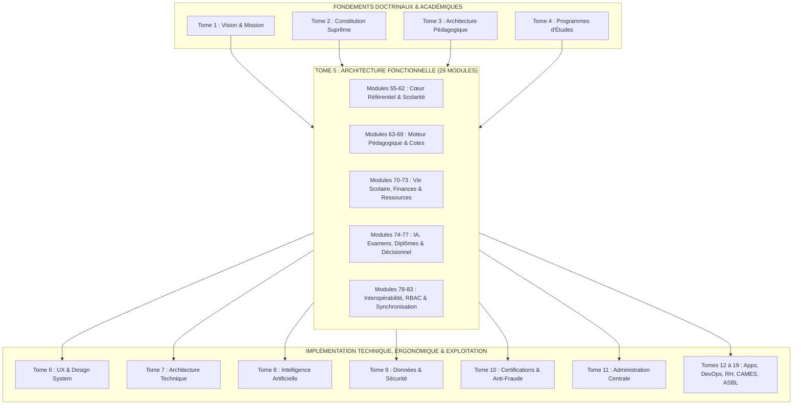

# TOME 5 — ARCHITECTURE FONCTIONNELLE
## 83. Matrice des Dépendances et Intégrations Inter-Tomes

---

> **Positionnement :** Clé de voûte relationnelle reliant le Tome 5 à l'ensemble des 19 Tomes d'ELLYSIUM  
> **Autorité :** Subordonné à la Constitution (Tome 2) et garant de la cohérence systémique globale  
> **Liaison :** Clôture formelle de l'Architecture Fonctionnelle et passerelle vers l'Architecture Technique (Tome 7)

---

## 1. Objet et Portée du Sous-Tome

Le sous-tome **83. Matrice des Dépendances et Intégrations Inter-Tomes** scelle l'achèvement de l'ingénierie fonctionnelle du Tome 5. Il formalise le maillage logique et contractuel reliant chacun des 29 modules fonctionnels aux tomes amonts (qui fournissent la légalité et le contenu académique) et aux tomes avals (qui traduisent ces fonctions en interfaces, code informatique, protocoles de sécurité et structures juridiques).

Il garantit :
- L'absence de toute lacune ou contradiction entre la doctrine pédagogique et les spécifications logicielles.
- La traçabilité exacte des exigences fonctionnelles qui seront implémentées dans le code (Tome 7).
- Le respect sans faille des normes de documentation édictées dans [foundations/04-conventions-de-depot-et-d-ecriture.md](file:///home/adolphe/CNEL%20-ELYSIUM/clenel-elysium/foundations/04-conventions-de-depot-et-d-ecriture.md).

---

## 2. Cartographie Globale des Dépendances Systémiques

---

## 3. Matrice Détaillée des Liaisons Entrantes (Amont $\rightarrow$ Tome 5)

| Tome Amont | Intitulé du Tome | Ce qu'il apporte au Tome 5 (Intrants Obligatoires) | Modules Dépendants du Tome 5 |
| :--- | :--- | :--- | :--- |
| **Tome 1** | Vision, Philosophie et Mission | Principe de gratuité de l'apprentissage individuel, parcours d'identification dual (Établissement vs Personne), objectifs prioritaires à 3 ans. | Modules 55, 58, 59, 71 |
| **Tome 2** | Constitution de l'Institution | Les 21 articles supra-normatifs : non-substitution de l'IA (Art. 6), inviolabilité des cotes (Art. 15), véracité documentaire (Art. 16), droits de recours (Art. 8). | Modules 56, 67, 74, 76, 80, 82 |
| **Tome 3** | Architecture Pédagogique & Ingénierie | Structuration en semestres et périodes, approche par compétences, modèles d'évaluation continue, rôles des tuteurs, normes d'assurance qualité (Partie IX). | Modules 62, 65, 66, 69, 73, 75 |
| **Tome 4** | Programmes d'Études (Secondaire & LMD) | Nomenclature officielle des 14 options des humanités et des 12 facultés, grilles horaires, coefficients, maxima variables congolais et maquettes semestrielles ECTS. | Modules 61, 62, 63, 66, 67, 68 |

---

## 4. Matrice Détaillée des Liaisons Sortantes (Tome 5 $\rightarrow$ Aval)

| Tome Aval | Intitulé du Tome | Ce que le Tome 5 lui transmet (Spécifications Consommées) | Modules Sources du Tome 5 |
| :--- | :--- | :--- | :--- |
| **Tome 6** | Expérience Utilisateur & Design System | Les parcours utilisateurs des 12 personas, les cinématiques d'appel mobile, les formulaires de caisse et les tableaux de bord à adapter en maquettes UI. | Modules 57, 58, 65, 66, 70, 77 |
| **Tome 7** | Architecture Technique & Interopérabilité | Les modèles conceptuels de données (MCD) à traduire en schémas SQL PostgreSQL, les règles de synchronisation hors-ligne (SQLite/CRDT) et les endpoints d'API. | Modules 58, 60, 67, 78, 82 |
| **Tome 8** | Intelligence Artificielle | Les verrous d'interdiction décisionnelle, la posture socratique maïeutique du tuteur et le pipeline d'indexation vectorielle RAG sur manuels officiels. | Modules 56, 73, 74 |
| **Tome 9** | Données et Sécurité | La classification 4 niveaux des données (isolement des données mineurs), les politiques de chiffrement au repos et la chaîne cryptographique de l'Audit Trail. | Modules 56, 60, 80, 82 |
| **Tome 10**| Examens, Certifications & Anti-Fraude | Le protocole d'anonymisation des épreuves, la génération des QR codes dynamiques de vérification publique et la structure des diplômes infalsifiables. | Modules 68, 75, 76 |
| **Tome 11**| Administration et Supervision Centrale | Les tableaux de bord de supervision réseau, la gestion des agrégats provinciaux et la coordination des ouvertures de nouvelles filières. | Modules 61, 77, 81 |
| **Tome 12**| Applications Clients (Android, PWA, Web) | Les exigences fonctionnelles d'ergonomie mobile, de scan photo de copies de devoirs et d'export spool des bulletins scolaires. | Modules 58, 64, 65, 68, 69 |
| **Tome 14**| Organisation & Ressources Humaines | Le suivi des heures effectives de cours prestées pour la rémunération des enseignants et le statut des tuteurs numériques. | Modules 64, 65, 72 |
| **Tome 15**| Partenariats & Homologation Ministérielle | Les formats d'exports SIGE pour l'EPST, les canevas LMD pour l'ESU et la vérification des arrêtés d'agrément des écoles partenaires. | Modules 61, 63, 76, 78 |
| **Tome 19**| Juridique, Conformité et ASBL | L'étanchéité absolue entre la gestion financière et l'accès pédagogique, la gouvernance collégiale des jurys et le respect de la Loi-cadre congolaise. | Modules 56, 71, 75, 81 |

---

## 5. Synthèse de Clôture du Tome 5 et Passage à la Phase Suivante

Avec la rédaction intégrale des 29 sous-tomes de la série 55 à 83 :
1. **L'Architecture Fonctionnelle d'ELLYSIUM est déclarée 100 % achevée et stabilisée**.
2. **Le système dispose désormais d'un cahier des charges fonctionnel d'ingénierie complet**, prêt pour la formalisation du Design System (Tome 6) et de l'Architecture Technique (Tome 7).
3. **La Phase 2 du Plan Général d'Implémentation (PGI) est close avec succès**.
