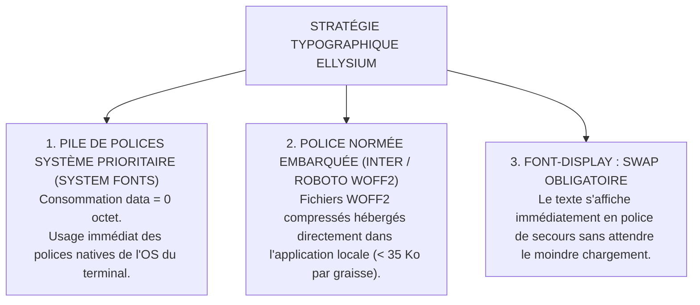

# TOME 6 — EXPÉRIENCE UTILISATEUR ET DESIGN SYSTEM
## 100. Typographie et Lisibilité en Environnement à Faible Débit

---

> **Positionnement :** Règle de sélection des polices de caractères, hiérarchie textuelle et optimisation du rendu hors-ligne  
> **Autorité :** Conforme aux normes d'éco-conception web et au principe d'autonomie technologique locale  
> **Liaison amont :** Module 97 (Tokens de Design) | **Liaison aval :** Module 101 (Accessibilité), Module 102 (Responsive)

---

## 1. Objet et Portée du Sous-Tome

La typographie est le vecteur principal de la transmission des cours, des énoncés de devoirs et des délibérations officielles. Si une application éducative dépend d'un serveur distant de polices (comme Google Fonts) pour afficher ses textes, une connexion dégradée ou inexistante provoque un blocage d'affichage ("Flash of Invisible Text" - FOIT) rendant l'application inutilisable. Ce sous-tome définit la stratégie de polices locales souveraines, l'échelle typographique et les ratios de lisibilité.

---

## 2. Stratégie Typographique Zéro Dépendance Réseau



### 2.1 Définition CSS de la Pile Typographique

```css
/* Pile principale : Interface et Textes de cours */
--font-sans: system-ui, -apple-system, BlinkMacSystemFont, 'Segoe UI', Roboto, 
             'Helvetica Neue', Arial, sans-serif;

/* Pile monospacée : Codes d'élèves, IUNE, formules et tables de cotes */
--font-mono: ui-monospace, SFMono-Regular, Menlo, Monaco, Consolas, 
             'Liberation Mono', 'Courier New', monospace;
```

---

## 3. Échelle Typographique Modulaire (Type Scale)

L'échelle typographique assure une hiérarchie visuelle claire sans écraser les petits écrans de smartphone :

| Niveau | Taille Police | Hauteur de Ligne (Line Height) | Graisse (Weight) | Usage type |
|---|---|---|---|---|
| **Display (H1)** | 28px (1.75rem) | 36px (1.3) | 700 (Bold) | Titre majeur de page / Accueil institutionnel |
| **Titre 1 (H2)** | 22px (1.375rem) | 28px (1.3) | 600 (SemiBold) | Titres de modules et chapitres de cours |
| **Titre 2 (H3)** | 18px (1.125rem) | 24px (1.35) | 600 (SemiBold) | En-têtes de sections et cartes de cours |
| **Sous-titre (H4)** | 16px (1.0rem) | 22px (1.4) | 500 (Medium) | Sous-rubriques et titres de tableaux |
| **Corps de texte** | **16px** (1.0rem) | **26px** (1.6) | 400 (Regular) | **Lecture principale des cours et syllabus** |
| **Texte compact** | 14px (0.875rem) | 20px (1.4) | 400 (Regular) | Cellules de tableaux denses de cotes |
| **Micro-texte** | 12px (0.75rem) | 16px (1.3) | 500 (Medium) | Badges de statut, métadonnées, horodatages |

**Règle UX-100-01** : La taille de base du corps de texte pour la lecture des leçons ne doit jamais descendre en dessous de **16px** sur mobile pour éviter la fatigue visuelle lors des études prolongées en soirée.

---

## 4. Confort de Lecture Prolongée et Sobriété Lumineuse

- **Longueur de ligne optimale (Measure)** : Les colonnes de texte de cours sont contraintes entre **60 et 75 caractères par ligne** maximum (`max-width: 65ch`). Une ligne trop longue disperse l'attention de l'apprenant.
- **Interlignage généreux** : Fixé à `1.6` pour aérer les définitions et théorèmes scientifiques complexes.
- **Formules mathématiques et scientifiques** : Rendu vectoriel ultra-léger (KaTeX pré-rendu ou MathJax compacté localement sans chargement d'images raster externes).

---

## 5. Verrous Fonctionnels Typographiques

| Réf. | Intitulé | Conséquence en cas de transgression |
|---|---|---|
| **VF-100-01** | Interdiction formelle des CDN typographiques tiers | Aucun appel réseau externe vers `fonts.googleapis.com` ou service distant similaire n'est toléré dans le code source de la plateforme. |
| **VF-100-02** | Rendu immédiat garanti | L'application doit afficher 100 % de son contenu textuel même si aucune connexion réseau n'a jamais été établie sur le terminal. |

---

*Sous-tome rédigé conformément aux Normes documentaires ELLYSIUM — Fondations 04.*  
*Version 1.0 — Référence : ELLYSIUM/T6/100/v1.0*

---

## 7. Verrous Fonctionnels Critiques

| Réf. Verrou | Description Fonctionnelle et Technique | Conséquence en Cas de Violation |
| :--- | :--- | :--- |
| **`VF-100-03`** | **Lisibilité des formules scientifiques KaTeX** | Rendu optimisé des équations mathématiques et chimiques sans débordement d'écran. |
| **`VF-100-04`** | **Ajustement dynamique de la taille de police** | L'apprenant peut agrandir le texte d'au moins 200% sans casser la mise en page. |
| **`VF-100-05`** | **Rendu fluide des diacritiques des langues nationales** | Support natif des caractères accentués et tons du Lingala et du Swahili. |
| **`VF-100-06`** | **L'interface reste pleinement fonctionnelle avec un contraste minimum de 4,5:1 sur tous les supports** | **Conséquence : violation = inéligibilité du module pour mise en production** |

---

*Sous-tome rédigé conformément aux Normes documentaires ELLYSIUM — Fondations 04.*
