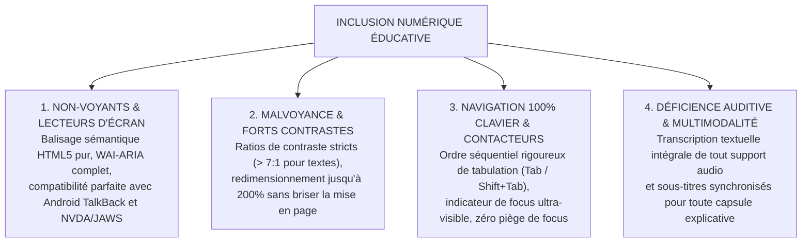

# TOME 6 — EXPÉRIENCE UTILISATEUR ET DESIGN SYSTEM
## 101. Accessibilité Numérique et Inclusion Républicaine (WCAG 2.2 AA/AAA)

---

> **Positionnement :** Conformité aux standards internationaux d'inclusion numérique pour les personnes en situation de handicap  
> **Autorité :** Conforme à la Constitution ELLYSIUM (Tome 2, Art. 3 — Égalité républicaine) et aux règles WCAG 2.2 (Niveau AA obligatoire, AAA visé)  
> **Liaison amont :** Module 97 (Charte), Module 98 (Composants), Module 100 (Typographie) | **Liaison aval :** Module 102 (Responsive), Module 105 (Tests)

---

## 1. Objet et Portée du Sous-Tome

L'instruction souveraine ne saurait tolérer la moindre exclusion fondée sur le handicap physique ou sensoriel. En République Démocratique du Congo et en Afrique, les élèves et étudiants non-voyants, malvoyants, sourds ou présentant un handicap moteur subissent trop souvent une marginalisation éducative insoutenable. Ce sous-tome fixe les exigences techniques et ergonomiques contraignantes imposées à tous les écrans d'ELLYSIUM pour garantir une accessibilité universelle intégrale.

---

## 2. Piliers Fondamentaux de l'Accessibilité ELLYSIUM



---

## 3. Directives Techniques pour Lecteurs d'Écran (TalkBack / NVDA)

Sur smartphone Android (écosystème dominant en RDC), Google TalkBack est l'outil d'émancipation essentiel des élèves aveugles :

### 3.1 Règles Sémantiques HTML5 et Attributs ARIA

**Règle UX-101-01** : Tout écran doit comporter une structure hiérarchique explicite :
- Une balise `<main>` unique par page.
- Une progression continue des niveaux de titre (`<h1>` puis `<h2>` puis `<h3>`) sans sauter de niveau.
- Rôles ARIA explicites sur les zones dynamiques : `aria-live="polite"` pour les annonces de calcul de notes ou de messages d'erreur.

### 3.2 Balisage des Évaluations et Bulletins

Les tableaux de notes scolaires constituent le défi d'accessibilité le plus complexe. Chaque cellule de cote doit être reliée sans ambiguïté à son intitulé de matière et à son type d'épreuve :

```html
<!-- Exemple de cellule accessible dans le cahier de cotes -->
<td role="cell" aria-label="Mathématiques, Interrogation 1, Note : 8 sur 10">
  8/10
</td>
```

---

## 4. Navigation au Clavier et Assistance Motrice

**Règle UX-101-02** : L'ensemble de la plateforme doit être 100 % manipulable sans souris ni écran tactile, au moyen d'un clavier standard ou d'un contacteur adapté pour handicapé moteur :
- **Lien d'évitement (Skip Link)** : Premier élément focusable sur chaque page permettant de sauter directement au contenu principal (*« Passer au contenu du cours »*).
- **Indicateur de focus (Focus Ring)** : Contour à haute visibilité de **3px** bleu contrasté avec décalage de 2px (`outline: 3px solid #0D47A1; outline-offset: 2px`).
- **Interdiction formelle des gestes complexes** : Aucun geste multipoint (pincement pour zoomer, balayage à trois doigts) ne peut être la seule manière d'effectuer une action. Une alternative par bouton simple est toujours présente.

---

## 5. Ratios de Contraste et Agrandissement Visuel

- **Ratios WCAG AAA** :
  - Textes normaux (< 18px) : Contraste minimal de **7.0:1** par rapport au fond.
  - Textes larges ($\ge 18\text{px}$) et composants UI interactifs : Contraste minimal de **4.5:1**.
- **Zoom texte à 200 %** : L'interface supporte l'agrandissement de police natif du système d'exploitation sans provoquer de défilement horizontal (pas de texte tronqué ni de superposition de boutons).

---

## 6. Verrous Fonctionnels d'Accessibilité

| Réf. | Intitulé | Conséquence en cas de transgression |
|---|---|---|
| **VF-101-01** | Absence d'alternative textuelle (Alt Text) | Toute image ou diagramme pédagogique dépourvu d'attribut `alt` descriptif est rejeté lors de la validation du cours. |
| **VF-101-02** | Piège au clavier (Focus Trap illégitime) | Tout composant bloquant la tabulation clavier sans possibilité de sortir par la touche `Échap` entraîne le blocage de la mise en recette logicielle. |
| **VF-101-03** | Dépendance exclusive au son | Aucune notification scolaire (début d'examen, rappel de devoir) ne peut être émise par un signal sonore sans notification visuelle et haptique simultanée. |

---

*Sous-tome rédigé conformément aux Normes documentaires ELLYSIUM — Fondations 04.*  
*Version 1.0 — Référence : ELLYSIUM/T6/101/v1.0*
