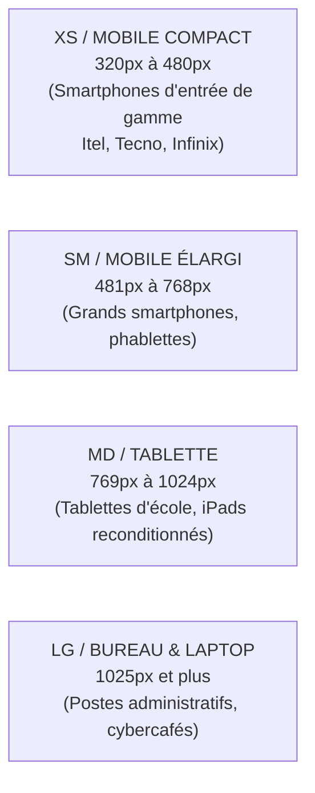
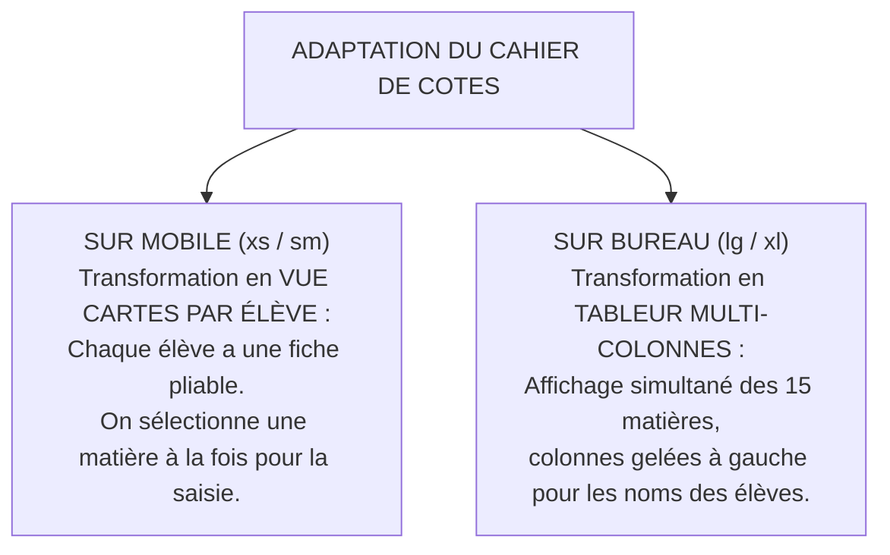

# TOME 6 — EXPÉRIENCE UTILISATEUR ET DESIGN SYSTEM
## 102. Design Responsive et Stratégie Mobile-First

---

> **Positionnement :** Conception adaptative multi-écrans, du smartphone d'entrée de gamme au poste administratif de direction  
> **Autorité :** Conforme à la réalité d'équipement observée sur le terrain (Module 86 — 85 % d'usagers mobiles)  
> **Liaison amont :** Module 86 (Personas), Module 98 (Composants UI) | **Liaison aval :** Module 103 (Gestion des états), Module 105 (Tests)

---

## 1. Objet et Portée du Sous-Tome

Dans le contexte d'Afrique francophone et particulièrement en RDC, concevoir d'abord pour un ordinateur portable pour ensuite « adapter » sur mobile est une erreur technique rédhibitoire. Le smartphone d'entrée de gamme (résolution 360 × 640 px, processeur quadri-cœur modeste) est le terminal de référence fondamental. Ce sous-tome formalise la grille responsive, les points de rupture (breakpoints) et les mécanismes de transformation des écrans complexes selon la taille du moniteur.

---

## 2. Échelle des Points de Rupture (Breakpoints)

Le système applique 4 points de rupture stricts, définis en unités relatives (`rem` / `px`) :



### 2.1 Spécifications des Résolutions Cibles

| Breakpoint | Largeur CSS | Dispositifs Cibles | Disposition dominante |
|---|---|---|---|
| **xs** | `320px` - `480px` | 85 % des élèves, étudiants et parents | Colonne unique verticale, Bottom Navigation Bar |
| **sm** | `481px` - `768px` | Téléphones grand format en paysage | 2 colonnes asymétriques, cartes condensées |
| **md** | `769px` - `1024px` | Tablettes de supervision de classe | Grille 2 à 3 colonnes, tiroirs latéraux |
| **lg** | `1025px` - `1440px` | Ordinateurs de bureau (Préfet, Promoteur) | Vue tableur matricielle dense, barre latérale fixe |
| **xl** | `> 1440px` | Postes centraux ministériels | Écrans larges avec contrainte de lecture (`max-width: 1440px`) |

---

## 3. Transformation des Vues Complexes selon le Terminal

### 3.1 Cas Critique : Le Cahier des Cotes (15 Matières Scolaires)

Un tableau de 15 colonnes ne peut pas être lu convenablement sur un écran mobile de 360px sans provoquer une fatigue visuelle extrême.



---

## 4. Optimisation des Périphériques de Saisie sur Mobile

**Règle UX-102-01** : Pour accélérer la saisie et éviter les erreurs de manipulation sur clavier virtuel :
- Tout champ de note ou de note sur 10/20 invoque automatiquement le clavier numérique décimal :
  ```html
  <input type="text" inputmode="decimal" pattern="[0-9]*[.,]?[0-9]*" />
  ```
- Tout champ de numéro de téléphone invoque le clavier téléphonique universel :
  ```html
  <input type="tel" inputmode="tel" autocomplete="tel" />
  ```
- Tout champ de recherche désactive la correction automatique intempestive qui déforme les patronymes congolais :
  ```html
  <input type="search" autocapitalize="none" autocorrect="off" spellcheck="false" />
  ```

---

## 5. Verrous Fonctionnels de Conception Responsive

| Réf. | Intitulé | Conséquence en cas de transgression |
|---|---|---|
| **VF-102-01** | Zéro défilement horizontal involontaire | Aucune page ne doit comporter de débordement horizontal (`overflow-x`) sur un écran de largeur $\ge 320\text{px}$. Tout dépassement bloque la validation UI. |
| **VF-102-02** | Contrainte de largeur maximale sur grand écran | Sur écran de bureau ou moniteur géant, le contenu textuel de cours ne doit jamais s'étendre sur plus de **960px** de large, afin de préserver la lisibilité sans mouvement de tête excessif. |

---

*Sous-tome rédigé conformément aux Normes documentaires ELLYSIUM — Fondations 04.*  
*Version 1.0 — Référence : ELLYSIUM/T6/102/v1.0*

---

## 7. Verrous Fonctionnels Critiques

| Réf. Verrou | Description Fonctionnelle et Technique | Conséquence en Cas de Violation |
| :--- | :--- | :--- |
| **`VF-102-03`** | **Transition fluide entre orientation portrait et paysage** | Aucun rechargement de page lors de la rotation de l'appareil. |
| **`VF-102-04`** | **Optimisation tactile des gestes courants** | Support du glissement (swipe) pour tourner les pages de cours ou devoirs. |
| **`VF-102-05`** | **Barre d'actions ancrée au bas de l'écran sur mobile** | Boutons d'action principaux situés dans la zone naturelle du pouce. |
| **`VF-102-06`** | **L'interface reste pleinement fonctionnelle avec un contraste minimum de 4,5:1 sur tous les supports** | **Conséquence : violation = inéligibilité du module pour mise en production** |

---

*Sous-tome rédigé conformément aux Normes documentaires ELLYSIUM — Fondations 04.*
