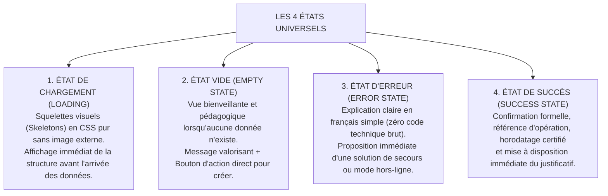

# TOME 6 — EXPÉRIENCE UTILISATEUR ET DESIGN SYSTEM
## 103. Gestion des États d'Interface (Chargement, Erreur, Succès, Vide)

---

> **Positionnement :** Traitement exhaustif des 4 états fondamentaux de toute vue applicative sous contraintes réseau instables  
> **Autorité :** Conforme aux principes de transparence cognitive et de robustesse aux pannes d'ELLYSIUM  
> **Liaison amont :** Module 98 (Composants UI) | **Liaison aval :** Module 104 (UX Writing), Module 105 (Tests)

---

## 1. Objet et Portée du Sous-Tome

Dans un environnement où les micro-coupures de courant et les pertes subites de réseau 3G/4G sont quotidiennes, une interface qui gèle sans retour d'information provoque l'angoisse de l'utilisateur (qui craint d'avoir perdu son argent Mobile Money ou son devoir). Chaque écran et chaque composant interactif d'ELLYSIUM doit obligatoirement modéliser et gérer les **4 états d'interface universels** : Chargement, Succès, Erreur et Vide.

---

## 2. Matrice des 4 États d'Interface



---

## 3. Spécifications Détaillées par État

### 3.1 État de Chargement : Squelettes CSS Légers (Zero GIF)

**Règle UX-103-01** : Les spinners de chargement rotatifs génériques au milieu d'un écran blanc sont formellement proscrits pour les chargements de pages. L'application utilise des **écrans squelettes (Skeleton screens)** dessinés en CSS vectoriel pur, mimant la forme exacte des cartes ou des lignes de tableau attendues.

```css
/* Animation de pulsation sobre et ultra-légère pour processeur modeste */
@keyframes pulse-subtle {
  0%, 100% { opacity: 0.6; background-color: #E0E0E0; }
  50% { opacity: 0.3; background-color: #EEEEEE; }
}
.skeleton-card {
  height: 96px;
  border-radius: 8px;
  animation: pulse-subtle 1.8s ease-in-out infinite;
}
```

### 3.2 État Vide : Pédagogie Positive et Action Claire

Lorsqu'une liste est vide (aucun devoir à rendre, aucune absence signalée, aucun message) :
- Ne jamais afficher une page blanche stérile.
- Illustrer avec un pictogramme sobre.
- Titre valorisant : *« Vous êtes à jour ! »* ou *« Aucun devoir en attente pour cette semaine »*.
- Bouton d'action d'enrichissement si applicable (ex. *« Découvrir les annales d'exercices »*).

### 3.3 État d'Erreur : Bienveillance et Résilience Hors-Ligne

**Règle UX-103-02** : Tout message d'erreur obéit à la structure en 3 volets :
1. **Ce qui s'est passé** (ex. *« La connexion à la caisse de paiement a été interrompue »*).
2. **Ce que le système a fait** (ex. *« Vos données de formulaire sont conservées en sécurité »*).
3. **Ce que l'utilisateur doit faire** (ex. bouton *« Réessayer l'envoi »* ou *« Sauvegarder pour envoi ultérieur hors-ligne »*).

Jamais de messages d'erreur opaques tels que *« Error 500 »* ou *« Unhandled exception in thread main »*.

### 3.4 État de Succès : Clôture et Traçabilité

Tout acte important (paiement, scellement de note, remise de copie, validation de bulletin) génère :
- Une bannière de confirmation verte rassurante (`#1B5E20`).
- Un numéro de référence unique opposable (ex. `REF-DEV-2025-08149`).
- Un bouton de téléchargement direct de la preuve.

---

## 4. Verrous Fonctionnels de Gestion des États

| Réf. | Intitulé | Conséquence en cas de transgression |
|---|---|---|
| **VF-103-01** | Timeout déterministe sur requête réseau | Toute requête réseau sans réponse au bout de **8 secondes** bascule automatiquement sur l'état d'erreur contextualisé avec proposition de mode hors-ligne. Aucun blocage d'interface infini n'est autorisé. |
| **VF-103-02** | Idempotence des actions de validation | En cas de coupure de réseau pendant un paiement ou une remise de devoir, la réitération de l'action ne peut en aucun cas créer un doublon dans la base de données. |

---

*Sous-tome rédigé conformément aux Normes documentaires ELLYSIUM — Fondations 04.*  
*Version 1.0 — Référence : ELLYSIUM/T6/103/v1.0*
