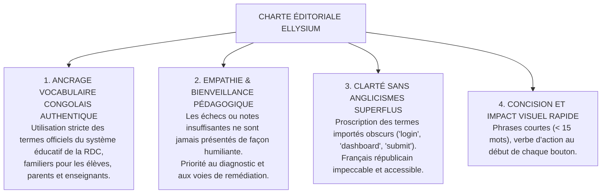

# TOME 6 — EXPÉRIENCE UTILISATEUR ET DESIGN SYSTEM
## 104. Rédaction d'Expérience (UX Writing) — Clarté, Empathie et Vocabulaire Républicain

---

> **Positionnement :** Ligne éditoriale, microcopie des interfaces, terminologie congolaise officielle et neutralité bienveillante  
> **Autorité :** Conforme aux dénominations officielles de l'EPST/ESU et à la Charte d'accessibilité culturelle  
> **Liaison amont :** Module 86 (Personas), Module 98 (Composants UI) | **Liaison aval :** Module 105 (Tests), Module 106 (Dépendances)

---

## 1. Objet et Portée du Sous-Tome

Les mots employés dans une application façonnent la confiance ou le découragement de l'usager. Dans un contexte éducatif où coexistent des élèves de 12 ans, des parents non alphabétisés au jargon numérique et des universitaires chevronnés, chaque intitulé de bouton, chaque message d'erreur et chaque notification doit faire l'objet d'un calibrage rigoureux. Ce sous-tome fixe la charte de rédaction UX d'ELLYSIUM.

---

## 2. Piliers Fondamentaux de la Rédaction ELLYSIUM



---

## 3. Lexique Officiel Normalisé ELLYSIUM

Pour bannir le flou sémantique, la table d'équivalence suivante est obligatoirement appliquée sur l'ensemble des écrans :

| Terme proscrit (générique ou anglicisme) | Terme officiel ELLYSIUM | Justification culturelle et réglementaire |
|---|---|---|
| *Login / Sign in* | **Se connecter** | Français clair pour tous les niveaux |
| *Dashboard* | **Tableau de bord** ou **Accueil** | Dénomination française standard |
| *Notes / Marks* | **Cotes** | Terme universel et officiel en RDC |
| *Homework / Assignment* | **Devoir à domicile** ou **Travail Dirigé** | Vocabulaire officiel EPST/ESU |
| *Tuition fees* | **Frais scolaires** / **Minerval** | Termes légaux du système éducatif congolais |
| *Principal / Headmaster* | **Préfet des études** | Titre officiel du chef d'établissement secondaire en RDC |
| *Homeroom Teacher* | **Professeur Titulaire** | Rôle officiel de coordination de la classe |
| *Grades 7-8* | **7e et 8e de l'Éducation de Base (EB)** | Nomenclature officielle de la réforme de l'EPST |
| *High School* | **Humanités** (ex. 1e à 4e des Humanités) | Structure quadriennale secondaire congolaise |
| *Submit* | **Envoyer mon travail** / **Valider** | Verbe explicite et rassurant |

---

## 4. Règles de Rédaction de la Microcopie Interactive

### 4.1 Libellés des Boutons d'Action

**Règle UX-104-01** : Un bouton doit indiquer précisément ce qui va se produire, en commençant par un verbe à l'infinitif ou à l'impératif clair.
- À proscrire : *« OK »*, *« Cliquer ici »*, *« Continuer »* (trop vague).
- À prescrire : *« Télécharger le cours (180 Ko) »*, *« Confirmer le paiement M-Pesa »*, *« Déposer ma copie manuscrite »*.

### 4.2 Messages d'Échec ou d'Avertissement

Lorsqu'un élève n'atteint pas la moyenne ($< 50\%$ ou ajournement LMD) :
- À proscrire : *« Échec lamentable »*, *« Recalé »*, *« Note insuffisante »*.
- À prescrire : *« Résultat non atteint pour cette période. Consultez le plan de révision conseillé pour rattraper ces points. »*

---

## 5. Prise en Compte des 4 Langues Nationales

Dans les écrans d'orientation de premier niveau et les messages vocaux de relance aux parents, l'interface intègre les 4 langues nationales congolaises (Lingala, Swahili, Kikongo, Tshiluba) en complément du français officiel :

```
Exemple de message d'alerte absence parent :
[FR] Gloire a été signalé absent ce matin à 07h45.
[LN] Gloire amonanaki te na kelasi na tongo oyo na 07h45.
[SW] Gloire hakuonekana darasani asubuhi hii saa 07h45.
```

---

## 6. Verrous Fonctionnels de Rédaction UX

| Réf. | Intitulé | Conséquence en cas de transgression |
|---|---|---|
| **VF-104-01** | Interdiction des insultes ou termes dégradants | Aucun algorithme ou message d'évaluation ne peut contenir de qualificatif blessant envers un usager. |
| **VF-104-02** | Exactitude des mentions de diplôme | Les dénominations des options secondaires et filières LMD doivent correspondre au mot près aux arrêtés ministériels de création. |

---

*Sous-tome rédigé conformément aux Normes documentaires ELLYSIUM — Fondations 04.*  
*Version 1.0 — Référence : ELLYSIUM/T6/104/v1.0*
